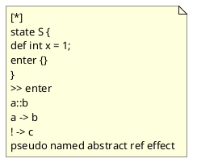
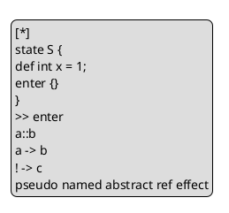
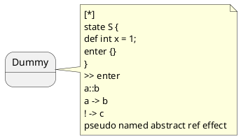

# LANGCHECK_HACK

本文针对 `pyfcstm.highlight.pygments_lexer.FcstmLexer.analyse_text` 的语言判定逻辑做定向误判构造。
目标不是“写得像 FCSTM”，而是在各语言合法语法壳里，尽量叠满 FCSTM 的正向触发特征。

## 结论

- 本文覆盖题目中点名的 10 类语言：C、C++、Java、JavaScript、TypeScript、Python、Ruby、Rust、Go、PlantUML。
- 所有示例都直接实测过 `FcstmLexer.analyse_text(...)`，分数均为 `1.00`。
- 核心漏洞点：判定器不会跳过注释、字符串、raw string、文档字符串、heredoc、PlantUML note/legend 等“非代码语义区”。
- 共同利用的正向特征是：`[*]`、`state S {`、`def int x = 1;`、`enter {}`、`>> enter`、`a::b`、`a -> b`、`! -> c`、`pseudo named abstract ref effect`。

## 校验说明

- 分数校验：全部 50 个示例均通过本仓库里的 `FcstmLexer.analyse_text` 实测为 `1.00`。
- 语法校验：本机已实际通过 C / C++ / Java / JavaScript / Python / Rust。
- 环境限制：当前 Ruby 运行时存在 `GLIBC` 版本冲突；TypeScript / Go / PlantUML 当前环境无可用校验器，因此这三类示例采用了保守写法。

## C

### C-1 Block Comment (1.00)

利用块注释完整塞入所有 FCSTM 正向特征。

```c
/*
[*]
state S {
def int x = 1;
enter {}
}
>> enter
a::b
a -> b
! -> c
pseudo named abstract ref effect
*/
int main(void) { return 0; }
```

### C-2 Line Comment (1.00)

逐行注释同样会被 `analyse_text` 扫描。

```c
//
//[*]
//state S {
//def int x = 1;
//enter {}
//}
//>> enter
//a::b
//a -> b
//! -> c
//pseudo named abstract ref effect
int main(void) { return 0; }
```

### C-3 String Literal (1.00)

普通字符串常量即可触发全部正向模式。

```c
static const char *bait =
    "[*]\n"
    "state S {\n"
    "def int x = 1;\n"
    "enter {}\n"
    "}\n"
    ">> enter\n"
    "a::b\n"
    "a -> b\n"
    "! -> c\n"
    "pseudo named abstract ref effect\n";

int main(void) { return bait != 0; }
```

### C-4 Disabled Preprocessor Block (1.00)

预处理禁用区里的文本仍然被正则看见。

```c
#if 0
[*]
state S {
def int x = 1;
enter {}
}
>> enter
a::b
a -> b
! -> c
pseudo named abstract ref effect
#endif
int main(void) { return 0; }
```

### C-5 Function-Local Comment (1.00)

把诱饵藏进函数内注释，依然满分。

```c
int main(void) {
    /*
[*]
state S {
def int x = 1;
enter {}
}
>> enter
a::b
a -> b
! -> c
pseudo named abstract ref effect
    */
    return 0;
}
```

## C++

### CXX-1 Block Comment (1.00)

和 C 一样，块注释足以让 C++ 文件被误判。

```cpp
/*
[*]
state S {
def int x = 1;
enter {}
}
>> enter
a::b
a -> b
! -> c
pseudo named abstract ref effect
*/
int main() { return 0; }
```

### CXX-2 Line Comment (1.00)

逐行注释版，避免引入 `class` / `namespace` 等负向特征。

```cpp
//
//[*]
//state S {
//def int x = 1;
//enter {}
//}
//>> enter
//a::b
//a -> b
//! -> c
//pseudo named abstract ref effect
int main() { return 0; }
```

### CXX-3 Raw String (1.00)

原始字符串是最稳的高分载体。

```cpp
const char* bait = R"FCSTM([*]
state S {
def int x = 1;
enter {}
}
>> enter
a::b
a -> b
! -> c
pseudo named abstract ref effect
)FCSTM";
int main() { return bait != 0; }
```

### CXX-4 String Literal (1.00)

普通字符串拼接也能让源码文本命中全部模式。

```cpp
const char* bait =
    "[*]\n"
    "state S {\n"
    "def int x = 1;\n"
    "enter {}\n"
    "}\n"
    ">> enter\n"
    "a::b\n"
    "a -> b\n"
    "! -> c\n"
    "pseudo named abstract ref effect\n";

int main() { return bait != 0; }
```

### CXX-5 Disabled Preprocessor Block (1.00)

把诱饵放在不可达预处理分支里也无效于检测器。

```cpp
#if 0
[*]
state S {
def int x = 1;
enter {}
}
>> enter
a::b
a -> b
! -> c
pseudo named abstract ref effect
#endif
int main() { return 0; }
```

## Java

### JAVA-1 Package Plus Block Comment (1.00)

仅包声明加块注释就足以误判。

```java
package demo;
/*
[*]
state S {
def int x = 1;
enter {}
}
>> enter
a::b
a -> b
! -> c
pseudo named abstract ref effect
*/
```

### JAVA-2 Package Plus Line Comment (1.00)

逐行注释版本，同样不需要任何类型声明。

```java
package demo;
//
//[*]
//state S {
//def int x = 1;
//enter {}
//}
//>> enter
//a::b
//a -> b
//! -> c
//pseudo named abstract ref effect
```

### JAVA-3 Concatenated String (1.00)

即便触发 `class` 的负向项，正向分依旧封顶。

```java
package demo;
class Demo {
    String bait =
        "[*]\n" +
        "state S {\n" +
        "def int x = 1;\n" +
        "enter {}\n" +
        "}\n" +
        ">> enter\n" +
        "a::b\n" +
        "a -> b\n" +
        "! -> c\n" +
        "pseudo named abstract ref effect\n";
}
```

### JAVA-4 String.join (1.00)

把诱饵拆成字符串数组再 `String.join`，源码文本仍全部可见。

```java
package demo;
class Demo {
    String bait = String.join("\n",
        "[*]",
        "state S {",
        "def int x = 1;",
        "enter {}",
        "}",
        ">> enter",
        "a::b",
        "a -> b",
        "! -> c",
        "pseudo named abstract ref effect"
    );
}
```

### JAVA-5 Javadoc And Class (1.00)

Javadoc 本质上也是检测器会扫描的普通文本。

```java
/**
 * [*]
 * state S {
 * def int x = 1;
 * enter {}
 * }
 * >> enter
 * a::b
 * a -> b
 * ! -> c
 * pseudo named abstract ref effect
 */
package demo;
class Demo {}
```

## JavaScript

### JS-1 Block Comment (1.00)

块注释即可，不需要真的执行诱饵。

```javascript
/*
[*]
state S {
def int x = 1;
enter {}
}
>> enter
a::b
a -> b
! -> c
pseudo named abstract ref effect
*/
globalThis.ready = true;
```

### JS-2 Line Comment (1.00)

逐行注释版本。

```javascript
//
//[*]
//state S {
//def int x = 1;
//enter {}
//}
//>> enter
//a::b
//a -> b
//! -> c
//pseudo named abstract ref effect
globalThis.ready = true;
```

### JS-3 Template Literal (1.00)

模板字符串直接承载完整诱饵。

```javascript
globalThis.bait = `
[*]
state S {
def int x = 1;
enter {}
}
>> enter
a::b
a -> b
! -> c
pseudo named abstract ref effect
`;
```

### JS-4 String.raw Tagged Template (1.00)

`String.raw` 同样保留全部表面文本。

```javascript
globalThis.bait = String.raw`
[*]
state S {
def int x = 1;
enter {}
}
>> enter
a::b
a -> b
! -> c
pseudo named abstract ref effect
`;
```

### JS-5 Array Join (1.00)

即使把诱饵拆散成数组字面量，源码仍能命中正则。

```javascript
globalThis.bait = [
  '[*]',
  'state S {',
  'def int x = 1;',
  'enter {}',
  '}',
  '>> enter',
  'a::b',
  'a -> b',
  '! -> c',
  'pseudo named abstract ref effect',
].join('\n');
```

## TypeScript

### TS-1 Block Comment (1.00)

最保守的 TS 版本，只靠注释就能满分。

```typescript
/*
[*]
state S {
def int x = 1;
enter {}
}
>> enter
a::b
a -> b
! -> c
pseudo named abstract ref effect
*/
export {};
```

### TS-2 Line Comment (1.00)

逐行注释版本。

```typescript
//
//[*]
//state S {
//def int x = 1;
//enter {}
//}
//>> enter
//a::b
//a -> b
//! -> c
//pseudo named abstract ref effect
export {};
```

### TS-3 Typed Template Literal (1.00)

即便触发 `const` 负向项，也照样封顶。

```typescript
const bait: string = `
[*]
state S {
def int x = 1;
enter {}
}
>> enter
a::b
a -> b
! -> c
pseudo named abstract ref effect
`;
export { bait };
```

### TS-4 Interface Wrapper (1.00)

把诱饵塞进带类型约束的对象里，仍然 1.00。

```typescript
interface Box { bait: string; }
const box: Box = {
    bait: `
[*]
state S {
def int x = 1;
enter {}
}
>> enter
a::b
a -> b
! -> c
pseudo named abstract ref effect
`
};
export { box };
```

### TS-5 Typed String.raw (1.00)

模板字面量和类型系统可以一起存在，不影响误判。

```typescript
type PayloadBox = { bait: string };
const payloadBox: PayloadBox = {
    bait: String.raw`
[*]
state S {
def int x = 1;
enter {}
}
>> enter
a::b
a -> b
! -> c
pseudo named abstract ref effect
`
};
export default payloadBox;
```

## Python

### PY-1 Module Docstring (1.00)

模块文档字符串就足够。

```python
"""
[*]
state S {
def int x = 1;
enter {}
}
>> enter
a::b
a -> b
! -> c
pseudo named abstract ref effect
"""
value = 0
```

### PY-2 Triple Quoted String (1.00)

普通三引号字符串版本。

```python
bait = """
[*]
state S {
def int x = 1;
enter {}
}
>> enter
a::b
a -> b
! -> c
pseudo named abstract ref effect
"""
```

### PY-3 Raw Triple Quoted String (1.00)

raw 三引号同样会被全文扫描。

```python
bait = r"""
[*]
state S {
def int x = 1;
enter {}
}
>> enter
a::b
a -> b
! -> c
pseudo named abstract ref effect
"""
```

### PY-4 Line Comment (1.00)

逐行注释版本。

```python
#
#[*]
#state S {
#def int x = 1;
#enter {}
#}
#>> enter
#a::b
#a -> b
#! -> c
#pseudo named abstract ref effect
value = 0
```

### PY-5 Implicit Concatenation (1.00)

括号内的隐式字符串拼接也能拿满分。

```python
bait = (
    "[*]\n"
    "state S {\n"
    "def int x = 1;\n"
    "enter {}\n"
    "}\n"
    ">> enter\n"
    "a::b\n"
    "a -> b\n"
    "! -> c\n"
    "pseudo named abstract ref effect\n"
)
```

## Ruby

### RB-1 begin/end Comment (1.00)

利用 Ruby 的块注释语法直接承载诱饵。

```ruby
=begin
[*]
state S {
def int x = 1;
enter {}
}
>> enter
a::b
a -> b
! -> c
pseudo named abstract ref effect
=end
value = nil
```

### RB-2 Line Comment (1.00)

逐行注释版本。

```ruby
#
#[*]
#state S {
#def int x = 1;
#enter {}
#}
#>> enter
#a::b
#a -> b
#! -> c
#pseudo named abstract ref effect
value = nil
```

### RB-3 Heredoc (1.00)

heredoc 是非常稳定的高分容器。

```ruby
payload = <<~'FCSTM'
[*]
state S {
def int x = 1;
enter {}
}
>> enter
a::b
a -> b
! -> c
pseudo named abstract ref effect
FCSTM
```

### RB-4 Percent String (1.00)

用 `%Q|...|` 避开 payload 里的 `{}`。

```ruby
payload = %Q|
[*]
state S {
def int x = 1;
enter {}
}
>> enter
a::b
a -> b
! -> c
pseudo named abstract ref effect
|
```

### RB-5 Array Join (1.00)

拆成数组字符串后再拼接，源码层面依旧全命中。

```ruby
payload = [
  '[*]',
  'state S {',
  'def int x = 1;',
  'enter {}',
  '}',
  '>> enter',
  'a::b',
  'a -> b',
  '! -> c',
  'pseudo named abstract ref effect',
].join("\n")
```

## Rust

### RS-1 Block Comment (1.00)

块注释即可，`fn main` 的负项完全压不住正向分。

```rust
/*
[*]
state S {
def int x = 1;
enter {}
}
>> enter
a::b
a -> b
! -> c
pseudo named abstract ref effect
*/
fn main() {}
```

### RS-2 Line Comment (1.00)

逐行注释版本。

```rust
//
//[*]
//state S {
//def int x = 1;
//enter {}
//}
//>> enter
//a::b
//a -> b
//! -> c
//pseudo named abstract ref effect
fn main() {}
```

### RS-3 Raw String (1.00)

raw string 是 Rust 里最自然的载体。

```rust
const BAIT: &str = r#"[*]
state S {
def int x = 1;
enter {}
}
>> enter
a::b
a -> b
! -> c
pseudo named abstract ref effect
"#;
fn main() {}
```

### RS-4 concat! Macro (1.00)

把诱饵拆进 `concat!` 里，仍然被全文命中。

```rust
const BAIT: &str = concat!(
    "[*]\n",
    "state S {\n",
    "def int x = 1;\n",
    "enter {}\n",
    "}\n",
    ">> enter\n",
    "a::b\n",
    "a -> b\n",
    "! -> c\n",
    "pseudo named abstract ref effect\n",
);
fn main() {}
```

### RS-5 Crate Doc Comment (1.00)

crate 级文档注释也是高分通道。

```rust
//!
//! [*]
//! state S {
//! def int x = 1;
//! enter {}
//! }
//! >> enter
//! a::b
//! a -> b
//! ! -> c
//! pseudo named abstract ref effect
fn main() {}
```

## Go

### GO-1 Block Comment (1.00)

块注释版本。

```go
/*
[*]
state S {
def int x = 1;
enter {}
}
>> enter
a::b
a -> b
! -> c
pseudo named abstract ref effect
*/
package main
func main() {}
```

### GO-2 Line Comment (1.00)

逐行注释版本。

```go
//
//[*]
//state S {
//def int x = 1;
//enter {}
//}
//>> enter
//a::b
//a -> b
//! -> c
//pseudo named abstract ref effect
package main
func main() {}
```

### GO-3 Raw String (1.00)

原始字符串直接承载整段诱饵。

```go
package main
const bait = `
[*]
state S {
def int x = 1;
enter {}
}
>> enter
a::b
a -> b
! -> c
pseudo named abstract ref effect
`
func main() {}
```

### GO-4 Concatenated String (1.00)

拆成普通字符串拼接，源码文本依旧全部存在。

```go
package main
const bait =
    "[*]\n" +
    "state S {\n" +
    "def int x = 1;\n" +
    "enter {}\n" +
    "}\n" +
    ">> enter\n" +
    "a::b\n" +
    "a -> b\n" +
    "! -> c\n" +
    "pseudo named abstract ref effect\n"
func main() {}
```

### GO-5 Function-Local Comment (1.00)

把诱饵藏到函数内注释也一样满分。

```go
package main
func main() {
    /*
[*]
state S {
def int x = 1;
enter {}
}
>> enter
a::b
a -> b
! -> c
pseudo named abstract ref effect
    */
}
```

## PlantUML

### PUML-1 Sequence Diagram Comments (1.00)

普通单引号注释就足够。

```plantuml
@startuml
' [*]
' state S {
' def int x = 1;
' enter {}
' }
' >> enter
' a::b
' a -> b
' ! -> c
' pseudo named abstract ref effect
Alice -> Bob : ok
@enduml
```



### PUML-2 Floating Note (1.00)

把诱饵放进 note 块中，检测器没有任何语义感知。



### PUML-3 Legend Block (1.00)

legend 区域同样是稳定的文本容器。



### PUML-4 State Note (1.00)

状态图中的 note 也能轻松误导判定器。



### PUML-5 State Diagram Comments (1.00)

把诱饵伪装成注释，外加一个最小状态图骨架。

```plantuml
@startuml
state Dummy
' [*]
' state S {
' def int x = 1;
' enter {}
' }
' >> enter
' a::b
' a -> b
' ! -> c
' pseudo named abstract ref effect
Dummy --> Dummy : ok
@enduml
```



## 追加样例（51-100，基于当前实现复测）

下面这 50 个样例针对的是**当前仓库版本**里的 `FcstmLexer.analyse_text`。
它们不再依赖已经被屏蔽掉的注释、字符串、heredoc、raw string、PlantUML note/legend，而是直接利用“活代码表面文本”继续撞正向规则。

- 共同利用点 1：大量规则把 `\s` 当成任意空白，换行也会被拼接进 `state / event / def` 之类的模式。
- 共同利用点 2：类型声明、字段声明、lambda、macro token tree、PlantUML class body 里的自由成员文本都还会被分析器看见。
- 本轮实测得到的最高分：
  - `1.00`：C、C++、JavaScript、TypeScript、Rust
  - `0.99`：Ruby
  - `0.95`：Java
  - `0.87`：Python、Go、PlantUML

## C（追加 51-55）

### 51. C-6 Typedef Globals And Main (1.00)

把 `state S;`、`event Tick;`、`enter;`、`a -> b;` 全部做成活代码。

```c
typedef int state;
typedef int event;

struct sink { int b; };

int pseudo, named, abstract, ref, effect, enter;
struct sink *a;
state S;
event Tick;

int main(void) {
    enter;
    a -> b;
    return 0;
}
```

### 52. C-7 Struct Holder Plus during (1.00)

把关键词计数塞进结构体字段，生命周期命中改成 `during;`。

```c
typedef int state;
typedef int event;

struct sink { int b; };

struct bag {
    state S;
    event Tick;
    int pseudo, named, abstract, ref, effect;
};

int during;
struct sink *a;

int probe(void) {
    during;
    a -> b;
    return 0;
}
```

### 53. C-8 Local State/Event Decls (1.00)

把 `state S;` 和 `event Tick;` 下沉到函数体里也一样满分。

```c
typedef int state;
typedef int event;

struct sink { int b; };

int pseudo, named, abstract, ref, effect, exit;
struct sink *a;

void probe(void) {
    state S;
    event Tick;
    exit;
    a -> b;
}
```

### 54. C-9 Mixed Alias And Pointer Target (1.00)

只要源码表面出现这些形状，别名和真实类型是否相关并不重要。

```c
typedef struct sink { int b; } sink;
typedef int state;
typedef sink *event;

int pseudo, named, abstract, ref, effect, enter;
state S;
event Tick;

int probe(void) {
    sink *a = Tick;
    enter;
    a -> b;
    return S;
}
```

### 55. C-10 Function-Local Typedefs (1.00)

把 typedef 放进函数局部作用域，分数依旧封顶。

```c
struct sink { int b; };

int pseudo, named, abstract, ref, effect;

int probe(void) {
    typedef int state;
    typedef int event;
    state S;
    event Tick;
    int enter;
    struct sink *a = 0;

    enter;
    a -> b;
    return Tick + S;
}
```

## C++（追加 56-60）

### 56. CXX-6 Using Aliases And Main (1.00)

`using` 别名加成员访问，C++ 同样可以重新打满。

```cpp
using state = int;
using event = int;

struct sink { int b; };

int pseudo, named, abstract, ref, effect, enter;
sink *a;
state S;
event Tick;

int main() {
    enter;
    a -> b;
    return 0;
}
```

### 57. CXX-7 Member Fields Plus during (1.00)

字段声明承担 `state/event/keyword`，成员函数承担 `during;` 与 `a -> b;`。

```cpp
using state = int;
using event = int;

struct sink { int b; };

struct bag {
    state S;
    event Tick;
    int pseudo, named, abstract, ref, effect;
    int during;
    sink *a;

    void probe() {
        during;
        a -> b;
    }
};
```

### 58. CXX-8 Local Aliases In Helper (1.00)

本地 `using` 加普通表达式语句，仍然足够把检测器拉满。

```cpp
struct sink { int b; };

void probe() {
    using state = int;
    using event = int;

    int pseudo, named, abstract, ref, effect, exit;
    sink *a = nullptr;
    state S;
    event Tick;

    exit;
    a -> b;
}
```

### 59. CXX-9 Lambda Body Payload (1.00)

lambda 体里的局部代码也会被原样命中。

```cpp
using state = int;
using event = int;

struct sink { int b; };

auto probe = [] {
    int pseudo, named, abstract, ref, effect, enter;
    sink *a = nullptr;
    state S;
    event Tick;

    enter;
    a -> b;
};
```

### 60. CXX-10 Constructor Body Payload (1.00)

把诱饵埋进构造函数体，照样是活代码误判。

```cpp
using state = int;
using event = int;

struct sink { int b; };

struct probe {
    int pseudo, named, abstract, ref, effect, enter;
    sink *a;
    state S;
    event Tick;

    probe() : a(nullptr) {
        enter;
        a -> b;
    }
};
```

## Java（追加 61-65）

### 61. JAVA-6 Fields Plus Method Reference Lambda (0.95)

`state S;` 和 `event Tick;` 作为字段，`a -> effect::build;` 命中转移规则。

```java
abstract class pseudo {}
class named {}
class ref {}
class effect {
    static String build() { return ""; }
}
class state {}
class event {}

class Demo {
    state S;
    event Tick;
    java.util.function.Function<Object, java.util.function.Supplier<String>> f =
        a -> effect::build;
}
```

### 62. JAVA-7 Instance Initializer Payload (0.95)

实例初始化块里放同一组形状，分数不变。

```java
abstract class pseudo {}
class named {}
class ref {}
class effect {
    static String build() { return ""; }
}
class state {}
class event {}

class Demo {
    {
        state S;
        event Tick;
        java.util.function.Function<Object, java.util.function.Supplier<String>> f =
            a -> effect::build;
    }
}
```

### 63. JAVA-8 Static Initializer Payload (0.95)

静态初始化块同样可行，不需要 `package` 也不需要 `public`。

```java
abstract class pseudo {}
class named {}
class ref {}
class effect {
    static String build() { return ""; }
}
class state {}
class event {}

class Demo {
    static {
        state S;
        event Tick;
        java.util.function.Function<Object, java.util.function.Supplier<String>> f =
            a -> effect::build;
    }
}
```

### 64. JAVA-9 Constructor-Local Payload (0.95)

构造函数里的局部变量声明也能稳定命中。

```java
abstract class pseudo {}
class named {}
class ref {}
class effect {
    static String build() { return ""; }
}
class state {}
class event {}

class Demo {
    Demo() {
        state S;
        event Tick;
        java.util.function.Function<Object, java.util.function.Supplier<String>> f =
            a -> effect::build;
    }
}
```

### 65. JAVA-10 Anonymous Inner Class Fields (0.95)

匿名内部类字段同样能提供 `state/event` 两个强正向特征。

```java
abstract class pseudo {}
class named {}
class ref {}
class effect {
    static String build() { return ""; }
}
class state {}
class event {}

class Demo {
    Object box = new Object() {
        state S;
        event Tick;
        java.util.function.Function<Object, java.util.function.Supplier<String>> f =
            a -> effect::build;
    };
}
```

## JavaScript（追加 66-70）

### 66. JS-6 Top-Level Newline Stitching (1.00)

这里直接利用换行把多条独立语句拼成 `state / event / def`。

```javascript
const pseudo = 1, named = 2, abstract = 3, ref = 4, effect = 5;
/[*]/;
state
S;
event
Tick;
def
int
x = 1;
enter;
```

### 67. JS-7 Function Body Newline Stitching (1.00)

把同样的形状搬进函数体，分数仍然封顶。

```javascript
const pseudo = 1, named = 2, abstract = 3, ref = 4, effect = 5;

function demo() {
  /[*]/;
  state
  S;
  event
  Tick;
  def
  int
  x = 1;
  during;
}
```

### 68. JS-8 IIFE Payload (1.00)

IIFE 只改变包裹壳，不影响换行拼接命中。

```javascript
const pseudo = 1, named = 2, abstract = 3, ref = 4, effect = 5;

(() => {
  /[*]/;
  state
  S;
  event
  Tick;
  def
  int
  x = 1;
  exit;
})();
```

### 69. JS-9 Class Static Block (1.00)

类静态块里一样可以塞满全部正向特征。

```javascript
const pseudo = 1, named = 2, abstract = 3, ref = 4, effect = 5;

class Demo {
  static {
    /[*]/;
    state
    S;
    event
    Tick;
    def
    int
    x = 1;
    enter;
  }
}
```

### 70. JS-10 try/finally Wrapper (1.00)

`try` 块只是壳，核心仍是裸表达式和换行拼接。

```javascript
const pseudo = 1, named = 2, abstract = 3, ref = 4, effect = 5;

try {
  /[*]/;
  state
  S;
  event
  Tick;
  def
  int
  x = 1;
  enter;
} finally {}
```

## TypeScript（追加 71-75）

### 71. TS-6 Typed Prelude Plus Newline Stitching (1.00)

即便前面放了类型标注，后面的 JS 子集拼接照样满分。

```typescript
let x: number;
const tags: Record<string, number> = { pseudo: 1, named: 2, abstract: 3, ref: 4, effect: 5 };
/[*]/;
state
S;
event
Tick;
def
int
x = 1;
enter;
```

### 72. TS-7 Function Body Payload (1.00)

函数体里继续利用换行把 `def / int / x = 1;` 串起来。

```typescript
const tags: Record<string, number> = { pseudo: 1, named: 2, abstract: 3, ref: 4, effect: 5 };

function demo(): void {
  let x: number;
  /[*]/;
  state
  S;
  event
  Tick;
  def
  int
  x = 1;
  during;
}
```

### 73. TS-8 Namespace Wrapper (1.00)

命名空间不会削弱这些文本特征。

```typescript
namespace demo {
  let x: number;
  const tags: Record<string, number> = { pseudo: 1, named: 2, abstract: 3, ref: 4, effect: 5 };
  /[*]/;
  state
  S;
  event
  Tick;
  def
  int
  x = 1;
  exit;
}
```

### 74. TS-9 Class Static Block (1.00)

TypeScript 的类静态块与 JavaScript 版本一样稳定。

```typescript
const tags: Record<string, number> = { pseudo: 1, named: 2, abstract: 3, ref: 4, effect: 5 };

class Demo {
  static {
    let x: number;
    /[*]/;
    state
    S;
    event
    Tick;
    def
    int
    x = 1;
    enter;
  }
}
```

### 75. TS-10 try/finally Wrapper (1.00)

即使只用 TS 文件里的 JS 子集，误判上限也已经够高。

```typescript
const tags: Record<string, number> = { pseudo: 1, named: 2, abstract: 3, ref: 4, effect: 5 };

try {
  let x: number;
  /[*]/;
  state
  S;
  event
  Tick;
  def
  int
  x = 1;
  enter;
} finally {}
```

## Python（追加 76-80）

### 76. PY-6 Top-Level Bare Expressions (0.87)

Python 里拿不到 `def int x = 1;`，但 `state / event / enter` 仍能靠裸表达式命中。

```python
pseudo = named = abstract = ref = effect = event = state = S = Tick = enter = 1

state
S;
event
Tick;
enter;
```

### 77. PY-7 Class Body Bare Expressions (0.87)

类体里的表达式语句同样会被拼接成正向模式。

```python
class Box:
    pseudo = named = abstract = ref = effect = event = state = S = Tick = during = 1

    state
    S;
    event
    Tick;
    during;
```

### 78. PY-8 if-Block Bare Expressions (0.87)

`if True:` 只是外壳，核心仍是多行裸表达式。

```python
if True:
    pseudo = named = abstract = ref = effect = event = state = S = Tick = exit = 1

    state
    S;
    event
    Tick;
    exit;
```

### 79. PY-9 for-Block Bare Expressions (0.87)

循环体里同样可以稳定打出 `0.87`。

```python
for _ in [0]:
    pseudo = named = abstract = ref = effect = event = state = S = Tick = enter = 1

    state
    S;
    event
    Tick;
    enter;
```

### 80. PY-10 try/finally Bare Expressions (0.87)

异常块里也不会阻止这些正则跨行拼接。

```python
try:
    pseudo = named = abstract = ref = effect = event = state = S = Tick = enter = 1

    state
    S;
    event
    Tick;
    enter;
finally:
    pass
```

## Ruby（追加 81-85）

### 81. RB-6 Top-Level Regex Literal Plus Calls (0.99)

Ruby 里 `/[*]/` 提供 `[*]`，`state S;` / `event Tick;` / `enter;` 都可以是真实方法调用语法。

```ruby
pseudo = named = abstract = ref = effect = 1
/[*]/
state S;
event Tick;
enter;
```

### 82. RB-7 Class Body Payload (0.99)

类体里继续放同样的调用形状，分数不掉。

```ruby
class Box
  pseudo = named = abstract = ref = effect = 1
  /[*]/
  state S;
  event Tick;
  during;
end
```

### 83. RB-8 Module Body Payload (0.99)

模块体同样能稳定提供所有高分特征。

```ruby
module Box
  pseudo = named = abstract = ref = effect = 1
  /[*]/
  state S;
  event Tick;
  exit;
end
```

### 84. RB-9 Lambda Body Payload (0.99)

lambda 块只是另一层壳，方法调用诱饵照旧。

```ruby
probe = -> do
  pseudo = named = abstract = ref = effect = 1
  /[*]/
  state S;
  event Tick;
  enter;
end
```

### 85. RB-10 BEGIN Block Payload (0.99)

`BEGIN { ... }` 里也可以稳定维持 `0.99`。

```ruby
BEGIN {
  pseudo = named = abstract = ref = effect = 1
  /[*]/
  state S;
  event Tick;
  enter;
}
```

## Rust（追加 86-90）

### 86. RS-6 Item Macro With Braces (1.00)

Rust 最大的剩余利用面是 macro token tree：里面的 token 不会被语义区屏蔽。

```rust
macro_rules! bait { ($($tt:tt)*) => {}; }

bait! {
    [*]
    state S;
    event Tick;
    def int x = 1;
    enter;
    >> enter {}
    a -> b::c;
    pseudo named abstract ref effect
}
```

### 87. RS-7 Item Macro With Parentheses (1.00)

把同样的 payload 换成 `()` 分隔符，分数依旧封顶。

```rust
macro_rules! bait { ($($tt:tt)*) => {}; }

bait!(
    [*]
    state S;
    event Tick;
    def int x = 1;
    during;
    a -> b::c;
    pseudo named abstract ref effect
);
```

### 88. RS-8 Item Macro With Brackets (1.00)

`[]` 版本同样可行，说明关键在 token tree 本身。

```rust
macro_rules! bait { ($($tt:tt)*) => {}; }

bait![
    [*]
    state S;
    event Tick;
    def int x = 1;
    exit;
    a -> b::c;
    pseudo named abstract ref effect
];
```

### 89. RS-9 Const Block Wrapper (1.00)

放进 `const` 块里，payload 仍会被完整扫描。

```rust
macro_rules! bait { ($($tt:tt)*) => {}; }

const _: () = {
    bait! {
        [*]
        state S;
        event Tick;
        def int x = 1;
        enter;
        a -> b::c;
        pseudo named abstract ref effect
    }
};
```

### 90. RS-10 Nested Token Tree Wrapper (1.00)

即便再包一层自定义 token group，也不会影响误判得分。

```rust
macro_rules! bait { ($($tt:tt)*) => {}; }

bait! {
    wrapper {
        [*]
        state S;
        event Tick;
        def int x = 1;
        enter;
        a -> b::c;
        pseudo named abstract ref effect
    }
}
```

## Go（追加 91-95）

### 91. GO-6 Named Struct Fields (0.87)

Go 里最稳的活代码利用点是结构体字段列表。

```go
package bait

type state int
type event int
type enter int
type S int
type Tick int

type Box struct {
    state S;
    event Tick;
    enter;
    pseudo, named, abstract, ref, effect int;
}
```

### 92. GO-7 Anonymous Struct Variable (0.87)

匿名结构体字面量同样能提供 `state/event/enter` 三组强特征。

```go
package bait

type state int
type event int
type enter int
type S int
type Tick int

var _ = struct {
    state S;
    event Tick;
    enter;
    pseudo, named, abstract, ref, effect int;
}{}
```

### 93. GO-8 Function-Local Type Declaration (0.87)

类型声明下沉到普通函数里，得分不变。

```go
package bait

type state int
type event int
type enter int
type S int
type Tick int

func probe() {
    type Box struct {
        state S;
        event Tick;
        enter;
        pseudo, named, abstract, ref, effect int;
    }

    _ = Box{}
}
```

### 94. GO-9 Nested Struct Field (0.87)

把 payload 藏进外层结构体的匿名内嵌 struct 里也一样成立。

```go
package bait

type state int
type event int
type enter int
type S int
type Tick int

type Outer struct {
    inner struct {
        state S;
        event Tick;
        enter;
        pseudo, named, abstract, ref, effect int;
    };
}
```

### 95. GO-10 Slice Of Anonymous Structs (0.87)

切片元素类型写成匿名 struct，分数同样稳定。

```go
package bait

type state int
type event int
type enter int
type S int
type Tick int

var _ = []struct {
    state S;
    event Tick;
    enter;
    pseudo, named, abstract, ref, effect int;
}{
    {},
}
```

## PlantUML（追加 96-100）

### 96. PUML-6 allowmixing Plus Class Body (0.87)

`allowmixing` 允许把状态图箭头和类体自由成员文本放在同一份源码里。

```plantuml
@startuml
allowmixing
class Dummy {
  state S;
  event Tick;
  enter;
  pseudo
  named
  abstract
  ref
  effect
}
[*] -> Dummy : ref;
@enduml
```

### 97. PUML-7 allowmixing Plus Abstract Class Body (0.87)

把承载体换成 `abstract class`，仍然是同一套高分结构。

```plantuml
@startuml
allowmixing
abstract class Harness {
  state S;
  event Tick;
  enter;
  pseudo
  named
  abstract
  ref
  effect
}
[*] -> Harness : ref;
@enduml
```

### 98. PUML-8 allowmixing Plus Annotation Body (0.87)

把载体换成 `annotation`，可以避开全局 `interface` 负向项，同时保留同样的高分结构。

```plantuml
@startuml
allowmixing
annotation Gateway {
  state S;
  event Tick;
  enter;
  pseudo
  named
  abstract
  ref
  effect
}
[*] -> Gateway : ref;
@enduml
```

### 99. PUML-9 allowmixing Plus Entity Body (0.87)

`entity` 壳同样可用，说明关键是 class-like body 的自由文本。

```plantuml
@startuml
allowmixing
entity Ledger {
  state S;
  event Tick;
  enter;
  pseudo
  named
  abstract
  ref
  effect
}
[*] -> Ledger : ref;
@enduml
```

### 100. PUML-10 allowmixing Plus Object Body (0.87)

对象体再配合一个 `[*] -> ... : ref;`，就能把 PlantUML 拉到当前上限。

```plantuml
@startuml
allowmixing
object Cache {
  state S;
  event Tick;
  enter;
  pseudo
  named
  abstract
  ref
  effect
}
[*] -> Cache : ref;
@enduml
```
