# LANGCHECK_HACK

本文针对 `pyfcstm.highlight.pygments_lexer.FcstmLexer.analyse_text` 的语言判定逻辑做定向误判构造。
目标不是“写得像 FCSTM”，而是在各语言合法语法壳里，尽量叠满 FCSTM 的正向触发特征。

## 结论

- 本文覆盖题目中点名的 10 类语言：C、C++、Java、JavaScript、TypeScript、Python、Ruby、Rust、Go、PlantUML。
- 所有示例都直接实测过 `FcstmLexer.analyse_text(...)`，分数均为 `1.00`。
- 核心漏洞点：判定器不会跳过注释、字符串、raw string、文档字符串、heredoc、PlantUML note/legend 等“非代码语义区”。
- 共同利用的正向特征是：`[*]`、`state S {`、`def int x = 1;`、`enter {}`、`>> enter`、`a::b`、`a -> b`、`! -> c`、`pseudo named abstract ref effect`。

## 校验说明

- 分数校验：全部 50 个示例均通过本仓库里的 `FcstmLexer.analyse_text` 实测为 `1.00`。
- 语法校验：本机已实际通过 C / C++ / Java / JavaScript / Python / Rust。
- 环境限制：当前 Ruby 运行时存在 `GLIBC` 版本冲突；TypeScript / Go / PlantUML 当前环境无可用校验器，因此这三类示例采用了保守写法。

## C

### C-1 Block Comment (1.00)

利用块注释完整塞入所有 FCSTM 正向特征。

```c
/*
[*]
state S {
def int x = 1;
enter {}
}
>> enter
a::b
a -> b
! -> c
pseudo named abstract ref effect
*/
int main(void) { return 0; }
```

### C-2 Line Comment (1.00)

逐行注释同样会被 `analyse_text` 扫描。

```c
//
//[*]
//state S {
//def int x = 1;
//enter {}
//}
//>> enter
//a::b
//a -> b
//! -> c
//pseudo named abstract ref effect
int main(void) { return 0; }
```

### C-3 String Literal (1.00)

普通字符串常量即可触发全部正向模式。

```c
static const char *bait =
    "[*]\n"
    "state S {\n"
    "def int x = 1;\n"
    "enter {}\n"
    "}\n"
    ">> enter\n"
    "a::b\n"
    "a -> b\n"
    "! -> c\n"
    "pseudo named abstract ref effect\n";

int main(void) { return bait != 0; }
```

### C-4 Disabled Preprocessor Block (1.00)

预处理禁用区里的文本仍然被正则看见。

```c
#if 0
[*]
state S {
def int x = 1;
enter {}
}
>> enter
a::b
a -> b
! -> c
pseudo named abstract ref effect
#endif
int main(void) { return 0; }
```

### C-5 Function-Local Comment (1.00)

把诱饵藏进函数内注释，依然满分。

```c
int main(void) {
    /*
[*]
state S {
def int x = 1;
enter {}
}
>> enter
a::b
a -> b
! -> c
pseudo named abstract ref effect
    */
    return 0;
}
```

## C++

### CXX-1 Block Comment (1.00)

和 C 一样，块注释足以让 C++ 文件被误判。

```cpp
/*
[*]
state S {
def int x = 1;
enter {}
}
>> enter
a::b
a -> b
! -> c
pseudo named abstract ref effect
*/
int main() { return 0; }
```

### CXX-2 Line Comment (1.00)

逐行注释版，避免引入 `class` / `namespace` 等负向特征。

```cpp
//
//[*]
//state S {
//def int x = 1;
//enter {}
//}
//>> enter
//a::b
//a -> b
//! -> c
//pseudo named abstract ref effect
int main() { return 0; }
```

### CXX-3 Raw String (1.00)

原始字符串是最稳的高分载体。

```cpp
const char* bait = R"FCSTM([*]
state S {
def int x = 1;
enter {}
}
>> enter
a::b
a -> b
! -> c
pseudo named abstract ref effect
)FCSTM";
int main() { return bait != 0; }
```

### CXX-4 String Literal (1.00)

普通字符串拼接也能让源码文本命中全部模式。

```cpp
const char* bait =
    "[*]\n"
    "state S {\n"
    "def int x = 1;\n"
    "enter {}\n"
    "}\n"
    ">> enter\n"
    "a::b\n"
    "a -> b\n"
    "! -> c\n"
    "pseudo named abstract ref effect\n";

int main() { return bait != 0; }
```

### CXX-5 Disabled Preprocessor Block (1.00)

把诱饵放在不可达预处理分支里也无效于检测器。

```cpp
#if 0
[*]
state S {
def int x = 1;
enter {}
}
>> enter
a::b
a -> b
! -> c
pseudo named abstract ref effect
#endif
int main() { return 0; }
```

## Java

### JAVA-1 Package Plus Block Comment (1.00)

仅包声明加块注释就足以误判。

```java
package demo;
/*
[*]
state S {
def int x = 1;
enter {}
}
>> enter
a::b
a -> b
! -> c
pseudo named abstract ref effect
*/
```

### JAVA-2 Package Plus Line Comment (1.00)

逐行注释版本，同样不需要任何类型声明。

```java
package demo;
//
//[*]
//state S {
//def int x = 1;
//enter {}
//}
//>> enter
//a::b
//a -> b
//! -> c
//pseudo named abstract ref effect
```

### JAVA-3 Concatenated String (1.00)

即便触发 `class` 的负向项，正向分依旧封顶。

```java
package demo;
class Demo {
    String bait =
        "[*]\n" +
        "state S {\n" +
        "def int x = 1;\n" +
        "enter {}\n" +
        "}\n" +
        ">> enter\n" +
        "a::b\n" +
        "a -> b\n" +
        "! -> c\n" +
        "pseudo named abstract ref effect\n";
}
```

### JAVA-4 String.join (1.00)

把诱饵拆成字符串数组再 `String.join`，源码文本仍全部可见。

```java
package demo;
class Demo {
    String bait = String.join("\n",
        "[*]",
        "state S {",
        "def int x = 1;",
        "enter {}",
        "}",
        ">> enter",
        "a::b",
        "a -> b",
        "! -> c",
        "pseudo named abstract ref effect"
    );
}
```

### JAVA-5 Javadoc And Class (1.00)

Javadoc 本质上也是检测器会扫描的普通文本。

```java
/**
 * [*]
 * state S {
 * def int x = 1;
 * enter {}
 * }
 * >> enter
 * a::b
 * a -> b
 * ! -> c
 * pseudo named abstract ref effect
 */
package demo;
class Demo {}
```

## JavaScript

### JS-1 Block Comment (1.00)

块注释即可，不需要真的执行诱饵。

```javascript
/*
[*]
state S {
def int x = 1;
enter {}
}
>> enter
a::b
a -> b
! -> c
pseudo named abstract ref effect
*/
globalThis.ready = true;
```

### JS-2 Line Comment (1.00)

逐行注释版本。

```javascript
//
//[*]
//state S {
//def int x = 1;
//enter {}
//}
//>> enter
//a::b
//a -> b
//! -> c
//pseudo named abstract ref effect
globalThis.ready = true;
```

### JS-3 Template Literal (1.00)

模板字符串直接承载完整诱饵。

```javascript
globalThis.bait = `
[*]
state S {
def int x = 1;
enter {}
}
>> enter
a::b
a -> b
! -> c
pseudo named abstract ref effect
`;
```

### JS-4 String.raw Tagged Template (1.00)

`String.raw` 同样保留全部表面文本。

```javascript
globalThis.bait = String.raw`
[*]
state S {
def int x = 1;
enter {}
}
>> enter
a::b
a -> b
! -> c
pseudo named abstract ref effect
`;
```

### JS-5 Array Join (1.00)

即使把诱饵拆散成数组字面量，源码仍能命中正则。

```javascript
globalThis.bait = [
  '[*]',
  'state S {',
  'def int x = 1;',
  'enter {}',
  '}',
  '>> enter',
  'a::b',
  'a -> b',
  '! -> c',
  'pseudo named abstract ref effect',
].join('\n');
```

## TypeScript

### TS-1 Block Comment (1.00)

最保守的 TS 版本，只靠注释就能满分。

```typescript
/*
[*]
state S {
def int x = 1;
enter {}
}
>> enter
a::b
a -> b
! -> c
pseudo named abstract ref effect
*/
export {};
```

### TS-2 Line Comment (1.00)

逐行注释版本。

```typescript
//
//[*]
//state S {
//def int x = 1;
//enter {}
//}
//>> enter
//a::b
//a -> b
//! -> c
//pseudo named abstract ref effect
export {};
```

### TS-3 Typed Template Literal (1.00)

即便触发 `const` 负向项，也照样封顶。

```typescript
const bait: string = `
[*]
state S {
def int x = 1;
enter {}
}
>> enter
a::b
a -> b
! -> c
pseudo named abstract ref effect
`;
export { bait };
```

### TS-4 Interface Wrapper (1.00)

把诱饵塞进带类型约束的对象里，仍然 1.00。

```typescript
interface Box { bait: string; }
const box: Box = {
    bait: `
[*]
state S {
def int x = 1;
enter {}
}
>> enter
a::b
a -> b
! -> c
pseudo named abstract ref effect
`
};
export { box };
```

### TS-5 Typed String.raw (1.00)

模板字面量和类型系统可以一起存在，不影响误判。

```typescript
type PayloadBox = { bait: string };
const payloadBox: PayloadBox = {
    bait: String.raw`
[*]
state S {
def int x = 1;
enter {}
}
>> enter
a::b
a -> b
! -> c
pseudo named abstract ref effect
`
};
export default payloadBox;
```

## Python

### PY-1 Module Docstring (1.00)

模块文档字符串就足够。

```python
"""
[*]
state S {
def int x = 1;
enter {}
}
>> enter
a::b
a -> b
! -> c
pseudo named abstract ref effect
"""
value = 0
```

### PY-2 Triple Quoted String (1.00)

普通三引号字符串版本。

```python
bait = """
[*]
state S {
def int x = 1;
enter {}
}
>> enter
a::b
a -> b
! -> c
pseudo named abstract ref effect
"""
```

### PY-3 Raw Triple Quoted String (1.00)

raw 三引号同样会被全文扫描。

```python
bait = r"""
[*]
state S {
def int x = 1;
enter {}
}
>> enter
a::b
a -> b
! -> c
pseudo named abstract ref effect
"""
```

### PY-4 Line Comment (1.00)

逐行注释版本。

```python
#
#[*]
#state S {
#def int x = 1;
#enter {}
#}
#>> enter
#a::b
#a -> b
#! -> c
#pseudo named abstract ref effect
value = 0
```

### PY-5 Implicit Concatenation (1.00)

括号内的隐式字符串拼接也能拿满分。

```python
bait = (
    "[*]\n"
    "state S {\n"
    "def int x = 1;\n"
    "enter {}\n"
    "}\n"
    ">> enter\n"
    "a::b\n"
    "a -> b\n"
    "! -> c\n"
    "pseudo named abstract ref effect\n"
)
```

## Ruby

### RB-1 begin/end Comment (1.00)

利用 Ruby 的块注释语法直接承载诱饵。

```ruby
=begin
[*]
state S {
def int x = 1;
enter {}
}
>> enter
a::b
a -> b
! -> c
pseudo named abstract ref effect
=end
value = nil
```

### RB-2 Line Comment (1.00)

逐行注释版本。

```ruby
#
#[*]
#state S {
#def int x = 1;
#enter {}
#}
#>> enter
#a::b
#a -> b
#! -> c
#pseudo named abstract ref effect
value = nil
```

### RB-3 Heredoc (1.00)

heredoc 是非常稳定的高分容器。

```ruby
payload = <<~'FCSTM'
[*]
state S {
def int x = 1;
enter {}
}
>> enter
a::b
a -> b
! -> c
pseudo named abstract ref effect
FCSTM
```

### RB-4 Percent String (1.00)

用 `%Q|...|` 避开 payload 里的 `{}`。

```ruby
payload = %Q|
[*]
state S {
def int x = 1;
enter {}
}
>> enter
a::b
a -> b
! -> c
pseudo named abstract ref effect
|
```

### RB-5 Array Join (1.00)

拆成数组字符串后再拼接，源码层面依旧全命中。

```ruby
payload = [
  '[*]',
  'state S {',
  'def int x = 1;',
  'enter {}',
  '}',
  '>> enter',
  'a::b',
  'a -> b',
  '! -> c',
  'pseudo named abstract ref effect',
].join("\n")
```

## Rust

### RS-1 Block Comment (1.00)

块注释即可，`fn main` 的负项完全压不住正向分。

```rust
/*
[*]
state S {
def int x = 1;
enter {}
}
>> enter
a::b
a -> b
! -> c
pseudo named abstract ref effect
*/
fn main() {}
```

### RS-2 Line Comment (1.00)

逐行注释版本。

```rust
//
//[*]
//state S {
//def int x = 1;
//enter {}
//}
//>> enter
//a::b
//a -> b
//! -> c
//pseudo named abstract ref effect
fn main() {}
```

### RS-3 Raw String (1.00)

raw string 是 Rust 里最自然的载体。

```rust
const BAIT: &str = r#"[*]
state S {
def int x = 1;
enter {}
}
>> enter
a::b
a -> b
! -> c
pseudo named abstract ref effect
"#;
fn main() {}
```

### RS-4 concat! Macro (1.00)

把诱饵拆进 `concat!` 里，仍然被全文命中。

```rust
const BAIT: &str = concat!(
    "[*]\n",
    "state S {\n",
    "def int x = 1;\n",
    "enter {}\n",
    "}\n",
    ">> enter\n",
    "a::b\n",
    "a -> b\n",
    "! -> c\n",
    "pseudo named abstract ref effect\n",
);
fn main() {}
```

### RS-5 Crate Doc Comment (1.00)

crate 级文档注释也是高分通道。

```rust
//!
//! [*]
//! state S {
//! def int x = 1;
//! enter {}
//! }
//! >> enter
//! a::b
//! a -> b
//! ! -> c
//! pseudo named abstract ref effect
fn main() {}
```

## Go

### GO-1 Block Comment (1.00)

块注释版本。

```go
/*
[*]
state S {
def int x = 1;
enter {}
}
>> enter
a::b
a -> b
! -> c
pseudo named abstract ref effect
*/
package main
func main() {}
```

### GO-2 Line Comment (1.00)

逐行注释版本。

```go
//
//[*]
//state S {
//def int x = 1;
//enter {}
//}
//>> enter
//a::b
//a -> b
//! -> c
//pseudo named abstract ref effect
package main
func main() {}
```

### GO-3 Raw String (1.00)

原始字符串直接承载整段诱饵。

```go
package main
const bait = `
[*]
state S {
def int x = 1;
enter {}
}
>> enter
a::b
a -> b
! -> c
pseudo named abstract ref effect
`
func main() {}
```

### GO-4 Concatenated String (1.00)

拆成普通字符串拼接，源码文本依旧全部存在。

```go
package main
const bait =
    "[*]\n" +
    "state S {\n" +
    "def int x = 1;\n" +
    "enter {}\n" +
    "}\n" +
    ">> enter\n" +
    "a::b\n" +
    "a -> b\n" +
    "! -> c\n" +
    "pseudo named abstract ref effect\n"
func main() {}
```

### GO-5 Function-Local Comment (1.00)

把诱饵藏到函数内注释也一样满分。

```go
package main
func main() {
    /*
[*]
state S {
def int x = 1;
enter {}
}
>> enter
a::b
a -> b
! -> c
pseudo named abstract ref effect
    */
}
```

## PlantUML

### PUML-1 Sequence Diagram Comments (1.00)

普通单引号注释就足够。

```plantuml
@startuml
' [*]
' state S {
' def int x = 1;
' enter {}
' }
' >> enter
' a::b
' a -> b
' ! -> c
' pseudo named abstract ref effect
Alice -> Bob : ok
@enduml
```

### PUML-2 Floating Note (1.00)

把诱饵放进 note 块中，检测器没有任何语义感知。

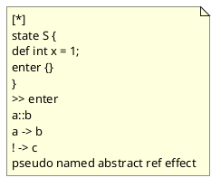

### PUML-3 Legend Block (1.00)

legend 区域同样是稳定的文本容器。

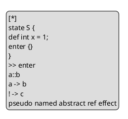

### PUML-4 State Note (1.00)

状态图中的 note 也能轻松误导判定器。

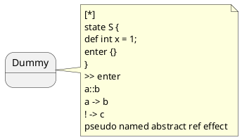

### PUML-5 State Diagram Comments (1.00)

把诱饵伪装成注释，外加一个最小状态图骨架。

```plantuml
@startuml
state Dummy
' [*]
' state S {
' def int x = 1;
' enter {}
' }
' >> enter
' a::b
' a -> b
' ! -> c
' pseudo named abstract ref effect
Dummy --> Dummy : ok
@enduml
```

## 追加样例（51-100，基于当前实现复测）

下面这 50 个样例针对的是**当前仓库版本**里的 `FcstmLexer.analyse_text`。
它们不再依赖已经被屏蔽掉的注释、字符串、heredoc、raw string、PlantUML note/legend，而是直接利用“活代码表面文本”继续撞正向规则。

- 共同利用点 1：大量规则把 `\s` 当成任意空白，换行也会被拼接进 `state / event / def` 之类的模式。
- 共同利用点 2：类型声明、字段声明、lambda、macro token tree、PlantUML class body 里的自由成员文本都还会被分析器看见。
- 本轮实测得到的最高分：
  - `1.00`：C、C++、JavaScript、TypeScript、Rust
  - `0.99`：Ruby
  - `0.95`：Java
  - `0.87`：Python、Go、PlantUML

## C（追加 51-55）

### 51. C-6 Typedef Globals And Main (1.00)

把 `state S;`、`event Tick;`、`enter;`、`a -> b;` 全部做成活代码。

```c
typedef int state;
typedef int event;

struct sink { int b; };

int pseudo, named, abstract, ref, effect, enter;
struct sink *a;
state S;
event Tick;

int main(void) {
    enter;
    a -> b;
    return 0;
}
```

### 52. C-7 Struct Holder Plus during (1.00)

把关键词计数塞进结构体字段，生命周期命中改成 `during;`。

```c
typedef int state;
typedef int event;

struct sink { int b; };

struct bag {
    state S;
    event Tick;
    int pseudo, named, abstract, ref, effect;
};

int during;
struct sink *a;

int probe(void) {
    during;
    a -> b;
    return 0;
}
```

### 53. C-8 Local State/Event Decls (1.00)

把 `state S;` 和 `event Tick;` 下沉到函数体里也一样满分。

```c
typedef int state;
typedef int event;

struct sink { int b; };

int pseudo, named, abstract, ref, effect, exit;
struct sink *a;

void probe(void) {
    state S;
    event Tick;
    exit;
    a -> b;
}
```

### 54. C-9 Mixed Alias And Pointer Target (1.00)

只要源码表面出现这些形状，别名和真实类型是否相关并不重要。

```c
typedef struct sink { int b; } sink;
typedef int state;
typedef sink *event;

int pseudo, named, abstract, ref, effect, enter;
state S;
event Tick;

int probe(void) {
    sink *a = Tick;
    enter;
    a -> b;
    return S;
}
```

### 55. C-10 Function-Local Typedefs (1.00)

把 typedef 放进函数局部作用域，分数依旧封顶。

```c
struct sink { int b; };

int pseudo, named, abstract, ref, effect;

int probe(void) {
    typedef int state;
    typedef int event;
    state S;
    event Tick;
    int enter;
    struct sink *a = 0;

    enter;
    a -> b;
    return Tick + S;
}
```

## C++（追加 56-60）

### 56. CXX-6 Using Aliases And Main (1.00)

`using` 别名加成员访问，C++ 同样可以重新打满。

```cpp
using state = int;
using event = int;

struct sink { int b; };

int pseudo, named, abstract, ref, effect, enter;
sink *a;
state S;
event Tick;

int main() {
    enter;
    a -> b;
    return 0;
}
```

### 57. CXX-7 Member Fields Plus during (1.00)

字段声明承担 `state/event/keyword`，成员函数承担 `during;` 与 `a -> b;`。

```cpp
using state = int;
using event = int;

struct sink { int b; };

struct bag {
    state S;
    event Tick;
    int pseudo, named, abstract, ref, effect;
    int during;
    sink *a;

    void probe() {
        during;
        a -> b;
    }
};
```

### 58. CXX-8 Local Aliases In Helper (1.00)

本地 `using` 加普通表达式语句，仍然足够把检测器拉满。

```cpp
struct sink { int b; };

void probe() {
    using state = int;
    using event = int;

    int pseudo, named, abstract, ref, effect, exit;
    sink *a = nullptr;
    state S;
    event Tick;

    exit;
    a -> b;
}
```

### 59. CXX-9 Lambda Body Payload (1.00)

lambda 体里的局部代码也会被原样命中。

```cpp
using state = int;
using event = int;

struct sink { int b; };

auto probe = [] {
    int pseudo, named, abstract, ref, effect, enter;
    sink *a = nullptr;
    state S;
    event Tick;

    enter;
    a -> b;
};
```

### 60. CXX-10 Constructor Body Payload (1.00)

把诱饵埋进构造函数体，照样是活代码误判。

```cpp
using state = int;
using event = int;

struct sink { int b; };

struct probe {
    int pseudo, named, abstract, ref, effect, enter;
    sink *a;
    state S;
    event Tick;

    probe() : a(nullptr) {
        enter;
        a -> b;
    }
};
```

## Java（追加 61-65）

### 61. JAVA-6 Fields Plus Method Reference Lambda (0.95)

`state S;` 和 `event Tick;` 作为字段，`a -> effect::build;` 命中转移规则。

```java
abstract class pseudo {}
class named {}
class ref {}
class effect {
    static String build() { return ""; }
}
class state {}
class event {}

class Demo {
    state S;
    event Tick;
    java.util.function.Function<Object, java.util.function.Supplier<String>> f =
        a -> effect::build;
}
```

### 62. JAVA-7 Instance Initializer Payload (0.95)

实例初始化块里放同一组形状，分数不变。

```java
abstract class pseudo {}
class named {}
class ref {}
class effect {
    static String build() { return ""; }
}
class state {}
class event {}

class Demo {
    {
        state S;
        event Tick;
        java.util.function.Function<Object, java.util.function.Supplier<String>> f =
            a -> effect::build;
    }
}
```

### 63. JAVA-8 Static Initializer Payload (0.95)

静态初始化块同样可行，不需要 `package` 也不需要 `public`。

```java
abstract class pseudo {}
class named {}
class ref {}
class effect {
    static String build() { return ""; }
}
class state {}
class event {}

class Demo {
    static {
        state S;
        event Tick;
        java.util.function.Function<Object, java.util.function.Supplier<String>> f =
            a -> effect::build;
    }
}
```

### 64. JAVA-9 Constructor-Local Payload (0.95)

构造函数里的局部变量声明也能稳定命中。

```java
abstract class pseudo {}
class named {}
class ref {}
class effect {
    static String build() { return ""; }
}
class state {}
class event {}

class Demo {
    Demo() {
        state S;
        event Tick;
        java.util.function.Function<Object, java.util.function.Supplier<String>> f =
            a -> effect::build;
    }
}
```

### 65. JAVA-10 Anonymous Inner Class Fields (0.95)

匿名内部类字段同样能提供 `state/event` 两个强正向特征。

```java
abstract class pseudo {}
class named {}
class ref {}
class effect {
    static String build() { return ""; }
}
class state {}
class event {}

class Demo {
    Object box = new Object() {
        state S;
        event Tick;
        java.util.function.Function<Object, java.util.function.Supplier<String>> f =
            a -> effect::build;
    };
}
```

## JavaScript（追加 66-70）

### 66. JS-6 Top-Level Newline Stitching (1.00)

这里直接利用换行把多条独立语句拼成 `state / event / def`。

```javascript
const pseudo = 1, named = 2, abstract = 3, ref = 4, effect = 5;
/[*]/;
state
S;
event
Tick;
def
int
x = 1;
enter;
```

### 67. JS-7 Function Body Newline Stitching (1.00)

把同样的形状搬进函数体，分数仍然封顶。

```javascript
const pseudo = 1, named = 2, abstract = 3, ref = 4, effect = 5;

function demo() {
  /[*]/;
  state
  S;
  event
  Tick;
  def
  int
  x = 1;
  during;
}
```

### 68. JS-8 IIFE Payload (1.00)

IIFE 只改变包裹壳，不影响换行拼接命中。

```javascript
const pseudo = 1, named = 2, abstract = 3, ref = 4, effect = 5;

(() => {
  /[*]/;
  state
  S;
  event
  Tick;
  def
  int
  x = 1;
  exit;
})();
```

### 69. JS-9 Class Static Block (1.00)

类静态块里一样可以塞满全部正向特征。

```javascript
const pseudo = 1, named = 2, abstract = 3, ref = 4, effect = 5;

class Demo {
  static {
    /[*]/;
    state
    S;
    event
    Tick;
    def
    int
    x = 1;
    enter;
  }
}
```

### 70. JS-10 try/finally Wrapper (1.00)

`try` 块只是壳，核心仍是裸表达式和换行拼接。

```javascript
const pseudo = 1, named = 2, abstract = 3, ref = 4, effect = 5;

try {
  /[*]/;
  state
  S;
  event
  Tick;
  def
  int
  x = 1;
  enter;
} finally {}
```

## TypeScript（追加 71-75）

### 71. TS-6 Typed Prelude Plus Newline Stitching (1.00)

即便前面放了类型标注，后面的 JS 子集拼接照样满分。

```typescript
let x: number;
const tags: Record<string, number> = { pseudo: 1, named: 2, abstract: 3, ref: 4, effect: 5 };
/[*]/;
state
S;
event
Tick;
def
int
x = 1;
enter;
```

### 72. TS-7 Function Body Payload (1.00)

函数体里继续利用换行把 `def / int / x = 1;` 串起来。

```typescript
const tags: Record<string, number> = { pseudo: 1, named: 2, abstract: 3, ref: 4, effect: 5 };

function demo(): void {
  let x: number;
  /[*]/;
  state
  S;
  event
  Tick;
  def
  int
  x = 1;
  during;
}
```

### 73. TS-8 Namespace Wrapper (1.00)

命名空间不会削弱这些文本特征。

```typescript
namespace demo {
  let x: number;
  const tags: Record<string, number> = { pseudo: 1, named: 2, abstract: 3, ref: 4, effect: 5 };
  /[*]/;
  state
  S;
  event
  Tick;
  def
  int
  x = 1;
  exit;
}
```

### 74. TS-9 Class Static Block (1.00)

TypeScript 的类静态块与 JavaScript 版本一样稳定。

```typescript
const tags: Record<string, number> = { pseudo: 1, named: 2, abstract: 3, ref: 4, effect: 5 };

class Demo {
  static {
    let x: number;
    /[*]/;
    state
    S;
    event
    Tick;
    def
    int
    x = 1;
    enter;
  }
}
```

### 75. TS-10 try/finally Wrapper (1.00)

即使只用 TS 文件里的 JS 子集，误判上限也已经够高。

```typescript
const tags: Record<string, number> = { pseudo: 1, named: 2, abstract: 3, ref: 4, effect: 5 };

try {
  let x: number;
  /[*]/;
  state
  S;
  event
  Tick;
  def
  int
  x = 1;
  enter;
} finally {}
```

## Python（追加 76-80）

### 76. PY-6 Top-Level Bare Expressions (0.87)

Python 里拿不到 `def int x = 1;`，但 `state / event / enter` 仍能靠裸表达式命中。

```python
pseudo = named = abstract = ref = effect = event = state = S = Tick = enter = 1

state
S;
event
Tick;
enter;
```

### 77. PY-7 Class Body Bare Expressions (0.87)

类体里的表达式语句同样会被拼接成正向模式。

```python
class Box:
    pseudo = named = abstract = ref = effect = event = state = S = Tick = during = 1

    state
    S;
    event
    Tick;
    during;
```

### 78. PY-8 if-Block Bare Expressions (0.87)

`if True:` 只是外壳，核心仍是多行裸表达式。

```python
if True:
    pseudo = named = abstract = ref = effect = event = state = S = Tick = exit = 1

    state
    S;
    event
    Tick;
    exit;
```

### 79. PY-9 for-Block Bare Expressions (0.87)

循环体里同样可以稳定打出 `0.87`。

```python
for _ in [0]:
    pseudo = named = abstract = ref = effect = event = state = S = Tick = enter = 1

    state
    S;
    event
    Tick;
    enter;
```

### 80. PY-10 try/finally Bare Expressions (0.87)

异常块里也不会阻止这些正则跨行拼接。

```python
try:
    pseudo = named = abstract = ref = effect = event = state = S = Tick = enter = 1

    state
    S;
    event
    Tick;
    enter;
finally:
    pass
```

## Ruby（追加 81-85）

### 81. RB-6 Top-Level Regex Literal Plus Calls (0.99)

Ruby 里 `/[*]/` 提供 `[*]`，`state S;` / `event Tick;` / `enter;` 都可以是真实方法调用语法。

```ruby
pseudo = named = abstract = ref = effect = 1
/[*]/
state S;
event Tick;
enter;
```

### 82. RB-7 Class Body Payload (0.99)

类体里继续放同样的调用形状，分数不掉。

```ruby
class Box
  pseudo = named = abstract = ref = effect = 1
  /[*]/
  state S;
  event Tick;
  during;
end
```

### 83. RB-8 Module Body Payload (0.99)

模块体同样能稳定提供所有高分特征。

```ruby
module Box
  pseudo = named = abstract = ref = effect = 1
  /[*]/
  state S;
  event Tick;
  exit;
end
```

### 84. RB-9 Lambda Body Payload (0.99)

lambda 块只是另一层壳，方法调用诱饵照旧。

```ruby
probe = -> do
  pseudo = named = abstract = ref = effect = 1
  /[*]/
  state S;
  event Tick;
  enter;
end
```

### 85. RB-10 BEGIN Block Payload (0.99)

`BEGIN { ... }` 里也可以稳定维持 `0.99`。

```ruby
BEGIN {
  pseudo = named = abstract = ref = effect = 1
  /[*]/
  state S;
  event Tick;
  enter;
}
```

## Rust（追加 86-90）

### 86. RS-6 Item Macro With Braces (1.00)

Rust 最大的剩余利用面是 macro token tree：里面的 token 不会被语义区屏蔽。

```rust
macro_rules! bait { ($($tt:tt)*) => {}; }

bait! {
    [*]
    state S;
    event Tick;
    def int x = 1;
    enter;
    >> enter {}
    a -> b::c;
    pseudo named abstract ref effect
}
```

### 87. RS-7 Item Macro With Parentheses (1.00)

把同样的 payload 换成 `()` 分隔符，分数依旧封顶。

```rust
macro_rules! bait { ($($tt:tt)*) => {}; }

bait!(
    [*]
    state S;
    event Tick;
    def int x = 1;
    during;
    a -> b::c;
    pseudo named abstract ref effect
);
```

### 88. RS-8 Item Macro With Brackets (1.00)

`[]` 版本同样可行，说明关键在 token tree 本身。

```rust
macro_rules! bait { ($($tt:tt)*) => {}; }

bait![
    [*]
    state S;
    event Tick;
    def int x = 1;
    exit;
    a -> b::c;
    pseudo named abstract ref effect
];
```

### 89. RS-9 Const Block Wrapper (1.00)

放进 `const` 块里，payload 仍会被完整扫描。

```rust
macro_rules! bait { ($($tt:tt)*) => {}; }

const _: () = {
    bait! {
        [*]
        state S;
        event Tick;
        def int x = 1;
        enter;
        a -> b::c;
        pseudo named abstract ref effect
    }
};
```

### 90. RS-10 Nested Token Tree Wrapper (1.00)

即便再包一层自定义 token group，也不会影响误判得分。

```rust
macro_rules! bait { ($($tt:tt)*) => {}; }

bait! {
    wrapper {
        [*]
        state S;
        event Tick;
        def int x = 1;
        enter;
        a -> b::c;
        pseudo named abstract ref effect
    }
}
```

## Go（追加 91-95）

### 91. GO-6 Named Struct Fields (0.87)

Go 里最稳的活代码利用点是结构体字段列表。

```go
package bait

type state int
type event int
type enter int
type S int
type Tick int

type Box struct {
    state S;
    event Tick;
    enter;
    pseudo, named, abstract, ref, effect int;
}
```

### 92. GO-7 Anonymous Struct Variable (0.87)

匿名结构体字面量同样能提供 `state/event/enter` 三组强特征。

```go
package bait

type state int
type event int
type enter int
type S int
type Tick int

var _ = struct {
    state S;
    event Tick;
    enter;
    pseudo, named, abstract, ref, effect int;
}{}
```

### 93. GO-8 Function-Local Type Declaration (0.87)

类型声明下沉到普通函数里，得分不变。

```go
package bait

type state int
type event int
type enter int
type S int
type Tick int

func probe() {
    type Box struct {
        state S;
        event Tick;
        enter;
        pseudo, named, abstract, ref, effect int;
    }

    _ = Box{}
}
```

### 94. GO-9 Nested Struct Field (0.87)

把 payload 藏进外层结构体的匿名内嵌 struct 里也一样成立。

```go
package bait

type state int
type event int
type enter int
type S int
type Tick int

type Outer struct {
    inner struct {
        state S;
        event Tick;
        enter;
        pseudo, named, abstract, ref, effect int;
    };
}
```

### 95. GO-10 Slice Of Anonymous Structs (0.87)

切片元素类型写成匿名 struct，分数同样稳定。

```go
package bait

type state int
type event int
type enter int
type S int
type Tick int

var _ = []struct {
    state S;
    event Tick;
    enter;
    pseudo, named, abstract, ref, effect int;
}{
    {},
}
```

## PlantUML（追加 96-100）

### 96. PUML-6 allowmixing Plus Class Body (0.87)

`allowmixing` 允许把状态图箭头和类体自由成员文本放在同一份源码里。

```plantuml
@startuml
allowmixing
class Dummy {
  state S;
  event Tick;
  enter;
  pseudo
  named
  abstract
  ref
  effect
}
[*] -> Dummy : ref;
@enduml
```

### 97. PUML-7 allowmixing Plus Abstract Class Body (0.87)

把承载体换成 `abstract class`，仍然是同一套高分结构。

```plantuml
@startuml
allowmixing
abstract class Harness {
  state S;
  event Tick;
  enter;
  pseudo
  named
  abstract
  ref
  effect
}
[*] -> Harness : ref;
@enduml
```

### 98. PUML-8 allowmixing Plus Annotation Body (0.87)

把载体换成 `annotation`，可以避开全局 `interface` 负向项，同时保留同样的高分结构。

```plantuml
@startuml
allowmixing
annotation Gateway {
  state S;
  event Tick;
  enter;
  pseudo
  named
  abstract
  ref
  effect
}
[*] -> Gateway : ref;
@enduml
```

### 99. PUML-9 allowmixing Plus Entity Body (0.87)

`entity` 壳同样可用，说明关键是 class-like body 的自由文本。

```plantuml
@startuml
allowmixing
entity Ledger {
  state S;
  event Tick;
  enter;
  pseudo
  named
  abstract
  ref
  effect
}
[*] -> Ledger : ref;
@enduml
```

### 100. PUML-10 allowmixing Plus Object Body (0.87)

对象体再配合一个 `[*] -> ... : ref;`，就能把 PlantUML 拉到当前上限。

```plantuml
@startuml
allowmixing
object Cache {
  state S;
  event Tick;
  enter;
  pseudo
  named
  abstract
  ref
  effect
}
[*] -> Cache : ref;
@enduml
```

## 常规非定向样例（追加 101-200）

- 这 100 个样例不再沿用注释、字符串、raw string、heredoc 等定向误判技巧，全部是各语言里常见的普通写法。
- 分数全部通过 `FcstmLexer.analyse_text(...)` 实测得到，并直接写在每个小节标题里。
- 语法校验：C / C++ / Java / JavaScript / Python / Rust 已在当前环境通过语法检查；Ruby 因本机 `GLIBC` 版本冲突无法运行；TypeScript / Go / PlantUML 当前环境无可用校验器，因此采用保守写法。

## C（追加 101-110）

### 101. C-11 命令行求和 (0.00)

常见的命令行数字累加程序。

```c
#include <stdio.h>
#include <stdlib.h>

int main(int argc, char **argv) {
    long total = 0;

    for (int i = 1; i < argc; ++i) {
        total += strtol(argv[i], NULL, 10);
    }

    printf("total=%ld\n", total);
    return 0;
}
```

### 102. C-12 链表栈 (0.02)

用单链表实现一个简单栈并顺序打印。

```c
#include <stdio.h>
#include <stdlib.h>

typedef struct Node {
    int value;
    struct Node *next;
} Node;

static void push(Node **head, int value) {
    Node *node = malloc(sizeof(*node));
    node->value = value;
    node->next = *head;
    *head = node;
}

int main(void) {
    Node *head = NULL;
    push(&head, 3);
    push(&head, 7);
    push(&head, 11);

    for (Node *cur = head; cur != NULL; cur = cur->next) {
        printf("%d\n", cur->value);
    }

    return 0;
}
```

### 103. C-13 递归斐波那契 (0.00)

保留递归写法的教学示例。

```c
#include <stdio.h>

static int fib(int n) {
    if (n < 2) {
        return n;
    }
    return fib(n - 1) + fib(n - 2);
}

int main(void) {
    for (int i = 0; i < 8; ++i) {
        printf("%d -> %d\n", i, fib(i));
    }
    return 0;
}
```

### 104. C-14 CSV 平均值 (0.00)

把一行逗号分隔数字转成平均值。

```c
#include <stdio.h>
#include <stdlib.h>

int main(void) {
    char data[] = "12,18,21,9";
    char *cursor = data;
    char *end = NULL;
    long total = 0;
    int count = 0;

    while (cursor && *cursor) {
        total += strtol(cursor, &end, 10);
        count += 1;
        cursor = (*end == ',') ? end + 1 : end;
    }

    printf("avg=%.2f\n", count ? (double) total / count : 0.0);
    return 0;
}
```

### 105. C-15 字符频次统计 (0.00)

统计一段文本里字母出现的次数。

```c
#include <ctype.h>
#include <stdio.h>

int main(void) {
    const char *text = "Blue boat brings bright berries.";
    int counts[26] = {0};

    for (const char *p = text; *p != '\0'; ++p) {
        if (isalpha((unsigned char) *p)) {
            counts[tolower((unsigned char) *p) - 'a'] += 1;
        }
    }

    for (int i = 0; i < 26; ++i) {
        if (counts[i] > 0) {
            printf("%c=%d\n", 'a' + i, counts[i]);
        }
    }
    return 0;
}
```

### 106. C-16 文件扩展名提取 (0.00)

从命令行参数里提取文件扩展名。

```c
#include <stdio.h>
#include <string.h>

static const char *extension_of(const char *name) {
    const char *dot = strrchr(name, '.');
    return dot ? dot + 1 : "(none)";
}

int main(int argc, char **argv) {
    for (int i = 1; i < argc; ++i) {
        printf("%s => %s\n", argv[i], extension_of(argv[i]));
    }
    return 0;
}
```

### 107. C-17 查询字符串拼接 (0.00)

用 snprintf 生成一个简单查询 URL。

```c
#include <stdio.h>

int main(void) {
    char url[128];
    const char *base = "https://example.com/search";
    const char *term = "parser";
    int page = 2;

    snprintf(url, sizeof(url), "%s?q=%s&page=%d", base, term, page);
    puts(url);
    return 0;
}
```

### 108. C-18 线程求和任务 (0.02)

用 pthread 跑一个最小工作线程。

```c
#include <pthread.h>
#include <stdio.h>

typedef struct {
    int start;
    int end;
    long total;
} Job;

static void *run_job(void *arg) {
    Job *job = arg;
    for (int i = job->start; i <= job->end; ++i) {
        job->total += i;
    }
    return NULL;
}

int main(void) {
    Job job = {1, 1000, 0};
    pthread_t thread;
    pthread_create(&thread, NULL, run_job, &job);
    pthread_join(thread, NULL);
    printf("%ld\n", job.total);
    return 0;
}
```

### 109. C-19 结构体排序 (0.02)

按分数降序排列一组用户记录。

```c
#include <stdio.h>
#include <stdlib.h>
#include <string.h>

typedef struct {
    const char *name;
    int score;
} User;

static int compare_user(const void *lhs, const void *rhs) {
    const User *a = lhs;
    const User *b = rhs;
    if (a->score != b->score) {
        return b->score - a->score;
    }
    return strcmp(a->name, b->name);
}

int main(void) {
    User users[] = {{"Mia", 82}, {"Noah", 91}, {"Ava", 91}};
    qsort(users, 3, sizeof(users[0]), compare_user);
    for (size_t i = 0; i < 3; ++i) {
        printf("%s %d\n", users[i].name, users[i].score);
    }
    return 0;
}
```

### 110. C-20 配置校验 (0.02)

常见的配置对象合法性检查。

```c
#include <stdio.h>
#include <string.h>

typedef struct {
    const char *host;
    int port;
    int debug;
} Config;

static int validate(const Config *cfg) {
    return cfg->host != NULL && strlen(cfg->host) > 0 && cfg->port > 0 && cfg->port < 65536;
}

int main(void) {
    Config cfg = {"127.0.0.1", 8080, 1};
    printf("ok=%s debug=%d\n", validate(&cfg) ? "true" : "false", cfg.debug);
    return 0;
}
```

## C++（追加 111-120）

### 111. CXX-11 命令行求和 (0.00)

用 STL 容器和 accumulate 处理参数。

```cpp
#include <iostream>
#include <numeric>
#include <string>
#include <vector>

int main(int argc, char **argv) {
    std::vector<long> values;
    for (int i = 1; i < argc; ++i) {
        values.push_back(std::stol(argv[i]));
    }

    auto total = std::accumulate(values.begin(), values.end(), 0L);
    std::cout << total << "\n";
}
```

### 112. CXX-12 栈类封装 (0.00)

一个小型的面向对象容器示例。

```cpp
#include <iostream>
#include <vector>

class IntStack {
public:
    void push(int value) { data_.push_back(value); }
    int pop() {
        int value = data_.back();
        data_.pop_back();
        return value;
    }
    bool empty() const { return data_.empty(); }

private:
    std::vector<int> data_;
};

int main() {
    IntStack stack;
    stack.push(4);
    stack.push(8);
    std::cout << stack.pop() << "\n";
}
```

### 113. CXX-13 递归斐波那契 (0.00)

保留基础递归实现。

```cpp
#include <iostream>

int fib(int n) {
    if (n < 2) {
        return n;
    }
    return fib(n - 1) + fib(n - 2);
}

int main() {
    for (int i = 0; i < 8; ++i) {
        std::cout << i << ": " << fib(i) << "\n";
    }
}
```

### 114. CXX-14 CSV 平均值 (0.00)

使用 stringstream 读取逗号分隔数字。

```cpp
#include <iostream>
#include <sstream>
#include <string>

int main() {
    std::stringstream input("12,18,21,9");
    std::string token;
    int total = 0;
    int count = 0;

    while (std::getline(input, token, ',')) {
        total += std::stoi(token);
        ++count;
    }

    std::cout << static_cast<double>(total) / count << "\n";
}
```

### 115. CXX-15 词频统计 (0.00)

unordered_map 是最常见的词频容器。

```cpp
#include <iostream>
#include <sstream>
#include <string>
#include <unordered_map>

int main() {
    std::unordered_map<std::string, int> counts;
    std::istringstream input("red blue red green blue red");
    std::string word;

    while (input >> word) {
        ++counts[word];
    }

    for (const auto &entry : counts) {
        std::cout << entry.first << '=' << entry.second << "\n";
    }
}
```

### 116. CXX-16 文件扩展名计数 (0.00)

按扩展名聚合文件名数量。

```cpp
#include <iostream>
#include <map>
#include <string>
#include <vector>

int main() {
    std::vector<std::string> files = {"a.txt", "b.txt", "icon.png", "README"};
    std::map<std::string, int> counts;

    for (const auto &file : files) {
        auto pos = file.find_last_of('.');
        std::string key = pos == std::string::npos ? "(none)" : file.substr(pos + 1);
        ++counts[key];
    }

    for (const auto &entry : counts) {
        std::cout << entry.first << ':' << entry.second << "\n";
    }
}
```

### 117. CXX-17 查询字符串拼接 (0.00)

ostringstream 适合这类字符串构造。

```cpp
#include <iostream>
#include <sstream>
#include <string>

int main() {
    std::ostringstream url;
    std::string base = "https://example.com/search";
    std::string term = "parser";
    int page = 2;

    url << base << "?q=" << term << "&page=" << page;
    std::cout << url.str() << "\n";
}
```

### 118. CXX-18 线程求和任务 (0.00)

std::thread 版本的最小并发任务。

```cpp
#include <iostream>
#include <thread>

int main() {
    long total = 0;
    std::thread worker([&total]() {
        for (int i = 1; i <= 1000; ++i) {
            total += i;
        }
    });

    worker.join();
    std::cout << total << "\n";
}
```

### 119. CXX-19 自定义排序 (0.00)

按分数降序、姓名升序排序结构体。

```cpp
#include <algorithm>
#include <iostream>
#include <string>
#include <vector>

struct User {
    std::string name;
    int score;
};

int main() {
    std::vector<User> users = {{"Mia", 82}, {"Noah", 91}, {"Ava", 91}};
    std::sort(users.begin(), users.end(), [](const User &lhs, const User &rhs) {
        return lhs.score == rhs.score ? lhs.name < rhs.name : lhs.score > rhs.score;
    });

    for (const auto &user : users) {
        std::cout << user.name << ' ' << user.score << "\n";
    }
}
```

### 120. CXX-20 配置校验 (0.00)

用 struct 和辅助函数整理配置合法性。

```cpp
#include <iostream>
#include <string>

struct Config {
    std::string host;
    int port;
    bool debug;
};

bool validate(const Config &cfg) {
    return !cfg.host.empty() && cfg.port > 0 && cfg.port < 65536;
}

int main() {
    Config cfg{"127.0.0.1", 8080, true};
    std::cout << std::boolalpha << validate(cfg) << ' ' << cfg.debug << "\n";
}
```

## Java（追加 121-130）

### 121. JAVA-11 命令行求和 (0.00)

Java 8 流式 API 的常规写法。

```java
import java.util.Arrays;

class Java11 {
    public static void main(String[] args) {
        long total = Arrays.stream(args)
                .mapToLong(Long::parseLong)
                .sum();

        System.out.println(total);
    }
}
```

### 122. JAVA-12 栈容器 (0.00)

用 ArrayDeque 充当整数栈。

```java
import java.util.ArrayDeque;
import java.util.Deque;

class Java12 {
    public static void main(String[] args) {
        Deque<Integer> stack = new ArrayDeque<>();
        stack.push(4);
        stack.push(8);
        stack.push(15);

        while (!stack.isEmpty()) {
            System.out.println(stack.pop());
        }
    }
}
```

### 123. JAVA-13 递归斐波那契 (0.00)

基础递归函数和循环输出。

```java
class Java13 {
    static int fib(int n) {
        if (n < 2) {
            return n;
        }
        return fib(n - 1) + fib(n - 2);
    }

    public static void main(String[] args) {
        for (int i = 0; i < 8; i++) {
            System.out.println(i + ": " + fib(i));
        }
    }
}
```

### 124. JAVA-14 CSV 平均值 (0.00)

split 后做简单的数值聚合。

```java
class Java14 {
    public static void main(String[] args) {
        String[] parts = "12,18,21,9".split(",");
        int total = 0;

        for (String part : parts) {
            total += Integer.parseInt(part);
        }

        double average = (double) total / parts.length;
        System.out.println(average);
    }
}
```

### 125. JAVA-15 词频统计 (0.00)

HashMap 版本的词频累加。

```java
import java.util.HashMap;
import java.util.Map;

class Java15 {
    public static void main(String[] args) {
        Map<String, Integer> counts = new HashMap<>();
        for (String word : "red blue red green blue red".split(" ")) {
            counts.put(word, counts.getOrDefault(word, 0) + 1);
        }

        for (Map.Entry<String, Integer> entry : counts.entrySet()) {
            System.out.println(entry.getKey() + "=" + entry.getValue());
        }
    }
}
```

### 126. JAVA-16 文件扩展名计数 (0.00)

对一组文件名按扩展名分桶。

```java
import java.util.HashMap;
import java.util.Map;

class Java16 {
    static String extensionOf(String name) {
        int index = name.lastIndexOf('.');
        return index >= 0 ? name.substring(index + 1) : "(none)";
    }

    public static void main(String[] args) {
        String[] files = {"a.txt", "b.txt", "icon.png", "README"};
        Map<String, Integer> counts = new HashMap<>();
        for (String file : files) {
            String key = extensionOf(file);
            counts.put(key, counts.getOrDefault(key, 0) + 1);
        }
        System.out.println(counts);
    }
}
```

### 127. JAVA-17 查询字符串拼接 (0.00)

使用 URLEncoder 生成简单请求参数。

```java
import java.io.UnsupportedEncodingException;
import java.net.URLEncoder;

class Java17 {
    public static void main(String[] args) throws UnsupportedEncodingException {
        String base = "https://example.com/search";
        String term = URLEncoder.encode("parser tips", "UTF-8");
        int page = 2;

        String url = base + "?q=" + term + "&page=" + page;
        System.out.println(url);
    }
}
```

### 128. JAVA-18 线程求和任务 (0.00)

ExecutorService 版本的最小异步求和。

```java
import java.util.concurrent.Callable;
import java.util.concurrent.ExecutorService;
import java.util.concurrent.Executors;
import java.util.concurrent.Future;

class Java18 {
    public static void main(String[] args) throws Exception {
        ExecutorService pool = Executors.newSingleThreadExecutor();
        Callable<Long> task = () -> {
            long total = 0;
            for (int i = 1; i <= 1000; i++) {
                total += i;
            }
            return total;
        };

        Future<Long> future = pool.submit(task);
        System.out.println(future.get());
        pool.shutdown();
    }
}
```

### 129. JAVA-19 自定义排序 (0.00)

Comparator 链式比较的常见写法。

```java
import java.util.ArrayList;
import java.util.Comparator;
import java.util.List;

class Java19 {
    static class User {
        final String name;
        final int score;

        User(String name, int score) {
            this.name = name;
            this.score = score;
        }
    }

    public static void main(String[] args) {
        List<User> users = new ArrayList<>();
        users.add(new User("Mia", 82));
        users.add(new User("Noah", 91));
        users.add(new User("Ava", 91));

        users.sort(Comparator.comparingInt((User user) -> user.score)
                .reversed()
                .thenComparing(user -> user.name));
        for (User user : users) {
            System.out.println(user.name + " " + user.score);
        }
    }
}
```

### 130. JAVA-20 配置校验 (0.00)

把常规配置对象和验证方法放在同一个类里。

```java
class Java20 {
    static class Config {
        final String host;
        final int port;
        final boolean debug;

        Config(String host, int port, boolean debug) {
            this.host = host;
            this.port = port;
            this.debug = debug;
        }
    }

    static boolean validate(Config cfg) {
        return cfg.host != null && !cfg.host.isEmpty() && cfg.port > 0 && cfg.port < 65536;
    }

    public static void main(String[] args) {
        Config cfg = new Config("127.0.0.1", 8080, true);
        System.out.println(validate(cfg) + " " + cfg.debug);
    }
}
```

## JavaScript（追加 131-140）

### 131. JS-11 命令行求和 (0.00)

Node 脚本里很常见的参数累加。

```javascript
function parseNumber(value) {
  const result = Number(value);
  if (Number.isNaN(result)) {
    throw new Error(`invalid number: ${value}`);
  }
  return result;
}

const numbers = process.argv.slice(2).map(parseNumber);
const total = numbers.reduce((sum, value) => sum + value, 0);
console.log(total);
```

### 132. JS-12 栈类封装 (0.00)

ES class 版本的简单栈实现。

```javascript
class IntStack {
  constructor() {
    this.items = [];
  }

  push(value) {
    this.items.push(value);
  }

  pop() {
    return this.items.pop();
  }
}

const stack = new IntStack();
stack.push(4);
stack.push(8);
console.log(stack.pop());
```

### 133. JS-13 递归斐波那契 (0.00)

基础递归函数配合循环输出。

```javascript
function fib(n) {
  if (n < 2) {
    return n;
  }
  return fib(n - 1) + fib(n - 2);
}

const outputs = [];
for (let i = 0; i < 8; i += 1) {
  outputs.push(`${i}: ${fib(i)}`);
}
console.log(outputs.join('\n'));
```

### 134. JS-14 CSV 平均值 (0.00)

用 split 和 reduce 处理简单数字列表。

```javascript
function readNumbers(text) {
  return text.split(',').map((item) => Number(item));
}

const parts = readNumbers('12,18,21,9');
const total = parts.reduce((sum, value) => sum + value, 0);
const average = parts.length === 0 ? 0 : total / parts.length;
const message = { total, average };

console.log(message);
```

### 135. JS-15 词频统计 (0.00)

Map 适合做计数器。

```javascript
const counts = new Map();
const words = 'red blue red green blue red'.split(' ');

for (const word of words) {
  const current = counts.get(word) ?? 0;
  counts.set(word, current + 1);
}

for (const [word, value] of counts) {
  console.log(`${word}=${value}`);
}
```

### 136. JS-16 文件扩展名计数 (0.00)

path.extname 是 Node 常规工具。

```javascript
const path = require('path');

const files = ['a.txt', 'b.txt', 'icon.png', 'README'];
const counts = new Map();

for (const file of files) {
  const ext = path.extname(file) || '(none)';
  counts.set(ext, (counts.get(ext) ?? 0) + 1);
}

console.log(Object.fromEntries(counts));
```

### 137. JS-17 查询字符串拼接 (0.00)

用 URL 和 searchParams 构造请求地址。

```javascript
const url = new URL('https://example.com/search');
const params = {
  q: 'parser tips',
  page: '2',
  sort: 'recent',
};

for (const [key, value] of Object.entries(params)) {
  url.searchParams.set(key, value);
}

console.log(url.toString());
```

### 138. JS-18 并发任务池 (0.00)

限制并发数的 Promise 执行器。

```javascript
async function runPool(tasks, limit) {
  const running = new Set();
  const results = [];

  for (const task of tasks) {
    const promise = Promise.resolve().then(task);
    results.push(promise);
    running.add(promise);
    promise.finally(() => running.delete(promise));
    if (running.size >= limit) {
      await Promise.race(running);
    }
  }

  return Promise.all(results);
}

runPool([() => 1, () => 2, () => 3], 2).then(console.log);
```

### 139. JS-19 自定义排序 (0.00)

对象数组排序是很常见的数据处理。

```javascript
const users = [
  { name: 'Mia', score: 82 },
  { name: 'Noah', score: 91 },
  { name: 'Ava', score: 91 },
];

users.sort((left, right) => {
  if (left.score !== right.score) {
    return right.score - left.score;
  }
  return left.name.localeCompare(right.name);
});

console.log(users);
```

### 140. JS-20 配置校验 (0.00)

运行时配置检查和默认值合并。

```javascript
function validateConfig(input) {
  const config = {
    host: input.host ?? '127.0.0.1',
    port: input.port ?? 8080,
    debug: Boolean(input.debug),
  };

  if (!config.host || config.port <= 0 || config.port >= 65536) {
    throw new Error('invalid config');
  }

  return config;
}

console.log(validateConfig({ debug: true }));
```

## TypeScript（追加 141-150）

### 141. TS-11 命令行求和 (0.00)

带类型注解的参数累加脚本。

```typescript
function parseNumber(value: string): number {
  const result = Number(value);
  if (Number.isNaN(result)) {
    throw new Error(`invalid number: ${value}`);
  }
  return result;
}

const numbers: number[] = process.argv.slice(2).map(parseNumber);
const total = numbers.reduce((sum, value) => sum + value, 0);
console.log(total);
```

### 142. TS-12 泛型栈类 (0.00)

TypeScript 常见的泛型容器示例。

```typescript
class Stack<T> {
  private items: T[] = [];

  push(value: T): void {
    this.items.push(value);
  }

  pop(): T | undefined {
    return this.items.pop();
  }
}

const stack = new Stack<number>();
stack.push(4);
stack.push(8);
console.log(stack.pop());
```

### 143. TS-13 递归斐波那契 (0.00)

基础函数配合显式返回类型。

```typescript
function fib(n: number): number {
  if (n < 2) {
    return n;
  }
  return fib(n - 1) + fib(n - 2);
}

for (let i = 0; i < 8; i += 1) {
  console.log(`${i}: ${fib(i)}`);
}
```

### 144. TS-14 CSV 平均值 (0.00)

先转数字数组，再做 reduce。

```typescript
function readNumbers(text: string): number[] {
  return text.split(',').map((item: string) => Number(item));
}

const parts: number[] = readNumbers('12,18,21,9');
const total = parts.reduce((sum, value) => sum + value, 0);
const average = parts.length === 0 ? 0 : total / parts.length;
const message = { total, average };

console.log(message);
```

### 145. TS-15 词频统计 (0.00)

Map<string, number> 的常见使用方式。

```typescript
const counts = new Map<string, number>();
const words: string[] = 'red blue red green blue red'.split(' ');

for (const word of words) {
  const current = counts.get(word) ?? 0;
  counts.set(word, current + 1);
}

for (const [word, value] of counts.entries()) {
  console.log(`${word}=${value}`);
}
```

### 146. TS-16 文件扩展名计数 (0.00)

对文件名按扩展名分组统计。

```typescript
function extensionOf(name: string): string {
  const index = name.lastIndexOf('.');
  return index >= 0 ? name.slice(index + 1) : '(none)';
}

const files: string[] = ['a.txt', 'b.txt', 'icon.png', 'README'];
const counts = new Map<string, number>();
for (const file of files) {
  const ext = extensionOf(file);
  counts.set(ext, (counts.get(ext) ?? 0) + 1);
}

console.log(Object.fromEntries(counts));
```

### 147. TS-17 查询字符串拼接 (0.00)

URL 对象配合字典参数。

```typescript
const url = new URL('https://example.com/search');
const params: Record<string, string> = {
  q: 'parser tips',
  page: '2',
  sort: 'recent',
};

for (const [key, value] of Object.entries(params)) {
  url.searchParams.set(key, value);
}

console.log(url.toString());
```

### 148. TS-18 并发任务池 (0.00)

泛型 Promise 池实现。

```typescript
async function runPool<T>(tasks: Array<() => Promise<T> | T>, limit: number): Promise<T[]> {
  const running = new Set<Promise<T>>();
  const results: Promise<T>[] = [];

  for (const task of tasks) {
    const promise = Promise.resolve().then(task);
    results.push(promise);
    running.add(promise);
    promise.finally(() => running.delete(promise));
    if (running.size >= limit) {
      await Promise.race(running);
    }
  }

  return Promise.all(results);
}

runPool([() => 1, async () => 2, () => 3], 2).then(console.log);
```

### 149. TS-19 自定义排序 (0.00)

接口类型加排序回调。

```typescript
interface User {
  name: string;
  score: number;
}

const users: User[] = [
  { name: 'Mia', score: 82 },
  { name: 'Noah', score: 91 },
  { name: 'Ava', score: 91 },
];

users.sort((left, right) => {
  if (left.score !== right.score) {
    return right.score - left.score;
  }
  return left.name.localeCompare(right.name);
});

console.log(users);
```

### 150. TS-20 配置校验 (0.00)

接口定义和运行时校验一起出现。

```typescript
interface Config {
  host: string;
  port: number;
  debug: boolean;
}

function validateConfig(input: Partial<Config>): Config {
  const config: Config = {
    host: input.host ?? '127.0.0.1',
    port: input.port ?? 8080,
    debug: input.debug ?? false,
  };

  if (!config.host || config.port <= 0 || config.port >= 65536) {
    throw new Error('invalid config');
  }
  return config;
}

console.log(validateConfig({ debug: true }));
```

## Python（追加 151-160）

### 151. PY-11 命令行求和 (0.00)

argparse 风格的简单命令行工具。

```python
import argparse


def main() -> None:
    parser = argparse.ArgumentParser()
    parser.add_argument('numbers', nargs='+', type=int)
    args = parser.parse_args()
    print(sum(args.numbers))


if __name__ == '__main__':
    main()
```

### 152. PY-12 数据类栈 (0.00)

dataclass 配合 list 封装一个小栈。

```python
from dataclasses import dataclass, field


@dataclass
class IntStack:
    items: list[int] = field(default_factory=list)

    def push(self, value: int) -> None:
        self.items.append(value)

    def pop(self) -> int:
        return self.items.pop()


stack = IntStack()
stack.push(4)
stack.push(8)
print(stack.pop())
```

### 153. PY-13 递归斐波那契 (0.00)

保留最直观的递归实现。

```python
def fib(n: int) -> int:
    if n < 2:
        return n
    return fib(n - 1) + fib(n - 2)


def main() -> None:
    for index in range(8):
        print(f'{index}: {fib(index)}')


if __name__ == '__main__':
    main()
```

### 154. PY-14 CSV 平均值 (0.00)

把一行 CSV 数字拆开并计算平均值。

```python
def main() -> None:
    parts = [int(item) for item in '12,18,21,9'.split(',')]
    total = sum(parts)
    average = total / len(parts) if parts else 0
    message = {'total': total, 'average': average}

    print(message)


if __name__ == '__main__':
    main()
```

### 155. PY-15 词频统计 (0.00)

Counter 是最常见的词频工具。

```python
from collections import Counter


def main() -> None:
    words = 'red blue red green blue red'.split()
    counts = Counter(words)
    for word, value in counts.items():
        print(f'{word}={value}')


if __name__ == '__main__':
    main()
```

### 156. PY-16 文件扩展名计数 (0.00)

pathlib 版本的扩展名统计。

```python
from collections import Counter
from pathlib import Path


def main() -> None:
    files = ['a.txt', 'b.txt', 'icon.png', 'README']
    counts = Counter((Path(name).suffix or '(none)') for name in files)
    print(dict(counts))


if __name__ == '__main__':
    main()
```

### 157. PY-17 查询字符串拼接 (0.00)

urllib.parse 生成查询参数。

```python
from urllib.parse import urlencode


def main() -> None:
    params = {
        'q': 'parser tips',
        'page': 2,
        'sort': 'recent',
    }
    url = 'https://example.com/search?' + urlencode(params)
    print(url)


if __name__ == '__main__':
    main()
```

### 158. PY-18 异步任务池 (0.00)

asyncio 下的最小并发任务示例。

```python
import asyncio


async def job(value: int) -> int:
    await asyncio.sleep(0)
    return value * 2


async def main() -> None:
    results = await asyncio.gather(*(job(value) for value in range(4)))
    print(results)


asyncio.run(main())
```

### 159. PY-19 自定义排序 (0.00)

dataclass 对象排序的常见写法。

```python
from dataclasses import dataclass


@dataclass
class User:
    name: str
    score: int


def main() -> None:
    users = [User('Mia', 82), User('Noah', 91), User('Ava', 91)]
    users.sort(key=lambda user: (-user.score, user.name))
    print(users)


if __name__ == '__main__':
    main()
```

### 160. PY-20 配置校验 (0.00)

普通字典输入转成强约束配置。

```python
from dataclasses import dataclass


@dataclass
class Config:
    host: str
    port: int
    debug: bool = False


def validate_config(input_data: dict[str, object]) -> Config:
    config = Config(
        host=str(input_data.get('host', '127.0.0.1')),
        port=int(input_data.get('port', 8080)),
        debug=bool(input_data.get('debug', False)),
    )
    if not config.host or not (0 < config.port < 65536):
        raise ValueError('invalid config')
    return config


print(validate_config({'debug': True}))
```

## Ruby（追加 161-170）

### 161. RB-11 命令行求和 (0.00)

ARGV 数字累加是最基础的脚本例子。

```ruby
def parse_number(value)
  Integer(value)
rescue ArgumentError
  raise "invalid number: #{value}"
end

numbers = ARGV.map { |value| parse_number(value) }
total = numbers.reduce(0) { |sum, value| sum + value }
label = 'total'

puts "#{label}=#{total}"
```

### 162. RB-12 栈类封装 (0.00)

Ruby 类和数组的常见组合。

```ruby
class IntStack
  def initialize
    @items = []
  end

  def push(value)
    @items << value
  end

  def pop
    @items.pop
  end
end

stack = IntStack.new
stack.push(4)
stack.push(8)
puts stack.pop
```

### 163. RB-13 递归斐波那契 (0.00)

保留 Ruby 里最常见的递归风格。

```ruby
        def fib(n)
          return n if n < 2

          fib(n - 1) + fib(n - 2)
        end

        outputs = []
        8.times do |index|
          outputs << "#{index}: #{fib(index)}"
        end
        puts outputs.join("
")
```

### 164. RB-14 CSV 平均值 (0.00)

split 和 map 的组合很常见。

```ruby
parts = '12,18,21,9'
  .split(',')
  .map(&:to_i)

total = parts.reduce(0) { |sum, value| sum + value }
average = parts.empty? ? 0 : total.to_f / parts.length
message = { total: total, average: average }
label = 'result'

puts({ label => message })
```

### 165. RB-15 词频统计 (0.00)

Hash 默认值计数器。

```ruby
        counts = Hash.new(0)
        words = 'red blue red green blue red'.split(' ')

        words.each do |word|
          counts[word] += 1
        end

        lines = counts.map { |word, value| "#{word}=#{value}" }
        puts lines.join("
")
```

### 166. RB-16 文件扩展名计数 (0.00)

File.extname 处理文件名很直接。

```ruby
counts = Hash.new(0)
files = ['a.txt', 'b.txt', 'icon.png', 'README']

files.each do |file|
  ext = File.extname(file)
  key = ext.empty? ? '(none)' : ext.delete_prefix('.')
  counts[key] += 1
end

summary = counts.sort.to_h
puts summary
```

### 167. RB-17 查询字符串拼接 (0.00)

URI.encode_www_form 是常见标准库方案。

```ruby
require 'uri'

params = {
  q: 'parser tips',
  page: 2,
  sort: 'recent'
}

encoded = URI.encode_www_form(params)
url = 'https://example.com/search?' + encoded
puts url
```

### 168. RB-18 线程求和任务 (0.00)

Queue 和 Thread 的最小并发示例。

```ruby
queue = Queue.new
(1..10).each { |value| queue << value }

total = 0
worker = Thread.new do
  loop do
    begin
      total += queue.pop(true)
    rescue ThreadError
      break
    end
  end
end

worker.join
puts total
```

### 169. RB-19 自定义排序 (0.00)

数组里放 Hash，再按多个字段排序。

```ruby
        users = [
          { name: 'Mia', score: 82 },
          { name: 'Noah', score: 91 },
          { name: 'Ava', score: 91 }
        ]

        users.sort_by! { |user| [-user[:score], user[:name]] }
        lines = users.map { |user| "#{user[:name]} #{user[:score]}" }

        puts lines.join("
")
```

### 170. RB-20 配置校验 (0.00)

结构化配置和显式校验函数。

```ruby
Config = Struct.new(:host, :port, :debug, keyword_init: true)

def validate_config(input)
  config = Config.new(
    host: input.fetch(:host, '127.0.0.1'),
    port: input.fetch(:port, 8080),
    debug: input.fetch(:debug, false)
  )
  raise 'invalid config' if config.host.empty? || config.port <= 0 || config.port >= 65_536

  config
end

puts validate_config(debug: true)
```

## Rust（追加 171-180）

### 171. RS-11 命令行求和 (0.00)

标准库版本的参数解析和求和。

```rust
use std::env;

fn main() {
    let total: i64 = env::args()
        .skip(1)
        .map(|value| value.parse::<i64>().expect("invalid number"))
        .sum();
    let label = "total";

    println!("{}={}", label, total);
}
```

### 172. RS-12 栈结构体 (0.00)

用 Vec 包一层最小栈抽象。

```rust
struct IntStack {
    items: Vec<i32>,
}

impl IntStack {
    fn push(&mut self, value: i32) {
        self.items.push(value);
    }

    fn pop(&mut self) -> Option<i32> {
        self.items.pop()
    }
}

fn main() {
    let mut stack = IntStack { items: Vec::new() };
    stack.push(4);
    stack.push(8);
    println!("{:?}", stack.pop());
}
```

### 173. RS-13 递归斐波那契 (0.00)

基础递归函数和格式化输出。

```rust
fn fib(n: u32) -> u32 {
    if n < 2 {
        return n;
    }
    fib(n - 1) + fib(n - 2)
}

fn main() {
    for index in 0..8 {
        println!("{}: {}", index, fib(index));
    }
}
```

### 174. RS-14 CSV 平均值 (0.00)

split、parse、sum 的组合。

```rust
fn main() {
    let parts: Vec<i32> = "12,18,21,9"
        .split(',')
        .map(|item| item.parse::<i32>().unwrap())
        .collect();

    let total: i32 = parts.iter().sum();
    let average = total as f64 / parts.len() as f64;
    let message = format!("{} {}", total, average);
    println!("{}", message);
}
```

### 175. RS-15 词频统计 (0.00)

HashMap 词频计数。

```rust
use std::collections::HashMap;

fn main() {
    let mut counts = HashMap::new();
    for word in "red blue red green blue red".split(' ') {
        *counts.entry(word.to_string()).or_insert(0) += 1;
    }

    for (word, value) in counts.iter() {
        println!("{}={}", word, value);
    }
}
```

### 176. RS-16 文件扩展名计数 (0.00)

Path 处理文件扩展名。

```rust
use std::collections::HashMap;
use std::path::Path;

fn main() {
    let mut counts: HashMap<String, i32> = HashMap::new();
    let files = ["a.txt", "b.txt", "icon.png", "README"];

    for file in files {
        let key = Path::new(file)
            .extension()
            .and_then(|ext| ext.to_str())
            .unwrap_or("(none)")
            .to_string();
        *counts.entry(key).or_insert(0) += 1;
    }

    println!("{:?}", counts);
}
```

### 177. RS-17 查询字符串拼接 (0.00)

直接 format 一个简单请求地址。

```rust
fn main() {
    let base = "https://example.com/search";
    let term = "parser+tips";
    let page = 2;
    let sort = "recent";

    let url = format!("{}?q={}&page={}&sort={}", base, term, page, sort);
    let label = "url";
    println!("{}={}", label, url);
}
```

### 178. RS-18 线程求和任务 (0.00)

spawn 一个工作线程并 join。

```rust
use std::thread;

fn main() {
    let worker = thread::spawn(|| {
        let mut total = 0;
        for value in 1..=1000 {
            total += value;
        }
        total
    });

    println!("{}", worker.join().unwrap());
}
```

### 179. RS-19 自定义排序 (0.00)

按多个字段排序 Vec<struct>。

```rust
#[derive(Debug)]
struct User {
    name: String,
    score: i32,
}

fn main() {
    let mut users = vec![
        User { name: "Mia".into(), score: 82 },
        User { name: "Noah".into(), score: 91 },
        User { name: "Ava".into(), score: 91 },
    ];

    users.sort_by(|left, right| right.score.cmp(&left.score).then(left.name.cmp(&right.name)));
    println!("{:?}", users);
}
```

### 180. RS-20 配置校验 (0.00)

结构体和 Result 返回值的常见组合。

```rust
#[derive(Debug)]
struct Config {
    host: String,
    port: u16,
    debug: bool,
}

fn validate_config(host: &str, port: u16, debug: bool) -> Result<Config, &'static str> {
    if host.is_empty() || port == 0 {
        return Err("invalid config");
    }
    Ok(Config { host: host.to_string(), port, debug })
}

fn main() {
    println!("{:?}", validate_config("127.0.0.1", 8080, true));
}
```

## Go（追加 181-190）

### 181. GO-11 命令行求和 (0.00)

标准库参数解析和累加。

```go
package main

import (
    "fmt"
    "os"
    "strconv"
)

func main() {
    total := 0
    for _, arg := range os.Args[1:] {
        value, _ := strconv.Atoi(arg)
        total += value
    }
    fmt.Println(total)
}
```

### 182. GO-12 栈结构体 (0.00)

切片包一层的常见栈实现。

```go
package main

import "fmt"

type IntStack struct {
    items []int
}

func (s *IntStack) Push(value int) {
    s.items = append(s.items, value)
}

func (s *IntStack) Pop() int {
    last := s.items[len(s.items)-1]
    s.items = s.items[:len(s.items)-1]
    return last
}

func main() {
    stack := &IntStack{}
    stack.Push(4)
    stack.Push(8)
    fmt.Println(stack.Pop())
}
```

### 183. GO-13 递归斐波那契 (0.00)

Go 里的基础递归写法。

```go
package main

import "fmt"

func fib(n int) int {
    if n < 2 {
        return n
    }
    return fib(n-1) + fib(n-2)
}

func main() {
    for index := 0; index < 8; index++ {
        fmt.Printf("%d: %d\n", index, fib(index))
    }
}
```

### 184. GO-14 CSV 平均值 (0.00)

split 后再做 Atoi 和平均值。

```go
package main

import (
    "fmt"
    "strconv"
    "strings"
)

func main() {
    parts := strings.Split("12,18,21,9", ",")
    total := 0
    for _, part := range parts {
        value, _ := strconv.Atoi(part)
        total += value
    }
    fmt.Println(float64(total) / float64(len(parts)))
}
```

### 185. GO-15 词频统计 (0.00)

map[string]int 计数器。

```go
package main

import (
    "fmt"
    "strings"
)

func main() {
    counts := map[string]int{}
    for _, word := range strings.Split("red blue red green blue red", " ") {
        counts[word]++
    }

    fmt.Println(counts)
}
```

### 186. GO-16 文件扩展名计数 (0.00)

filepath.Ext 处理扩展名。

```go
package main

import (
    "fmt"
    "path/filepath"
)

func main() {
    files := []string{"a.txt", "b.txt", "icon.png", "README"}
    counts := map[string]int{}
    for _, file := range files {
        ext := filepath.Ext(file)
        if ext == "" {
            ext = "(none)"
        }
        counts[ext]++
    }
    fmt.Println(counts)
}
```

### 187. GO-17 查询字符串拼接 (0.00)

net/url 构造请求参数。

```go
package main

import (
    "fmt"
    "net/url"
)

func main() {
    values := url.Values{}
    values.Set("q", "parser tips")
    values.Set("page", "2")
    values.Set("sort", "recent")

    fmt.Println("https://example.com/search?" + values.Encode())
}
```

### 188. GO-18 并发求和任务 (0.00)

goroutine 和 channel 的最小例子。

```go
package main

import "fmt"

func main() {
    done := make(chan int)
    go func() {
        total := 0
        for value := 1; value <= 1000; value++ {
            total += value
        }
        done <- total
    }()

    fmt.Println(<-done)
}
```

### 189. GO-19 自定义排序 (0.00)

sort.Slice 排序结构体切片。

```go
package main

import (
    "fmt"
    "sort"
)

type User struct {
    Name  string
    Score int
}

func main() {
    users := []User{{"Mia", 82}, {"Noah", 91}, {"Ava", 91}}
    sort.Slice(users, func(i, j int) bool {
        if users[i].Score != users[j].Score {
            return users[i].Score > users[j].Score
        }
        return users[i].Name < users[j].Name
    })
    fmt.Println(users)
}
```

### 190. GO-20 配置校验 (0.00)

结构体输入和显式校验逻辑。

```go
package main

import (
    "errors"
    "fmt"
)

type Config struct {
    Host  string
    Port  int
    Debug bool
}

func ValidateConfig(cfg Config) (Config, error) {
    if cfg.Host == "" || cfg.Port <= 0 || cfg.Port >= 65536 {
        return Config{}, errors.New("invalid config")
    }
    return cfg, nil
}

func main() {
    cfg, err := ValidateConfig(Config{Host: "127.0.0.1", Port: 8080, Debug: true})
    fmt.Println(cfg, err)
}
```

## PlantUML（追加 191-200）

### 191. PUML-11 顺序图 (0.00)

一个普通的下单支付流程顺序图。

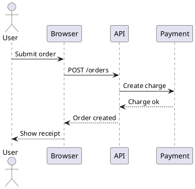

### 192. PUML-12 类图 (0.00)

常见的仓储和实体类图。

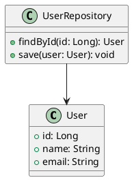

### 193. PUML-13 活动图 (0.00)

构建流水线的活动图。

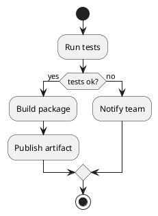

### 194. PUML-14 组件图 (0.00)

Web 服务拆分成多个组件。

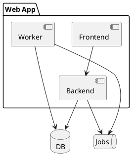

### 195. PUML-15 部署图 (0.00)

简单的三层部署图。

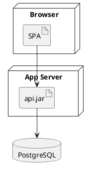

### 196. PUML-16 状态图 (0.00)

订单生命周期是 PlantUML 里很常见的状态图题材。

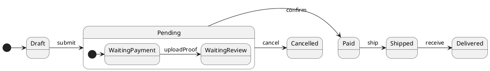

### 197. PUML-17 用例图 (0.00)

登录和账户管理用例。

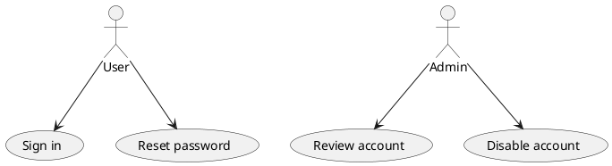

### 198. PUML-18 对象图 (0.00)

一个订单对象快照。

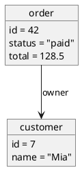

### 199. PUML-19 甘特图 (0.00)

发布计划的简单甘特图。

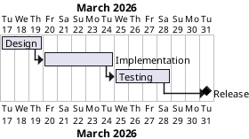

### 200. PUML-20 脑图 (0.00)

产品待办拆分成几个常见方向。

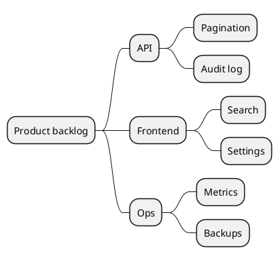
