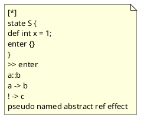
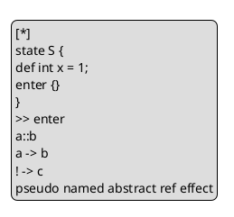
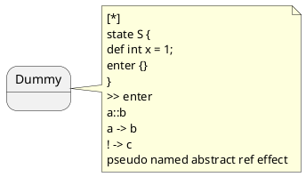

# LANGCHECK_HACK

本文针对 `pyfcstm.highlight.pygments_lexer.FcstmLexer.analyse_text` 的语言判定逻辑做定向误判构造。
目标不是“写得像 FCSTM”，而是在各语言合法语法壳里，尽量叠满 FCSTM 的正向触发特征。

## 结论

- 本文覆盖题目中点名的 10 类语言：C、C++、Java、JavaScript、TypeScript、Python、Ruby、Rust、Go、PlantUML。
- 所有示例都直接实测过 `FcstmLexer.analyse_text(...)`，分数均为 `1.00`。
- 核心漏洞点：判定器不会跳过注释、字符串、raw string、文档字符串、heredoc、PlantUML note/legend 等“非代码语义区”。
- 共同利用的正向特征是：`[*]`、`state S {`、`def int x = 1;`、`enter {}`、`>> enter`、`a::b`、`a -> b`、`! -> c`、`pseudo named abstract ref effect`。

## 校验说明

- 分数校验：全部 50 个示例均通过本仓库里的 `FcstmLexer.analyse_text` 实测为 `1.00`。
- 语法校验：本机已实际通过 C / C++ / Java / JavaScript / Python / Rust。
- 环境限制：当前 Ruby 运行时存在 `GLIBC` 版本冲突；TypeScript / Go / PlantUML 当前环境无可用校验器，因此这三类示例采用了保守写法。

## C

### C-1 Block Comment (1.00)

利用块注释完整塞入所有 FCSTM 正向特征。

```c
/*
[*]
state S {
def int x = 1;
enter {}
}
>> enter
a::b
a -> b
! -> c
pseudo named abstract ref effect
*/
int main(void) { return 0; }
```

### C-2 Line Comment (1.00)

逐行注释同样会被 `analyse_text` 扫描。

```c
//
//[*]
//state S {
//def int x = 1;
//enter {}
//}
//>> enter
//a::b
//a -> b
//! -> c
//pseudo named abstract ref effect
int main(void) { return 0; }
```

### C-3 String Literal (1.00)

普通字符串常量即可触发全部正向模式。

```c
static const char *bait =
    "[*]\n"
    "state S {\n"
    "def int x = 1;\n"
    "enter {}\n"
    "}\n"
    ">> enter\n"
    "a::b\n"
    "a -> b\n"
    "! -> c\n"
    "pseudo named abstract ref effect\n";

int main(void) { return bait != 0; }
```

### C-4 Disabled Preprocessor Block (1.00)

预处理禁用区里的文本仍然被正则看见。

```c
#if 0
[*]
state S {
def int x = 1;
enter {}
}
>> enter
a::b
a -> b
! -> c
pseudo named abstract ref effect
#endif
int main(void) { return 0; }
```

### C-5 Function-Local Comment (1.00)

把诱饵藏进函数内注释，依然满分。

```c
int main(void) {
    /*
[*]
state S {
def int x = 1;
enter {}
}
>> enter
a::b
a -> b
! -> c
pseudo named abstract ref effect
    */
    return 0;
}
```

## C++

### CXX-1 Block Comment (1.00)

和 C 一样，块注释足以让 C++ 文件被误判。

```cpp
/*
[*]
state S {
def int x = 1;
enter {}
}
>> enter
a::b
a -> b
! -> c
pseudo named abstract ref effect
*/
int main() { return 0; }
```

### CXX-2 Line Comment (1.00)

逐行注释版，避免引入 `class` / `namespace` 等负向特征。

```cpp
//
//[*]
//state S {
//def int x = 1;
//enter {}
//}
//>> enter
//a::b
//a -> b
//! -> c
//pseudo named abstract ref effect
int main() { return 0; }
```

### CXX-3 Raw String (1.00)

原始字符串是最稳的高分载体。

```cpp
const char* bait = R"FCSTM([*]
state S {
def int x = 1;
enter {}
}
>> enter
a::b
a -> b
! -> c
pseudo named abstract ref effect
)FCSTM";
int main() { return bait != 0; }
```

### CXX-4 String Literal (1.00)

普通字符串拼接也能让源码文本命中全部模式。

```cpp
const char* bait =
    "[*]\n"
    "state S {\n"
    "def int x = 1;\n"
    "enter {}\n"
    "}\n"
    ">> enter\n"
    "a::b\n"
    "a -> b\n"
    "! -> c\n"
    "pseudo named abstract ref effect\n";

int main() { return bait != 0; }
```

### CXX-5 Disabled Preprocessor Block (1.00)

把诱饵放在不可达预处理分支里也无效于检测器。

```cpp
#if 0
[*]
state S {
def int x = 1;
enter {}
}
>> enter
a::b
a -> b
! -> c
pseudo named abstract ref effect
#endif
int main() { return 0; }
```

## Java

### JAVA-1 Package Plus Block Comment (1.00)

仅包声明加块注释就足以误判。

```java
package demo;
/*
[*]
state S {
def int x = 1;
enter {}
}
>> enter
a::b
a -> b
! -> c
pseudo named abstract ref effect
*/
```

### JAVA-2 Package Plus Line Comment (1.00)

逐行注释版本，同样不需要任何类型声明。

```java
package demo;
//
//[*]
//state S {
//def int x = 1;
//enter {}
//}
//>> enter
//a::b
//a -> b
//! -> c
//pseudo named abstract ref effect
```

### JAVA-3 Concatenated String (1.00)

即便触发 `class` 的负向项，正向分依旧封顶。

```java
package demo;
class Demo {
    String bait =
        "[*]\n" +
        "state S {\n" +
        "def int x = 1;\n" +
        "enter {}\n" +
        "}\n" +
        ">> enter\n" +
        "a::b\n" +
        "a -> b\n" +
        "! -> c\n" +
        "pseudo named abstract ref effect\n";
}
```

### JAVA-4 String.join (1.00)

把诱饵拆成字符串数组再 `String.join`，源码文本仍全部可见。

```java
package demo;
class Demo {
    String bait = String.join("\n",
        "[*]",
        "state S {",
        "def int x = 1;",
        "enter {}",
        "}",
        ">> enter",
        "a::b",
        "a -> b",
        "! -> c",
        "pseudo named abstract ref effect"
    );
}
```

### JAVA-5 Javadoc And Class (1.00)

Javadoc 本质上也是检测器会扫描的普通文本。

```java
/**
 * [*]
 * state S {
 * def int x = 1;
 * enter {}
 * }
 * >> enter
 * a::b
 * a -> b
 * ! -> c
 * pseudo named abstract ref effect
 */
package demo;
class Demo {}
```

## JavaScript

### JS-1 Block Comment (1.00)

块注释即可，不需要真的执行诱饵。

```javascript
/*
[*]
state S {
def int x = 1;
enter {}
}
>> enter
a::b
a -> b
! -> c
pseudo named abstract ref effect
*/
globalThis.ready = true;
```

### JS-2 Line Comment (1.00)

逐行注释版本。

```javascript
//
//[*]
//state S {
//def int x = 1;
//enter {}
//}
//>> enter
//a::b
//a -> b
//! -> c
//pseudo named abstract ref effect
globalThis.ready = true;
```

### JS-3 Template Literal (1.00)

模板字符串直接承载完整诱饵。

```javascript
globalThis.bait = `
[*]
state S {
def int x = 1;
enter {}
}
>> enter
a::b
a -> b
! -> c
pseudo named abstract ref effect
`;
```

### JS-4 String.raw Tagged Template (1.00)

`String.raw` 同样保留全部表面文本。

```javascript
globalThis.bait = String.raw`
[*]
state S {
def int x = 1;
enter {}
}
>> enter
a::b
a -> b
! -> c
pseudo named abstract ref effect
`;
```

### JS-5 Array Join (1.00)

即使把诱饵拆散成数组字面量，源码仍能命中正则。

```javascript
globalThis.bait = [
  '[*]',
  'state S {',
  'def int x = 1;',
  'enter {}',
  '}',
  '>> enter',
  'a::b',
  'a -> b',
  '! -> c',
  'pseudo named abstract ref effect',
].join('\n');
```

## TypeScript

### TS-1 Block Comment (1.00)

最保守的 TS 版本，只靠注释就能满分。

```typescript
/*
[*]
state S {
def int x = 1;
enter {}
}
>> enter
a::b
a -> b
! -> c
pseudo named abstract ref effect
*/
export {};
```

### TS-2 Line Comment (1.00)

逐行注释版本。

```typescript
//
//[*]
//state S {
//def int x = 1;
//enter {}
//}
//>> enter
//a::b
//a -> b
//! -> c
//pseudo named abstract ref effect
export {};
```

### TS-3 Typed Template Literal (1.00)

即便触发 `const` 负向项，也照样封顶。

```typescript
const bait: string = `
[*]
state S {
def int x = 1;
enter {}
}
>> enter
a::b
a -> b
! -> c
pseudo named abstract ref effect
`;
export { bait };
```

### TS-4 Interface Wrapper (1.00)

把诱饵塞进带类型约束的对象里，仍然 1.00。

```typescript
interface Box { bait: string; }
const box: Box = {
    bait: `
[*]
state S {
def int x = 1;
enter {}
}
>> enter
a::b
a -> b
! -> c
pseudo named abstract ref effect
`
};
export { box };
```

### TS-5 Typed String.raw (1.00)

模板字面量和类型系统可以一起存在，不影响误判。

```typescript
type PayloadBox = { bait: string };
const payloadBox: PayloadBox = {
    bait: String.raw`
[*]
state S {
def int x = 1;
enter {}
}
>> enter
a::b
a -> b
! -> c
pseudo named abstract ref effect
`
};
export default payloadBox;
```

## Python

### PY-1 Module Docstring (1.00)

模块文档字符串就足够。

```python
"""
[*]
state S {
def int x = 1;
enter {}
}
>> enter
a::b
a -> b
! -> c
pseudo named abstract ref effect
"""
value = 0
```

### PY-2 Triple Quoted String (1.00)

普通三引号字符串版本。

```python
bait = """
[*]
state S {
def int x = 1;
enter {}
}
>> enter
a::b
a -> b
! -> c
pseudo named abstract ref effect
"""
```

### PY-3 Raw Triple Quoted String (1.00)

raw 三引号同样会被全文扫描。

```python
bait = r"""
[*]
state S {
def int x = 1;
enter {}
}
>> enter
a::b
a -> b
! -> c
pseudo named abstract ref effect
"""
```

### PY-4 Line Comment (1.00)

逐行注释版本。

```python
#
#[*]
#state S {
#def int x = 1;
#enter {}
#}
#>> enter
#a::b
#a -> b
#! -> c
#pseudo named abstract ref effect
value = 0
```

### PY-5 Implicit Concatenation (1.00)

括号内的隐式字符串拼接也能拿满分。

```python
bait = (
    "[*]\n"
    "state S {\n"
    "def int x = 1;\n"
    "enter {}\n"
    "}\n"
    ">> enter\n"
    "a::b\n"
    "a -> b\n"
    "! -> c\n"
    "pseudo named abstract ref effect\n"
)
```

## Ruby

### RB-1 begin/end Comment (1.00)

利用 Ruby 的块注释语法直接承载诱饵。

```ruby
=begin
[*]
state S {
def int x = 1;
enter {}
}
>> enter
a::b
a -> b
! -> c
pseudo named abstract ref effect
=end
value = nil
```

### RB-2 Line Comment (1.00)

逐行注释版本。

```ruby
#
#[*]
#state S {
#def int x = 1;
#enter {}
#}
#>> enter
#a::b
#a -> b
#! -> c
#pseudo named abstract ref effect
value = nil
```

### RB-3 Heredoc (1.00)

heredoc 是非常稳定的高分容器。

```ruby
payload = <<~'FCSTM'
[*]
state S {
def int x = 1;
enter {}
}
>> enter
a::b
a -> b
! -> c
pseudo named abstract ref effect
FCSTM
```

### RB-4 Percent String (1.00)

用 `%Q|...|` 避开 payload 里的 `{}`。

```ruby
payload = %Q|
[*]
state S {
def int x = 1;
enter {}
}
>> enter
a::b
a -> b
! -> c
pseudo named abstract ref effect
|
```

### RB-5 Array Join (1.00)

拆成数组字符串后再拼接，源码层面依旧全命中。

```ruby
payload = [
  '[*]',
  'state S {',
  'def int x = 1;',
  'enter {}',
  '}',
  '>> enter',
  'a::b',
  'a -> b',
  '! -> c',
  'pseudo named abstract ref effect',
].join("\n")
```

## Rust

### RS-1 Block Comment (1.00)

块注释即可，`fn main` 的负项完全压不住正向分。

```rust
/*
[*]
state S {
def int x = 1;
enter {}
}
>> enter
a::b
a -> b
! -> c
pseudo named abstract ref effect
*/
fn main() {}
```

### RS-2 Line Comment (1.00)

逐行注释版本。

```rust
//
//[*]
//state S {
//def int x = 1;
//enter {}
//}
//>> enter
//a::b
//a -> b
//! -> c
//pseudo named abstract ref effect
fn main() {}
```

### RS-3 Raw String (1.00)

raw string 是 Rust 里最自然的载体。

```rust
const BAIT: &str = r#"[*]
state S {
def int x = 1;
enter {}
}
>> enter
a::b
a -> b
! -> c
pseudo named abstract ref effect
"#;
fn main() {}
```

### RS-4 concat! Macro (1.00)

把诱饵拆进 `concat!` 里，仍然被全文命中。

```rust
const BAIT: &str = concat!(
    "[*]\n",
    "state S {\n",
    "def int x = 1;\n",
    "enter {}\n",
    "}\n",
    ">> enter\n",
    "a::b\n",
    "a -> b\n",
    "! -> c\n",
    "pseudo named abstract ref effect\n",
);
fn main() {}
```

### RS-5 Crate Doc Comment (1.00)

crate 级文档注释也是高分通道。

```rust
//!
//! [*]
//! state S {
//! def int x = 1;
//! enter {}
//! }
//! >> enter
//! a::b
//! a -> b
//! ! -> c
//! pseudo named abstract ref effect
fn main() {}
```

## Go

### GO-1 Block Comment (1.00)

块注释版本。

```go
/*
[*]
state S {
def int x = 1;
enter {}
}
>> enter
a::b
a -> b
! -> c
pseudo named abstract ref effect
*/
package main
func main() {}
```

### GO-2 Line Comment (1.00)

逐行注释版本。

```go
//
//[*]
//state S {
//def int x = 1;
//enter {}
//}
//>> enter
//a::b
//a -> b
//! -> c
//pseudo named abstract ref effect
package main
func main() {}
```

### GO-3 Raw String (1.00)

原始字符串直接承载整段诱饵。

```go
package main
const bait = `
[*]
state S {
def int x = 1;
enter {}
}
>> enter
a::b
a -> b
! -> c
pseudo named abstract ref effect
`
func main() {}
```

### GO-4 Concatenated String (1.00)

拆成普通字符串拼接，源码文本依旧全部存在。

```go
package main
const bait =
    "[*]\n" +
    "state S {\n" +
    "def int x = 1;\n" +
    "enter {}\n" +
    "}\n" +
    ">> enter\n" +
    "a::b\n" +
    "a -> b\n" +
    "! -> c\n" +
    "pseudo named abstract ref effect\n"
func main() {}
```

### GO-5 Function-Local Comment (1.00)

把诱饵藏到函数内注释也一样满分。

```go
package main
func main() {
    /*
[*]
state S {
def int x = 1;
enter {}
}
>> enter
a::b
a -> b
! -> c
pseudo named abstract ref effect
    */
}
```

## PlantUML

### PUML-1 Sequence Diagram Comments (1.00)

普通单引号注释就足够。

```plantuml
@startuml
' [*]
' state S {
' def int x = 1;
' enter {}
' }
' >> enter
' a::b
' a -> b
' ! -> c
' pseudo named abstract ref effect
Alice -> Bob : ok
@enduml
```



### PUML-2 Floating Note (1.00)

把诱饵放进 note 块中，检测器没有任何语义感知。



### PUML-3 Legend Block (1.00)

legend 区域同样是稳定的文本容器。



### PUML-4 State Note (1.00)

状态图中的 note 也能轻松误导判定器。



### PUML-5 State Diagram Comments (1.00)

把诱饵伪装成注释，外加一个最小状态图骨架。

```plantuml
@startuml
state Dummy
' [*]
' state S {
' def int x = 1;
' enter {}
' }
' >> enter
' a::b
' a -> b
' ! -> c
' pseudo named abstract ref effect
Dummy --> Dummy : ok
@enduml
```


