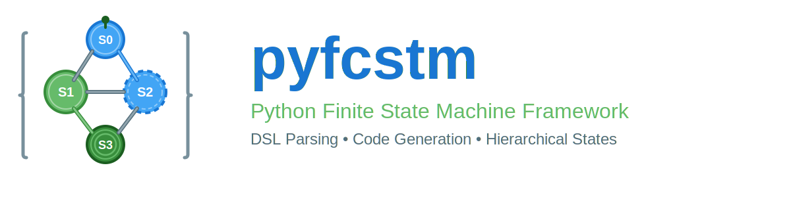

# pyfcstm (Python Finite Control State Machine Framework)

<div align="center">
  
</div>

<div align="center">

[](https://pypi.org/project/pyfcstm/)


[](https://codeclimate.com/github/HansBug/pyfcstm/maintainability)
[](https://codecov.io/gh/hansbug/pyfcstm)
[](https://deepwiki.com/HansBug/pyfcstm)

[](https://github.com/hansbug/pyfcstm/actions?query=workflow%3A%22Docs+Deploy%22)
[](https://github.com/hansbug/pyfcstm/actions?query=workflow%3A%22Code+Test%22)
[](https://github.com/hansbug/pyfcstm/actions?query=workflow%3A%22Badge+Creation%22)
[](https://github.com/hansbug/pyfcstm/actions?query=workflow%3A%22Package+Release%22)

[](https://github.com/hansbug/pyfcstm/stargazers)
[](https://github.com/hansbug/pyfcstm/network)

[](https://github.com/hansbug/pyfcstm/issues)
[](https://github.com/hansbug/pyfcstm/pulls)
[](https://github.com/hansbug/pyfcstm/graphs/contributors)
[](https://github.com/hansbug/pyfcstm/blob/main/LICENSE)

</div>

---

**pyfcstm** is the **Python Finite Control State Machine Framework**, a powerful Python framework for parsing the
**FCSTM (Finite Control State Machine) Domain-Specific Language (DSL)** and generating executable code in multiple
target languages. It specializes in modeling **Hierarchical State Machines (Harel Statecharts)** with a flexible
Jinja2-based template system, making it ideal for embedded systems, protocol implementations, game AI, workflow
engines, and complex control logic.

Out of the box, pyfcstm can parse, visualize, and simulate FCSTM state machines. For source-code generation, pyfcstm
provides the rendering engine and model API, while you provide the target-language template directory.

## Table of Contents

- [Core Features](#core-features)
- [Installation](#installation)
- [Quick Start](#quick-start)
    - [CLI Usage](#1-using-the-command-line-interface-cli)
    - [Python API](#2-using-the-python-api)
    - [Example DSL Code](#3-example-dsl-code-traffic-light-example)
- [DSL Syntax Overview](#dsl-syntax-overview)
- [Template System](#code-generation-template-system)
- [Use Cases](#use-cases)
- [Documentation](#documentation)
- [Contributing](#contribution--support)
- [License](#license)

## Core Features

pyfcstm aims to provide a complete solution from conceptual design to code implementation. Its core strengths include:

| Feature                         | Description                                                                                                                           | Advantage                                                                                                      | Documentation Pointer                                                                                         |
|:--------------------------------|:--------------------------------------------------------------------------------------------------------------------------------------|:---------------------------------------------------------------------------------------------------------------|:--------------------------------------------------------------------------------------------------------------|
| **FSM DSL**                     | A concise and readable DSL syntax for defining states, nesting, transitions, events, conditions, and effects.                         | Focus on state machine logic, not programming language details.                                                | [DSL Syntax Tutorial](https://pyfcstm.readthedocs.io/en/latest/tutorials/dsl/index.html)                      |
| **Hierarchical State Machines** | Supports **nested states** and **composite state** lifecycles (`enter`, `during`, `exit`).                                            | Capable of modeling complex real-time systems and protocols, enhancing maintainability.                        | [DSL Syntax Tutorial - State Definitions](https://pyfcstm.readthedocs.io/en/latest/tutorials/dsl/index.html)  |
| **Expression System**           | Built-in mathematical and logical expression parser supporting variable definition, conditional guards, and state effects (`effect`). | Allows defining the state machine's internal data and behavior at the DSL level.                               | [DSL Syntax Tutorial - Expression System](https://pyfcstm.readthedocs.io/en/latest/tutorials/dsl/index.html)  |
| **Templated Code Generation**   | Based on the **Jinja2** template engine, rendering the state machine model into target code (e.g., C/C++, Python, Rust).              | Extremely high flexibility, supporting code generation for virtually any programming language.                 | [Template Tutorial](https://pyfcstm.readthedocs.io/en/latest/tutorials/render/index.html)                     |
| **Cross-Language Support**      | Easily enables state machine code generation for embedded or high-performance languages like **C/C++** through the template system.   | Suitable for scenarios where state machine logic needs to be deployed across different platforms or languages. | [Template Tutorial - Expression Styles](https://pyfcstm.readthedocs.io/en/latest/tutorials/render/index.html) |
| **PlantUML Integration**        | Directly converts DSL files into **PlantUML** code, with preset detail levels and fine-grained visualization options.                | Facilitates design review and documentation generation.                                                        | [Visualization Guide](https://pyfcstm.readthedocs.io/en/latest/tutorials/visualization/index.html)            |
| **Simulation Runtime**          | Runs FCSTM models directly in Python or from an interactive CLI REPL / batch executor.                                                | Lets you validate behavior before committing to generated code.                                                | [Simulation Guide](https://pyfcstm.readthedocs.io/en/latest/tutorials/simulation/index.html)                  |
| **Syntax Highlighting**         | Includes FCSTM syntax highlighting for Pygments and editor integrations, including a VS Code extension in this repository.            | Improves authoring, documentation, and review workflows around `.fcstm` files.                                 | [Syntax Highlighting Guide](https://pyfcstm.readthedocs.io/en/latest/tutorials/grammar/index.html)            |

## Installation

### Basic Installation

pyfcstm requires Python 3.7+ and is published on PyPI:

```shell
pip install pyfcstm
```

You can invoke the CLI either as `pyfcstm` or as a Python module:

```shell
python -m pyfcstm --help
```

### Install the Latest Main Branch

If you want the newest code before the next release:

```shell
pip install -U git+https://github.com/hansbug/pyfcstm@main
```

### Development Installation

For local development, install the package itself in editable mode first, then add the extra dependency groups you
need:

```shell
git clone https://github.com/HansBug/pyfcstm.git
cd pyfcstm
pip install -e .
pip install -e ".[dev,test,doc]"
```

If you also need packaging helpers, install the build extras as well:

```shell
pip install -e ".[build]"
```

### Verify Installation

After installation, verify that pyfcstm is working correctly:

```shell
pyfcstm --version
pyfcstm --help
python -m pyfcstm --help
```

**More Information**: See
the [Installation Documentation](https://pyfcstm.readthedocs.io/en/latest/tutorials/installation/index.html) for
detailed steps and environment requirements.

## Quick Start

### 1. Using the Command Line Interface (CLI)

pyfcstm provides three main command-line subcommands:

- `plantuml` for visualization
- `generate` for template-based code generation
- `simulate` for interactive or batch execution

Before using them, create a small FCSTM file such as `traffic_light.fcstm`:

```fcstm
def int timer = 0;

state TrafficLight {
    [*] -> Red;

    state Red {
        during {
            timer = timer + 1;
        }
    }

    state Yellow {
        during {
            timer = timer + 1;
        }
    }

    state Green {
        during {
            timer = timer + 1;
        }
    }

    Red -> Green : if [timer >= 30] effect { timer = 0; };
    Green -> Yellow : if [timer >= 25] effect { timer = 0; };
    Yellow -> Red : if [timer >= 5] effect { timer = 0; };
}
```

#### Generate PlantUML State Diagram

Use the `plantuml` subcommand to convert a DSL file into PlantUML format:

```shell
pyfcstm plantuml -i traffic_light.fcstm -o traffic_light.puml

# Use a full-detail preset and override specific options
pyfcstm plantuml -i traffic_light.fcstm -l full \
  -c show_variable_definitions=true \
  -c show_lifecycle_actions=true \
  -o traffic_light_full.puml
```

**Tip**: The generated `.puml` file can be rendered online at [PlantUML Server](https://www.plantuml.com/plantuml/uml/)
or locally using the PlantUML tool. If `-o/--output` is omitted, PlantUML is written to stdout.

#### Run the State Machine in the CLI Simulator

Use the `simulate` subcommand when you want to validate the DSL behavior before writing templates:

```shell
# Interactive REPL
pyfcstm simulate -i traffic_light.fcstm

# Batch mode
pyfcstm simulate -i traffic_light.fcstm -e "current; cycle 3; history 3"
```

In interactive mode, useful commands include `cycle`, `current`, `events`, `history`, `init`, and `export`.

#### Templated Code Generation

Use the `generate` subcommand, along with a template directory, to generate target language code:

```shell
pyfcstm generate -i traffic_light.fcstm -t ./templates/c -o ./generated/c --clear
```

**Important**: `generate` expects a template directory that you provide. At minimum, that directory should contain a
`config.yaml`; any `.j2` files are rendered, and non-template files are copied as-is.

### 2. Using the Python API

You can integrate pyfcstm directly into your Python projects for custom parsing and rendering workflows.

#### Parse, Inspect, and Visualize a Model

```python
from pyfcstm.dsl import parse_with_grammar_entry
from pyfcstm.model import parse_dsl_node_to_state_machine
from pyfcstm.model.plantuml import PlantUMLOptions

# 1. Load DSL code from file or string
with open('traffic_light.fcstm', 'r', encoding='utf-8') as f:
    dsl_code = f.read()

# 2. Parse the DSL code to generate an Abstract Syntax Tree (AST)
ast_node = parse_with_grammar_entry(dsl_code, entry_name='state_machine_dsl')

# 3. Convert the AST into a State Machine Model
model = parse_dsl_node_to_state_machine(ast_node)

# 4. Inspect the parsed model
print(f"Root state: {model.root_state.name}")
print(f"Variables: {list(model.defines)}")

for state in model.walk_states():
    print(f"State: {'.'.join(state.path)} (leaf={state.is_leaf_state})")

# 5. Export to PlantUML
plantuml_code = model.to_plantuml(
    PlantUMLOptions(detail_level='full', show_lifecycle_actions=True)
)
with open('diagram.puml', 'w', encoding='utf-8') as f:
    f.write(plantuml_code)

# 6. Export back to DSL text
print(str(model.to_ast_node()))
```

#### Render Code and Simulate in Python

```python
from pyfcstm.render import StateMachineCodeRenderer
from pyfcstm.simulate import SimulationRuntime

# Reuse the `model` object from the previous example.

renderer = StateMachineCodeRenderer(template_dir='./templates/c')
renderer.render(model, output_dir='./generated/c', clear_previous_directory=True)

runtime = SimulationRuntime(model)
runtime.cycle()

print(f"Current state: {'.'.join(runtime.current_state.path)}")
print(f"Variables: {runtime.vars}")
```

### 3. Example DSL Code (Traffic Light Example)

The following **Traffic Light** state machine example, included in the original `README.md`, demonstrates the core
syntax of the pyfcstm DSL:

```
def int a = 0;
def int b = 0x0;
def int round_count = 0;  // define variables
state TrafficLight {
    >> during before {
        a = 0;
    }
    >> during before abstract FFT;
    >> during before abstract TTT;
    >> during after {
        a = 0xff;
        b = 0x1;
    }

    !InService -> [*] :: Error;

    state InService {
        enter {
            a = 0;
            b = 0;
            round_count = 0;
        }

        enter abstract InServiceAbstractEnter /*
            Abstract Operation When Entering State 'InService'
            TODO: Should be Implemented In Generated Code Framework
        */

        // for non-leaf state, either 'before' or 'after' aspect keyword should be used for during block
        during before abstract InServiceBeforeEnterChild /*
            Abstract Operation Before Entering Child States of State 'InService'
            TODO: Should be Implemented In Generated Code Framework
        */

        during after abstract InServiceAfterEnterChild /*
            Abstract Operation After Entering Child States of State 'InService'
            TODO: Should be Implemented In Generated Code Framework
        */

        exit abstract InServiceAbstractExit /*
            Abstract Operation When Leaving State 'InService'
            TODO: Should be Implemented In Generated Code Framework
        */

        state Red {
            during {  // no aspect keywords ('before', 'after') should be used for during block of leaf state
                a = 0x1 << 2;
            }
        }
        state Yellow;
        state Green;
        [*] -> Red :: Start effect {
            b = 0x1;
        };
        Red -> Green effect {
            b = 0x3;
        };
        Green -> Yellow effect {
            b = 0x2;
        };
        Yellow -> Red : if [a >= 10] effect {
            b = 0x1;
            round_count = round_count + 1;
        };
        Green -> Yellow : /Idle.E2;
        Yellow -> Yellow : /E2;
    }
    state Idle;

    [*] -> InService;
    InService -> Idle :: Maintain;
    Idle -> Idle :: E2;
    Idle -> [*];
}
```

## DSL Syntax Overview

The pyfcstm DSL syntax is inspired by UML Statecharts and supports the following key elements:

| Element                 | Keyword                   | Description                                                                                                                            | Example                         | Documentation Pointer                                                                       |
|:------------------------|:--------------------------|:---------------------------------------------------------------------------------------------------------------------------------------|:--------------------------------|:--------------------------------------------------------------------------------------------|
| **Variable Definition** | `def int/float`           | Defines integer or float variables for the state machine's internal data.                                                              | `def int counter = 0;`          | [Variable Definitions](https://pyfcstm.readthedocs.io/en/latest/tutorials/dsl/index.html)   |
| **State**               | `state`                   | Defines a state, supporting **Leaf States** and **Composite States** (nesting).                                                        | `state Running { ... }`         | [State Definitions](https://pyfcstm.readthedocs.io/en/latest/tutorials/dsl/index.html)      |
| **Transition**          | `->`                      | Defines transitions between states, supporting **Entry** (`[*]`) and **Exit** (`[*]`) transitions.                                     | `Red -> Green;`                 | [Transition Definitions](https://pyfcstm.readthedocs.io/en/latest/tutorials/dsl/index.html) |
| **Forced Transition**   | `!`                       | A shorthand that expands into one or more normal transitions; exit actions still execute normally.                                     | `! * -> ErrorHandler :: Error;` | [Transition Definitions](https://pyfcstm.readthedocs.io/en/latest/tutorials/dsl/index.html) |
| **Event Definition**    | `event`                   | Optionally declares an event explicitly, including a display name for visualization.                                                   | `event Start named "Start";`    | [Event Definitions](https://pyfcstm.readthedocs.io/en/latest/tutorials/dsl/index.html)      |
| **Event Reference**     | `::`, `:`, `/`            | Triggers a transition with local (`::`), chain (`:`), or root-relative absolute (`/`) event scoping.                                  | `Red -> Green :: Timer;`        | [Event Scoping](https://pyfcstm.readthedocs.io/en/latest/tutorials/dsl/index.html)          |
| **Guard Condition**     | `if [...]`                | A condition that must be true for the transition to occur.                                                                             | `Yellow -> Red : if [a >= 10];` | [Expression System](https://pyfcstm.readthedocs.io/en/latest/tutorials/dsl/index.html)      |
| **Effect**              | `effect { ... }`          | Operations (variable assignments) executed when the transition occurs.                                                                 | `effect { b = 0x1; }`           | [Operational Statements](https://pyfcstm.readthedocs.io/en/latest/tutorials/dsl/index.html) |
| **Lifecycle Actions**   | `enter`, `during`, `exit` | Actions executed when a state is entered, active, or exited.                                                                           | `enter { a = 0; }`              | [Lifecycle Actions](https://pyfcstm.readthedocs.io/en/latest/tutorials/dsl/index.html)      |
| **Abstract Action**     | `abstract`                | Declares an abstract function that must be implemented in the generated code framework.                                                | `enter abstract Init;`          | [Lifecycle Actions](https://pyfcstm.readthedocs.io/en/latest/tutorials/dsl/index.html)      |
| **Aspect Action**       | `>> during`               | Special `during` action for composite states, executed **before** (`before`) or **after** (`after`) the leaf state's `during` actions. | `>> during before { ... }`      | [Lifecycle Actions](https://pyfcstm.readthedocs.io/en/latest/tutorials/dsl/index.html)      |
| **Pseudo State**        | `pseudo state`            | Special leaf state that will not apply the aspect actions of the ancestor states.                                                      | `pseudo state LeafState;`       | [Pseudo States](https://pyfcstm.readthedocs.io/en/latest/tutorials/dsl/index.html)          |

### Key DSL Concepts

#### Hierarchical State Management

The DSL inherently supports **state nesting**, allowing for the creation of complex, yet organized, state machines. A
composite state's lifecycle actions (`enter`, `during`, `exit`) are executed relative to its substates.
The `>> during before/after` aspect actions provide a powerful mechanism for **Aspect-Oriented Programming (AOP)**
within the state machine, enabling logic to be injected before or after the substate's transitions or actions.

#### Action Execution Order

Understanding how actions execute in hierarchical state machines is crucial for building correct state machine logic.
The execution order differs significantly between **leaf states** (states with no children) and **composite states** (
states with children).

Here's a complete example demonstrating the execution order:

```
def int log_counter = 0;

state System {
    // Aspect actions with >> apply to ALL descendant leaf states
    // These execute during the leaf state's "during" phase
    >> during before {
        log_counter = log_counter + 1;  // Executes for ALL leaf states (Active, Idle)
    }

    >> during after {
        log_counter = log_counter + 100;  // Executes for ALL leaf states (Active, Idle)
    }

    state SubSystem {
        // Composite state actions (without >>) execute ONLY when entering/exiting the composite state
        // CRITICAL: during before/after are NOT triggered during child-to-child transitions!

        // during before: executes ONLY on [*] -> Child (entering composite state from parent)
        //                AFTER SubSystem.enter but BEFORE Child.enter
        //                NOT executed on Child1 -> Child2 transitions
        during before {
            log_counter = log_counter + 10;  // Only when entering from parent: [*] -> Active
        }

        // during after: executes ONLY on Child -> [*] (exiting composite state to parent)
        //               AFTER Child.exit but BEFORE SubSystem.exit
        //               NOT executed on Child1 -> Child2 transitions
        during after {
            log_counter = log_counter + 1000;  // Only when exiting to parent: Idle -> [*]
        }

        state Active {
            // Leaf state's own during action
            during {
                log_counter = log_counter + 50;  // Executes every cycle while Active is the current state
            }
        }

        state Idle {
            during {
                log_counter = log_counter + 5;
            }
        }

        [*] -> Active;                        // Triggers SubSystem.during before
        Active -> Idle :: Pause;              // Does NOT trigger during before/after
        Idle -> Active :: Resume;             // Does NOT trigger during before/after
        Idle -> [*] :: Stop;                  // Triggers SubSystem.during after
    }

    [*] -> SubSystem;
}
```

**Complete Execution Order for `System.SubSystem.Active`**:

**Scenario 1: Initial Entry** (`System.[*] -> SubSystem -> [*] -> Active`)

**Entry Phase**:

1. `System.enter` - Root state enter actions
2. `SubSystem.enter` - Composite state enter actions
3. `SubSystem.during before` - **Triggered** (because `[*] -> Active`)
4. `Active.enter` - Leaf state enter actions

**During Phase** (each cycle while `Active` remains active):

1. `System >> during before` - Aspect action (executes for ALL leaf states)
2. `Active.during` - Leaf state's own during action
3. `System >> during after` - Aspect action (executes for ALL leaf states)

Note: `SubSystem.during before/after` do **NOT** execute during the `during` phase.

**Scenario 2: Child-to-Child Transition** (`Active -> Idle :: Pause`)

**Transition Sequence**:

1. `Active.exit` - Leaf state exit actions
2. (Transition effect, if any)
3. `Idle.enter` - Leaf state enter actions

**CRITICAL**: `SubSystem.during before/after` are **NOT triggered** during child-to-child transitions!

**Scenario 3: Exit from Composite State** (`Idle -> [*] :: Stop`)

**Exit Phase**:

1. `Idle.exit` - Leaf state exit actions
2. `SubSystem.during after` - **Triggered** (because `Idle -> [*]`)
3. `SubSystem.exit` - Composite state exit actions
4. `System.exit` - Root state exit actions

**Key Concepts**:

**Aspect Actions (`>> during before/after`)**:

- Apply to **all descendant leaf states** in the hierarchy
- Execute during the **leaf state's `during` phase** (every cycle)
- Flow from root to leaf for `before`, leaf to root for `after`
- Enable cross-cutting concerns like logging, monitoring, validation

**Composite State Actions (`during before/after` without `>>`)**:

- `during before`: Executes **ONLY** when entering composite state from parent (`[*] -> Child`)
    - Executes AFTER composite state's `enter` but BEFORE child state's `enter`
    - **NOT triggered** during child-to-child transitions (`Child1 -> Child2`)
- `during after`: Executes **ONLY** when exiting composite state to parent (`Child -> [*]`)
    - Executes AFTER child state's `exit` but BEFORE composite state's `exit`
    - **NOT triggered** during child-to-child transitions (`Child1 -> Child2`)
- Do **NOT** execute during a leaf state's `during` phase
- Used for setup/cleanup when entering/exiting the composite state boundary

**Leaf State Actions (`during`)**:

- Execute every cycle while the leaf state is active
- Sandwiched between ancestor aspect `before` and `after` actions

**Execution Flow Summary**:

- **Entry** (from parent): `State.enter` → `State.during before` → `Child.enter`
- **During** (each cycle): Aspect `>> during before` → Leaf `during` → Aspect `>> during after`
- **Exit** (to parent): `Child.exit` → `State.during after` → `State.exit`
- **Child-to-Child Transition**: `Child1.exit` → (transition effect) → `Child2.enter` (no `during before/after`)

#### Event Scoping

Transitions can be triggered by events with different scopes:

* **Local Event (`::`)**: The event is scoped to the source state's namespace. E.g., `StateA -> StateB :: EventX` means
  the event becomes `Root.StateA.EventX`.
* **Chain Event (`:`)**: The event is scoped to the parent state's namespace, so sibling transitions can share it.
  E.g., `StateA -> StateB : EventX` means the event becomes `Root.EventX`.
* **Absolute Event (`: /...`)**: The event is resolved from the root state explicitly.
  E.g., `StateA -> StateB : /System.Reset` means the event path is `Root.System.Reset`.

If you want an event to appear with a human-friendly label in diagrams, declare it explicitly first, for example
`event Reset named "System Reset";`.

## Code Generation Template System

The core value of pyfcstm lies in its highly flexible template system, which allows users complete control over the
structure and content of the generated code.

### Template Directory Structure

The template directory follows the convention-over-configuration principle and contains a required configuration file
plus any mix of renderable or static assets:

```
template_directory/
├── config.yaml          # Core configuration file, defining rendering rules, globals, and filters
├── *.j2                 # Jinja2 template files for dynamic code generation
├── *.c                  # Static files, copied directly to the output directory
└── ...                  # Directory structure is preserved
```

pyfcstm does not ship a universal built-in code template set. In practice, you prepare a template directory for your
own runtime/framework and pass it to `pyfcstm generate`.

**More Information**:
See [Template System Architecture Details](https://pyfcstm.readthedocs.io/en/latest/tutorials/render/index.html) for a
deep dive into the structure.

### Core Configuration (`config.yaml`)

The `config.yaml` file is the "brain" of the template system, defining:

1. **`expr_styles`**: Defines expression rendering rules for different target languages (e.g., C, Python), enabling
   cross-language expression conversion. This is crucial for translating DSL expressions like `a >= 10` into the correct
   syntax for C (`a >= 10`) or Python (`a >= 10`).
2. **`globals`**: Defines global variables and functions (including importing external Python functions) accessible in
   all templates. This allows for reusable logic and constants across the generated code.
3. **`filters`**: Defines custom filters for data transformation within templates. For example, a filter could be used
   to convert a state name to a valid C function name (e.g., `{{ state.name \| to_c_func_name }}`).
4. **`ignores`**: Defines files or directories to be ignored during the code generation process, using `pathspec` for
   git-like pattern matching.

**More Information**:
See [Configuration File Deep Analysis](https://pyfcstm.readthedocs.io/en/latest/tutorials/render/index.html) for
detailed
configuration options.

### Template Rendering

In the `.j2` template files, you have access to the complete **State Machine Model Object** and can use Jinja2 syntax
combined with custom filters and global functions to generate code.

**Key Model Objects**:

* `model`: The root state machine object, with `model.defines`, `model.root_state`, and `model.walk_states()`.
* `state`: A state object, with properties like `name`, `path`, `is_leaf_state`, `transitions`, and helper methods
  such as `list_on_enters()` / `list_on_durings()` / `list_on_exits()`.
* `transition`: A transition object, with properties like `from_state`, `to_state`, `guard`, and `effects`.

**Example Template Snippet (Jinja2)**:

```jinja2

void {{ state.name }}_enter() {
    
    
    {{ enter.name }}();
    
    
    {{ op.var_name }} = {{ op.expr | expr_render(style='c') }};
    
    
    
}

```

**More Information**:
See [Template Syntax Deep Analysis](https://pyfcstm.readthedocs.io/en/latest/tutorials/render/index.html) for a
comprehensive guide on template development.

## Use Cases

pyfcstm is designed for a wide range of applications where state machines are essential:

### Embedded Systems

- **Firmware Development**: Generate C/C++ code for microcontrollers and embedded devices
- **Real-Time Systems**: Model complex control logic with hierarchical states and timing constraints
- **Hardware State Machines**: Design and implement hardware control sequences

### Protocol Implementation

- **Network Protocols**: Implement TCP/IP, HTTP, WebSocket, or custom protocol state machines
- **Communication Protocols**: Model serial communication, CAN bus, or industrial protocols
- **Parser State Machines**: Build lexers and parsers for custom data formats

### Game Development

- **AI Behavior**: Create NPC behavior trees and decision-making systems
- **Game State Management**: Manage game modes, menus, and gameplay states
- **Animation Controllers**: Control character animations and transitions

### Workflow Engines

- **Business Process Automation**: Model approval workflows and business logic
- **Task Orchestration**: Coordinate multi-step processes and dependencies
- **State-Based Applications**: Build applications with complex state transitions

### IoT and Robotics

- **Robot Control**: Implement robot behavior and navigation logic
- **Smart Device Logic**: Model IoT device states and interactions
- **Sensor Fusion**: Coordinate multiple sensors and actuators

## Documentation

- **Full Documentation**: [https://pyfcstm.readthedocs.io/](https://pyfcstm.readthedocs.io/)
- **Installation Guide**: [Installation](https://pyfcstm.readthedocs.io/en/latest/tutorials/installation/index.html)
- **Project Structure Guide**: [Structure](https://pyfcstm.readthedocs.io/en/latest/tutorials/structure/index.html)
- **DSL Syntax Tutorial**: [DSL Reference](https://pyfcstm.readthedocs.io/en/latest/tutorials/dsl/index.html)
- **Visualization Guide**: [PlantUML Visualization](https://pyfcstm.readthedocs.io/en/latest/tutorials/visualization/index.html)
- **Simulation Guide**: [Simulation Runtime](https://pyfcstm.readthedocs.io/en/latest/tutorials/simulation/index.html)
- **Template System Guide**: [Template Tutorial](https://pyfcstm.readthedocs.io/en/latest/tutorials/render/index.html)
- **CLI Reference**: [CLI Guide](https://pyfcstm.readthedocs.io/en/latest/tutorials/cli/index.html)
- **Syntax Highlighting Guide**: [Grammar and Editor Support](https://pyfcstm.readthedocs.io/en/latest/tutorials/grammar/index.html)
- **API Documentation**: [API Reference](https://pyfcstm.readthedocs.io/en/latest/api_doc/index.html)

## Contribution & Support

pyfcstm is an open-source project under the LGPLv3 license, and contributions are welcome:

- **Report Bugs**: Submit issues on [GitHub Issues](https://github.com/hansbug/pyfcstm/issues)
- **Submit Pull Requests**: See [CONTRIBUTING.md](https://github.com/hansbug/pyfcstm/blob/main/CONTRIBUTING.md) for
  guidelines
- **Suggest Features**: Discuss feature ideas in the Issues section
- **Ask Questions**: Open an issue if you need help with the DSL, templates, or simulator

**Source Code**: [https://github.com/HansBug/pyfcstm](https://github.com/HansBug/pyfcstm)

## License

This project is licensed under
the [GNU Lesser General Public License v3 (LGPLv3)](https://github.com/hansbug/pyfcstm/blob/main/LICENSE).
