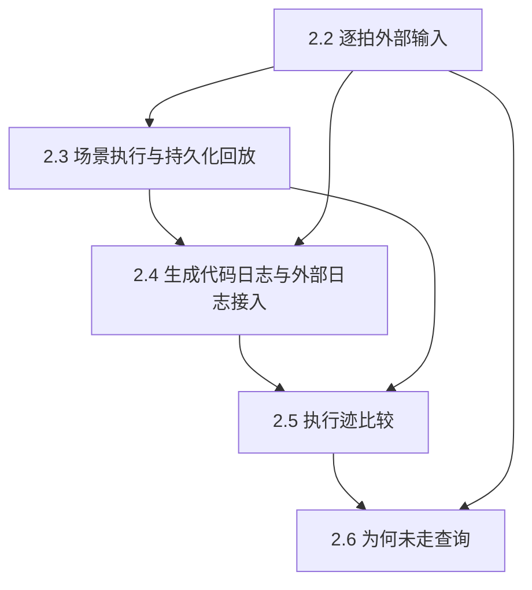

## 概述

本伞 PR 统一跟踪 pyfcstm 周期控制基础设施的五项后续建设，目标是把逐拍输入、场景回放、生成代码观测、执行迹比较和 why-not 诊断连接成可复现、可审计的工程链路。

2.1 结构化内部执行迹已在 PR #484 合入，本伞 PR 从 2.2 开始，不重复实现已完成内容。

## 依赖关系

## Sub-PR 计划

| 顺序 | Sub-PR | 目标 | 主要交付 | 依赖 | 估计工作量 | 上游学术收益 |
|---|---|---|---|---|---|---|
| 1 | 2.2 逐拍外部输入 | 固定周期控制系统的输入语义 | 输入声明与类型检查、cycle 开始采样、缺失值/范围/写权限规则；贯通 simulator、BMC、witness/replay 和生成后端 | 2.1 | 中，1–2 周 | 保证实验输入定义一致，提升复现实验和结果比较的可信度 |
| 2 | 2.3 场景执行与持久化回放 | 将实验变成可交换、可审计 artifact | 公共场景文件格式、初始配置与逐拍激励读取、结果保存、场景和 BMC witness 回放 | 2.2 | 中偏大，1–2 周 | 支撑 benchmark case、统一回放协议和可复现实验材料 |
| 3 | 2.4 生成代码日志与外部日志接入 | 连接模型语义与生成代码实际行为 | 先支持一个生成后端；统一 cycle/字段/元素 ID/缺失值契约；日志导入统一 trace | 2.2、2.3 | 中偏大，2–3 周 | 支撑模型与生成代码的一致性实验，增强工程有效性和外部效度 |
| 4 | 2.5 执行迹比较 | 自动定位两次运行的首个可观察差异 | trace 对齐、状态/迁移/动作/变量/输入比较、首个分歧及上下文报告 | 2.3、2.4 | 中，1–2 周 | 支撑差分实验、回归实验和一致性评估 |
| 5 | 2.6 “为何未走”查询 | 解释某拍某候选迁移未执行的机械原因 | 事件不满足、guard 为假、优先级压制、后继验证失败等结构化原因及查询 API | 2.1、2.5 | 中，1–2 周 | 将结果级异常定位到具体控制决策，提供可验证的诊断解释 |

## 建议施工方式

- 本 PR 只作为伞形跟踪与设计边界，不把五项实现揉成一个不可审查的大提交。
- 每项功能通过独立 sub-PR 开发、测试和合并，并在本 PR 勾选进度。
- 推荐顺序：2.2 → 2.3 → 2.4 → 2.5 → 2.6；2.4 可在 2.2 完成后并行准备日志适配设计。
- 所有实现保持 FCSTM 的离散 cycle 语义；不引入稠密时间、概率、RTC 队列或异步并发语义。

## 进度

- [x] 2.1 结构化内部执行迹（PR #484）
- [ ] 2.2 逐拍外部输入
- [ ] 2.3 场景执行与持久化回放
- [ ] 2.4 生成代码日志与外部日志接入
- [ ] 2.5 执行迹比较
- [ ] 2.6 “为何未走”查询

## 验证与合并

每个 sub-PR 按仓库现行测试、文档和代码审查要求验证；本伞 PR 不额外引入历史性的 no C/I 要求。
