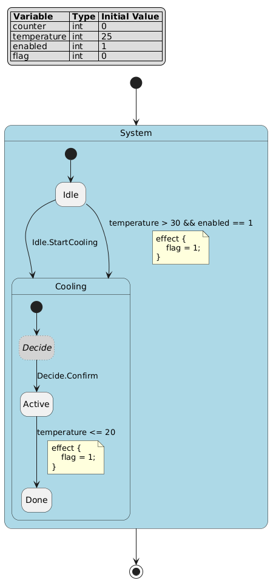

项目验收中文手册
================

.. contents:: 目录
   :depth: 2
   :local:

本文是项目验收 PDF 根文档。它覆盖验收所需的后端能力、内置模板、动态验证和编辑器交接边界；不替代完整用户手册、API 参考、发布说明或社区页面。验收手册只记录可交付能力、复现入口、真实输出和明确边界，不记录内部执行元数据。

交付范围
--------

.. list-table:: 验收范围与复现入口
   :header-rows: 1

   * - 字段
     - 本 PDF 的处理
   * - Scope
     - 中文验收 PDF、验收样例、动态验证输出、普通 PDF 构建入口和通用 PDF 门禁。
   * - Source facts
     - ``docs/source/acceptance/acceptance.fcstm``、两个 demo 的生成输出、内置模板、现有仿真 fixture、编辑器交付清单和 PDF checker。
   * - Capability list
     - 11 项后端功能、五套内置模板、四套 C/C++ native 构建证据、编辑器能力矩阵、动态验证四场景和公式编辑交接。
   * - Tutorial path
     - 读取样例，运行诊断、代码生成、PlantUML、图片生成、仿真、动态验证和 PDF 门禁。
   * - Boundaries
     - 动态验证不是形式化验证；GUI 边界是后端合同和交接项，不在本文内实现桌面控件。
   * - Verification
     - 根目录执行 ``make docs_pdf``，产物名为 ``pyfcstm-acceptance-zh.pdf``；随后运行 ``tools/check_docs_pdf.py``、``pdfinfo``、``pdftotext``、``mutool`` 与逐页渲染检查。

普通根目录构建命令：

.. code-block:: bash

   make docs_pdf

该入口直接构建验收 PDF，不需要额外专用目标。LaTeX 采用 ``oneside`` 与 ``openany``，避免手册类双面排版产生无意义空白页。

功能映射
--------

以下 11 项功能均映射到可复现证据，避免使用跨页长表造成 PDF 空白页。

1. **fcstm 状态机建模与解析**：支持变量、层次状态、伪状态、事件、guard、effect、生命周期动作和普通初始转换；脚本文本通过生产解析入口转换为内部模型。证据：``acceptance.fcstm`` 被 ``load_state_machine_from_text()`` 解析，``inspect-json-summary`` 给出状态数、转换数和诊断数。
2. **模型检查与诊断**：语法错误、结构错误和模型检查结果分开输出，便于 UI 或脚本展示。证据：``syntax-diagnostic``、``structure-diagnostic``、``inspect-json-summary`` 三段输出。
3. **代码生成**：``StateMachineCodeRenderer`` 使用模板目录生成目标代码和 README。证据：``five-template-generation`` 记录每套模板的真实生成文件。
4. **多语言模板生成**：内置模板包括 ``python``、``c``、``c_poll``、``cpp``、``cpp_poll``。证据：``template-list`` 与 ``five-template-generation`` 同时证明模板枚举和渲染结果。
5. **PlantUML 脚本生成**：CLI 可从 FCSTM 生成 PlantUML 状态图脚本。证据：``cli-plantuml`` 返回 ``@enduml`` 结尾，资源规则生成 ``acceptance.fcstm.puml``。
6. **可视化图片生成**：文档资源规则基于 PlantUML 生成 PNG/SVG 状态图。证据：本页嵌入 ``acceptance.fcstm.puml.png``，同目录保留 SVG。
7. **状态机仿真**：``pyfcstm simulate`` 和 ``SimulationRuntime`` 均可按周期推进并读取当前状态。证据：``cli-simulation`` 记录 CLI 返回码与末尾输出。
8. **模型动态验证**：将输入事件、预期状态、预期变量和预期异常与真实仿真轨迹逐步比较。证据：``dynamic_validation.demo.py.txt`` 给出 expected/actual/matched、异常 cause 和 mutation 反证。
9. **语法高亮支持**：Python 包注册 Pygments lexer，别名 ``fcstm`` / ``fcsm``，文件名 ``*.fcstm``。证据：``pygments-entry-point`` 通过 ``get_lexer_by_name("fcstm")`` 真实加载。
10. **编辑器集成支持**：VS Code 交付语言声明、TextMate、高亮、诊断、补全、悬停、定义、轮廓、格式化、修复动作、预览和导出合同。证据：本文的编辑器矩阵给出后端入口、UI 表现和边界。
11. **动态验证例子**：固定四个代表场景：通过、失败回滚、异常 cause 和 DFS 安全限制。证据：动态验证章节逐项展开。

验收样例
--------

完整 FCSTM 样例覆盖层次状态、伪状态、事件、guard、effect、生命周期动作和变量写回：

.. literalinclude:: acceptance.fcstm
   :language: fcstm

真实生成的 PlantUML 图：

后端真实证据
------------

以下输出由 demo 脚本在文档资源构建阶段生成，内容来自生产 API、CLI、模板渲染、CMake native 构建、Pygments entry point 和 Java/JAR 前置检查。

.. literalinclude:: acceptance_report.demo.py.txt
   :language: text

最小自定义模板
--------------

除内置模板外，渲染器也接受普通模板目录。最小模板只需要 ``config.yaml`` 和一个 ``.j2`` 文件：

.. code-block:: yaml

   expr_styles:
     dsl: {}
   stmt_styles:
     dsl: {}
   globals: {}
   filters: {}
   tests: {}
   ignores: []

.. code-block:: jinja

   machine = {{ model.name }}
   states = {{ model.walk_states() | list | length }}

调用方式：

.. code-block:: python

   model = load_state_machine_from_text(source_text)
   StateMachineCodeRenderer(template_dir).render(model, output_dir, clear_previous_directory=True)

该最小模板证明生成器边界清晰：解析和模型检查属于生产 API，模板只负责读取模型并输出文件。

动态验证
--------

动态验证定义为：给定 FCSTM 模型、可选初始状态和变量、每周期事件输入、每周期预期状态/变量/结束状态/异常，使用 ``SimulationRuntime`` 执行并自动比较实际轨迹。它验证选定场景的运行行为，不证明所有输入和所有路径都满足性质。

.. list-table:: 固定四场景
   :header-rows: 1
   :widths: 30 45 25

   * - 场景
     - 覆盖点
     - 反证方式
   * - 场景 1：多层转换失败
     - 多层转换无法到达可停止状态时，推测执行拒绝该路径，并保持原活动状态和已提交变量不被污染。
     - 临时修改一个预期状态，统一 checker 必须报告精确字段不匹配并返回失败。
   * - 场景 2：事件伪状态链
     - 进入事件驱动伪状态时，缺少伪状态事件则保持原状态；同周期补齐事件后进入稳定子状态。
     - 修改 ``counter`` 预期值触发不匹配。
   * - 场景 3：guard 表达式异常
     - guard 中除零被包装为 ``SimulationRuntimeExpressionError``，cause 保留 ``ZeroDivisionError``，状态和变量不被破坏。
     - 修改异常类型或变量预期触发不匹配。
   * - 场景 4：伪状态自循环
     - 无条件伪状态自循环触发 DFS step safety limit，回滚到进入前稳定状态。
     - 修改状态或变量预期触发不匹配。

.. literalinclude:: dynamic_validation.demo.py.txt
   :language: json

编辑器与 GUI 交接
-----------------

.. list-table:: VS Code 与 GUI 能力矩阵
   :header-rows: 1
   :widths: 24 38 38

   * - 能力
     - 已交付后端或 VS Code 合同
     - GUI 边界
   * - TextMate 高亮
     - ``editors/fcstm.tmLanguage.json`` 绑定 ``source.fcstm`` 和 ``.fcstm``。
     - GUI 可复用语法文件或独立实现同等 token 规则。
   * - Problems 诊断
     - 解析错误来自 ``GrammarParseError``；结构错误来自 ``ModelValidationError.diagnostics``；检查摘要来自 ``inspect_model().to_json()``。
     - GUI 负责将 line/column/code/severity/message 映射到 Problems 面板。
   * - completion
     - VS Code 侧提供语言服务补全；后端模型暴露状态、事件、动作和变量名称。
     - GUI 可按当前编辑上下文请求候选项并自行排序展示。
   * - hover
     - VS Code 侧展示符号说明和诊断上下文；后端模型对象提供路径、类型和生命周期信息。
     - GUI 负责悬停 UI，不改变后端模型语义。
   * - definition
     - 状态、事件、动作引用可解析到模型节点或语法位置。
     - GUI 负责跳转体验；后端只需返回可定位对象或诊断。
   * - outline
     - 层次状态树来自 ``model.walk_states()`` 和父子关系。
     - GUI 负责树控件、折叠状态和选中同步。
   * - format
     - VS Code 侧可对 FCSTM 文本格式化；后端解析器用于格式化后的语义校验。
     - GUI 可以先格式化再重新解析，失败则保留原文。
   * - code action
     - 诊断 code 和位置信息可驱动快速修复，例如补充分号、定位缺失目标。
     - GUI 负责动作列表和应用编辑；后端不直接修改用户文件。
   * - preview
     - PlantUML 脚本和 PNG/SVG 由现有资源入口生成。
     - GUI 负责渲染面板刷新、缩放和错误提示。
   * - export
     - 可导出 FCSTM、PlantUML、PNG/SVG、代码生成结果、动态验证 JSON 和 PDF 报告。
     - GUI 负责文件选择、覆盖确认和路径权限。

公式编辑交接
~~~~~~~~~~~~

公式编辑分三类处理：

* guard 条件：调用 ``parse_expr_from_string(text, mode="logical")``。
* 数值表达式：调用 ``parse_expr_from_string(text, mode="numeric")``。
* 动作块：放入最小完整 FCSTM 模型后调用 ``load_state_machine_from_text()``，因为动作局部变量、持久变量写回和语句顺序需要模型上下文。

``formula-smoke`` 证明三类输入都能通过；``formula-error`` 证明错误公式能返回可展示诊断。

Java/JAR 前置
-------------

ANTLR 语法重新生成需要 Java 与 ``antlr-4.9.3.jar``。验收构建不重新生成 ANTLR 文件，但 ``java-jar-prerequisite`` 记录当前环境是否能满足该前置。若 GUI 或编辑器项目要在本地重新生成语法产物，先运行：

.. code-block:: bash

   make antlr
   make antlr_build

PDF 门禁
--------

PDF 门禁执行以下检查：

* PDF 结构可读，``qpdf`` 可用时执行结构检查。
* ``pdfinfo`` 页数满足验收文档下限。
* ``pdftotext`` 能提取目录、主要章节、验收哨兵和 CJK 文本。
* ``pdffonts`` 包含 Fandol CJK 字体，避免中文缺字。
* ``mutool show outline`` 能读取书签，且包含验收主要章节。
* 生成 TeX 不包含超长物理行，不展开大型 registry 值。
* LaTeX、Sphinx 和 makeindex 日志没有 fatal pattern、force mode 或 rejected index entry。
* PDF 文本不包含内部执行元数据或被禁止的内部标记。

尾部检查哨兵：``acceptance_pdf_tail_sentinel``。

项目验收可复现验收完成哨兵。

.. raw:: latex

   \phantomsection

验收文本锚点：fcstm状态机建模与解析。

::

   fcstm状态机建模与解析
