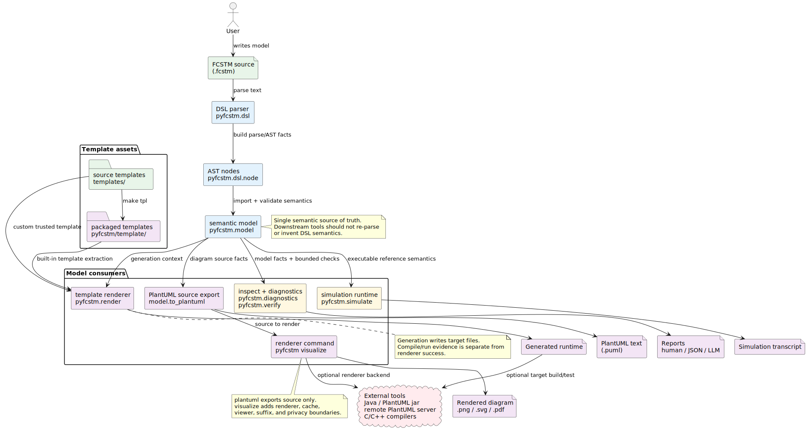

.. _sec-explanations-architecture-zh:

架构解释
========

pyfcstm 围绕清晰 pipeline 组织：DSL 文本变成 AST nodes，AST nodes 变成经过验证的 state-machine model，然后这个 model 可以被 simulate、inspect、verify、visualize 或 render 成目标语言代码。

主流程
------

   仓库高层 pipeline。

主要层次包括：

* **DSL parsing**：位于 ``pyfcstm/dsl/``。ANTLR grammar files 定义 syntax，listener code 构建 AST nodes。
* **Model import**：位于 ``pyfcstm/model/``。importer 将 states、transitions、events、actions、variables 和 diagnostics 解析为语义 state-machine model。
* **Runtime tools**：位于 ``pyfcstm/simulate/`` 和 ``pyfcstm/entry/``。它们提供交互式和 batch simulation、CLI entry points、inspect output 和 PlantUML export。
* **Rendering**：位于 ``pyfcstm/render/``，打包模板位于 ``pyfcstm/template/``。renderer 消费 model 和 template assets；它不 hard-code 目标 runtime API。
* **Analysis**：位于 ``pyfcstm/solver/`` 以及 verify/inspect integrations。它们把 model facts 转换为 diagnostics 和 reachability-style checks。
* **Documentation and LLM guide assets**：位于 ``docs/`` 和 ``pyfcstm/llm/``。prompt-facing grammar guide 是带 checksum 的打包资产。

当前内置模板形态
----------------

内置模板是当前行为，不是计划中的功能。可编辑源码资产位于 ``templates/``。可分发内置模板资产位于 ``pyfcstm/template/``，通过 ``make tpl`` 刷新。CLI 路径 ``pyfcstm generate --template <name>`` 会解包打包资产，然后使用与自定义模板目录相同的 renderer。

这个拆分让维护者拥有源码树，也让用户拥有稳定的命名入口。

Inspect 与 diagnostics
----------------------

Inspect 和 diagnostics 属于 model-facing toolchain。它们提供结构化 facts 和详细消息，可指导人类或 LLM-assisted repair。它们不替代 runtime simulation 或 generated-code validation；它们暴露 parser 和 model importer 对机器的理解。

Simulation 与执行语义
---------------------

Simulator 是 Python 侧语义检查的参考可执行模型。声称与 simulator 对齐的模板 runtime 应该通过 simulator trace 做验证。生命周期 action 顺序、hot start behavior、composite-state entry semantics 等执行细节见 :doc:`../execution_semantics/index_zh`。

维护边界
--------

* 生成 grammar outputs 应重新生成，不手工编辑。
* 生成文档应通过文档命令产生，不直接编辑。
* 内置模板应先改仓库模板源码，再重新打包。
* ``test/`` 下的单元测试应面向生产 ``pyfcstm`` 行为，并与 JavaScript test tree 独立。

这些边界让仓库保持可解释，并让每个生成资产可复现。
