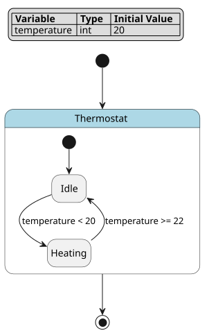
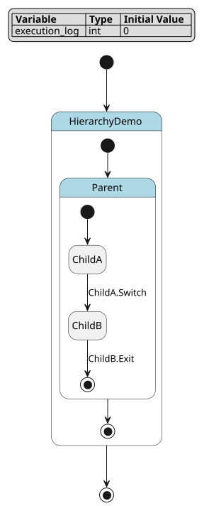
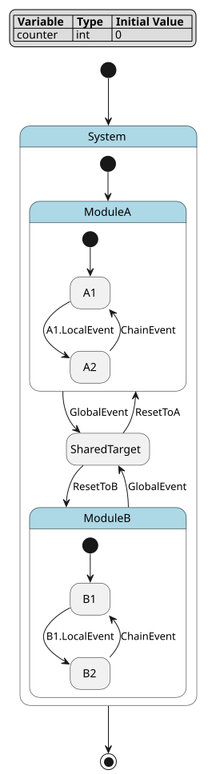
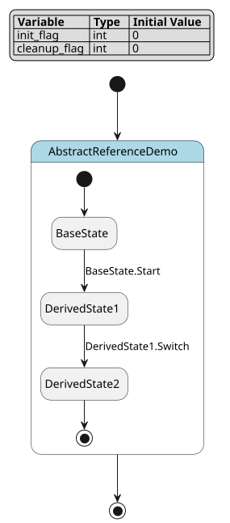
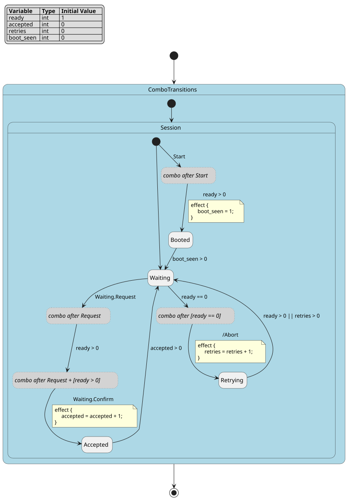
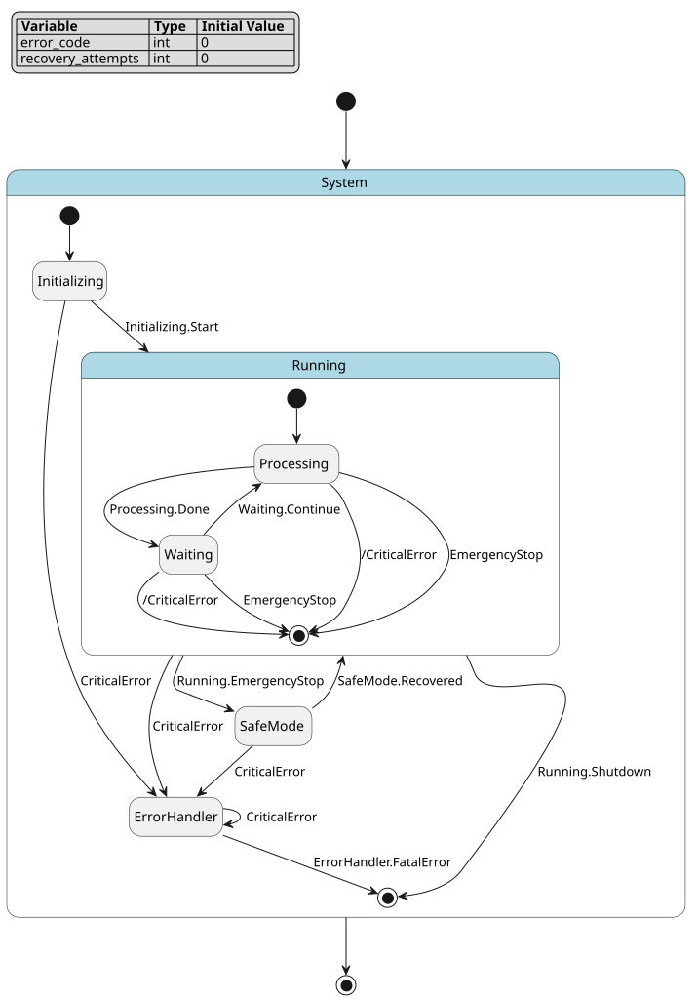
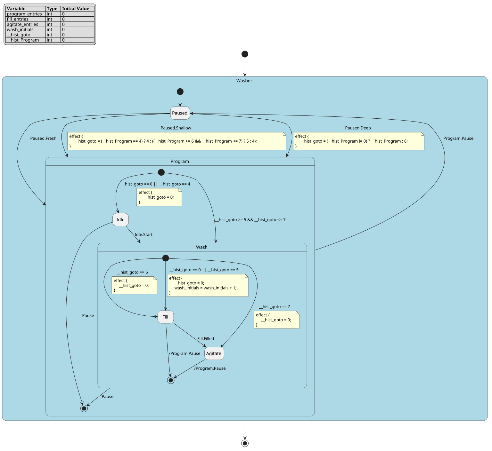
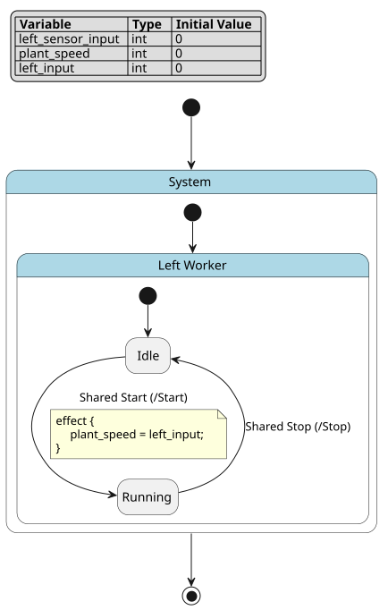

.. _sec-explanations-dsl-semantics:

DSL semantics explanation
=========================

.. contents:: Semantics map
   :local:
   :depth: 2

Scope
-----

This page explains why the FCSTM DSL behaves the way it does. It is not the
syntax table; use :doc:`../../reference/dsl/index` for exact grammar forms. It
is not the first tutorial; use :doc:`../../tutorials/dsl/index` for a runnable
starting path. Complete simulator internals live in
:doc:`../execution_semantics/index`.

.. _dsl-root-design:

Why variables come before one root state
----------------------------------------

A FCSTM model is one controller with one active-state stack. Persistent
variables come before the root so every guard, effect, lifecycle action, import
mapping, and diagnostic pass can use the same data surface.

.. code-block:: fcstm

   def int temperature = 20;

   state Thermostat {
       [*] -> Idle;
       state Idle;
   }

This is not only parser convenience. Code generation needs one runtime object,
one variable store, and one root active stack. Import assembly also needs one
host tree into which imported modules can be rewritten.

   This baseline diagram has only the authored root composite and two authored
   leaf states. It shows the three model surfaces that later examples build on:
   one variable table, one state tree, and one transition graph. Combo and
   forced expansion add generated structure onto those same surfaces.

.. _dsl-ownership-name-resolution:

Ownership tree and name resolution
----------------------------------

States, events, lifecycle actions, and imports are owned by states. A transition
can directly name endpoints visible in the state where the transition is written.

.. code-block:: fcstm

   state Root {
       [*] -> Parent;

       state Parent {
           [*] -> ChildA;
           state ChildA;
           state ChildB;
           ChildA -> ChildB;
       }
   }

``ChildA -> ChildB`` belongs inside ``Parent``. If a parent-level rule wrote
``RootOutside -> ChildB`` while ``ChildB`` is private to ``Parent``, the rule
would couple the parent to a nested implementation detail. The DSL instead
encourages boundary routing: enter ``Parent`` and let ``Parent`` choose a child,
or move the child-targeting transition into ``Parent``.

Inspect exposes the resolved paths in ``transitions[].from_path`` and
``transitions[].to_path``. That is the evidence to use when checking whether a
transition landed on the boundary or an internal child.

.. _dsl-composite-entry-semantics:

Composite entry and initial transitions
---------------------------------------

A composite state is both a boundary and a child-selection rule. Entering the
boundary is not the same thing as already being in a leaf child.

Initial entry through a composite follows this conceptual order:

1. enter the composite boundary;
2. evaluate and apply the composite's initial transition;
3. run plain composite ``during before``;
4. enter the selected child.

A child-to-child transition is different:

1. exit the source child;
2. run the transition effect;
3. enter the target child.

Plain composite ``during before`` / ``during after`` does not wrap that
child-to-child movement. That boundary keeps composite entry/exit behavior from
turning into hidden behavior on every internal state change.

   Use this figure to separate boundary entry from child-to-child movement. The
   parent and child states are authored DSL nodes; inspect lifecycle fields show
   whether behavior belongs to the composite boundary, a leaf, or an aspect on
   descendant leaf cycles.

.. _dsl-event-ownership-signal:

Event scopes as ownership signals
---------------------------------

Event spelling tells readers who owns the signal:

.. list-table:: Event ownership
   :header-rows: 1
   :widths: 22 36 42

   * - Spelling
     - Example
     - Meaning
   * - ``::``
     - ``Idle -> Heating :: Heat;``
     - The source state owns a private event name.
   * - ``:``
     - ``Idle -> Running : Start;``
     - A containing or named state owns the event path.
   * - ``: /``
     - ``Worker -> Active : /Start;``
     - The path starts from the root-owned event namespace.

The spelling matters during refactoring. A source-local event can be copied with
one state; a root event is public protocol. Combo terms inherit the leading
scope unless a continuation term explicitly starts with ``/``.

Forced transitions use similar trigger spellings, but they are declaration
expansion shorthand. A forced trigger still produces ordinary expanded
transitions; it is not a combo chain and it cannot carry an effect.

   The event-scope diagram should be read as an ownership map. Source-local
   events move with their source state; root events act more like a public
   protocol. Inspect ``event`` and ``event_scope`` fields when the same visual
   edge could be interpreted as local or global.

.. _dsl-expression-separation:

Guard, effect, and expression separation
----------------------------------------

The DSL separates numeric expressions from conditions because value computation
and control-flow decisions have different portability and diagnostic needs.

.. code-block:: fcstm

   Sampling -> Done : if [sensor >= target] effect {
       next_sample = sensor + 1;
       alarm_count = (next_sample > target) ? alarm_count + 1 : alarm_count;
   };

The guard is tested first. The effect runs only after the transition is chosen.
``next_sample`` is a block-local temporary inside the effect; it does not become
persistent state after the block exits.

This separation is also where target-profile warnings must stay precise. A
numeric diagnostic about fixed-width integer range, division policy, shift count,
or float bitwise behavior is a C/C++ deployment-profile warning for ``c``,
``c_poll``, ``cpp``, and ``cpp_poll`` unless the diagnostic explicitly says
otherwise. It is not evidence that the Python generated runtime has the same
fixed-width or undefined-behavior risk.

.. _dsl-lifecycle-hooks-semantics:

Lifecycle, abstract hooks, and refs
-----------------------------------

Lifecycle actions attach behavior to state boundaries and active cycles:

* ``enter`` belongs to entry;
* plain leaf ``during`` belongs to ordinary active cycles;
* ``exit`` belongs to exit;
* named actions create stable reference targets and generated hook names;
* ``abstract`` says generated code must call a user-provided implementation;
* ``ref`` reuses a named lifecycle action path.

.. code-block:: fcstm

   state Device {
       enter SharedInit {
           ready = 1;
       }
       state Idle {
           enter ref /SharedInit;
           during abstract PollHardware;
       }
   }

``ref`` deliberately points to a named lifecycle action, not to a state or an
event. That keeps reusable behavior explicit and avoids making state names double
as callable procedures.

   This figure is a reminder that state paths and action paths are separate
   namespaces. Generated runtimes can expose stable hooks for abstract and named
   lifecycle actions because the DSL records those actions explicitly.

.. _dsl-during-aspect-semantics:

During before/after and aspects
-------------------------------

Two different features use during-stage words:

* plain ``during before`` / ``during after`` belongs to the composite boundary;
* ``>> during before`` / ``>> during after`` is an aspect contributed by an
  ancestor to descendant leaf-state active cycles.

The checked ``hierarchy_execution.fcstm`` example uses numeric additions to make
ordering observable. Conceptually, a leaf active cycle sees:

.. code-block:: text

   ancestor >> during before
   parent   >> during before
   leaf     during
   parent   >> during after
   ancestor >> during after

A child-to-child transition does not run plain composite ``during before`` or
``during after``. Combo pseudo relay states also do not receive aspect actions.
Relay states are routing machinery; letting aspects observe each relay hop would
turn an implementation detail into business behavior.

.. _dsl-combo-relay-semantics:

Pseudo and combo relay semantics
--------------------------------

Combo transitions solve the event-plus-guard problem without inventing an
ordinary transition form that mixes separate event and guard suffixes.

Author-written transition:

.. code-block:: fcstm

   Waiting -> Accepted :: Request + [ready > 0] + Confirm effect {
       accepted = accepted + 1;
   }

Model construction expands this into a pseudo relay chain. Inspect keeps both
views:

* ``combo_origins`` records the original trigger terms and source spans;
* ``combo_transitions`` records generated edges with provenance;
* generated pseudo states are named with the reserved ``__combo_`` prefix.

The final effect belongs to the semantic transition to ``Accepted``. It must not
be duplicated on every relay hop. If any required event or guard term is absent
in the same cycle, the chain does not complete and the visible state should not
silently advance to the final target.

   The ``__combo_`` nodes in this diagram are generated pseudo relay states.
   They have no business lifecycle actions and should not be treated as stable
   business states. The authored transition from ``Waiting`` to ``Accepted`` is
   split into event, guard, and final event-plus-effect hops; only the final hop
   reaches the business target and runs the original effect.

.. list-table:: Combo semantic checkpoints
   :header-rows: 1
   :widths: 22 38 40

   * - Checkpoint
     - Runtime meaning
     - Design reason
   * - First event hop
     - Consume ``Request`` and move into a relay.
     - Preserve trigger order without running business side effects early.
   * - Middle guard hop
     - Test ``ready > 0``.
     - A false guard keeps the chain from masquerading as a completed business transition.
   * - Final event hop
     - Consume ``Confirm``, enter ``Accepted``, and run the original effect.
     - Execute the effect exactly once after the complete trigger chain is satisfied.
   * - Pseudo relay state
     - Carry routing only.
     - Prevent generated structure from leaking into business semantics.

``W_COMBO_DUPLICATE_EVENT`` and combo guard diagnostics point back to the
author-written trigger terms, not merely to generated pseudo states. This is why
inspect diagnostics can guide an LLM or user back to the original DSL source.

.. _dsl-forced-transition-expansion:

Forced transition expansion
---------------------------

Forced transitions are a different kind of expansion. They duplicate one source
pattern over multiple concrete sources:

.. code-block:: fcstm

   !* -> ErrorHandler :: CriticalError;

The expanded transitions are ordinary transitions for runtime purposes: normal
exit actions still run, then the target's entry behavior runs. Forced
transitions cannot carry ``effect`` blocks because a side-effectful many-source
shorthand is hard to audit. If the same update must happen for all expanded
sources, put it in the target ``enter`` action or write explicit normal
transitions.

Forced transitions also cannot carry combo ``+`` chains. Combo is ordered relay
expansion; forced is source-set expansion. Keeping them separate makes the
expanded model inspectable.

   The diagram contains more expanded edges than authored forced declarations.
   ``!*`` covers applicable sources in the current owner scope, while
   ``!Running`` reaches the ``Running`` boundary and related child exits.
   Because the expanded edges are ordinary transitions, source exits and target
   entries still run normally; the forced declaration itself carries no effect.

.. list-table:: Forced versus combo expansion
   :header-rows: 1
   :widths: 24 38 38

   * - Topic
     - Combo transition
     - Forced transition
   * - Expansion dimension
     - Ordered trigger terms become a relay chain.
     - One source pattern becomes multiple edges.
   * - Intermediate state
     - Generated pseudo relay states.
     - No trigger-order relay chain.
   * - Effect action
     - Allowed, but only on the final hop.
     - Disallowed to avoid hidden side-effect cloning.
   * - Good use case
     - Event and guard terms must be satisfied in sequence.
     - Many states respond to one emergency event or guard.

.. _dsl-history-semantics:

History semantics and lowering
------------------------------

Leaving a composite state and entering it again normally starts over at its
initial transition. That suits "start again", not "pause and continue". History
(``[H]`` / ``[H*]``) expresses the second: entering the owner through its history
restores the configuration it had when it was last left. The syntax and the
full list of forms are in :ref:`dsl-history-reference`; this section explains
when a record is written, what a restore does, and why a plain machine can do
exactly that.

Three runtime facts
~~~~~~~~~~~~~~~~~~~

The design rests on three properties of the FCSTM runtime.

.. list-table:: Runtime facts history relies on
   :header-rows: 1
   :widths: 8 46 46

   * - Fact
     - Property
     - Consequence for history
   * - F1
     - Transitions only connect siblings. An owner's ``exit`` runs only when a
       transition whose source is the owner commits; a forced ``!P -> Q`` also
       expands into edges sourced at the owner.
     - "The owner was left" and "a transition sourced at the owner committed"
       are the same event, so there is one write point. A transition into
       ``O.[H]`` always comes from outside ``O`` (or is ``O``'s own external
       self transition).
   * - F2
     - A cycle runs from one stoppable leaf to the next; a composite cannot
       rest in its initial-wait position.
     - A cycle exits at most one stoppable leaf, leaf first and ancestors after,
       so the configuration before the owner's exit is the leaf the cycle
       started from.
   * - F3
     - Candidates run speculatively on a copy of the variables and are
       discarded on failure; initial transitions are tried in declaration order
       and a later one is tried when an earlier one cannot stabilize.
     - Records roll back with a failed candidate for free. But a failing
       restore route would silently fall through to an ordinary initial,
       which is why ordinary initials are gated (see below).

Execution rules
~~~~~~~~~~~~~~~

.. list-table:: History rules
   :header-rows: 1
   :widths: 18 82

   * - Rule
     - Content
   * - Ownership
     - Each owner declares at most one ``[H]`` and one ``[H*]``; both share one
       record. Neither the root nor a leaf can own history.
   * - Record
     - The stoppable leaf the owner was last left from, relative to the owner.
       Shallow history uses its first segment, deep history the whole path.
   * - Write
     - Only when a transition sourced at the owner commits. Transitions inside
       the owner, leaving only an inner composite, ordinary entries and restores
       never write; a failed candidate rolls its write back.
   * - Pseudo states
     - Never recorded. An activation that only passes pseudo states and leaves
       again keeps the previous record.
   * - ``O.[H]``
     - With a record: enter the recorded direct child, then continue with that
       child's ordinary initial. Without: the shallow default.
   * - ``O.[H*]``
     - With a record: restore the exact path. The ordinary initials on that path
       (their guards, events and effects) do not run; ``enter`` actions and
       plain ``during before`` on the path do. Without: the deep default.
   * - Reading
     - Ordinary entry ignores and keeps the record; a restore reads it without
       consuming it. Only the latest record is kept.
   * - All or nothing
     - If the restore path cannot reach a stoppable leaf in this cycle -- for
       example the remembered child's initial is guarded off -- the whole
       history transition is rejected like any other failed candidate. It never
       falls back to an ordinary entry.
   * - Business data
     - Variables are not restored; lifecycle actions on the path run again.
   * - ``-> [*]``
     - FCSTM has no final state. ``X -> [*]`` leaves the owner like any other
       exit, so the record is the last stoppable leaf.

The record changes only when the owner is left. Cycle by cycle on the washer
example of :ref:`dsl-history-task`:

.. list-table:: Current configuration versus record
   :header-rows: 1
   :widths: 22 38 40

   * - Cycle / event
     - Active leaf after the cycle
     - Record of ``Program``
   * - 1 initialization
     - ``Paused``
     - none
   * - 2 ``Fresh``
     - ``Program.Idle``
     - none
   * - 3 ``Start``
     - ``Program.Wash.Fill``
     - none
   * - 4 ``Filled``
     - ``Program.Wash.Agitate``
     - none
   * - 5 ``Pause``
     - ``Paused``
     - ``Wash.Agitate`` (first write)
   * - 6 ``Shallow``
     - ``Program.Wash.Fill``
     - ``Wash.Agitate`` (a restore does not write)
   * - 7 ``Pause``
     - ``Paused``
     - ``Wash.Fill`` (overwritten by this exit)
   * - 8 ``Deep``
     - ``Program.Wash.Fill``
     - ``Wash.Fill``
   * - 9 ``Pause``
     - ``Paused``
     - ``Wash.Fill``
   * - 10 ``Fresh``
     - ``Program.Idle``
     - ``Wash.Fill`` (ordinary entry keeps it)
   * - 11 ``Pause``
     - ``Paused``
     - ``Idle``
   * - 12 ``Deep``
     - ``Program.Idle``
     - ``Idle``

This exact sequence is a shared semantic fixture
(``history_washer_shallow_and_deep_restore``) that the simulator, all five
generated runtimes and BMC replay.

Authored versus lowered
~~~~~~~~~~~~~~~~~~~~~~~

Model conversion lowers history after forced and combo expansion, so every
history entry is already a concrete edge. States are numbered in preorder, which
makes every subtree one contiguous id range. Four rewrites implement the rules:

1. **Record** -- every stoppable leaf's ``exit`` writes its id into the record
   of each owner above it.
2. **Entry** -- a transition into ``O.[H]`` / ``O.[H*]`` computes the restore
   target once, at the end of its effect, into ``__hist_goto``.
3. **Route** -- one guarded initial per composite and child on the way to any
   possible target, ``[*] -> K : if [goto in range(K)]``; entering a leaf clears
   ``goto``. A plain user initial to the same child is merged into that route.
4. **Gate** -- the remaining user initials of those composites fire only while
   no restore passes (``goto == 0``, or ``goto == id(C)`` when the composite
   itself is a restore target) and clear ``goto`` first. An evented initial is
   split through a ``__hist_gate_<n>`` pseudo state.

The washer's ``Program`` lowers to two initials and ``Wash`` to three -- the same
count as a careful hand-written equivalent. Condensed excerpt of the exported
model (``str(machine.to_ast_node())``; unrelated lines are omitted and short
blocks joined on one line):

.. code-block:: fcstm

   Paused -> Program :: Deep effect {
       __hist_goto = (__hist_Program != 0) ? __hist_Program : 6;
   }
   // inside Program
   [*] -> Wash : if [__hist_goto >= 5 && __hist_goto <= 7];
   [*] -> Idle : if [__hist_goto == 0 || __hist_goto == 4] effect {
       __hist_goto = 0;
   }
   // inside Wash
   [*] -> Fill : if [__hist_goto == 6] effect { __hist_goto = 0; }
   [*] -> Agitate : if [__hist_goto == 7] effect { __hist_goto = 0; }
   [*] -> Fill : if [__hist_goto == 0 || __hist_goto == 5] effect {
       __hist_goto = 0;
       wash_initials = wash_initials + 1;
   }
   // every leaf below Program
   state Agitate { exit { __hist_Program = 7; } }

   The lowered washer as PlantUML draws it. The two history entries from
   ``Paused`` compute ``__hist_goto``; ``Program`` has one route into ``Wash``
   (range 5..7) merged with nothing and its own initial into ``Idle`` merged
   with the route to ``Idle`` (id 4); ``Wash`` has routes to ``Fill`` (6) and
   ``Agitate`` (7) plus its gated initial. The labels are code identifiers only,
   so one figure serves both languages.

Why each part is correct:

* **The record is right.** By F2, the cycle that leaves the owner starts from
  one stoppable leaf and exits leaf first, ancestors after, without entering and
  leaving another stoppable leaf in between. The last write before the owner's
  exit is therefore that leaf -- the configuration "before exiting the parent"
  that SCXML prescribes.
* **It only has to be right when read.** Only the owner's leaves write its
  record, and they exit only while the owner is active, so the variable is
  frozen while the owner is inactive. It is read only by a transition into the
  owner, which by F1 happens while the owner is inactive.
* **Routes are exclusive.** Sibling id ranges do not overlap, ``goto == 0``
  excludes every route, and ``goto`` is ``0`` at every stable point because a
  restore clears it on the leaf or on the composite target's ordinary initial.
* **Failures are atomic.** All writes happen on the candidate's copy of the
  variables (F3).

Why ordinary initials are gated
~~~~~~~~~~~~~~~~~~~~~~~~~~~~~~~

Without the gate, a blocked restore silently becomes an ordinary entry. Take
the model of the shared fixture
``history_blocked_restore_is_rejected_gated_initial``: ``K``'s initial is
``[*] -> K1 : if [ready == 1];`` and ``Block`` sets ``ready = 0``.

.. list-table:: A blocked restore, with and without gates
   :header-rows: 1
   :widths: 40 30 30

   * - Scenario
     - With gates (lowering)
     - Without gates
   * - ``Fresh``, ``Go``, ``Stop``, ``Block``, ``Resume``: the shallow record is
       ``K``, whose initial is now blocked
     - Stays in ``Off``; ``Resume`` is not consumed (all or nothing)
     - Falls back to ``O.Idle``; history silently became an ordinary entry
   * - ``Block``, ``ResumeDeep``: no record, the deep default ``K`` is blocked
     - Stays in ``Off``
     - Falls back to ``O.Idle``
   * - ``Block``, ``Fresh``: ordinary entry
     - ``O.Idle``
     - ``O.Idle`` -- gates never change an ordinary entry

The cause is F3: after a route fails validation, the runtime tries the next
initial in the list. UML and SCXML initials carry no guards or events, so they
never meet this; it is specific to FCSTM. The "clear ``goto`` first" order in
rule 4 matters too: when a gated initial itself enters a nested history
(``[*] -> S2.[H*];``), its own effect sets ``goto`` for the next owner, and
clearing afterwards would erase it. The shared fixture
``history_nested_owner_initial_enters_inner_history`` locks this down.

Boundaries and counterexamples
~~~~~~~~~~~~~~~~~~~~~~~~~~~~~~

* **Not concurrency.** FCSTM has one active path; there are no orthogonal
  regions whose histories would interact.
* **Not persistence.** Records live in the machine's variables, like any other
  state; saving them across processes is the host's job (a hot start restores
  them through :meth:`pyfcstm.model.model.StateMachine.history_variables`).
* **Not business data.** A restore does not roll variables back; the washer's
  counters keep counting on every restore.
* **No multi-level targets.** ``X -> P.O.[H]`` is rejected; enter ``P`` and let
  ``P`` enter ``O.[H]`` from its own scope, or declare the history on ``P``.
* **No default effect.** ``[H] -> Child effect { ... }`` is not a form; put the
  effect on the history entry transition or in ``Child``'s ``enter``.
* **The raw record is not observable while the owner is active.** The
  ``__hist_<owner>`` variable follows leaf exits then; read it with
  ``history_record()`` while the owner is inactive.
* **History does not make a stuck model live.** A restore can reach a
  configuration that ordinary entry never reaches (a skipped initial effect
  leaves a variable at another value, for example). If that configuration
  loops through pseudo states, the runtime reports the loop exactly as it would
  for the same configuration written without history.

Evidence beyond the unit tests: a random differential against XState 5.33.2
(1489 models, 120609 steps, 12978 restores) found no difference in the active
leaf or the exit/entry order, and an FCSTM-specific oracle over 1451 random
models with pseudo states, guards, combo and forced transitions found no
failure. A fixed-seed version of that oracle runs in the unit tests.

.. _dsl-import-assembly-semantics:

Import assembly semantics
-------------------------

Import syntax is legal inside composite states, but file loading and module
assembly run after parsing.

.. code-block:: fcstm

   import "./import_worker.fcstm" as LeftWorker {
       var sensor_* -> left_$1;
       var speed -> plant_speed;
       event /Start -> Start named "Shared Start";
   }

The parser records the path, alias, optional display name, and mapping
statements. The import/model layer then resolves the path, loads the imported
root, checks conflicts, rewrites variable names, rewrites event paths, and adds
the imported root as a child state under the alias.

Mapping templates are not arbitrary code. ``$0`` is the whole matched imported
variable name; ``$1`` / ``${1}`` are capture groups from wildcard selectors;
``*`` is the fallback template. Directory projects must import a concrete entry
file such as ``./line/main.fcstm`` because a bare directory is not DSL source.

   The imported module appears under its host alias in the state tree. Variable
   and event mappings are not drawn as scripts, but they affect inspect's
   variable list, event table, and resolved transition paths. Use those fields
   as the evidence when reviewing import assembly.

Design boundaries
-----------------

The DSL is intentionally narrower than a general programming language:

* no loops in operation blocks;
* no user-defined functions in DSL source;
* event syntax and ordinary guard syntax are not combined on the same ordinary
  transition;
* forced transitions have no effects and no combo chains;
* combo relay pseudo states are pure routing helpers;
* target-risk diagnostics must name their target profile.

The event-plus-guard boundary is intentionally visible. This ordinary transition
shape is invalid:

.. literalinclude:: ../../tutorials/dsl/event_guard_mixed_invalid.fcstm.txt
   :language: fcstm
   :caption: Invalid ordinary event-plus-guard suffix; expected parser excerpt: ``Unexpected token 'if'``.

Use combo syntax when both terms are required:

.. code-block:: fcstm

   A -> B :: Go + [ready > 0];

The other boundaries fail at the parser or model-validation layer rather than
being silently rewritten. For example, a forced transition with an ``effect``
block is rejected instead of cloning a side effect across many sources; a combo
relay pseudo state with lifecycle actions is rejected or warned as routing
machinery, not treated as business behavior; and numeric target-risk warnings
must stay scoped to the C/C++ deployment profiles that have fixed-width or
undefined-behavior risk.

Those boundaries keep models parseable, inspectable, simulatable, and suitable
for multi-language code generation.
