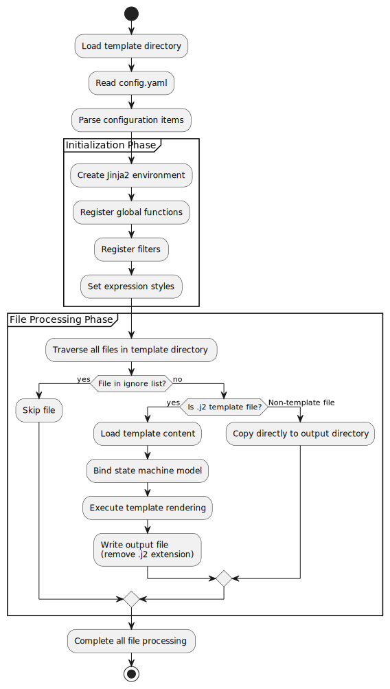
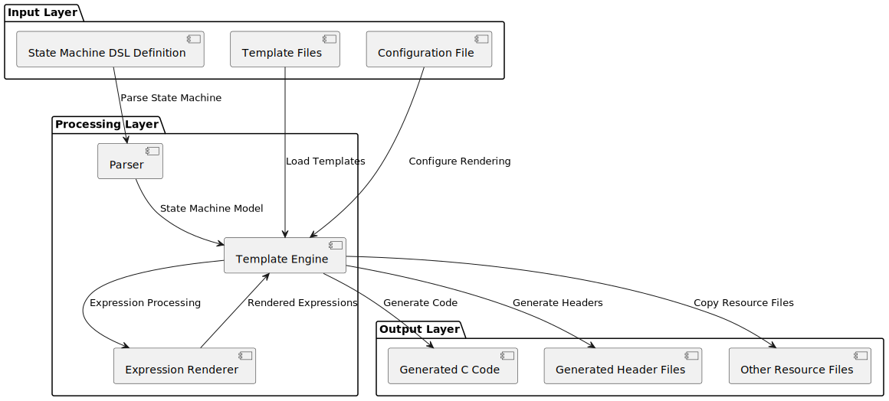
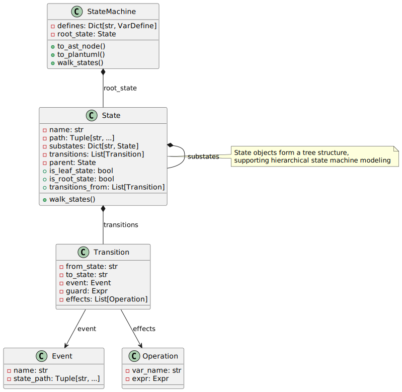
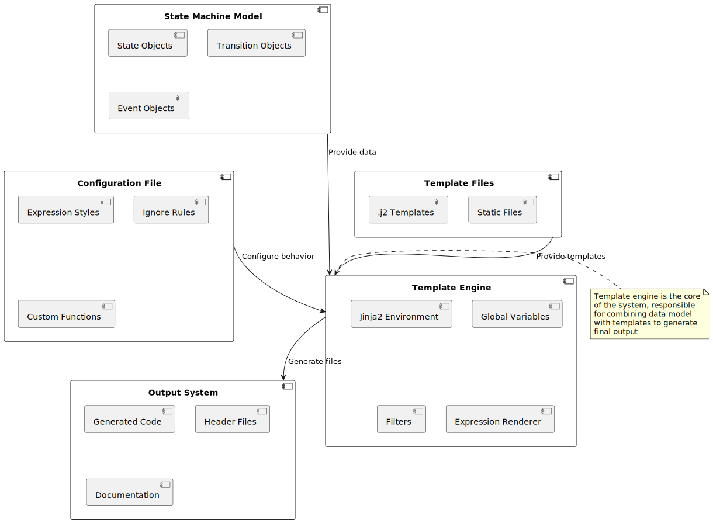

.. _sec-explanations-template-rendering:

Template rendering explanation
==============================

The renderer turns a validated state-machine model into a generated file tree.
It deliberately stays small: parsing, model validation, template extraction,
Jinja2 rendering, and target-language runtime design are separate concerns.

Rendering pipeline
------------------

The generation path is:

1. The CLI reads FCSTM DSL text.
2. The parser builds DSL AST nodes.
3. The model importer builds a ``StateMachine``.
4. For built-in templates, ``pyfcstm.template`` extracts a packaged template
   asset to a temporary directory.
5. ``StateMachineCodeRenderer`` reads ``config.yaml`` from the template
   directory.
6. The renderer builds a Jinja2 environment, registers expression and statement
   renderers, and walks template files.
7. ``*.j2`` files are rendered; other files are copied unless ignored.

   Rendering flow from DSL input to generated files.

Template directory boundaries
-----------------------------

A template directory describes output shape. The renderer does not decide the
runtime API, target-language naming scheme, or build system. Those belong to the
template. This is why built-in templates can expose very different integration
surfaces while sharing the same model and renderer.

   Renderer components and their responsibilities.

``config.yaml`` extends the renderer environment. It should describe renderer
facts such as expression styles, statement styles, helper filters, helper tests,
and ignored source files. It should not hide target-runtime semantics in Python
callbacks.

Expression and statement rendering
----------------------------------

The model stores expressions and operation statements in language-neutral form.
Templates choose how to render them for a target language:

* ``expr_render`` renders expression objects such as guards and assignment
  values.
* ``stmt_render`` renders one operation statement.
* ``stmts_render`` renders a sequence of operation statements.

   Model objects provide the language-neutral input consumed by templates.

The older ``operation_stmt_render`` helpers intentionally render DSL echo text.
They remain useful for documentation, comments, and debugging, but runtime
codegen should use the target-language statement renderers.

Built-in template packaging
---------------------------

Repository template sources live under ``templates/``. Distributable built-in
assets live under ``pyfcstm/template/`` and are refreshed by ``make tpl``. The
CLI's ``pyfcstm generate --template <name>`` path extracts the packaged asset
first, then hands the extracted directory to the same renderer used for custom
``--template-dir`` paths.

That packaging boundary matters: user-facing docs should teach
``--template <name>`` for built-ins. Direct repository ``templates/`` paths are a
maintainer source tree, not the stable user entry point.

Where logic should live
-----------------------

.. list-table:: Logic placement guide
   :header-rows: 1

   * - Logic type
     - Preferred home
   * - Target runtime behavior
     - Generated source files and target-language hooks.
   * - Repeated file structure
     - Jinja2 macros or includes.
   * - Naming and formatting helpers
     - Template-local filters or globals declared in ``config.yaml``.
   * - Cross-template renderer behavior
     - Production renderer code with tests.
   * - Built-in template asset metadata
     - ``pyfcstm/template`` packaging metadata and generated README contracts.

   Core renderer components and extension points.

The smallest maintainable template keeps these layers explicit. That makes
output easier to review, tests easier to write, and downstream integration less
surprising.
