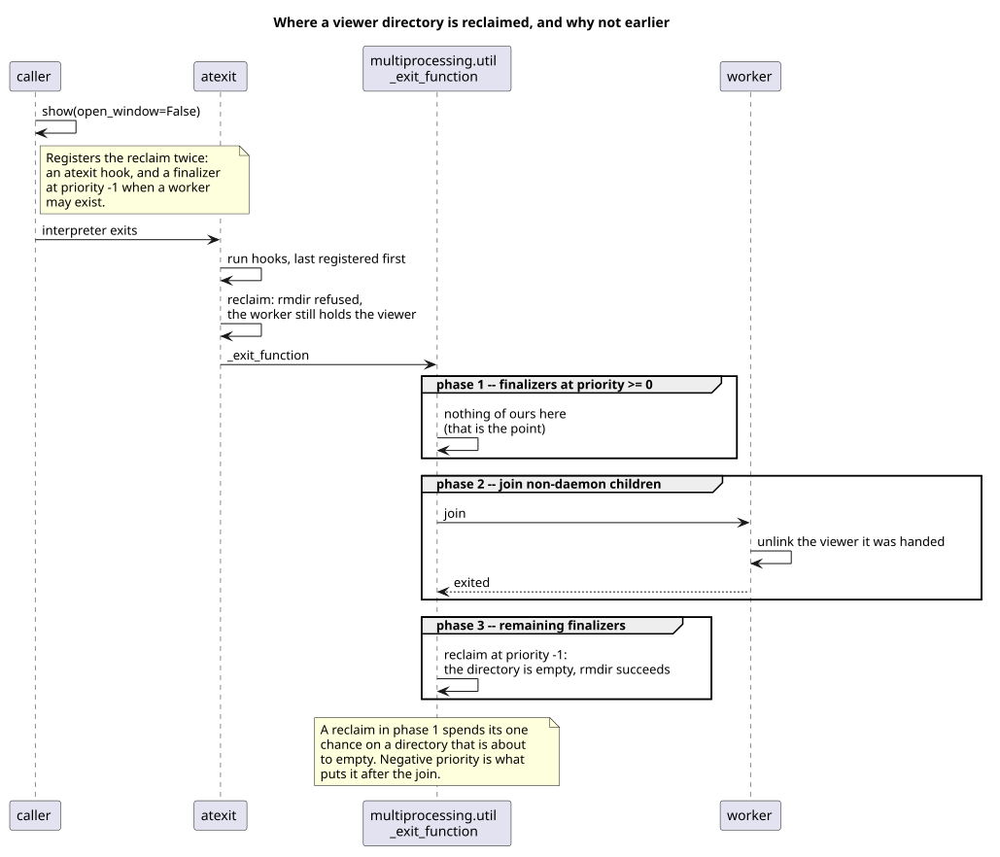

.. _sec-explanations-visualization:

Diagram viewer explanation
==========================

``StateMachine.diagram()`` answers a different question from ``pyfcstm plantuml``.
PlantUML gives text you can put under version control; the diagram viewer gives one
file you can open on a machine with no network, no PlantUML, and no pyfcstm — and
which shows the model's own source beside the picture, when the model kept one.

This page explains why that shape, and the consequences a caller has to plan around:
what a snapshot is detached from, why the document is one large file, why ``--open``
blocks, why the privacy boundary is a directory rather than a file, and when the
temporary directory is reclaimed. It is not the option catalogue — use
:doc:`/reference/visualization_options/index` for exact fields and
:doc:`/reference/cli/index` for exact command forms — and not a task recipe; use
:doc:`/how_to/visualization/index` for those.

Two artefacts from one snapshot
-------------------------------

:meth:`pyfcstm.model.model.StateMachine.diagram` returns a
:class:`pyfcstm.diagram.api.Diagram`, and everything else derives from it:

.. list-table:: What the snapshot produces
   :header-rows: 1
   :widths: 22 30 48

   * - Surface
     - Output
     - What it is for
   * - ``to_dict`` / ``to_json``
     - Portable description
     - Feeding another renderer, a diff, or a test. Carries no local paths and no
       editor selection state, so two machines produce the same bytes.
   * - ``to_html`` / ``save`` / ``show``
     - One self-contained document
     - Reading offline. Carries the renderer, layout engine, rasteriser, fonts and
       the model's source, so it needs nothing installed.
   * - ``with_options`` / ``with_view_state``
     - Another snapshot
     - Asking a different question of the same captured model.

Why the snapshot is detached from the model
-------------------------------------------

The snapshot is taken once, at ``diagram()``, and copied out of the model. Editing
the model afterwards cannot change what an already-saved view shows, and attribute
assignment on a :class:`pyfcstm.diagram.api.Diagram` is refused rather than silently
accepted.

The alternative — a live view holding a reference to the model — fails in a way that
is hard to notice. Consider a script that captures a view, mutates the model to
explore a variant, then writes both:

.. code-block:: text

   view = machine.diagram()          # intended: the model as it is now
   machine.add_state(...)            # exploring a variant
   view.save("before.html")          # a live view would render the variant here

With a live view, ``before.html`` would show the *variant*, and nothing in the run
would say so. The immutability is not a purity preference; it is what makes the name
``before.html`` true.

``with_options`` and ``with_view_state`` return new snapshots for the same reason: a
caller who keeps a reference to compare two option sets has two objects, not one
object with a history.

Why one self-contained document
-------------------------------

The viewer is roughly 29 MB -- 29,397,900 bytes for ``state Root;`` loaded from text,
measured here; the exact number moves with the model and with the packaged assets -- and
that is a deliberate trade:

.. list-table:: What the size buys, and what it costs
   :header-rows: 1
   :widths: 34 66

   * - Property
     - Consequence
   * - No network request, ever
     - The document opens on an air-gapped machine, from a mail attachment, or from
       an archive years later. Nothing can rot out from under it.
   * - Renderer, layout engine, rasteriser and CJK fonts embedded
     - The picture is identical wherever it is opened, including the fonts, which is
       what makes a CJK model readable off the original machine.
   * - The model's source travels with it, when the model kept one
     - The source-to-diagram comparison works offline. It also means the document is
       as sensitive as the model. A model that never had source text is the boundary
       below.
   * - One file per document, not per call
     - A kept viewer is named from the document, so asking twice for the same
       diagram returns the same file. Three runs of one script leave one 29 MB file
       rather than three.

That last row is the reason the name is derived from the document rather than being
random. It is also where a caller has to be careful, which
`What sharing a name costs`_ covers.

Where the source half does not apply
------------------------------------

The comparison needs a model that kept both its source *and* the ranges that say where
each state was declared, which in practice means one loaded through
:func:`pyfcstm.model.load.load_state_machine_from_text` or its file counterpart. A
:class:`pyfcstm.model.model.StateMachine` assembled in Python has neither, so the viewer
renders the diagram and says why the other half is missing rather than showing an empty
pane:

.. code-block:: text

   sourceAvailable: False
   sourceUnavailableReason: This model did not retain its original FCSTM source;
     load it through load_state_machine_from_file/text, or pass source_text explicitly.

Passing ``source_text`` without ranges does not get you half of it. The ranges come
from parsing, so text alone leaves nothing to link a state to, and the viewer treats that
as unavailable rather than showing a pane where clicking a state does nothing:

.. code-block:: text

   sourceAvailable: False
   sourceUnavailableReason: This model carries source text but no source ranges, so the
     diagram cannot be linked to it. Ranges come from parsing; a model built
     programmatically has none.

Why the viewer refuses the network
----------------------------------

Because the document carries the model's source, a viewer that could talk to the
network would be a way for a diagram to send a model somewhere. The policy is
therefore not "no external assets" but "no requests at all": ``default-src 'none'``,
``connect-src 'none'``, script hashes rather than a nonce-only allowance,
``base-uri`` and ``form-action`` set to ``'none'``, and no ``eval`` or
``new Function``. ``wasm-unsafe-eval`` is the single exception, and it is what the
embedded rasteriser needs to run at all.

The claim is checked rather than asserted: ``make diagram_csp_check`` verifies
sixteen properties of the emitted document, including that the fonts are embedded,
that the page reaches the network zero times, and that neither ``eval`` nor
``new Function`` appears.

Why ``--open`` blocks
---------------------

``show()`` with a window behaves like ``matplotlib.pyplot.show()``: it returns when
the window closes. That is not a limitation to work around — it is what makes the
temporary file's lifetime ownable.

.. list-table:: Who removes the document
   :header-rows: 1
   :widths: 30 34 36

   * - Call
     - Path
     - Removal
   * - ``show()``
     - A fresh temporary path, one per call
     - This call, when the window closes
   * - ``show(output=...)``
     - The path you named
     - Nobody; it is yours
   * - ``show(open_window=False)``
     - A path derived from the document
     - Nobody; see the next section

A non-blocking ``--open`` would leave nobody able to answer the third column for the
first row. The document would have to survive the process, because the browser reads
it after the call returns — and at roughly 29 MB each, "survive the process" means
"accumulate".

The window also gets a private browser profile, for a reason worth stating: a
Chromium-family browser hands the document to an already-running instance and exits at
once rather than staying to own the window. Blocking on that process would therefore
return immediately, and the document would be removed while the window was still
open. A profile of its own is what makes the process the caller waits on the
process that owns the window.

Why the privacy boundary is a directory
---------------------------------------

A viewer written 0600 is not private enough, and the reason is that ``stat`` needs no
permission on the file it is asked about:

.. list-table:: What another local user can learn, and from where
   :header-rows: 1
   :widths: 40 30 30

   * - Fact
     - Needs
     - Hidden by 0600?
   * - The document's contents
     - Read on the file
     - Yes
   * - The document's name
     - Read on the *directory*
     - No
   * - The document's exact size
     - ``stat`` on the file
     - No
   * - That the directory exists
     - ``x`` on the parent
     - Not even by 0700

The two middle rows are not the same kind of leak, and it is worth being precise
because the design rests on it.

A name derived from the document is a *strong* fingerprint: render candidate models
offline, hash each one, and the name matches exactly or not at all.

The size is a *coarse* side channel, and it collides readily. Four one-state models
whose source text is the same length produce documents of identical length -- and, as
the digests below show, of different content, which is why their names differ while
their sizes do not:

.. code-block:: text

   29397900  sha 5ab7ea2b6fb891d8  state Root;
   29397900  sha 5c0d65bb553a9654  state Boot;
   29397900  sha 32873dcdfc7523e9  state Test;
   29397900  sha 73773c2d5eb47a00  state AAAA;

The embedded assets dominate the length, so a size match narrows the field rather than
naming a model. It is still information a caller did not choose to publish.

Renaming the file would close the first leak and leave the second. Neither is closed by
*any* mode on the file, because ``stat`` does not need one — so the boundary has to be
the directory, which closes both. Viewers go in a per-user directory whose mode is
0700, verified before each use rather than remembered as verified: a directory, not a
symlink, owned by this user, closed to everyone else. When the predictable name cannot
be trusted, the process makes a private one of its own and says so in a warning.

What is left visible is that such a directory exists, when it last changed, and — on a
filesystem whose directory size grows with its entries — roughly how many things are
in it. None of that identifies a model, which is what the fingerprint did.

What sharing a name costs
-------------------------

Reuse follows the *directory*, not the process. Two consequences a caller has to plan
around:

.. code-block:: text

   # Two unrelated processes, same trusted directory, same model:
   process 1: .../pyfcstm-viewers-1000/kept-5ab7ea2b6fb891d8.html
   process 2: .../pyfcstm-viewers-1000/kept-5ab7ea2b6fb891d8.html
   process 2 removes what it was handed
   process 1's path: no such file

A forked child inherits the resolved directory, so it is handed the same path its
parent was. That is the same rule, not a special case — and it is why "each process
keeps its own" would be the wrong way to describe the fallback: the unit is the
directory.

So a kept viewer is shared for removal too. Pass an explicit output path when you
need a document only you may remove.

When the temporary directory is reclaimed
-----------------------------------------

This section is about the directory a process makes for itself, which happens only
when the predictable per-user name cannot be trusted. The trusted directory is *not*
reclaimed and is not meant to be: it is the one whose name carries reuse, so a viewer
left in it is found again by the next process, and an empty one costs nothing and is
used again. What follows applies to the other kind.

A caller who keeps a viewer in such a directory and later removes it leaves it empty,
and nothing in the call that made it is still running to notice. So the reclaim happens
at exit — and *where* at exit is the whole difference between working and not:

         last one, after the children are joined.

The claim the diagram makes is that priority is not a detail. ``_exit_function`` runs
finalizers at priority zero and above, *then* terminates daemon children and joins
every child still active, *then* runs what is left. A worker still holding the viewer it was handed has not removed it during
the first of those, so a reclaim there finds the directory occupied and spends its one
chance. Negative priority puts it in the third phase, after the join. Measured on
CPython 3.7 through 3.14, on ``fork``, ``spawn`` and ``forkserver``: at priority zero
the worker has not finished; in the last phase it has.

Two registrations can therefore run in one exit, and which goes first is the order the
caller happened to show and start in:

.. list-table:: The two orders a caller produces
   :header-rows: 1
   :widths: 30 70

   * - Order
     - What happens
   * - start, then show
     - ``multiprocessing.util`` is already imported, so both the ``atexit`` hook and
       the finalizer exist. ``atexit`` runs the later registration first, so the hook
       meets a directory the worker still holds; the finalizer, after the join, finds
       it empty.
   * - show, then start
     - Importing ``multiprocessing`` does not import its ``util``, so no finalizer is
       registered at all. ``util``'s own hook is then the later registration, runs
       first, and joins the worker before this package's hook looks at the directory.

Whichever succeeds leaves the other looking at a directory that has gone, which is why
``ENOENT`` is graded as the outcome asked for rather than as a failure.

What no exit hook reaches is a process that leaves without running any: ``os._exit`` by
hand, or a signal. Such a process leaves one empty directory behind, and only where the
predictable name could not be trusted in the first place. Nothing here can reclaim it,
because the bookkeeping is per process — another process's leftovers are invisible, and
sweeping the temporary directory by name would race a process sitting between creating
its own and writing into it.

Where the platform limits the promise
-------------------------------------

The directory check means what it says on POSIX, where both the mode and the owner can
be asked about. On Windows it still asks whether the path exists and whether ``os.lstat``
reports a directory rather than a link or a file -- what it cannot ask is who owns it and
who else may look: an owner exists there and is readable through the platform's security
API, but the portable ``os.lstat`` and ``os.geteuid`` this package uses do not report it.

``os.mkdir`` does apply a restrictive ACL for a mode of 0o700 on Windows, from the
releases that carried CVE-2024-4030 -- 3.8.20, 3.9.20, 3.10.15, 3.11.10, 3.12.4 and 3.13
-- and ignores the mode entirely before them. Every one of those except 3.12.4 and 3.13
arrived after python.org had stopped shipping Windows installers for its line, so the
practical rule is shorter than the version list: with an installer from python.org, the
ACL is there on 3.12.4 or later and on 3.13, and on no other supported line. A
self-built or redistributed interpreter of 3.8.20, 3.9.20, 3.10.15 or 3.11.10 has it. Privacy there rests on ``%TEMP%`` being per
account, which is the default; a ``TEMP`` pointing at a directory other users share is
not detectable from inside the process, and in that case neither the directory nor the
0600 on the files inside it keeps anything private, because that mode is only Windows'
read-only bit.

The advice that follows is the same one the sharing section reaches: pass an explicit
output path for a document that must not be somewhere shared, or that only you may
remove.

Next steps
----------

Use :doc:`/how_to/visualization/index` for the tasks, and
:doc:`/reference/visualization_options/index` for the exact option fields, environment
variables, and behaviour boundaries this page reasons about.
