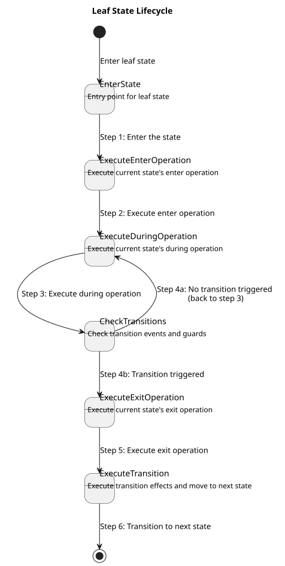
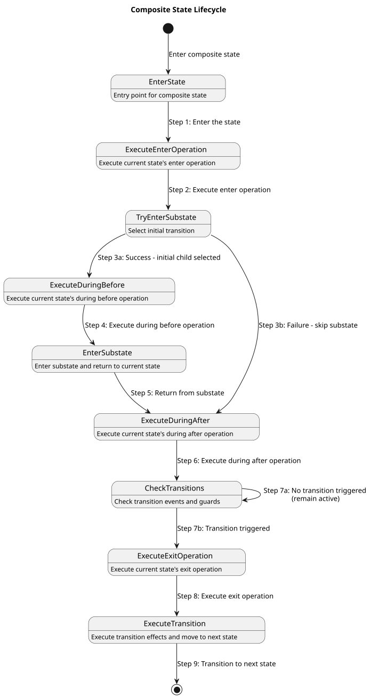

.. _sec-how-to-dsl:

DSL task guide
==============

.. contents:: Task map
   :local:
   :depth: 2

How to use this page
--------------------

This page is not a syntax catalog. It is a set of recipes for authoring or
repairing common FCSTM DSL shapes. Each recipe states when to use the feature,
what to write, how to verify it, what diagnostics to expect, and where to read
more.

A command that mentions a checked example is intended to run from the repository
root.

.. _dsl-small-valid-model-task:

Write a small valid model
-------------------------

Use this when you need a minimal sanity check before adding advanced features.
Start with one root composite, one initial transition, and leaf states owned by
that composite.

.. literalinclude:: ../../tutorials/dsl/first_thermostat.fcstm
   :language: fcstm
   :caption: First runnable model; expected diagnostics: none.

Verify it:

.. code-block:: bash

   pyfcstm inspect -i docs/source/tutorials/dsl/first_thermostat.fcstm --format human --color never

Expected summary:

.. code-block:: text

   status: ok
   root: Thermostat
   diagnostics: 0 errors / 0 warnings / 0 infos

Common mistake: putting a transition before both endpoint states exist. Keep the
state declarations and transitions inside the same owning composite unless the
transition intentionally enters or exits that composite boundary.

.. _dsl-state-target-task:

Organize states and resolve targets
-----------------------------------

Use this when a transition says it cannot find a state, or when you are unsure
where a transition should be declared.

Recommended complete pattern:

.. code-block:: fcstm

   state Parent {
       [*] -> ChildA;
       state ChildA;
       state ChildB;
       ChildA -> ChildB;
   }

``ChildA -> ChildB`` belongs inside ``Parent`` because ``Parent`` owns both
names. From outside ``Parent``, target ``Parent`` itself and let ``Parent`` use
its initial transition.

Common mistake: targeting a child owned by another composite from the outside.

.. code-block:: fcstm

   state Root {
       [*] -> Outside;
       state Outside;
       state Parent {
           [*] -> ChildA;
           state ChildA;
           state ChildB;
       }
       Outside -> ChildB;  // invalid: ChildB is not owned by Root
   }

The fix is either ``Outside -> Parent;`` or moving the child-targeting
transition inside ``Parent``. Read :ref:`dsl-state-forms` and
:ref:`dsl-ownership-name-resolution` for the exact rule.

If you save that bad model as ``/tmp/nested_target_invalid.fcstm``, verify the
failure with:

.. code-block:: bash

   pyfcstm inspect -i /tmp/nested_target_invalid.fcstm --format human --color never

Expected excerpt:

.. code-block:: text

   Invalid state machine model ... Unknown to state 'ChildB' of transition:
   Outside -> ChildB; (line 9)

Verify a checked hierarchy example:

.. code-block:: bash

   pyfcstm inspect -i docs/source/tutorials/dsl/hierarchy_execution.fcstm --format human --color never

Expected excerpt:

.. code-block:: text

   root: HierarchyDemo
   diagnostics: 0 errors / 1 warnings / 1 infos

Pseudo states are route-only leaf helpers, not business states with lifecycle
behavior. The legacy pseudo-state example is kept as a checked resource:

.. literalinclude:: ../../tutorials/dsl/pseudo_state_demo.fcstm
   :language: fcstm
   :caption: Pseudo-state routing example; expected diagnostics: one ``W_UNREFERENCED_VAR`` and three ``I_TRANSITION_NEVER_EVENT_TRIGGERED`` notes.

.. _dsl-event-scopes-task:

Write event scopes
------------------

Use events for discrete external triggers. Choose the spelling by ownership:

.. list-table:: Event-scope recipe
   :header-rows: 1
   :widths: 24 34 42

   * - Need
     - Write
     - Meaning
   * - Private event of the source state
     - ``Idle -> Heating :: Heat;``
     - Event is local to ``Idle``.
   * - Event owned by containing or named state
     - ``Idle -> Running : Start;``
     - Event resolves through the containing ownership chain.
   * - Root-owned event
     - ``Worker -> Active : /Start;``
     - Event path starts below the root state.

Checked examples:

.. literalinclude:: ../../tutorials/dsl/event_scoping_complete.fcstm
   :language: fcstm
   :caption: Complete event scopes; expected diagnostics: ``W_UNREFERENCED_VAR`` for the demonstration counter.

.. figure:: ../../tutorials/dsl/event_scoping_complete.fcstm.puml.svg
   :alt: Event scope state diagram
   :align: center

   Read this diagram by asking who owns each signal. Edges written with ``::``
   use source-local events, edges written with ``: Name`` use a containing or
   named owner, and edges written with ``: /Name`` use the root event
   namespace. Inspect ``events[].qualified_name`` and ``events[].scope`` to
   confirm the same ownership that the diagram labels suggest.

Verify and inspect event ownership:

.. code-block:: bash

   pyfcstm inspect -i docs/source/tutorials/dsl/event_scoping_complete.fcstm --format json

In JSON, check ``events[].qualified_name`` and ``events[].scope``. For readability, prefer
``: /Start`` because it separates the event-scope ``:`` token from the absolute
root path. The compact spelling ``:/Start`` is accepted by the current parser and
serializes to the same absolute event, but the spaced form is easier to teach,
search, and review.

Common mistake: do not move between ``::`` and ``:`` only for aesthetics. The
spelling changes who owns the event, which can change import mapping,
simulation input names, and inspect ``events[].scope`` output.

.. _dsl-guards-effects-task:

Write guards, effects, and operation blocks
-------------------------------------------

Use guards to decide whether a transition is enabled. Use effects for updates
that happen after the source exits and before the target enters.

A complete operation-block example is checked in:

.. literalinclude:: ../../tutorials/dsl/operation_blocks_complete.fcstm
   :language: fcstm
   :caption: Assignments, block-local temporary, ``if`` / ``else if`` / ``else``, empty statement, and ternary assignment; expected diagnostics: none.

Key points demonstrated by the file:

* ``delta`` and ``next_sample`` are block-local temporaries. They can be read
  only after assignment inside the same block.
* ``if [condition] { ... } else if [condition] { ... } else { ... }`` is legal
  inside operation blocks.
* A standalone ``;`` is an accepted empty statement.
* Guard conditions and assignment expressions are different languages: guards
  use condition expressions; assignments use numeric expressions.

Verify it:

.. code-block:: bash

   pyfcstm inspect -i docs/source/tutorials/dsl/operation_blocks_complete.fcstm --format human --color never

Expected diagnostic count is zero. Common mistake: if you see ``E_UNDEFINED_VAR`` with
``refs.is_temporary=true``, the usual fix is to assign the temporary before its
first read in the same block.

.. _dsl-expression-safety-task:

Use expressions safely
----------------------

Use this when an expression parses in one place but not another. FCSTM has three
expression contexts:

.. list-table:: Expression contexts
   :header-rows: 1
   :widths: 22 38 40

   * - Context
     - Accepts
     - Does not accept
   * - ``init_expression``
     - literals, ``pi`` / ``E`` / ``tau``, arithmetic, bitwise operators, unary math functions
     - runtime variable reads, ternary expressions
   * - ``num_expression``
     - runtime variables, arithmetic, bitwise, math functions, numeric ternary
     - condition-only operators outside a parenthesized ternary condition
   * - ``cond_expression``
     - comparisons, ``&&`` / ``and``, ``||`` / ``or``, ``!`` / ``not``, ``=>`` / ``implies``, ``xor``, ``iff``, condition ternary
     - numeric assignment statements

Checked expression examples:

.. literalinclude:: ../../tutorials/dsl/expression_condition_ternary.fcstm
   :language: fcstm
   :caption: Runtime expressions, condition operators, implication, xor/iff, and ternary forms; expected diagnostics: none.

A smaller fragment showing the most common spelling traps:

.. code-block:: fcstm

   // Good: boolean xor is the word "xor".
   A -> B : if [(left > 0) xor (right > 0)];

   // Good: implication is "=>" or "implies" in a condition.
   A -> B : if [request > 0 => ready > 0];

   // Good: numeric bitwise xor remains "^".
   flags = flags ^ 0x01;

Do not use ``->`` for implication; it is transition syntax. Do not use ``^`` as
boolean xor. See :ref:`dsl-expression-reference` and
:ref:`dsl-expression-separation` for precedence and design rationale.

Verify the checked expression example:

.. code-block:: bash

   pyfcstm inspect -i docs/source/tutorials/dsl/expression_condition_ternary.fcstm --format human --color never

Expected excerpt:

.. code-block:: text

   root: ExpressionConditionTernary
   diagnostics: 0 errors / 0 warnings / 0 infos

.. _dsl-lifecycle-task:

Write lifecycle hooks, refs, and abstract hooks
-----------------------------------------------

Use concrete lifecycle actions when the model itself owns the behavior. Use
``abstract`` when generated code should call a user-provided hook. Use ``ref``
when multiple states should reuse a named lifecycle action.

Fragment pattern (not a complete checked file; the checked complete file follows):

.. code-block:: fcstm

   state Device {
       enter SharedInit {
           ready = 1;
       }

       state Idle {
           enter ref /SharedInit;
           during abstract PollHardware;
       }
   }

``ref`` points to a named lifecycle action, not to a state and not to an event.
Common mistake: ``enter ref /Idle`` tries to reference a state path, not a named
lifecycle action; name the action first, then reference that action path.
The checked example below shows concrete, abstract, doc-comment abstract, and
reference forms:

.. literalinclude:: ../../tutorials/dsl/abstract_reference_demo.fcstm
   :language: fcstm
   :caption: Abstract and reference actions; expected diagnostics: two ``I_UNREFERENCED_VAR_MAYBE_ABSTRACT`` entries and one ``I_TRANSITION_NEVER_EVENT_TRIGGERED`` note.

Review the diagrams when you need lifecycle ordering:

   A leaf state can run ``enter`` when it becomes active, ``during`` while it
   stays active, and ``exit`` before it is left. This is authored behavior, not
   generated relay machinery.

   A composite state is a boundary around child selection. Its ordinary
   ``during before`` / ``during after`` actions are boundary actions; they are
   not the same as ancestor ``>> during`` aspects and they do not observe every
   combo relay hop.

.. figure:: ../../tutorials/dsl/abstract_reference_demo.fcstm.puml.svg
   :alt: Abstract and reference action diagram
   :align: center

   This diagram is useful for checking that action paths and state paths are
   different concepts. ``ref`` reuses a named lifecycle action; it does not call
   a state or an event. Inspect the generated action list and references when a
   ``ref`` path looks surprising.

Verify the checked lifecycle example:

.. code-block:: bash

   pyfcstm inspect -i docs/source/tutorials/dsl/abstract_reference_demo.fcstm --format human --color never

Expected excerpt:

.. code-block:: text

   root: AbstractReferenceDemo
   diagnostics: 0 errors / 0 warnings / 3 infos

.. _dsl-aspect-task:

Use during aspects
------------------

Use ``>> during before`` and ``>> during after`` on an ancestor when monitoring
or logging should wrap descendant leaf-state active cycles. Do not confuse them
with plain ``during before`` / ``during after`` actions on a composite.

.. literalinclude:: ../../tutorials/dsl/hierarchy_execution.fcstm
   :language: fcstm
   :caption: Aspect and hierarchy execution example; expected diagnostics: ``W_UNREFERENCED_VAR`` and ``I_TRANSITION_NEVER_EVENT_TRIGGERED`` for demonstration-only model parts.

.. figure:: ../../tutorials/dsl/hierarchy_execution.fcstm.puml.svg
   :alt: Hierarchy execution state diagram
   :align: center

   The figure separates authored hierarchy from runtime ordering. Parent and
   child states are authored DSL nodes; aspect actions are not drawn as business
   states. Use inspect lifecycle/action fields together with the diagram to
   confirm whether behavior is attached to a boundary or to descendant leaf
   cycles.

Interpretation:

* ancestor ``>> during before`` runs before the active leaf ``during``;
* ancestor ``>> during after`` runs after the active leaf ``during``;
* plain composite ``during before`` / ``during after`` is part of composite
  entry/exit semantics and does not wrap child-to-child transitions;
* aspect actions do not run inside combo pseudo relay states.

Common mistake: do not use an aspect to observe combo relay hops. Combo relay
pseudo states are generated routing machinery, so business logging belongs on
authored states or transition effects.

See :ref:`dsl-during-aspect-semantics` for the detailed boundary.

Verify the checked aspect example:

.. code-block:: bash

   pyfcstm inspect -i docs/source/tutorials/dsl/hierarchy_execution.fcstm --format human --color never

Expected excerpt:

.. code-block:: text

   root: HierarchyDemo
   diagnostics: 0 errors / 1 warnings / 1 infos

.. _dsl-forced-transition-task:

Write forced transitions
------------------------

Use forced transitions when one declaration should expand over many source
states. Forced transitions are expansion shorthand, not a way to hide shared side
effects.

.. literalinclude:: ../../tutorials/dsl/forced_transitions.fcstm
   :language: fcstm
   :caption: Forced transition example; expected diagnostics: two ``W_UNREFERENCED_VAR`` warnings for demonstration-only variables.

.. figure:: ../../tutorials/dsl/forced_transitions.fcstm.puml.svg
   :alt: Forced transition expansion diagram
   :align: center

   The authored DSL has only two forced declarations, but the inspected model
   contains multiple ordinary expanded transitions carrying ``forced_origin``.
   ``!*`` expands over applicable sources in the owner scope, while
   ``!Running`` contributes exits from the ``Running`` boundary and related
   child paths. The expansion still follows ordinary exit and target-entry
   semantics.

Rules:

* ``!State -> Target :: Event;`` expands from the named source and its reachable
  nested sources.
* ``!* -> Target :: Event;`` expands from all applicable sources in the owner
  scope.
* A forced transition may have one local, chain/root, or guard trigger.
* It cannot have a combo ``+`` chain and cannot have an ``effect`` block.

If you need shared side effects, put them in the target state's ``enter`` block
or write explicit normal transitions with visible ``effect`` blocks. See
:ref:`dsl-forced-transition-expansion` for why the DSL keeps this restriction.

Common mistake: ``!* -> Target :: Event effect { ... };`` is invalid. Forced
transitions expand to many ordinary transitions, so cloning side effects would
hide behavior; write explicit normal transitions when effects are required.

Verify the expansion size:

.. code-block:: bash

   pyfcstm inspect -i docs/source/tutorials/dsl/forced_transitions.fcstm --format human --color never

Expected excerpt:

.. code-block:: text

   root: System
   transitions: 17
   diagnostics: 0 errors / 2 warnings / 0 infos

.. _dsl-combo-transition-task:

Write combo transitions
-----------------------

Use combo triggers when one transition should require an ordered chain of event
terms and guard terms in the same cycle. Combo transitions expand into pseudo
relay states during model construction; simulation, inspect, generation, and
PlantUML consume the expanded model.

.. literalinclude:: ../../tutorials/dsl/combo_transitions.fcstm
   :language: fcstm
   :caption: Normal combo, entry combo, guard alias, root event term, effects, and generated pseudo relay states; expected diagnostics: none.

.. figure:: ../../tutorials/dsl/combo_transitions.fcstm.puml.svg
   :alt: Combo transition expansion diagram
   :align: center

   Nodes whose names start with ``__combo_`` are generated pseudo relay states,
   not authored business states. For
   ``Waiting -> Accepted :: Request + [ready > 0] + Confirm``, the diagram
   shows one event edge, one guard edge, and one final event edge into
   ``Accepted``. The original ``effect`` belongs only to the final hop.

Verify the expansion:

.. code-block:: bash

   pyfcstm inspect -i docs/source/tutorials/dsl/combo_transitions.fcstm --format json

Useful JSON fields:

* ``combo_origins`` keeps the author-written trigger and each term.
* ``combo_transitions`` lists generated edges that carry provenance back to the
  original combo.
* ``states`` includes generated pseudo states with ``is_pseudo=true`` and names
  beginning with ``__combo_``.

Conceptual expansion:

.. code-block:: fcstm

   // Authored form.
   Waiting -> Accepted :: Request + [ready > 0] + Confirm effect {
       accepted = accepted + 1;
   }

   // Conceptual expansion. Real relay names include a hash and must not be hand-written.
   Waiting -> __combo_waiting_request :: Request;
   __combo_waiting_request -> __combo_waiting_ready : if [ready > 0];
   __combo_waiting_ready -> Accepted :: Confirm effect {
       accepted = accepted + 1;
   }

.. list-table:: How to read combo expansion
   :header-rows: 1
   :widths: 24 36 40

   * - Trigger term
     - Expanded edge
     - What to inspect
   * - ``Request``
     - Business state to first pseudo relay event edge.
     - The corresponding ``combo_transitions`` item has empty ``effect``.
   * - ``[ready > 0]``
     - Guard edge between pseudo relays.
     - If the guard is false, the chain does not reach the target state.
   * - ``Confirm``
     - Final hop into the business target.
     - The original ``effect`` appears only on this hop.
   * - ``__combo_`` state
     - Generated pure routing node.
     - It is pseudo, action-free, and not an aspect execution point.

Repair examples:

.. code-block:: fcstm

   // Bad ordinary syntax: event suffix plus separate guard suffix.
   A -> B :: Go if [ready > 0];

   // Good combo syntax: event term plus bracketed guard term.
   A -> B :: Go + [ready > 0];

Repeated event terms are legal but suspicious. The checked warning example is:

.. literalinclude:: ../../tutorials/dsl/combo_duplicate_event.fcstm
   :language: fcstm
   :caption: Intentional duplicate-event combo example; expected diagnostics: ``W_COMBO_DUPLICATE_EVENT`` and ``I_TRANSITION_NEVER_EVENT_TRIGGERED``.

.. _dsl-history-task:

Resume a composite state with history
-------------------------------------

Use history when leaving a composite state and coming back should continue
where it stopped instead of starting over. The starting point is the washer
model below: ``Program`` can be paused and later entered fresh, through its
shallow history, or through its deep history.

If you have not used history before, the guided path in
:doc:`/tutorials/history/index` builds the same ideas step by step on a charger
model.

.. literalinclude:: ../../tutorials/dsl/history_washer.fcstm
   :language: fcstm
   :caption: Shallow and deep history on ``Program``; expected diagnostics: four ``W_UNREFERENCED_VAR`` warnings for the entry counters.

1. **Declare the history inside the composite state** (the *owner*).
   ``[H] -> Idle;`` declares shallow history and ``[H*] -> Wash.Fill;`` deep
   history. The right-hand side is only where history goes while the owner has
   no record yet: a shallow default is a direct child, a deep default is any
   descendant path written relative to the owner.
2. **Enter the history from the owner's parent scope.** Write the owner as the
   target and append the marker: ``Paused -> Program.[H] :: Shallow;``. Every
   ordinary transition form accepts a history target: event and guard triggers,
   combo triggers, ``effect`` blocks, forced ``!State`` and ``!*`` transitions,
   a parent's initial ``[*] -> Program.[H*];`` and an external self transition
   ``!Program -> Program.[H*] :: Reenter;``.
3. **Run the model.** The demo pauses in ``Agitate`` and resumes once through
   each history:

   .. literalinclude:: ../../tutorials/dsl/history_washer.demo.sh
      :language: bash
      :caption: ``history_washer.demo.sh``

   Output, generated from the script:

   .. literalinclude:: ../../tutorials/dsl/history_washer.demo.sh.txt
      :language: text

   Deep history resumes ``Wash.Agitate`` exactly: ``fill_entries`` stays 1 and
   ``wash_initials`` stays 1 because the initials on the restored path do not
   run. Shallow history only remembers the direct child ``Wash``, so it enters
   ``Wash`` and runs its ordinary initial again (``wash_initials`` becomes 2).
   The two ``__hist_*`` variables are the lowered history; see step 5.
4. **Check the model.** Inspect judges the model as written, so history adds
   no finding of its own:

   .. code-block:: bash

      pyfcstm inspect -i docs/source/tutorials/dsl/history_washer.fcstm --format human --color never

   Expected excerpt (truncated):

   .. code-block:: text

      states: 7 total / 4 leaf
      transitions: 13
      variables: 4
        program_entries: control; external supply: none
        ...
      diagnostics: 0 errors / 4 warnings / 0 infos

   The four warnings are the ``W_UNREFERENCED_VAR`` warnings of the counters.
   The report describes the model before lowering: it lists the four counters
   but no ``__hist_*`` variable, and ``transitions: 13`` counts only the
   transitions written in the file (with the forced ``!Program`` exits
   expanded), not the lowered routes.
5. **Hot start with a record.** History is lowered into ordinary ``int``
   variables that the simulator, generated code and BMC see: ``__hist_goto`` (the restore in
   progress, always ``0`` at a stable point) and one ``__hist_<owner>`` record
   per owner. A hot start must supply them like any persistent variable. Use
   :meth:`pyfcstm.model.model.StateMachine.history_variables` to compute them
   from a source-level record instead of writing ids by hand:

   .. code-block:: python

      from pyfcstm.model import load_state_machine_from_text
      from pyfcstm.simulate import SimulationRuntime

      machine = load_state_machine_from_text(open("history_washer.fcstm").read())
      user = {"program_entries": 0, "fill_entries": 0, "agitate_entries": 0, "wash_initials": 0}
      runtime = SimulationRuntime(
          machine,
          initial_state="Washer.Paused",
          initial_vars={**user, **machine.history_variables({"Washer.Program": "Wash.Agitate"})},
      )
      runtime.cycle()
      runtime.cycle(["Washer.Paused.Deep"])
      print(".".join(runtime.current_state.path))   # Washer.Program.Wash.Agitate
      print(machine.history_record(runtime.vars, "Washer.Program"))   # Wash.Agitate

   ``history_record()`` decodes a record back to a leaf path; it is meaningful
   while the owner is inactive. The simulator rejects a hot start whose
   ``__hist_goto`` is not ``0`` or whose record names no stoppable leaf of its
   owner, and its message lists the valid ids with their leaf paths. The
   ``init`` command of ``pyfcstm simulate`` accepts the same variables, for
   example ``__hist_goto=0 __hist_Program=7``.

Common mistakes and repairs:

.. list-table::
   :header-rows: 1
   :widths: 30 34 36

   * - Symptom
     - Cause
     - Repair
   * - ``E_HISTORY_TARGET_UNDECLARED``: ``R.O does not declare shallow history``
     - ``X -> O.[H]`` without ``[H] -> ...;`` inside ``O``. History is never
       provided implicitly.
     - Add the declaration to ``O``, or enter ``O`` normally.
   * - ``E_HISTORY_DECLARATION_INVALID`` with ``reason: default_not_direct_child``
     - ``[H] -> W.W1;`` -- shallow history remembers a direct child only.
     - Use ``[H] -> W;`` or declare ``[H*] -> W.W1;``.
   * - ``E_HISTORY_DECLARATION_INVALID`` with ``default_not_found``, ``default_pseudo``, ``root_owner`` or ``leaf_owner``
     - The default names a missing or pseudo state, or the root or a leaf declares history.
     - Point the default at a real state below the owner; declare history in the composite that is left and re-entered.
   * - ``W_HISTORY_UNUSED``
     - A declared kind that no ``Owner.[H]`` / ``Owner.[H*]`` target uses.
     - Add the target where the model resumes, or delete the declaration.
   * - ``E_HISTORY_RESERVED_PREFIX``
     - A variable, state or temporary named like ``__hist_x`` or ``_hist_x`` in a model that uses history.
     - Rename it; target languages collapse underscores, so both collide with the lowered names.
   * - A resume event is not consumed and the machine stays put
     - The restore path is blocked, for example the remembered child's initial
       guard is false. The whole transition is rejected on purpose; it never
       falls back to an ordinary entry.
     - Make the remembered path enterable, or add a separate ordinary entry for
       that situation. See :ref:`dsl-history-semantics`.

Reproduce the first mistake: save this model as ``undeclared.fcstm``, where
``O`` declares no history,

.. code-block:: fcstm

   state R {
       state A;
       state O { state B; [*] -> B; }
       [*] -> A;
       A -> O.[H] :: Resume;
   }

and inspect it with ``--collect-errors``:

.. code-block:: bash

   pyfcstm inspect -i undeclared.fcstm --collect-errors --format human --color never

Expected excerpt:

.. code-block:: text

   [ERROR] E_HISTORY_TARGET_UNDECLARED
     R.O does not declare shallow history ([H] -> ...;), so it cannot be entered through O.[H].
     --> undeclared.fcstm:5:5

All forms, diagnostics and lowered names are listed in
:ref:`dsl-history-reference`; the execution rules and why they hold are in
:ref:`dsl-history-semantics`.

.. _dsl-import-task:

Assemble imports
----------------

Use imports when a composite state should include another FCSTM module as a
child. Imports are parsed in the DSL, then path resolution and assembly run in
the Python model/import layer.

Basic import:

.. literalinclude:: ../../tutorials/dsl/import_host_basic.fcstm
   :language: fcstm
   :caption: Basic import host; expected diagnostics: two ``W_UNREFERENCED_VAR`` warnings.

Mapping import:

.. literalinclude:: ../../tutorials/dsl/import_host_mapped.fcstm
   :language: fcstm
   :caption: Import with variable and event mappings; expected diagnostics: three ``W_UNREFERENCED_VAR`` warnings.

.. figure:: ../../tutorials/dsl/import_host_mapped.fcstm.puml.svg
   :alt: Host model after import mapping
   :align: center

   The host model attaches the imported module under an alias. The mapping
   block is not a text-replacement script; it rewrites variables and event paths
   during model assembly. Check both the diagram's state tree and inspect's
   variable, event, and transition paths when validating an import.

Imported worker:

.. literalinclude:: ../../tutorials/dsl/import_worker.fcstm
   :language: fcstm
   :caption: Imported worker module; expected diagnostics: two ``W_UNREFERENCED_VAR`` warnings.

Directory entry import:

.. literalinclude:: ../../tutorials/dsl/import_host_directory.fcstm
   :language: fcstm
   :caption: Directory-style import through an explicit ``main.fcstm`` entry file; expected diagnostics: ``W_UNUSED_EVENT``, ``W_LEAF_NO_OUTGOING_TRANSITION``, and ``W_UNREFERENCED_VAR`` for demonstration-only imported resources.

Mapping facts:

* ``var speed -> plant_speed;`` maps one imported variable to one host variable.
* ``var sensor_* -> left_$1;`` captures the wildcard suffix and inserts it into
  the target template.
* ``var * -> prefix_$0;`` is a fallback mapping; ``$0`` is the whole imported
  variable name.
* ``event /Start -> Start;`` maps an imported root event to a host event.
* Directory projects must import a concrete entry file such as
  ``./import_line/main.fcstm``; a bare directory is not a DSL file.

Common mistakes: a bare directory path is not loaded as DSL source; an out-of-range
placeholder such as ``$2`` in ``var sensor_* -> left_$2;`` reports an import
mapping validation error. Use ``$0`` for the whole imported name and ``$1`` /
``${1}`` for the first wildcard capture.
The rendered target must be a valid DSL identifier, not an empty capture,
a numeric name, or a reserved keyword such as ``input`` or ``param``.

``var`` is the canonical mapping keyword; ``def`` remains an explicit legacy spelling. Numeric types must match. Child ``input`` may bind to all four parent roles; child ``param`` only to parent ``param``; child ``control/output`` only to parent ``control/output``. A permitted binding adopts the parent role; see :ref:`dsl-import-forms` for the complete result matrix.

The parent must explicitly declare a cross-role target. Missing targets retain the child role; implicit same-role sharing requires equal defaults and shared ``input`` requires an explicit declaration. Explicit parent defaults win and multiple legitimate writers introduce no restriction. Reject illegal source read-only writes before mapping. In collect mode a failed variable binding commits neither declarations nor substates from that import; diagnostics retain source files and import locations.

With pyfcstm installed, save ``child.fcstm`` in a working directory:

.. code-block:: fcstm

   input int reading;
   output int result = 0;
   state Child { enter { result = reading; } }

Save ``host.fcstm`` beside it, binding the child input to parent control state and internalizing the child output:

.. code-block:: fcstm

   control int cached = 5;
   control int internal = 0;
   state Host {
       import "./child.fcstm" as Child {
           var reading -> cached;
           var result -> internal;
       }
       [*] -> Child;
   }

Run this Python code from that directory. It executes in memory and creates no output files:

.. code-block:: python

   from pyfcstm.model import load_state_machine_from_file
   from pyfcstm.simulate import SimulationRuntime

   model = load_state_machine_from_file("host.fcstm")
   runtime = SimulationRuntime(model)
   runtime.cycle()
   print(runtime.vars["internal"])
   print(list(model.inputs), list(model.output_variables))

Expected output confirms the value is 5, with no external inputs or system outputs in the final model:

.. code-block:: text

   5
   [] []

Changing the parent declaration to ``param int internal = 0`` makes the child ``output`` binding fail with ``E_IMPORT_DUPLICATE_MAPPING``; choose a writable parent target. A numeric type mismatch requires correcting the declarations rather than an implicit conversion. Child input bound to mutable parent state reads the latest value in execution order; reverify properties that relied on cycle-frozen child inputs against the assembled model.

Preamble forms such as ``name = value;`` and ``name := value;`` are parser-helper
entry points used by import assembly tests and helpers. They are not ordinary
root-level ``def`` declarations in a normal ``state_machine_dsl`` file. See
:ref:`dsl-import-preamble-forms` for the exact boundary.

Verify the mapped import from the repository root:

.. code-block:: bash

   pyfcstm inspect -i docs/source/tutorials/dsl/import_host_mapped.fcstm --format human --color never

Expected excerpt:

.. code-block:: text

   root: System
   variables: 3
   diagnostics: 0 errors / 3 warnings / 0 infos

Verify the directory-entry import:

.. code-block:: bash

   pyfcstm inspect -i docs/source/tutorials/dsl/import_host_directory.fcstm --format human --color never

Expected excerpt:

.. code-block:: text

   root: Factory
   diagnostics: 0 errors / 3 warnings / 0 infos

.. _dsl-diagnostics-task:

Diagnose and repair DSL errors
------------------------------

Use inspect diagnostics as a repair loop:

.. code-block:: bash

   pyfcstm inspect -i docs/source/tutorials/dsl/combo_duplicate_event.fcstm --format json

A diagnostic has a ``code``, ``severity``, human message, source span, and
``refs`` payload. Many diagnostics also carry a suggested fix.

.. list-table:: Diagnostic repair lab
   :header-rows: 1
   :widths: 22 30 48

   * - Example
     - Expected code
     - Repair direction
   * - ``combo_duplicate_event.fcstm``
     - ``W_COMBO_DUPLICATE_EVENT``
     - Check whether the second event term is a typo. Keep it only if the explicit two-hop relay is intentional.
   * - ``guard_vars_never_change.fcstm``
     - ``W_UNWRITTEN_READ_VAR`` + ``W_GUARD_VARS_NEVER_CHANGE`` + ``I_TRANSITION_NEVER_EVENT_TRIGGERED``
     - Add the missing lifecycle/effect write, or simplify the guard if an initial-value-only guard is intentional; the exit transition info is expected for this minimal warning fixture.
   * - ``during_const_assign.fcstm``
     - ``W_DURING_CONST_ASSIGN``
     - Move one-time initialization to ``enter`` or make the ``during`` expression depend on runtime state.
   * - ``numeric_target_range.fcstm``
     - ``W_NUMERIC_LITERAL_OUT_OF_TARGET_RANGE``
     - Treat it as a C/C++ deployment-profile warning for ``c`` / ``c_poll`` / ``cpp`` / ``cpp_poll``. It is not evidence that Python generated code has the same fixed-width risk.

Minimal bad syntax example kept as a text fixture because it is intentionally not parseable as ``*.fcstm``:

.. literalinclude:: ../../tutorials/dsl/event_guard_mixed_invalid.fcstm.txt
   :language: fcstm
   :caption: Intentional parser error; expected excerpt: ``Unexpected token 'if'``.

It fails because ordinary event syntax and ordinary guard syntax are two separate transition forms. Repair it as combo syntax:

.. code-block:: fcstm

   A -> B :: Go + [ready > 0];

For code-level details, read :doc:`../../reference/diagnostics_codes/index`.

Verify the intentional warning file:

.. code-block:: bash

   pyfcstm inspect -i docs/source/tutorials/dsl/combo_duplicate_event.fcstm --format human --color never

Expected excerpt:

.. code-block:: text

   W_COMBO_DUPLICATE_EVENT
   diagnostics: 0 errors / 1 warnings / 1 infos
