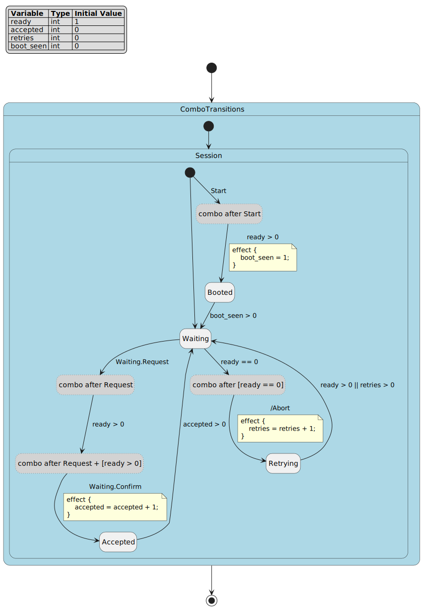
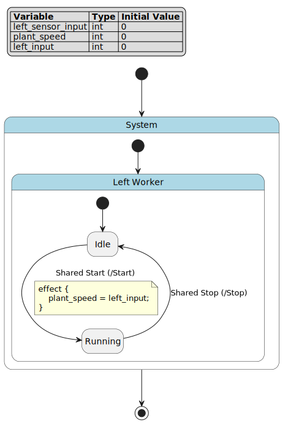

.. _sec-how-to-dsl-zh:

DSL 任务指南
============

.. contents:: 任务地图
   :local:
   :depth: 2

如何使用本页
------------

本页不是语法目录，而是 FCSTM DSL 的任务手册。每个任务配方都说明什么时候使用、推荐写法、如何验证、预期诊断、常见错误和深入阅读位置。

所有引用已检查示例的命令都默认从仓库根目录运行。

术语约定：本页首次出现必要英文术语时采用“中文（English）”格式，后文只使用中文。诊断（diagnostics）是
``pyfcstm inspect`` 给出的检查结果，目标配置（target profile）是生成目标语言或运行时配置，拥有者作用域
（owner scope）是拥有当前声明的状态作用域，端点（endpoint）是转换（transition）的来源或目标，伪中继状态
（pseudo relay state）是组合转换（combo transition）展开生成的纯路由节点。代码、命令、文件路径、JSON 字段、诊断码和 DSL
关键字保持原文。

.. _dsl-small-valid-model-task-zh:

写一个小型有效模型
------------------

当你需要在加入高级功能前做最小健全性检查（sanity check）时，从一个根复合状态（root composite）、一个初始转换（initial transition）和几个叶状态（leaf state）开始。

.. literalinclude:: ../../tutorials/dsl/first_thermostat.fcstm
   :language: fcstm
   :caption: 第一个可运行模型；预期诊断：无。

验证命令：

.. code-block:: bash

   pyfcstm inspect -i docs/source/tutorials/dsl/first_thermostat.fcstm --format human --color never

预期摘要：

.. code-block:: text

   status: ok
   root: Thermostat
   diagnostics: 0 errors / 0 warnings / 0 infos

常见错误：在端点状态声明之前，或不在同一个拥有者作用域中写转换。除非转换本来就是进入或离开复合状态边界，否则应把端点和转换放在同一个拥有复合状态内。

.. _dsl-state-target-task-zh:

组织状态并解析目标
------------------

当转换报告找不到状态，或你不确定转换应该写在哪里时，用这个规则：转换只能直接引用当前拥有者作用域能看到的端点名称。

推荐完整模式：

.. code-block:: fcstm

   state Parent {
       [*] -> ChildA;
       state ChildA;
       state ChildB;
       ChildA -> ChildB;
   }

``ChildA -> ChildB`` 写在 ``Parent`` 内，因为 ``Parent`` 拥有这两个名字。从 ``Parent`` 外部进入时，应以 ``Parent`` 为目标，再由 ``Parent`` 的初始转换选择子状态。

常见错误：从外部直接以另一个复合状态拥有的子状态为目标。

.. code-block:: fcstm

   state Root {
       [*] -> Outside;
       state Outside;
       state Parent {
           [*] -> ChildA;
           state ChildA;
           state ChildB;
       }
       Outside -> ChildB;  // 错误：ChildB 不属于 Root
   }

修复方式是写 ``Outside -> Parent;``，或把指向子状态的转换移入 ``Parent``。精确规则见 :ref:`dsl-state-forms-zh` 和 :ref:`dsl-ownership-name-resolution-zh`。

如果把上面的坏模型保存为 ``/tmp/nested_target_invalid.fcstm``，可用下面命令验证失败：

.. code-block:: bash

   pyfcstm inspect -i /tmp/nested_target_invalid.fcstm --format human --color never

预期会看到：

.. code-block:: text

   Invalid state machine model ... Unknown to state 'ChildB' of transition:
   Outside -> ChildB; (line 9)

验证一个已检查层级示例：

.. code-block:: bash

   pyfcstm inspect -i docs/source/tutorials/dsl/hierarchy_execution.fcstm --format human --color never

预期摘录：

.. code-block:: text

   root: HierarchyDemo
   diagnostics: 0 errors / 1 warnings / 1 infos

伪状态只负责路由，是叶状态辅助节点，不应承载业务生命周期行为。这个遗留伪状态示例作为已检查资源保留：

.. literalinclude:: ../../tutorials/dsl/pseudo_state_demo.fcstm
   :language: fcstm
   :caption: 伪状态路由示例；预期诊断：一个 ``W_UNREFERENCED_VAR`` 和三个 ``I_TRANSITION_NEVER_EVENT_TRIGGERED``\ 。

.. _dsl-event-scopes-task-zh:

编写事件作用域
--------------

离散外部触发建议用事件。根据所有权选择拼写：

.. list-table:: 事件作用域写法
   :header-rows: 1
   :widths: 24 34 42

   * - 需求
     - 写法
     - 含义
   * - 来源状态私有事件
     - ``Idle -> Heating :: Heat;``
     - 事件归 ``Idle`` 本地拥有。
   * - 包含状态或命名状态拥有的事件
     - ``Idle -> Running : Start;``
     - 事件沿所有权链解析。
   * - 根状态拥有的事件
     - ``Worker -> Active : /Start;``
     - 事件路径从根状态下方开始。

已检查示例：

.. literalinclude:: ../../tutorials/dsl/event_scoping_complete.fcstm
   :language: fcstm
   :caption: 完整事件作用域示例；预期诊断：演示用 ``counter`` 触发 ``W_UNREFERENCED_VAR``\ 。

.. figure:: ../../tutorials/dsl/event_scoping_complete.fcstm.puml.svg
   :alt: 事件作用域状态图
   :align: center

   阅读这张图时，先问每个信号由谁拥有。使用 ``::`` 的边消费来源状态本地事件；使用
   ``: Name`` 的边消费包含状态或命名状态拥有的事件；使用 ``: /Name`` 的边消费根事件命名空间下的事件。
   复核时查看 ``events[].qualified_name`` 和 ``events[].scope``\ ，确认检查报告中的拥有者与图中标签一致。

验证命令：

.. code-block:: bash

   pyfcstm inspect -i docs/source/tutorials/dsl/event_scoping_complete.fcstm --format json

在 JSON 中查看 ``events[].qualified_name`` 和 ``events[].scope``。为了可读性，推荐写成 ``: /Start``\ ，因为它把事件作用域
``:`` 词法符号和绝对根路径分开。当前解析器也接受紧凑写法 ``:/Start``\ ，并会序列化成同一个绝对事件，
但带空格的写法更适合教学、搜索和复核。

常见错误：不要只因为“看起来更短”就在 ``::`` 和 ``:`` 之间切换。这个拼写会改变事件拥有者，进而影响导入映射、
仿真输入名称和检查报告的 ``events[].scope`` 输出。

.. _dsl-guards-effects-task-zh:

编写守卫条件、效果动作和操作块
--------------------------------

守卫条件决定转换是否可用。效果动作在来源退出之后、目标进入之前更新变量。

完整操作块示例：

.. literalinclude:: ../../tutorials/dsl/operation_blocks_complete.fcstm
   :language: fcstm
   :caption: 赋值、块内临时变量、``if`` / ``else if`` / ``else``、空语句和三目赋值；预期诊断：无。

示例中的关键点：

* ``delta`` 和 ``next_sample`` 是块内临时变量，只能在同一个块内赋值后读取。
* 操作块内支持 ``if [condition] { ... } else if [condition] { ... } else { ... }``。
* 单独的 ``;`` 是合法空操作语句。
* 守卫条件和赋值右侧是不同表达式上下文。

验证命令：

.. code-block:: bash

   pyfcstm inspect -i docs/source/tutorials/dsl/operation_blocks_complete.fcstm --format human --color never

常见错误：如果看到 ``E_UNDEFINED_VAR`` 且 ``refs.is_temporary=true``，通常说明临时变量在同一个块内先被读取后被赋值。

.. _dsl-expression-safety-task-zh:

安全使用表达式
--------------

表达式有三个上下文：

.. list-table:: 表达式上下文
   :header-rows: 1
   :widths: 22 38 40

   * - 上下文
     - 接受
     - 不接受
   * - ``init_expression``
     - 字面量、``pi`` / ``E`` / ``tau``、算术、位运算、一元数学函数
     - 运行时变量读取、三目表达式
   * - ``num_expression``
     - 运行时变量、算术、位运算、数学函数、数值三目表达式
     - 条件专用运算符直接出现在数值赋值中
   * - ``cond_expression``
     - 比较、``&&`` / ``and``、``||`` / ``or``、``!`` / ``not``、``=>`` / ``implies``、``xor``、``iff``、条件三目表达式
     - 数值赋值语句

已检查示例：

.. literalinclude:: ../../tutorials/dsl/expression_condition_ternary.fcstm
   :language: fcstm
   :caption: 运行时表达式、条件运算符、蕴含、xor / iff 和三目形式；预期诊断：无。

常见拼写陷阱：

片段模式（片段，不是完整已验证文件；后面有完整已验证文件）：

.. code-block:: fcstm

   // 正确：布尔异或使用 "xor"。
   A -> B : if [(left > 0) xor (right > 0)];

   // 正确：蕴含在条件中使用 "=>" 或 "implies"。
   A -> B : if [request > 0 => ready > 0];

   // 正确：数值位异或仍然是 "^"。
   flags = flags ^ 0x01;

不要用 ``->`` 表示蕴含；它是转换语法。不要把 ``^`` 当布尔异或。完整优先级见 :ref:`dsl-expression-reference-zh` 和 :ref:`dsl-expression-separation-zh`。

验证已检查表达式示例：

.. code-block:: bash

   pyfcstm inspect -i docs/source/tutorials/dsl/expression_condition_ternary.fcstm --format human --color never

预期摘录：

.. code-block:: text

   root: ExpressionConditionTernary
   diagnostics: 0 errors / 0 warnings / 0 infos

.. _dsl-lifecycle-task-zh:

编写生命周期钩子、引用和抽象钩子
--------------------------------

模型自己拥有行为时使用具体生命周期动作；生成代码需要调用用户行为时使用 ``abstract``；多个状态复用命名生命周期动作时使用 ``ref``。

片段模式（片段，不是完整已验证文件；后面有完整已验证文件）：

.. code-block:: fcstm

   state Device {
       enter SharedInit {
           ready = 1;
       }

       state Idle {
           enter ref /SharedInit;
           during abstract PollHardware;
       }
   }

``ref`` 指向命名生命周期动作，不指向状态或事件。
常见错误：``enter ref /Idle`` 是在引用状态路径，而不是命名生命周期动作。应先命名动作，再引用这个动作路径。

.. literalinclude:: ../../tutorials/dsl/abstract_reference_demo.fcstm
   :language: fcstm
   :caption: 抽象动作和引用动作示例；预期诊断：两个 ``I_UNREFERENCED_VAR_MAYBE_ABSTRACT`` 和一个 ``I_TRANSITION_NEVER_EVENT_TRIGGERED``\ 。

生命周期顺序可参考：

.. figure:: ../../tutorials/dsl/leaf_state_lifecycle.puml.svg
   :alt: 叶状态生命周期
   :align: center

   叶状态在变为活动时执行 ``enter``\ ，保持活动时执行 ``during``\ ，离开前执行 ``exit``\ 。
   这是作者写出的业务行为，不是组合转换生成的中继结构。

.. figure:: ../../tutorials/dsl/composite_state_lifecycle.puml.svg
   :alt: 复合状态生命周期
   :align: center

   复合状态是子状态选择边界。普通 ``during before`` / ``during after`` 是边界动作；
   它们不同于祖先 ``>> during`` 切面，也不会观察组合中继链里的每一跳。

.. figure:: ../../tutorials/dsl/abstract_reference_demo.fcstm.puml.svg
   :alt: 抽象动作和引用动作状态图
   :align: center

   这张图用来区分动作路径和状态路径。``ref`` 复用命名生命周期动作，不调用状态或事件。
   如果 ``ref`` 路径看起来意外，应同时检查动作列表和引用关系。

验证已检查生命周期示例：

.. code-block:: bash

   pyfcstm inspect -i docs/source/tutorials/dsl/abstract_reference_demo.fcstm --format human --color never

预期摘录：

.. code-block:: text

   root: AbstractReferenceDemo
   diagnostics: 0 errors / 0 warnings / 3 infos

.. _dsl-aspect-task-zh:

使用活动切面
------------

当祖先状态需要在后代叶状态活动周期前后做监控或日志时，使用 ``>> during before`` 和 ``>> during after``。不要把它们和复合状态的普通 ``during before`` / ``during after`` 混为一谈。

.. literalinclude:: ../../tutorials/dsl/hierarchy_execution.fcstm
   :language: fcstm
   :caption: 切面与层级执行示例；预期诊断：``W_UNREFERENCED_VAR`` 和 ``I_TRANSITION_NEVER_EVENT_TRIGGERED``\ 。

.. figure:: ../../tutorials/dsl/hierarchy_execution.fcstm.puml.svg
   :alt: 层级执行状态图
   :align: center

   这张图把作者写出的层级和运行时顺序分开看。父状态与子状态是作者 DSL 节点；
   切面动作不是业务状态，也不会画成组合中继节点。复核行为挂在边界上还是后代叶周期上时，
   应把检查输出里的生命周期 / 动作字段和图中的层级一起读。

解释：

* 祖先状态 ``>> during before`` 在活动叶状态 ``during`` 前运行；
* 祖先状态 ``>> during after`` 在活动叶状态 ``during`` 后运行；
* 普通复合状态 ``during before`` / ``during after`` 属于复合状态进入/退出语义，不包裹子状态到子状态转换；
* 切面动作不在组合伪中继状态内运行。

常见错误：不要用切面去观察组合中继跳转。伪中继状态是生成的路由结构；业务日志应放在作者写的状态或转换效果动作上。

详见 :ref:`dsl-during-aspect-semantics-zh`。

验证已检查切面示例：

.. code-block:: bash

   pyfcstm inspect -i docs/source/tutorials/dsl/hierarchy_execution.fcstm --format human --color never

预期摘录：

.. code-block:: text

   root: HierarchyDemo
   diagnostics: 0 errors / 1 warnings / 1 infos

.. _dsl-forced-transition-task-zh:

编写强制转换
----------------------

当一个声明要展开到多个来源状态时使用强制转换。强制转换是展开简写，不是隐藏共享副作用的办法。

.. literalinclude:: ../../tutorials/dsl/forced_transitions.fcstm
   :language: fcstm
   :caption: 强制转换示例；预期诊断：两个演示变量触发 ``W_UNREFERENCED_VAR``\ 。

.. figure:: ../../tutorials/dsl/forced_transitions.fcstm.puml.svg
   :alt: 强制转换展开图
   :align: center

   这张图展示强制转换展开后的结构。源码里只有两条强制声明，但检查模型中会出现多条带
   ``forced_origin`` 的展开转换。图中 ``Running`` 的子状态也会通过退出标记参与紧急停止路径，
   这说明强制转换不是“跳过层级”，而是在展开后仍遵循普通退出语义。

规则：

* ``!State -> Target :: Event;`` 从命名来源及其可达嵌套来源展开。
* ``!* -> Target :: Event;`` 从拥有者作用域内所有适用来源展开。
* 强制转换可以带一个本地、链式 / 根事件或守卫触发器。
* 它不能带组合 ``+`` 链，也不能有 ``effect`` 块。

需要共享副作用时，把行为放到目标状态 ``enter``，或写显式普通转换。原因见 :ref:`dsl-forced-transition-expansion-zh`。

常见错误：``!* -> Target :: Event effect { ... };`` 是非法的。强制转换会展开成多条普通转换，复制副作用会隐藏行为；需要效果动作时请写显式普通转换。

验证展开规模：

.. code-block:: bash

   pyfcstm inspect -i docs/source/tutorials/dsl/forced_transitions.fcstm --format human --color never

预期摘录：

.. code-block:: text

   root: System
   transitions: 17
   diagnostics: 0 errors / 2 warnings / 0 infos

展开读法：

.. list-table:: 强制转换展开读法
   :header-rows: 1
   :widths: 26 34 40

   * - 作者写法
     - 展开效果
     - 用户应检查什么
   * - ``!* -> ErrorHandler :: CriticalError;``
     - 当前拥有者作用域内多个状态都能响应 ``CriticalError``。
     - ``forced_transitions[].from_path`` 为 ``*``，``expansion_count`` 给出展开数量。
   * - ``!Running -> SafeMode :: EmergencyStop;``
     - ``Running`` 及其相关子路径会得到紧急停止出口。
     - 展开边的 ``forced_origin`` 保留原始声明文本。
   * - 不允许 ``effect``
     - 展开不会复制副作用。
     - 共享副作用应放到 ``SafeMode.enter`` / ``ErrorHandler.enter``，或写显式普通转换。

.. _dsl-combo-transition-task-zh:

编写组合转换
---------------------

当一个转换需要在同一个周期内按顺序满足多个事件项和守卫项时，使用组合触发器。组合转换在模型构建阶段展开成伪中继状态；仿真、检查、生成和 PlantUML 都消费展开后的模型。

.. literalinclude:: ../../tutorials/dsl/combo_transitions.fcstm
   :language: fcstm
   :caption: 普通组合、初始组合、守卫别名、根事件项、效果动作和生成的伪中继状态；预期诊断：无。

   图中的 ``__combo_`` 节点是生成的伪中继状态，不是作者写的业务状态。以
   ``Waiting -> Accepted :: Request + [ready > 0] + Confirm`` 为例，图中会先从
   ``Waiting`` 到第一个中继节点消费 ``Request``，再经过守卫边，最后消费 ``Confirm`` 进入
   ``Accepted``。原始效果动作只在最后一跳执行。

验证展开：

.. code-block:: bash

   pyfcstm inspect -i docs/source/tutorials/dsl/combo_transitions.fcstm --format json

JSON 中重点看：

* ``combo_origins`` 保留作者写的触发器和每个项；
* ``combo_transitions`` 列出带溯源信息的生成边；
* ``states`` 中会出现 ``is_pseudo=true`` 且以 ``__combo_`` 开头的生成伪状态。

概念展开：

.. code-block:: fcstm

   // 作者写法
   Waiting -> Accepted :: Request + [ready > 0] + Confirm effect {
       accepted = accepted + 1;
   }

   // 概念展开。真实中继名带哈希，不应手写。
   Waiting -> __combo_waiting_request :: Request;
   __combo_waiting_request -> __combo_waiting_ready : if [ready > 0];
   __combo_waiting_ready -> Accepted :: Confirm effect {
       accepted = accepted + 1;
   }

.. list-table:: 组合转换展开读法
   :header-rows: 1
   :widths: 24 36 40

   * - 触发项
     - 展开边
     - 用户应检查什么
   * - ``Request``
     - 从业务状态到第一个伪中继状态的事件边。
     - ``combo_transitions`` 中这一跳 ``effect`` 为空。
   * - ``[ready > 0]``
     - 两个伪中继状态之间的守卫边。
     - 守卫失败时不会进入目标状态。
   * - ``Confirm``
     - 最后一跳进入目标状态。
     - 原始 ``effect`` 只在这一跳出现。
   * - ``__combo_`` 状态
     - 生成的纯路由节点。
     - 不写业务动作；不执行切面动作。

修复示例：

.. code-block:: fcstm

   // 错误：普通事件后缀后又接守卫后缀。
   A -> B :: Go if [ready > 0];

   // 正确：组合转换使用方括号守卫项。
   A -> B :: Go + [ready > 0];

重复事件项合法但可疑。已验证警告示例：

.. literalinclude:: ../../tutorials/dsl/combo_duplicate_event.fcstm
   :language: fcstm
   :caption: 故意重复事件项的组合示例；预期诊断：``W_COMBO_DUPLICATE_EVENT`` 和 ``I_TRANSITION_NEVER_EVENT_TRIGGERED``\ 。

.. _dsl-import-task-zh:

组装导入
-----------

当一个复合状态需要把另一个 FCSTM 模块作为子状态时使用导入。导入语法在 DSL 中解析；路径解析和组装在 Python 模型 / 导入层执行。

基本导入：

.. literalinclude:: ../../tutorials/dsl/import_host_basic.fcstm
   :language: fcstm
   :caption: 基本导入宿主模型；预期诊断：两个 ``W_UNREFERENCED_VAR``\ 。

映射导入：

.. literalinclude:: ../../tutorials/dsl/import_host_mapped.fcstm
   :language: fcstm
   :caption: 带变量和事件映射的导入；预期诊断：三个 ``W_UNREFERENCED_VAR``\ 。

   图中宿主模型把被导入模块挂到别名下面。映射不是文本替换脚本，而是模型组装阶段的重写：
   变量名和事件路径按映射表变成宿主可见的名称。复核时应同时看图中的状态树和检查输出中的变量、事件、转换路径。

被导入工作模块：

.. literalinclude:: ../../tutorials/dsl/import_worker.fcstm
   :language: fcstm
   :caption: 被导入工作模块；预期诊断：两个 ``W_UNREFERENCED_VAR``\ 。

目录入口导入：

.. literalinclude:: ../../tutorials/dsl/import_host_directory.fcstm
   :language: fcstm
   :caption: 通过显式 ``main.fcstm`` 入口文件执行目录式导入；预期诊断：``W_UNUSED_EVENT``、``W_DEADLOCK_LEAF`` 和 ``W_UNREFERENCED_VAR``\ ，均来自演示用被导入资源。

映射事实：

* ``def speed -> plant_speed;`` 映射一个被导入变量到一个宿主变量。
* ``def sensor_* -> left_$1;`` 捕获通配后缀，并插入目标模板。
* ``def * -> prefix_$0;`` 是兜底映射；``$0`` 表示完整被导入变量名。
* ``event /Start -> Start;`` 映射被导入根事件到宿主事件。
* 目录项目必须导入具体入口文件，例如 ``./import_line/main.fcstm``；裸目录不是 DSL 文件。

常见错误：裸目录路径不会被当作 DSL 源加载；``def sensor_* -> left_$2;`` 这样的越界占位符
会触发导入映射验证错误。``$0`` 表示完整被导入名称，``$1`` / ``${1}`` 表示第一个通配捕获。

前置片段形式（preamble form）例如 ``name = value;`` 和 ``name := value;``，它是导入组装辅助测试使用的解析辅助入口，不是普通 ``state_machine_dsl`` 文件里的根级 ``def``。边界见 :ref:`dsl-import-preamble-forms-zh`。

从仓库根目录验证映射导入：

.. code-block:: bash

   pyfcstm inspect -i docs/source/tutorials/dsl/import_host_mapped.fcstm --format human --color never

预期摘录：

.. code-block:: text

   root: System
   variables: 3
   diagnostics: 0 errors / 3 warnings / 0 infos

验证目录入口导入：

.. code-block:: bash

   pyfcstm inspect -i docs/source/tutorials/dsl/import_host_directory.fcstm --format human --color never

预期摘录：

.. code-block:: text

   root: Factory
   diagnostics: 0 errors / 3 warnings / 0 infos

.. _dsl-diagnostics-task-zh:

诊断并修复 DSL 错误
--------------------

把检查诊断当成修复循环：

.. code-block:: bash

   pyfcstm inspect -i docs/source/tutorials/dsl/combo_duplicate_event.fcstm --format json

诊断包含 ``code``、``severity``、面向人的消息、源码区间和 ``refs`` 载荷。很多诊断也携带建议修复。

.. list-table:: 诊断修复练习
   :header-rows: 1
   :widths: 22 30 48

   * - 示例
     - 预期诊断码
     - 修复方向
   * - ``combo_duplicate_event.fcstm``
     - ``W_COMBO_DUPLICATE_EVENT``
     - 检查第二个事件项是否写错。只有确实需要显式两跳中继时才保留。
   * - ``guard_vars_never_change.fcstm``
     - ``W_UNWRITTEN_READ_VAR`` + ``W_GUARD_VARS_NEVER_CHANGE`` + ``I_TRANSITION_NEVER_EVENT_TRIGGERED``
     - 添加缺失的生命周期 / 效果动作写入，或确认这是有意的初值守卫后简化守卫；退出转换信息是这个最小警告示例的预期输出。
   * - ``during_const_assign.fcstm``
     - ``W_DURING_CONST_ASSIGN``
     - 一次性初始化移到 ``enter``，或让 ``during`` 表达式依赖运行时状态。
   * - ``numeric_target_range.fcstm``
     - ``W_NUMERIC_LITERAL_OUT_OF_TARGET_RANGE``
     - 这是 ``c`` / ``c_poll`` / ``cpp`` / ``cpp_poll`` 的 C/C++ 部署配置警告，不代表 Python 生成代码具有同样固定位宽风险。

最小坏语法示例作为文本夹具（text fixture）保存，因为它故意不是可解析的 ``*.fcstm`` 文件：

.. literalinclude:: ../../tutorials/dsl/event_guard_mixed_invalid.fcstm.txt
   :language: fcstm
   :caption: 故意解析错误；预期摘录：``Unexpected token 'if'``\ 。

它失败的原因是普通事件语法和普通守卫语法是两种独立转换形式。修复为组合语法：

.. code-block:: fcstm

   A -> B :: Go + [ready > 0];

代码层细节见 :doc:`../../reference/diagnostics_codes/index_zh`。

验证有意触发警告的文件：

.. code-block:: bash

   pyfcstm inspect -i docs/source/tutorials/dsl/combo_duplicate_event.fcstm --format human --color never

预期摘录：

.. code-block:: text

   W_COMBO_DUPLICATE_EVENT
   diagnostics: 0 errors / 1 warnings / 1 infos
