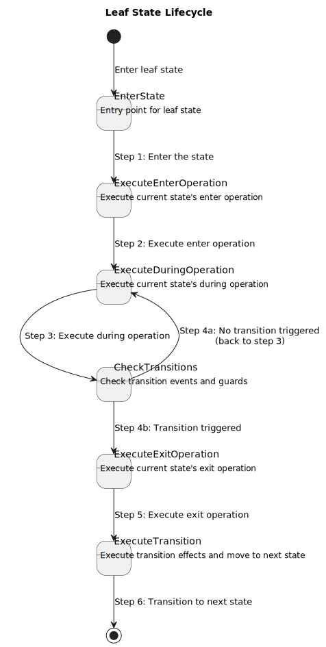
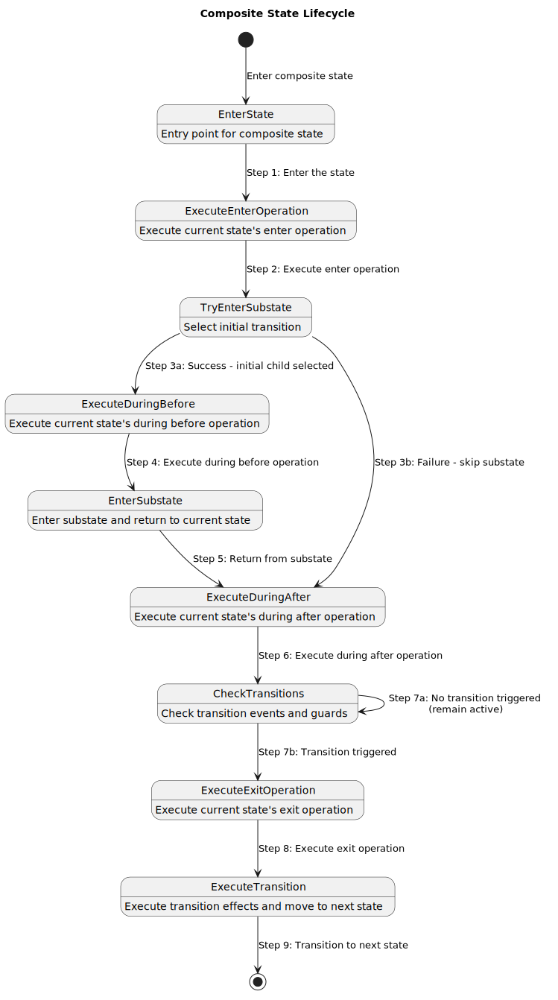

.. _sec-how-to-dsl-zh:

DSL 任务指南
============

.. contents:: 任务地图
   :local:
   :depth: 2

如何使用本页
------------

本页不是语法目录，而是 FCSTM DSL 的任务手册。每个 recipe 都说明什么时候使用、推荐写法、如何验证、预期 diagnostics、常见错误和深入阅读位置。

所有引用 checked example 的命令都默认从仓库根目录运行。

术语约定：``recipe`` 是可执行任务配方，``checked example`` 是已纳入构建/测试检查的示例，
``diagnostics`` 是 inspect 给出的诊断，``target profile`` 是生成目标语言/运行时配置。

.. _dsl-small-valid-model-task-zh:

写一个小型有效模型
------------------

当你需要在加入高级功能前做最小 sanity check 时，从一个 root composite、一个 initial transition 和几个 leaf states 开始。

.. literalinclude:: ../../tutorials/dsl/first_thermostat.fcstm
   :language: fcstm
   :caption: 第一个可运行模型；预期 diagnostics：none。

验证命令：

.. code-block:: bash

   pyfcstm inspect -i docs/source/tutorials/dsl/first_thermostat.fcstm --format human --color never

预期摘要：

.. code-block:: text

   status: ok
   root: Thermostat
   diagnostics: 0 errors / 0 warnings / 0 infos

常见错误：在 endpoint state 声明之前或不在同一个 owner scope 中写 transition。除非 transition 本来就是进入或离开 composite boundary，否则应把 endpoint 和 transition 放在同一个 owning composite 内。

.. _dsl-state-target-task-zh:

组织 state 并解析 target
------------------------

当 transition 报告找不到 state，或你不确定 transition 应该写在哪里时，用这个规则：transition 只能直接引用当前 owner scope 能看到的 endpoint 名称。

推荐完整模式：

.. code-block:: fcstm

   state Parent {
       [*] -> ChildA;
       state ChildA;
       state ChildB;
       ChildA -> ChildB;
   }

``ChildA -> ChildB`` 写在 ``Parent`` 内，因为 ``Parent`` 拥有这两个名字。从 ``Parent`` 外部进入时，应 target ``Parent``，再由 ``Parent`` 的 initial transition 选择 child。

常见错误：从外部直接 target 另一个 composite 拥有的 child state。

.. code-block:: fcstm

   state Root {
       [*] -> Outside;
       state Outside;
       state Parent {
           [*] -> ChildA;
           state ChildA;
           state ChildB;
       }
       Outside -> ChildB;  // invalid: ChildB 不属于 Root
   }

修复方式是写 ``Outside -> Parent;``，或把指向 child 的 transition 移入 ``Parent``。精确规则见 :ref:`dsl-state-forms-zh` 和 :ref:`dsl-ownership-name-resolution-zh`。

验证一个 checked hierarchy 示例：

.. code-block:: bash

   pyfcstm inspect -i docs/source/tutorials/dsl/hierarchy_execution.fcstm --format human --color never

预期摘录：

.. code-block:: text

   root: HierarchyDemo
   diagnostics: 0 errors / 1 warnings / 1 infos

.. _dsl-event-scopes-task-zh:

编写 event scope
----------------

离散外部触发建议用 event。根据 ownership 选择拼写：

.. list-table:: Event-scope recipe
   :header-rows: 1
   :widths: 24 34 42

   * - 需求
     - 写法
     - 含义
   * - Source state 私有事件
     - ``Idle -> Heating :: Heat;``
     - Event local to ``Idle``。
   * - Containing 或 named state 拥有的事件
     - ``Idle -> Running : Start;``
     - Event 沿 ownership chain 解析。
   * - Root-owned event
     - ``Worker -> Active : /Start;``
     - Event path 从 root 下方开始。

Checked example：

.. literalinclude:: ../../tutorials/dsl/event_scoping_complete.fcstm
   :language: fcstm
   :caption: 完整 event scope 示例；预期 diagnostics：演示用 ``counter`` 触发 ``W_UNREFERENCED_VAR``\ 。

验证命令：

.. code-block:: bash

   pyfcstm inspect -i docs/source/tutorials/dsl/event_scoping_complete.fcstm --format json

在 JSON 中查看 ``events[].qualified_name`` 和 ``events[].scope``。不要在实际 DSL 中写 ``:/Start``；那只是说明文字里的简写。合法 absolute form 是 ``: /Start``。

.. _dsl-guards-effects-task-zh:

编写 guard、effect 和 operation block
----------------------------------------------

Guard 决定 transition 是否 enabled。Effect 在 source exit 之后、target enter 之前更新变量。

完整 operation-block 示例：

.. literalinclude:: ../../tutorials/dsl/operation_blocks_complete.fcstm
   :language: fcstm
   :caption: Assignment、block-local temporary、``if`` / ``else if`` / ``else``、empty statement 和 ternary assignment；预期 diagnostics：none。

示例中的关键点：

* ``delta`` 和 ``next_sample`` 是 block-local temporary，只能在同一个 block 内赋值后读取。
* Operation block 内支持 ``if [condition] { ... } else if [condition] { ... } else { ... }``。
* 单独的 ``;`` 是合法 no-op statement。
* Guard condition 和 assignment RHS 是不同表达式上下文。

验证命令：

.. code-block:: bash

   pyfcstm inspect -i docs/source/tutorials/dsl/operation_blocks_complete.fcstm --format human --color never

如果看到 ``E_UNDEFINED_VAR`` 且 ``refs.is_temporary=true``，通常说明 temporary 在同一个 block 内先被读取后被赋值。

.. _dsl-expression-safety-task-zh:

安全使用 expression
-------------------

表达式有三个上下文：

.. list-table:: Expression contexts
   :header-rows: 1
   :widths: 22 38 40

   * - 上下文
     - 接受
     - 不接受
   * - ``init_expression``
     - literal、``pi`` / ``E`` / ``tau``、arithmetic、bitwise、unary math function
     - runtime variable read、ternary expression
   * - ``num_expression``
     - runtime variable、arithmetic、bitwise、math function、numeric ternary
     - condition-only operator 直接出现在 numeric assignment 中
   * - ``cond_expression``
     - comparison、``&&`` / ``and``、``||`` / ``or``、``!`` / ``not``、``=>`` / ``implies``、``xor``、``iff``、condition ternary
     - numeric assignment statement

Checked example：

.. literalinclude:: ../../tutorials/dsl/expression_condition_ternary.fcstm
   :language: fcstm
   :caption: Runtime expression、condition operator、implication、xor/iff 和 ternary form；预期 diagnostics：none。

常见拼写陷阱：

.. code-block:: fcstm

   // Good: boolean xor 使用 word "xor"。
   A -> B : if [(left > 0) xor (right > 0)];

   // Good: implication 在 condition 中使用 "=>" 或 "implies"。
   A -> B : if [request > 0 => ready > 0];

   // Good: numeric bitwise xor 仍然是 "^"。
   flags = flags ^ 0x01;

不要用 ``->`` 表示 implication；它是 transition 语法。不要把 ``^`` 当 boolean xor。完整 precedence 见 :ref:`dsl-expression-reference-zh` 和 :ref:`dsl-expression-separation-zh`。

验证 checked expression 示例：

.. code-block:: bash

   pyfcstm inspect -i docs/source/tutorials/dsl/expression_condition_ternary.fcstm --format human --color never

预期摘录：

.. code-block:: text

   root: ExpressionConditionTernary
   diagnostics: 0 errors / 0 warnings / 0 infos

.. _dsl-lifecycle-task-zh:

编写 lifecycle hook、ref 和 abstract hook
----------------------------------------------------

模型自己拥有行为时使用 concrete lifecycle action；generated code 需要调用用户行为时使用 ``abstract``；多个 state 复用 named lifecycle action 时使用 ``ref``。

.. code-block:: fcstm

   state Device {
       enter SharedInit {
           ready = 1;
       }

       state Idle {
           enter ref /SharedInit;
           during abstract PollHardware;
       }
   }

``ref`` 指向 named lifecycle action，不指向 state 或 event。

.. literalinclude:: ../../tutorials/dsl/abstract_reference_demo.fcstm
   :language: fcstm
   :caption: Abstract 和 reference action 示例；预期 diagnostics：两个 ``I_UNREFERENCED_VAR_MAYBE_ABSTRACT`` 和一个 ``I_TRANSITION_NEVER_EVENT_TRIGGERED``\ 。

Lifecycle ordering 可参考：

验证 checked lifecycle 示例：

.. code-block:: bash

   pyfcstm inspect -i docs/source/tutorials/dsl/abstract_reference_demo.fcstm --format human --color never

预期摘录：

.. code-block:: text

   root: AbstractReferenceDemo
   diagnostics: 0 errors / 0 warnings / 3 infos

.. _dsl-aspect-task-zh:

使用 during aspect
------------------

当 ancestor 需要在 descendant leaf-state active cycle 前后做监控或日志时，使用 ``>> during before`` 和 ``>> during after``。不要把它们和 composite 的 plain ``during before`` / ``during after`` 混为一谈。

.. literalinclude:: ../../tutorials/dsl/hierarchy_execution.fcstm
   :language: fcstm
   :caption: Aspect 与 hierarchy execution 示例；预期 diagnostics：``W_UNREFERENCED_VAR`` 和 ``I_TRANSITION_NEVER_EVENT_TRIGGERED``\ 。

解释：

* ancestor ``>> during before`` 在 active leaf ``during`` 前运行；
* ancestor ``>> during after`` 在 active leaf ``during`` 后运行；
* plain composite ``during before`` / ``during after`` 属于 composite entry/exit 语义，不包裹 child-to-child transition；
* aspect action 不在 combo pseudo relay state 内运行。

详见 :ref:`dsl-during-aspect-semantics-zh`。

验证 checked aspect 示例：

.. code-block:: bash

   pyfcstm inspect -i docs/source/tutorials/dsl/hierarchy_execution.fcstm --format human --color never

预期摘录：

.. code-block:: text

   root: HierarchyDemo
   diagnostics: 0 errors / 1 warnings / 1 infos

.. _dsl-forced-transition-task-zh:

编写 forced transition
----------------------

当一个声明要展开到多个 source states 时使用 forced transition。Forced transition 是 expansion shorthand，不是隐藏共享 side effect 的办法。

.. literalinclude:: ../../tutorials/dsl/forced_transitions.fcstm
   :language: fcstm
   :caption: Forced transition 示例；预期 diagnostics：两个演示变量触发 ``W_UNREFERENCED_VAR``\ 。

规则：

* ``!State -> Target :: Event;`` 从 named source 及其可达 nested sources 展开。
* ``!* -> Target :: Event;`` 从 owner scope 内所有适用 source 展开。
* Forced transition 可以带一个 local、chain/root 或 guard trigger。
* 它不能带 combo ``+`` chain，也不能有 ``effect`` block。

需要共享 side effect 时，把行为放到 target ``enter``，或写显式 normal transitions。原因见 :ref:`dsl-forced-transition-expansion-zh`。

验证展开规模：

.. code-block:: bash

   pyfcstm inspect -i docs/source/tutorials/dsl/forced_transitions.fcstm --format human --color never

预期摘录：

.. code-block:: text

   root: System
   transitions: 17
   diagnostics: 0 errors / 2 warnings / 0 infos

.. _dsl-combo-transition-task-zh:

编写 combo transition
---------------------

当一个 transition 需要同一个 cycle 内按顺序满足多个 event term 和 guard term 时，使用 combo trigger。Combo transition 在 model construction 阶段展开成 pseudo relay states；simulation、inspect、generation 和 PlantUML 都消费展开后的模型。

.. literalinclude:: ../../tutorials/dsl/combo_transitions.fcstm
   :language: fcstm
   :caption: Normal combo、entry combo、guard alias、root event term、effect 和 generated pseudo relay states；预期 diagnostics：none。

验证展开：

.. code-block:: bash

   pyfcstm inspect -i docs/source/tutorials/dsl/combo_transitions.fcstm --format json

JSON 中重点看：

* ``combo_origins`` 保留 author-written trigger 和每个 term；
* ``combo_transitions`` 列出带 provenance 的 generated edges；
* ``states`` 中会出现 ``is_pseudo=true`` 且以 ``__combo_`` 开头的 generated pseudo states。

修复示例：

.. code-block:: fcstm

   // Bad: ordinary event suffix 后又接 guard suffix。
   A -> B :: Go if [ready > 0];

   // Good: combo 使用 bracketed guard term。
   A -> B :: Go + [ready > 0];

重复 event term 合法但可疑。Checked warning 示例：

.. literalinclude:: ../../tutorials/dsl/combo_duplicate_event.fcstm
   :language: fcstm
   :caption: 故意重复 event term 的 combo 示例；预期 diagnostics：``W_COMBO_DUPLICATE_EVENT`` 和 ``I_TRANSITION_NEVER_EVENT_TRIGGERED``\ 。

.. _dsl-import-task-zh:

组装 import
-----------

当一个 composite state 需要把另一个 FCSTM module 作为 child 时使用 import。Import syntax 在 DSL 中解析；path resolution 和 assembly 在 Python model/import 层执行。

Basic import：

.. literalinclude:: ../../tutorials/dsl/import_host_basic.fcstm
   :language: fcstm
   :caption: Basic import host；预期 diagnostics：两个 ``W_UNREFERENCED_VAR``\ 。

Mapping import：

.. literalinclude:: ../../tutorials/dsl/import_host_mapped.fcstm
   :language: fcstm
   :caption: Import with variable and event mappings；预期 diagnostics：三个 ``W_UNREFERENCED_VAR``\ 。

Imported worker：

.. literalinclude:: ../../tutorials/dsl/import_worker.fcstm
   :language: fcstm
   :caption: Imported worker module；预期 diagnostics：两个 ``W_UNREFERENCED_VAR``\ 。

Mapping facts：

* ``def speed -> plant_speed;`` 映射一个 imported variable 到一个 host variable。
* ``def sensor_* -> left_$1;`` 捕获 wildcard suffix，并插入 target template。
* ``def * -> prefix_$0;`` 是 fallback mapping；``$0`` 表示完整 imported variable name。
* ``event /Start -> Start;`` 映射 imported root event 到 host event。
* Directory project 必须 import 具体 entry file，例如 ``./import_line/main.fcstm``；bare directory 不是 DSL file。

Preamble form（如 ``name = value;`` 和 ``name := value;``）是 import assembly helper/test 使用的 parser-helper entry point，不是普通 ``state_machine_dsl`` 文件里的 root-level ``def``。边界见 :ref:`dsl-import-preamble-forms-zh`。

从仓库根目录验证 mapped import：

.. code-block:: bash

   pyfcstm inspect -i docs/source/tutorials/dsl/import_host_mapped.fcstm --format human --color never

预期摘录：

.. code-block:: text

   root: System
   variables: 3
   diagnostics: 0 errors / 3 warnings / 0 infos

.. _dsl-diagnostics-task-zh:

诊断并修复 DSL 错误
--------------------

把 inspect diagnostics 当成 repair loop：

.. code-block:: bash

   pyfcstm inspect -i docs/source/tutorials/dsl/combo_duplicate_event.fcstm --format json

Diagnostic 包含 ``code``、``severity``、human message、source span 和 ``refs`` payload。很多 diagnostic 也携带 suggested fix。

.. list-table:: Diagnostic repair lab
   :header-rows: 1
   :widths: 22 30 48

   * - 示例
     - 预期 code
     - 修复方向
   * - ``combo_duplicate_event.fcstm``
     - ``W_COMBO_DUPLICATE_EVENT``
     - 检查第二个 event term 是否写错。只有确实需要显式 two-hop relay 时才保留。
   * - ``guard_vars_never_change.fcstm``
     - ``W_GUARD_VARS_NEVER_CHANGE``
     - 添加缺失的 lifecycle/effect write，或确认这是 intentional initial-value-only guard 后简化 guard。
   * - ``during_const_assign.fcstm``
     - ``W_DURING_CONST_ASSIGN``
     - 一次性初始化移到 ``enter``，或让 ``during`` expression 依赖 runtime state。
   * - ``numeric_target_range.fcstm``
     - ``W_NUMERIC_LITERAL_OUT_OF_TARGET_RANGE``
     - 这是 ``c`` / ``c_poll`` / ``cpp`` / ``cpp_poll`` 的 C/C++ deployment-profile warning，不代表 Python generated code 具有同样 fixed-width risk。

最小坏语法示例作为 text fixture 保存，因为它故意不是可解析的 ``*.fcstm`` 文件：

.. literalinclude:: ../../tutorials/dsl/event_guard_mixed_invalid.fcstm.txt
   :language: fcstm
   :caption: 故意 parser error；预期 excerpt：``Unexpected token 'if'``\ 。

它失败的原因是 ordinary event syntax 和 ordinary guard syntax 是两种独立 transition forms。修复为 combo syntax：

.. code-block:: fcstm

   A -> B :: Go + [ready > 0];

Code-level 细节见 :doc:`../../reference/diagnostics_codes/index_zh`。

验证 intentional warning 文件：

.. code-block:: bash

   pyfcstm inspect -i docs/source/tutorials/dsl/combo_duplicate_event.fcstm --format human --color never

预期摘录：

.. code-block:: text

   W_COMBO_DUPLICATE_EVENT
   diagnostics: 0 errors / 1 warnings / 1 infos
