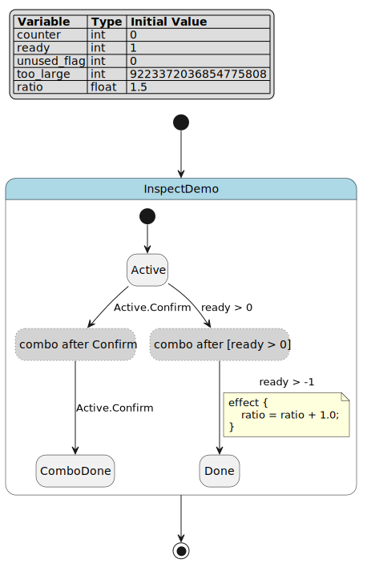

.. _sec-how-to-inspect-zh:

Inspect 任务指南
========================================

本页是 ``pyfcstm inspect`` 的任务手册。第一次学习请先看
:doc:`../../tutorials/inspect/index_zh`；需要查完整字段时再看
:doc:`../../reference/inspect_report/index_zh` 和
:doc:`../../reference/diagnostics_codes/index_zh`。这里关注的是：本地读报告、写机器报告、给大语言模型修复循环交接、处理输出后缀、区分失败边界，以及谨慎启用有界验证。

本页核心术语只在这里集中交接一次：检查（inspect）、诊断（diagnostic）、人类可读格式（human）、完整 JSON（json）、大语言模型 JSON（llm-json）、大语言模型 Markdown（llm-md）、标准输出（stdout）、标准错误（stderr）、退出状态（exit status）、副作用（side effect）、验证（verify）。后文普通叙述会尽量使用中文；命令、路径、字段、诊断码和格式名保持原样。

示例都使用已纳入文档构建的
``docs/source/tutorials/inspect/inspect_diagnostics.fcstm``\ 。它是合法 FCSTM DSL，里面的可疑点是教学用信号。命令失败表示还没有成功报告；成功报告即使整体状态是 ``warning``\ ，仍然可以被脚本读取。

   这张图说明示例很小但不空洞：两个组合触发器会展开成伪中继状态；诊断既能指回作者写的转换，也能携带展开来源。

任务卡片的统一读法
----------------------------------------

下面十三个任务都按同一组字段写，方便复制到缺陷单、评审意见或持续集成说明里。

.. list-table:: 任务字段
   :header-rows: 1
   :widths: 22 78

   * - 字段
     - 含义
   * - 输入
     - 命令运行前假设的源文件、报告或消费方。
   * - 命令或代码
     - 最短可复现命令或 Python 片段。
   * - 预期信号
     - 短输出、计数、退出状态或其他可观察结果。
   * - 文件副作用
     - 会创建、覆盖或明确不会创建的文件。
   * - 首个失败检查
     - 信号不出现时先看哪里。
   * - 参考链接
     - 负责完整字段、选项或诊断码的页面。

长流程保留在教程目录里的 ``inspect_*.demo.sh`` 文件中；正文只展示对读者有意义的短片段。

1. 选择报告格式
----------------------------------------

输入。一个合法 FCSTM 文件，以及明确的消费方：人、脚本或修复提示。

命令或代码。比较四种公开格式：

.. code-block:: bash

   pyfcstm inspect -i docs/source/tutorials/inspect/inspect_diagnostics.fcstm
   pyfcstm inspect -i docs/source/tutorials/inspect/inspect_diagnostics.fcstm --format json
   pyfcstm inspect -i docs/source/tutorials/inspect/inspect_diagnostics.fcstm --format llm-json
   pyfcstm inspect -i docs/source/tutorials/inspect/inspect_diagnostics.fcstm --format llm-md

预期信号。``human`` 以检查器风格摘要开头，``json`` 包含
``root_state_path`` 和结构数组，``llm-json`` 带
``schema_version`` ``pyfcstm.inspect.llm.v1``\ ，``llm-md`` 以 Markdown 标题开头。

文件副作用。除非使用 ``-o``\ ，否则四条命令都只写标准输出。

首个失败检查。运行 ``python -m pyfcstm inspect --help``\ ，确认 ``--format`` 仍列出
``human|json|llm-json|llm-md``\ 。

参考链接。格式契约见 :doc:`../../reference/inspect_report/index_zh`。

2. 本地阅读人类可读报告
----------------------------------------

输入。诊断较丰富的教程文件。

命令或代码。报告要粘贴到缺陷单或评审评论时关闭颜色：

.. code-block:: bash

   pyfcstm inspect -i docs/source/tutorials/inspect/inspect_diagnostics.fcstm --color never | sed -n '1,22p'

预期信号。已检查输出开头是：

.. code-block:: text

   [WARN] FCSTM Inspect Report: inspect_diagnostics.fcstm
   Summary
     status: warning
     root: InspectDemo
     diagnostics: 0 errors / 9 warnings / 4 infos

第一个警告是 ``W_DURING_CONST_ASSIGN``\ ，并带源码摘录、原因、修复形状和禁止做法。

文件副作用。无；命令读取一个文件并把纯文本写到标准输出。

首个失败检查。如果看到颜色转义字符，添加 ``--color never``\ 。如果完全没有报告，先看标准错误里的读取、解析或模型校验失败。

参考链接。诊断码含义和修复元数据见 :doc:`../../reference/diagnostics_codes/index_zh`。

3. 保存人类可读报告并控制颜色
----------------------------------------

输入。需要作为文本附件保存的报告。

命令或代码。写出到文件：

.. code-block:: bash

   pyfcstm inspect -i docs/source/tutorials/inspect/inspect_diagnostics.fcstm \
       --format human --color never -o /tmp/inspect-human.txt
   sed -n '1,5p' /tmp/inspect-human.txt

预期信号。文件以 ``[WARN] FCSTM Inspect Report`` 开头，没有 ANSI 转义字符。写入文件时颜色始终关闭，即使命令行终端本身支持颜色。

文件副作用。``/tmp/inspect-human.txt`` 会被创建或覆盖。

首个失败检查。如果文件为空，先确认输出目录存在；写入失败会作为命令行错误报告。

参考链接。颜色和输出文件规则见 :doc:`../../reference/inspect_report/index_zh`。

4. 为持续集成写出完整 JSON
----------------------------------------

输入。一个合法模型，以及需要精确计数或图结构的脚本。

命令或代码。保存完整 ``ModelInspect`` 载荷：

.. code-block:: bash

   pyfcstm inspect -i docs/source/tutorials/inspect/inspect_diagnostics.fcstm \
       --format json -o /tmp/inspect.json
   python - <<'PY'
   import json
   from pathlib import Path

   report = json.loads(Path('/tmp/inspect.json').read_text())
   print(report['root_state_path'])
   print(len(report['states']), len(report['transitions']))
   print(len(report['diagnostics']))
   PY

预期信号。示例会打印 ``InspectDemo``\ ，然后是 ``6 5``\ ，最后是 ``13``\ 。完整 JSON 还包含
``combo_origins``、``reachability_graph``、``var_dataflow`` 和 ``metrics``\ 。

文件副作用。``/tmp/inspect.json`` 会被创建或覆盖。

首个失败检查。如果 ``json.loads`` 失败，先确认命令确实用了 ``--format json``\ 。带 ``.json`` 后缀的人类可读报告仍然不是 JSON。

参考链接。顶层字段和嵌套字段见 :doc:`../../reference/inspect_report/index_zh`。

5. 用 JSON 严重级别做门禁
----------------------------------------

输入。已经生成的完整 JSON 报告。

命令或代码。统计严重级别，不匹配人类可读消息：

.. code-block:: python

   import json
   from pathlib import Path

   report = json.loads(Path('/tmp/inspect.json').read_text())
   errors = [item for item in report['diagnostics'] if item['severity'] == 'error']
   warnings = [item for item in report['diagnostics'] if item['severity'] == 'warning']
   if errors:
       raise SystemExit('inspect found blocking diagnostics')
   print('warnings:', len(warnings))

预期信号。教程文件没有错误、有九个警告，所以只阻塞错误的策略会打印 ``warnings: 9`` 并成功退出。

文件副作用。无；代码只读取 JSON 文件。

首个失败检查。如果这个夹具触发失败，先打印触发门禁的 ``code``\ ，不要比较本地化文本。

参考链接。稳定诊断字段见 :doc:`../../reference/diagnostics_codes/index_zh`。

6. 为自动修复提示写出 ``llm-json``
----------------------------------------

输入。合法模型，以及不需要完整结构清单的修复循环。

命令或代码。创建紧凑修复包：

.. code-block:: bash

   pyfcstm inspect -i docs/source/tutorials/inspect/inspect_diagnostics.fcstm \
       --format llm-json -o /tmp/inspect.llm.json
   python - <<'PY'
   import json
   from pathlib import Path

   report = json.loads(Path('/tmp/inspect.llm.json').read_text())
   first = report['diagnostics'][0]
   print(report['schema_version'])
   print(sorted(first.keys()))
   print(len(first['recommended_actions']), len(first['do_not']))
   PY

预期信号。结构版本是 ``pyfcstm.inspect.llm.v1``\ 。第一个诊断包含
``source_excerpt``、``refs``、``recommended_actions`` 和 ``do_not``\ 。

文件副作用。``/tmp/inspect.llm.json`` 会被创建或覆盖。

首个失败检查。如果修复指导缺失，检查 ``code`` 是否在 ``codes.yaml`` 中有注册表指导，并确认渲染器能读取源码文本。

参考链接。大语言模型报告字段见 :doc:`../../reference/inspect_report/index_zh`。

7. 为人工修复交接写出 ``llm-md``
----------------------------------------

输入。同一个模型，但消费方需要可读 Markdown 说明。

命令或代码。导出并只看开头：

.. code-block:: bash

   pyfcstm inspect -i docs/source/tutorials/inspect/inspect_diagnostics.fcstm \
       --format llm-md -o /tmp/inspect.llm.md
   sed -n '1,12p' /tmp/inspect.llm.md

预期信号。已检查示例开头是：

.. code-block:: text

   # FCSTM Inspect Report
   - Schema: `pyfcstm.inspect.llm.v1`
   - Status: `warning`
   - Diagnostics: 0 errors / 9 warnings / 4 infos

文件副作用。``/tmp/inspect.llm.md`` 会被创建或覆盖。

首个失败检查。如果文件看起来像 JSON，确认使用的是 ``--format llm-md`` 而不是 ``--format llm-json``\ 。

参考链接。共享契约见 :doc:`../../reference/inspect_report/index_zh`；修复思路见 :doc:`../../explanations/diagnostics/index_zh`。

8. 从诊断跳回源码位置
----------------------------------------

输入。包含 ``span`` 或 ``location`` 的报告。

命令或代码。查看重复组合事件附近的源码摘录：

.. code-block:: bash

   pyfcstm inspect -i docs/source/tutorials/inspect/inspect_diagnostics.fcstm \
       --color never | rg -A8 'W_COMBO_DUPLICATE_EVENT'

预期信号。摘录指向第 19 行，并标出第二个 ``Confirm``\ ：

.. code-block:: text

   Active -> ComboDone :: Confirm + Confirm;
                                      ^^^^^^^

文件副作用。无。

首个失败检查。如果缺源码行，确认报告来自顶层源文件。导入或生成对象的范围可能没有完整上下文。

参考链接。``span`` 和 ``location`` 字段见 :doc:`../../reference/inspect_report/index_zh`。

9. 理解输出后缀警告
----------------------------------------

输入。请求的格式和一个可能暗示其他格式的输出后缀。

命令或代码。下面的命令合法但可疑：

.. code-block:: bash

   pyfcstm inspect -i docs/source/tutorials/inspect/inspect_diagnostics.fcstm \
       -o /tmp/report.json 2> /tmp/inspect-suffix.err
   sed -n '1p' /tmp/inspect-suffix.err

预期信号。标准错误会提示文件看起来像 JSON，但当前格式是 ``human``\ 。命令仍会写出请求的人类可读报告。

文件副作用。``/tmp/report.json`` 含人类可读文本，不是 JSON；本示例还把警告写到 ``/tmp/inspect-suffix.err``\ 。

首个失败检查。如果下游 JSON 解析失败，先看文件第一行，不要先改解析器。

参考链接。后缀和颜色行为见 :doc:`../../reference/inspect_report/index_zh`。

10. 区分无效输入和成功诊断
----------------------------------------

输入。一个可能语法无效、模型无效，或合法但有警告的文件。

命令或代码。把非零退出状态当作进程失败，而不是普通报告：

.. code-block:: bash

   pyfcstm inspect -i bad.fcstm --format json

预期信号。语法错误以状态 ``1`` 退出，标准错误类似 ``Failed to parse input DSL file``\ 。重复状态这类模型错误也以状态 ``1`` 退出，并以 ``Invalid state machine model`` 开头。合法教程夹具虽然报告状态是 ``warning``\ ，命令状态仍是 ``0``\ 。

文件副作用。失败命令不会产生成功的 ``diagnostics`` 数组。如果请求了 ``-o``\ ，不要信任上一次运行留下的旧文件。

首个失败检查。先打印退出状态和标准错误，再读取 ``diagnostics[]``\ 。无效输入属于进程边界。

参考链接。失败边界见 :doc:`../../reference/inspect_report/index_zh` 和 :doc:`../../explanations/diagnostics/index_zh`。

11. 启用有界验证诊断
----------------------------------------

输入。合法模型，以及确实需要验证支持事实的场景。

命令或代码。显式启用：

.. code-block:: bash

   pyfcstm inspect -i docs/source/tutorials/inspect/inspect_diagnostics.fcstm \
       --enable-verify --format json -o /tmp/inspect-verify.json
   python - <<'PY'
   import json
   from pathlib import Path

   codes = [item['code'] for item in json.loads(Path('/tmp/inspect-verify.json').read_text())['diagnostics']]
   print('W_TOPOLOGICAL_NOEXIT' in codes)
   print('I_TOPOLOGICAL_NON_TERMINATING' in codes)
   PY

预期信号。启用验证后，教程夹具会对两个拓扑检查都打印 ``True``\ 。

文件副作用。``/tmp/inspect-verify.json`` 会被创建或覆盖。

首个失败检查。如果没有验证支持的诊断，确认命令里确实有 ``--enable-verify``\ 。提高 ``--max-complexity-tier`` 只能允许更多有界算法，不会开启 BMC 搜索。

参考链接。验证层级见 :doc:`../../explanations/diagnostics/index_zh`；诊断码细节见 :doc:`../../reference/diagnostics_codes/index_zh`。

12. 识别验证策略拒绝
----------------------------------------

输入。命令请求自动检查运行超出边界的策略。

命令或代码。下面的标签会被 Click 接受，然后由检查策略拒绝：

.. code-block:: bash

   pyfcstm inspect -i docs/source/tutorials/inspect/inspect_diagnostics.fcstm \
       --max-complexity-tier bmc_search
   pyfcstm inspect -i docs/source/tutorials/inspect/inspect_diagnostics.fcstm \
       --max-call-count-scaling k_unrollings

预期信号。两条命令都以状态 ``1`` 退出。第一条标准错误说明 ``bmc_search algorithms are not allowed in automatic inspect runs``\ ；第二条说明 ``call-count scaling 'k_unrollings' is not allowed``\ 。``k_unrollings_times_branching`` 同样会被拒绝。

文件副作用。不产生成功报告。

首个失败检查。如果持续集成误用了这些标签，删除策略参数，不要吞掉错误。BMC 类检查需要单独的显式验证流程。

参考链接。允许和禁止的策略值见 :doc:`../../reference/inspect_report/index_zh`。

13. 保持目标和部署警告的范围精确
----------------------------------------

输入。消息里提到目标家族或生成运行时配置的诊断。

命令或代码。读取数值警告的结构化引用：

.. code-block:: bash

   python - <<'PY'
   import json
   from pathlib import Path

   report = json.loads(Path('/tmp/inspect.json').read_text())
   item = next(d for d in report['diagnostics'] if d['code'] == 'W_NUMERIC_LITERAL_OUT_OF_TARGET_RANGE')
   print(', '.join(item['refs']['target_templates']))
   print(item['refs']['runtime_note'])
   PY

预期信号。目标模板是 ``c, c_poll, cpp, cpp_poll``\ 。运行时说明会指出风险来自 C/C++ 默认整数配置；Python 生成运行时不一定有同样的固定位宽风险。

文件副作用。无；代码只读取已有 JSON。

首个失败检查。如果评审意见写成 “Python 溢出”，先对照 ``refs.target_templates``\ 。同一个诊断可以是真实部署风险，但不一定适用于每个目标。

参考链接。目标相关数值诊断见 :doc:`../../reference/diagnostics_codes/index_zh`。

故障速查
----------------------------------------

下表是补充材料，不计入十三个任务卡片。

.. list-table:: 首个检查动作
   :header-rows: 1
   :widths: 30 35 35

   * - 现象
     - 可能边界
     - 首个动作
   * - 没有输出文件
     - 读取、解析、模型、策略或写入失败
     - 先看退出状态和标准错误，避免读取旧文件。
   * - JSON 解析器看到 ``[WARN]``
     - 人类可读报告被保存成 JSON 后缀
     - 重新运行 ``--format json``\ ，保留后缀警告。
   * - 粘贴文本里有 ANSI 转义
     - 人类可读输出启用了颜色
     - 使用 ``--color never`` 或写入 ``-o``\ 。
   * - 没有验证支持的诊断
     - 默认静态检查未启用验证
     - 添加 ``--enable-verify`` 并保持策略有界。
   * - 警告看起来只适用于某些目标
     - 结构化引用携带部署范围
     - 先读 ``refs``\ ，再决定是否适用于所有生成运行时。
   * - 修复补丁改得太大
     - 修复提示忽略了来源信息
     - 使用 ``llm-json`` 或 ``llm-md``\ ，并保留 ``do_not`` 规则。

本页验证来源
----------------------------------------

短摘录来自这些已检查资源：``inspect_human.demo.sh.txt`` 负责人类可读输出，
``inspect_formats.demo.sh.txt`` 负责 JSON 和大语言模型报告形状，
``inspect_cli_edges.demo.sh.txt`` 负责颜色和后缀行为，
``inspect_invalid.demo.sh.txt`` 负责解析失败，
``inspect_verify_policy.demo.sh.txt`` 负责策略拒绝。只有源资源改变时才需要重新运行对应脚本；单纯复用短摘录时，不应在正文嵌入长 shell 脚本。
