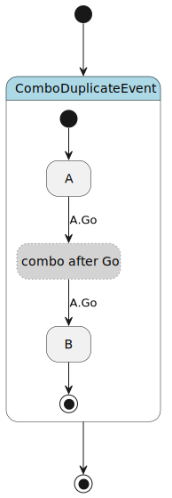

.. _sec-reference-diagnostics-codes-zh:

诊断码参考
==========

诊断码（diagnostic code）是 ``pyfcstm inspect`` 输出、CI 过滤、IDE 集成和 LLM 修复提示使用的稳定标识。完整注册表位于
``pyfcstm.diagnostics.CODE_REGISTRY``；本页解释编写 DSL 时最常见的用户侧诊断。

本页首次出现必要英文术语时采用“中文（English）”格式，后文只使用中文。诊断码、JSON 字段、命令、文件路径和原始输出保持原文。

如何阅读检查诊断
----------------

需要机器可读修复上下文时运行 JSON 检查：

.. code-block:: bash

   pyfcstm inspect -i docs/source/tutorials/dsl/combo_duplicate_event.fcstm --format json

每个诊断通常包含：

* ``code``：稳定标识，例如 ``W_COMBO_DUPLICATE_EVENT``；
* ``severity``：``error``、``warning`` 或 ``info``；
* ``message``：简短人工说明；
* ``span``：可用时给出源码位置；
* ``refs``：结构化字段，例如 ``event_name`` 或 ``guard_vars``；
* 可选修复建议载荷，供工具生成修复建议。

严重级别的含义：

.. list-table:: 严重级别
   :header-rows: 1
   :widths: 18 42 40

   * - 级别
     - 含义
     - 建议动作
   * - ``error``
     - 阻塞解析或模型构建。
     - 先修复，再运行仿真或生成。
   * - ``warning``
     - 不一定阻塞，但指出可疑模型、可移植风险或目标风险。
     - 明确修复，或在文档 / 测试中说明它是预期教学噪声。
   * - ``info``
     - 提供静态分析线索。
     - 若模型依赖外部动作，应在示例中解释为什么可接受。

常见代码
--------

.. list-table:: 常见检查诊断
   :header-rows: 1
   :widths: 28 12 60

   * - 诊断码
     - 级别
     - 含义与常见修复
   * - ``W_DURING_CONST_ASSIGN``
     - warning
     - 具体 ``during`` 动作每个周期都赋同一个只含字面量的数值。一次性初始化应移到 ``enter``，或者让表达式依赖运行时状态。
   * - ``W_COMBO_DUPLICATE_EVENT``
     - warning
     - 组合触发器重复同一个规范化事件项。检查第二个项是否拼写错误；只有需要显式两跳中继时才保留。
   * - ``W_COMBO_GUARD_PREFIX_IMPLIED``
     - warning
     - 前面的无副作用组合守卫蕴含后面的守卫项。移除冗余守卫，或改写成真正想表达的条件。
   * - ``W_COMBO_RELAY_PSEUDO_HAS_ACTIONS``
     - warning
     - ``pseudo state __combo_*`` 节点含生命周期或切面动作。把业务行为移到作者写的状态，或把伪状态改名到保留命名空间之外。
   * - ``W_COMBO_RESERVED_PREFIX_STATE_KIND``
     - warning
     - 普通叶状态或复合状态使用保留组合中继前缀。应重命名状态，不要为了消除警告把业务状态改成伪状态。
   * - ``W_GUARD_VARS_NEVER_CHANGE``
     - warning
     - 守卫只读取从不被动作 / 效果动作修改的变量。添加缺失写入，或确认初值常量行为后简化守卫。
   * - ``W_UNWRITTEN_READ_VAR``
     - warning
     - 操作块在同一块中读到了尚未被写入定义的变量。应提前初始化，或调整块顺序让写入先可见。
   * - ``W_NUMERIC_LITERAL_OUT_OF_TARGET_RANGE``
     - warning
     - 整数字面量超出默认 C/C++ 系列生成整数范围。这是 C/C++ 部署配置警告，不是 Python 运行时溢出结论。
   * - ``W_DEADLOCK_LEAF``
     - warning
     - 非伪叶状态没有外出转换。如果它不应是终止状态，应添加退出或外出转换。
   * - ``W_UNREFERENCED_VAR``
     - warning
     - 变量无法通过 DSL 数据流影响任何转换守卫。除非外部抽象钩子使用它，否则应移除或接入模型行为。
   * - ``I_UNREFERENCED_VAR_MAYBE_ABSTRACT``
     - info
     - 变量未被 DSL 数据流使用，但可见抽象动作可能在外部使用它。
   * - ``I_TRANSITION_NEVER_EVENT_TRIGGERED``
     - info
     - 事件触发转换没有被已检查事件路径触发。若它由外部事件触发可保留，否则应移除或重命名陈旧事件。

可运行诊断示例
--------------

下面这些已验证文件故意展示常见警告。它们是有效 DSL 文件，不是破坏解析器的文本夹具（fixture）。后文只称文本夹具。

.. list-table:: 诊断示例
   :header-rows: 1
   :widths: 30 32 38

   * - 文件
     - 关键输出摘录
     - 学习点
   * - ``combo_duplicate_event.fcstm``
     - ``warning: W_COMBO_DUPLICATE_EVENT``
     - 检查输出通过 ``refs.term_span`` 和 ``refs.first_term_span`` 指向重复组合项。
   * - ``guard_vars_never_change.fcstm``
     - ``warning: W_UNWRITTEN_READ_VAR`` + ``warning: W_GUARD_VARS_NEVER_CHANGE`` + ``info: I_TRANSITION_NEVER_EVENT_TRIGGERED``
     - 只读取初始值的守卫需要修复，或明确记录为有意示例；额外读写和落空诊断是这个紧凑示例的预期输出。
   * - ``during_const_assign.fcstm``
     - ``warning: W_DURING_CONST_ASSIGN``
     - ``during`` 中反复赋常量通常应移到 ``enter``。
   * - ``numeric_target_range.fcstm``
     - ``warning: W_NUMERIC_LITERAL_OUT_OF_TARGET_RANGE``
     - 数值目标警告只限定到 C/C++ 系列生成运行时。

示例命令：

.. code-block:: bash

   pyfcstm inspect -i docs/source/tutorials/dsl/numeric_target_range.fcstm --format human --color never

预期摘录：

.. code-block:: text

   W_NUMERIC_LITERAL_OUT_OF_TARGET_RANGE
   C/C++ default deployment profile risk: integer literal 9223372036854775808 is outside the PYFCSTM_GENERATED_INT64 range

坏 DSL 到修复的读法
-------------------

诊断不是为了“吓停”用户，而是为了把问题定位回源码。阅读时建议按四步处理：

1. 看 ``severity`` 判断是否阻塞；
2. 看 ``code`` 找到本页或参考页的修复说明；
3. 看 ``span`` 回到源码位置；
4. 看 ``refs`` 判断涉及哪个变量、事件、守卫或组合触发项。

组合重复项示例：

.. code-block:: fcstm

   Waiting -> Accepted :: Go + Go;

修复方向：如果第二个 ``Go`` 是误写，删除它；如果真的需要两次不同信号，应改成两个不同事件名，或显式解释为什么重复项是预期设计。

未变化守卫变量示例：

.. code-block:: fcstm

   def int ready = 0;

   state Root {
       [*] -> A;
       state A;
       state B;
       A -> B : if [ready > 0];
   }

修复方向：给 ``ready`` 添加进入动作、活动动作或转换效果动作中的写入；如果它只是固定配置值，应考虑把不可达分支删掉，或把说明写进模型文档。

.. _diag-c-cpp-risk-wording-zh:

C/C++ 目标配置范围
------------------

``W_NUMERIC_LITERAL_OUT_OF_TARGET_RANGE`` 和相关数值部署警告关注 C/C++ 系列生成运行时。它们适用于 ``c``、``c_poll``、``cpp`` 和
``cpp_poll`` 部署审查，不代表 Python 生成运行时也有同样溢出行为。如果未来存在 Python 专属诊断，必须由对应诊断明确说明；不能从 C/C++ 配置措辞推断 Python 风险。

.. _diag-combo-relay-scope-zh:

组合中继范围
------------

组合中继伪状态警告关注生成中继的纯粹性和保留命名。它们不表示 ``during before`` 切面动作会在组合中继伪状态内执行。伪中继状态应保持纯路由辅助节点；可观察业务行为应放在作者写的状态或转换效果动作上。

   图中带 ``__combo_`` 前缀的节点是组合转换生成结构。重复事件诊断应该指回作者写的触发项，而不是要求用户去编辑图中的生成节点。
