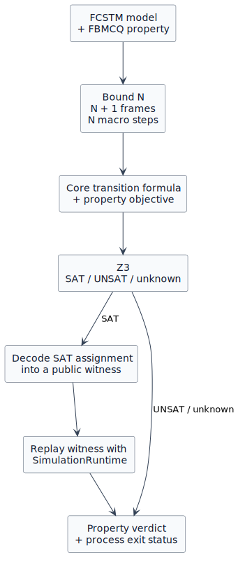
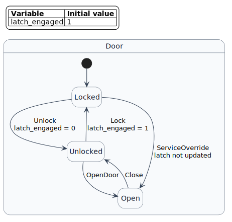

Your First Bounded Model Check
================================

This tutorial is the last stop in the tutorial path. You should already know
how to read an FCSTM model and a concrete Simulation trace. Here you will ask a
different question: instead of choosing one event sequence and observing what
happens, can a solver search **all event choices allowed by the model up to a
finite bound** and find a safety violation for you?

The example is a door controller with a physical latch. One maintenance path
opens the door without releasing that latch. You will state the intended
safety property, let BMC find the path, read the counterexample, repair the
model, and run the same property again.

The complete pipeline
---------------------

Bounded model checking (BMC) converts a finite prefix of the state machine into
one symbolic formula. Z3 checks that formula. A SAT assignment is decoded into
a public trace and replayed with :class:`pyfcstm.simulate.SimulationRuntime`
before the CLI reports a trusted trace.

Keep the layers separate:

* the **FCSTM model** defines the behaviors that are possible;
* the **FBMCQ property** states the behavior you want to find or rule out;
* the **bound** limits how many macro steps the symbolic search contains;
* the **solver status** describes the formula, while the **property verdict**
  tells a user whether the stated property holds within that bound;
* a SAT **witness** is a decoded satisfying trace; when it violates a safety
  property, that same trace is called a **counterexample**;
* **replay** checks that the decoded trace agrees with the executable runtime.

1. Identify the safety rule
---------------------------

The controller records the physical latch separately from its logical state:

.. code-block:: fcstm

   def int latch_engaged = 1;

   state Locked;
   state Unlocked;
   state Open;

   [*] -> Locked;

These focused declarations sit inside the complete model's composite
``state Door { ... }``.  That owner is why later paths are ``Door.Locked`` and
``Door.Open``; the excerpt is not intended as a standalone model.

The normal unlock path clears the latch before the door can open:

.. code-block:: fcstm

   Locked -> Unlocked : Unlock effect {
       latch_engaged = 0;
   }
   Unlocked -> Open : OpenDoor;

The maintenance path is shorter, but wrong:

.. code-block:: fcstm

   Locked -> Open : ServiceOverride;

The transition changes the logical state to ``Open`` and leaves
``latch_engaged`` equal to ``1``. The dangerous condition is therefore not
merely “the door opens”; it is the combination “the door is open **and** the
physical latch is still engaged.”

:download:`Download the complete faulty model <first_check.fcstm>` rather than
reconstructing it from the three focused excerpts above.

2. State the property, not the solver result
--------------------------------------------

The query uses ``forbid`` because the unsafe combination must never occur in
the searched prefix:

.. literalinclude:: door_latch_safety.fbmcq
   :language: text
   :caption: ``door_latch_safety.fbmcq``

:download:`Download the property <door_latch_safety.fbmcq>` into the same
directory as the model.  The commands below use these short local file names,
so they work from that directory without repository-only paths.

Read it as:

   For every execution represented within two macro steps, forbid any observed
   frame where ``Door.Open`` is active while ``latch_engaged == 1``.

``forbid`` is a **counterexample-polarity property**. The solver does not try
to prove the English sentence directly. It searches for the opposite: one
allowed trace containing the forbidden condition. Consequently:

* SAT means such a counterexample exists, so the property does **not** hold;
* UNSAT means no such counterexample exists in the encoded prefix, so the
  property **does** hold within this bound.

This polarity mapping is why users should read ``PROPERTY HOLDS`` or
``PROPERTY DOES NOT HOLD`` before reading the solver status.

3. Turn bound 2 into frames and steps
-------------------------------------

A **frame** is one symbolic snapshot of the control state and every persistent
variable. A **step** connects two neighboring frames. One BMC step represents
one FCSTM **macro step**: the work performed by one runtime cycle from one
observable boundary to the next, including the selected macro case (such as
initial entry, an event transition, fallback, or termination absorption) and
its ordered actions.

For bound :math:`N`, BMC allocates :math:`N+1` frames and :math:`N` steps:

.. list-table:: Bound-two horizon
   :header-rows: 1
   :widths: 16 22 25 37

   * - Item
     - Index
     - Example observation
     - Meaning
   * - Frame
     - ``0``
     - cold-init sentinel, ``latch_engaged=1``
     - Snapshot before the first encoded macro step.  Its control value is the
       ``STATE_INIT`` sentinel, not a named FCSTM state, so ``active(...)`` is
       false here.
   * - Step
     - ``0``
     - initial entry
     - Moves from cold initialization to ``Door.Locked``.
   * - Frame
     - ``1``
     - ``Door.Locked``, ``latch_engaged=1``
     - Snapshot after initial entry.
   * - Step
     - ``1``
     - ``ServiceOverride``
     - Moves directly from ``Locked`` to ``Open``.
   * - Frame
     - ``2``
     - ``Door.Open``, ``latch_engaged=1``
     - Final snapshot; the forbidden condition is true here.

The off-by-one rule matters: ``<= 2`` does not mean two snapshots. It means at
most two macro steps and therefore frames ``0``, ``1``, and ``2``. Nothing in
this query describes frame ``3`` or any later behavior.

4. Run the search
-----------------

Run the faulty model and the safety property:

.. code-block:: bash

   python -m pyfcstm bmc \
       -i first_check.fcstm \
       -q door_latch_safety.fbmcq \
       --color never

The live timing value varies, but the structure is stable:

.. code-block:: text

   BMC forbid <= 2: PROPERTY DOES NOT HOLD
   A counterexample violating the bounded property was found.

   Solver: SAT in ... ms
   Replay: verified (3 frames, 2 steps).

   Trace
     0: init -> Door.Locked [initial]
     1: Door.Locked -> Door.Open [transition; events=Door.ServiceOverride]

Interpret the lines in order:

1. ``PROPERTY DOES NOT HOLD`` is the user-facing conclusion.
2. ``SAT`` says the counterexample objective has a satisfying assignment.
3. ``3 frames, 2 steps`` confirms the bound-two horizon.
4. ``Replay: verified`` says the decoded event sequence reproduced the public
   observations in the runtime; it is a consistency gate, not an unbounded
   proof.
5. The trace identifies the defect: the solver selected ``ServiceOverride``.

The normal ``Unlock`` then ``OpenDoor`` route would require a third macro step
after cold initial entry.  Bound 2 cannot include that route, while the direct
``ServiceOverride`` route fits exactly; the trace therefore also demonstrates
how the chosen bound controls which counterexamples can be observed.

The command exits ``1`` because the property is false within the bound. That is
a valid BMC report, not a parse or CLI failure.

5. Repair the model and keep the property
------------------------------------------

Repair the transition, not the query:

.. code-block:: fcstm

   Locked -> Open : ServiceOverride effect {
       latch_engaged = 0;
   }

:download:`Download the repaired model <first_check_fixed.fcstm>`, then run the
same property against it:

.. code-block:: bash

   python -m pyfcstm bmc \
       -i first_check_fixed.fcstm \
       -q door_latch_safety.fbmcq \
       --color never

The result changes:

.. code-block:: text

   BMC forbid <= 2: PROPERTY HOLDS
   No counterexample was found within the bound.

   Solver: UNSAT in ... ms

The formula is UNSAT because every encoded path to ``Door.Open`` now clears
the latch. The command exits ``0``. This proves only that the forbidden
combination has no trace of at most two macro steps under the modeled behavior.
It does not establish an unbounded invariant, validate omitted environment
behavior, or prove that the FCSTM model matches the physical door.

6. Save a short machine-readable result
----------------------------------------

Use ``--json`` for CI or another tool. The faulty property still exits ``1``,
so a shell must treat that value as an expected negative verdict rather than an
invocation failure:

.. code-block:: bash

   python -m pyfcstm bmc \
       -i first_check.fcstm \
       -q door_latch_safety.fbmcq \
       --json -o /tmp/door-bmc.json || test $? -eq 1

The full JSON contains every frame and step. The four fields needed to classify
this result are:

.. code-block:: json

   {
     "schema_version": "bmc-cli/v1",
     "result": {
       "status": "sat",
       "outcome": "property_violated",
       "property_satisfied": false
     },
     "replay": {"ok": true},
     "exit_code": 1
   }

Do not snapshot ``elapsed_ms``; it is live timing. Do not infer the property
truth from ``status`` alone; consume ``outcome`` or ``property_satisfied``.

7. Know the other non-success outcomes
--------------------------------------

The two runs above are decisive. Other reports require a different response:

.. list-table:: Results that are not ordinary holds/does-not-hold verdicts
   :header-rows: 1
   :widths: 16 10 31 43

   * - Result
     - Exit
     - Meaning
     - Next action
   * - ``timeout``
     - ``3``
     - Z3 exceeded a per-check time limit.
     - Increase the timeout or simplify/reduce the bounded problem.
   * - ``unknown``
     - ``3``
     - Z3 did not return SAT or UNSAT and supplies a reason when available.
     - Preserve the diagnostic; do not call the property true or false.
   * - ``incomplete``
     - ``3``
     - A ``response`` main check is UNSAT, but its separate horizon check did
       not prove the suffix safe.  Inspect ``incomplete_status``: SAT means a
       truncated response window; ``unknown`` or ``timeout`` means that
       diagnostic check was inconclusive.
     - For SAT, increase the bound because solver time cannot create missing
       frames.  For ``unknown`` or ``timeout``, inspect the solver reason,
       simplify the problem, or increase ``--timeout-ms``.
   * - replay mismatch
     - ``4``
     - A SAT witness was decoded, but runtime observations disagree.
     - Treat the property verdict as untrusted and report an implementation
       consistency problem.

Only ``response`` has the separate horizon formula that can produce
``incomplete``.  The exact library-level ``unchecked`` state and exit-priority
matrix are listed in :doc:`../../reference/bmc_results/index`.

Vocabulary checkpoint
---------------------

You should now be able to distinguish these pairs:

* **simulation / BMC**: one selected execution / symbolic search over allowed
  executions up to a bound;
* **frame / step**: one snapshot / the macro-step relation between snapshots;
* **property / objective**: the user claim / the formula whose satisfying model
  the solver searches for;
* **SAT / property holds**: a formula has a model / a polarity-aware conclusion
  that may be true or false for SAT;
* **witness / counterexample**: any decoded SAT trace / a witness that disproves
  a counterexample-polarity property;
* **decode / replay**: project solver values into a trace / execute that trace
  against runtime semantics.

Where to go next
----------------

Read the deeper material in concept order:

1. :doc:`../../explanations/bmc_semantics/index` explains frames, macro cases,
   the transition relation, and the bounded core formula.
2. :doc:`../../explanations/bmc_properties/index` compares all seven property
   objectives, quantifiers, polarity, and definedness.
3. :doc:`../../explanations/bmc_solving/index` separates solving, witness
   decoding, runtime replay, and trust boundaries.
4. :doc:`../../how_to/bmc/index` gives repeatable task recipes after the mental
   model is in place.
5. :doc:`../../reference/bmc_query/index` and
   :doc:`../../reference/bmc_results/index` provide exact syntax and result
   contracts.
