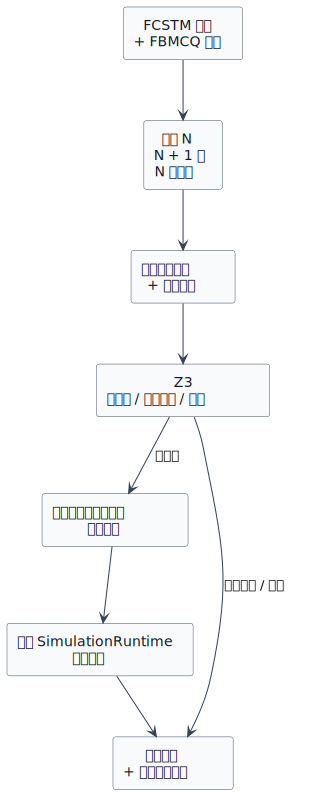
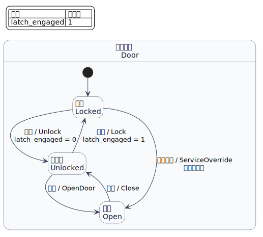

第一次有界模型检查
==================

本教程是教程路径的最后一站。你应该已经能读懂 FCSTM 模型和一条具体仿真轨迹。现在换一个问题：
不再由人手工选择一组事件并观察结果，而是让求解器搜索 **有限边界内模型允许的全部事件选择**，
它能否找到安全违规？

示例是带机械锁舌的门控制器。其中一条维护路径开门时没有释放锁舌。你将写出安全性质，让有界模型检查
找到这条路径，读懂反例，修复模型，再用同一条性质复查。

完整流程
--------

有界模型检查（bounded model checking，BMC）把状态机的一段有限前缀转换成一个符号公式，
再交给 Z3 检查。若公式可满足，系统把求解结果解码为公开轨迹，并在命令行报告可信轨迹之前，
先用 :class:`pyfcstm.simulate.SimulationRuntime` 重放。

先分清各层职责：

* **FCSTM 模型** 定义哪些行为可能发生；
* **FBMCQ 性质** 说明希望找到或排除哪种行为；
* **边界** 限制符号搜索包含多少个宏步；
* **求解状态** 描述公式是否可满足，**性质结论** 才回答用户写下的性质在边界内是否成立；
* 可满足时得到的解码轨迹叫 **见证（witness）**；若它推翻安全性质，同一条轨迹也叫 **反例（counterexample）**；
* **重放（replay）** 检查解码轨迹是否与可执行运行时一致。

1. 找出安全规则
---------------

控制器把物理锁舌和逻辑状态分开记录：

.. code-block:: fcstm

   def int latch_engaged = 1;

   state Locked;
   state Unlocked;
   state Open;

   [*] -> Locked;

这些短声明位于完整模型的组合状态 ``state Door { ... }`` 内，因此后文路径写成
``Door.Locked`` 和 ``Door.Open``。这个片段用于说明状态与变量，不是可独立运行的
完整模型。

正常解锁路径先释放锁舌，再允许开门：

.. code-block:: fcstm

   Locked -> Unlocked : Unlock effect {
       latch_engaged = 0;
   }
   Unlocked -> Open : OpenDoor;

维护路径更短，却有缺陷：

.. code-block:: fcstm

   Locked -> Open : ServiceOverride;

这条转换把逻辑状态改成 ``Open``，却让 ``latch_engaged`` 保持 ``1``。真正危险的不是“门打开”本身，
而是“门已打开 **并且** 物理锁舌仍然啮合”的状态与数据组合。

正文只展示理解所需的短片段；:download:`完整缺陷模型可在此下载 <first_check.fcstm>`。

2. 写性质，而不是预先写求解结论
---------------------------------

查询使用 ``forbid``，因为搜索范围内绝不能出现危险组合：

.. literalinclude:: door_latch_safety.fbmcq
   :language: text
   :caption: ``door_latch_safety.fbmcq``

:download:`下载性质文件 <door_latch_safety.fbmcq>`，并把它与模型放在同一目录。
后续命令使用这些简短的本地文件名，因此不依赖仓库内部路径。

它的含义是：

   对两个宏步以内表示的每条执行，禁止出现 ``Door.Open`` 活跃且
   ``latch_engaged == 1`` 的观测帧。

``forbid`` 是 **反例极性（counterexample polarity）** 性质。求解器不会直接证明上面的中文句子，
而是搜索它的反面：是否存在一条允许轨迹包含被禁止的条件。因此：

* SAT 表示找到反例，所以性质 **不成立**；
* UNSAT 表示编码范围内不存在反例，所以性质在这个边界内 **成立**。

正因为存在这种极性映射，用户应该先读带极性语义的首行，再把求解状态当作支持证据。
``WITNESS FOUND`` 表示存在量化搜索找到了一条执行，并不表示所有执行都满足谓词。
``PROPERTY GUARANTEED`` 只用于反例搜索已经在完整的有界响应窗口中找不到反例的情况。

3. 把边界 2 展开为帧和步
-------------------------

**帧（frame）** 是控制状态和全部持久变量的一次符号快照。**步（step）** 连接相邻两帧。
一个 BMC 步表示一个 FCSTM **宏步（macro-step）**：从一个可观察边界到下一个可观察边界的一次运行周期，
其中包括被选中的宏分支（例如初始进入、事件转换、回退或终止吸收）及其有序动作。

边界为 :math:`N` 时，BMC 分配 :math:`N+1` 帧和 :math:`N` 步：

.. list-table:: 边界为 2 的搜索范围
   :header-rows: 1
   :widths: 16 22 25 37

   * - 项目
     - 编号
     - 示例观测
     - 含义
   * - 帧
     - ``0``
     - 冷启动标记，``latch_engaged=1``
     - 第一个编码宏步之前的快照。其控制值是 ``STATE_INIT`` 哨兵，
       不是具名 FCSTM 状态，因而 ``active(...)`` 为假。
   * - 步
     - ``0``
     - 初始进入
     - 从冷启动进入 ``Door.Locked``。
   * - 帧
     - ``1``
     - ``Door.Locked``，``latch_engaged=1``
     - 初始进入后的快照。
   * - 步
     - ``1``
     - ``ServiceOverride``
     - 从 ``Locked`` 直接进入 ``Open``。
   * - 帧
     - ``2``
     - ``Door.Open``，``latch_engaged=1``
     - 最终快照；危险条件在这里为真。

这个差一边界规则很重要：``<= 2`` 不是两张快照，而是至多两个宏步，因此包含帧 ``0``、``1``、``2``。
查询没有描述帧 ``3`` 或更晚行为。

4. 运行搜索
-----------

用缺陷模型运行安全性质：

.. code-block:: bash

   python -m pyfcstm bmc \
       -i first_check.fcstm \
       -q door_latch_safety.fbmcq \
       --color never

实际耗时会变化，报告结构保持稳定：

.. code-block:: text

   BMC forbid <= 2: PROPERTY DOES NOT HOLD WITHIN BOUND; COUNTEREXAMPLE FOUND
   Scenario: FEASIBLE
   Primary search: COUNTEREXAMPLE = SAT
   Conclusion: At least one admissible execution violates the forbid property within 2 macro-steps.

   Solver: SAT in ... ms
   Replay: verified (3 frames, 2 steps).

   Trace
     0: init -> Door.Locked [initial]
     1: Door.Locked -> Door.Open [transition; events=Door.ServiceOverride]

按顺序解释：

1. ``PROPERTY DOES NOT HOLD WITHIN BOUND; COUNTEREXAMPLE FOUND`` 是面向用户的结论。
2. ``SAT`` 表示反例目标存在满足赋值。
3. ``3 frames, 2 steps`` 与边界为 2 的搜索范围一致。
4. ``Replay: verified`` 表示解码后的事件序列在运行时重现了公开观测；它是一致性门禁，不是无界证明。
5. 轨迹指出缺陷来源：求解器选择了 ``ServiceOverride``。

正常的 ``Unlock`` 再 ``OpenDoor`` 路径还需要在冷启动初始进入之后执行两个宏步，
也就是总计三个宏步。边界 2 容不下该路径，却刚好容纳直达的 ``ServiceOverride``；
这条轨迹也展示了所选边界如何决定能观察到哪些反例。

命令退出状态为 ``1``，因为性质在边界内为假。这是有效 BMC 报告，不是解析错误或命令调用失败。

5. 修复模型，保持性质不变
-------------------------

应该修复转换，而不是放宽查询：

.. code-block:: fcstm

   Locked -> Open : ServiceOverride effect {
       latch_engaged = 0;
   }

:download:`下载修复后的模型 <first_check_fixed.fcstm>`，再用同一条性质运行：

.. code-block:: bash

   python -m pyfcstm bmc \
       -i first_check_fixed.fcstm \
       -q door_latch_safety.fbmcq \
       --color never

结果变为：

.. code-block:: text

   BMC forbid <= 2: PROPERTY GUARANTEED WITHIN BOUND; NO COUNTEREXAMPLE
   Scenario: FEASIBLE
   Primary search: COUNTEREXAMPLE = UNSAT
   Conclusion: Every admissible execution within 2 macro-steps satisfies the forbid property.

   Solver: UNSAT in ... ms

公式不可满足，因为编码范围内每条通往 ``Door.Open`` 的路径都会释放锁舌。命令退出状态为 ``0``。
这只证明至多两个宏步的模型行为中不存在危险组合；它不证明无界不变式，不验证模型遗漏的环境行为，
也不证明 FCSTM 模型与物理门完全一致。

6. 保存简短的机器可读结果
-------------------------

持续集成或其他工具使用 ``--json``。缺陷性质仍以 ``1`` 退出，因此 shell 应把它看作预期的负性质结论，
而不是命令调用失败：

.. code-block:: bash

   python -m pyfcstm bmc \
       -i first_check.fcstm \
       -q door_latch_safety.fbmcq \
       --json -o /tmp/door-bmc.json || test $? -eq 1

完整 JSON 包含每一帧和每一步。判断这个结果只需要先看以下稳定字段：

.. code-block:: json

   {
     "result": {
       "status": "sat",
       "outcome": "property_violated",
       "property_satisfied": false
     },
     "replay": {"ok": true},
     "exit_code": 1
   }

不要快照 ``elapsed_ms``，它是实时耗时。也不要只根据 ``status`` 推断性质真假；应读取 ``outcome`` 或
``property_satisfied``。

7. 认识其他非普通结论
---------------------

上面的两次运行都有确定结论。其他报告需要不同处理：

.. list-table:: 不是普通成立或不成立的结果
   :header-rows: 1
   :widths: 16 10 31 43

   * - 结果
     - 退出状态
     - 含义
     - 下一步
   * - ``timeout``
     - ``3``
     - Z3 超过单次检查的时间限制。
     - 增加超时，或缩小、简化有界问题。
   * - ``unknown``
     - ``3``
     - Z3 没有返回 SAT 或 UNSAT，并在可用时给出原因。
     - 保留诊断，不能把性质称为真或假。
   * - ``incomplete``
     - ``3``
     - ``response`` 主检查为 UNSAT，但独立边界检查没有证明后缀安全。先看
       ``incomplete_status``：SAT 表示响应窗口被截断；``unknown`` 或
       ``timeout`` 表示这次诊断检查没有确定结论。
     - SAT 时增大边界，因为增加求解时间不会产生缺失的帧；``unknown`` 或
       ``timeout`` 时检查求解原因、简化问题或增大 ``--timeout-ms``。
   * - 重放不匹配
     - ``4``
     - SAT 见证已经解码，但运行时观测不一致。
     - 把性质结论视为不可信，并报告实现一致性问题。

只有 ``response`` 拥有可能产生 ``incomplete`` 的独立边界公式。库级
``unchecked`` 状态和完整退出优先级矩阵见 :doc:`../../reference/bmc_results/index_zh`。

概念检查点
----------

现在应该能区分以下概念：

* **仿真 / 有界模型检查**：一条选定执行 / 在边界内符号搜索允许执行；
* **帧 / 步**：一次快照 / 连接相邻快照的宏步关系；
* **性质 / 求解目标**：用户声明 / 求解器实际搜索满足赋值的公式；
* **SAT / 性质成立**：公式有满足赋值 / 经过极性解释后可能成立也可能不成立的用户结论；
* **见证 / 反例**：任意解码后的 SAT 轨迹 / 推翻反例极性性质的见证；
* **解码 / 重放**：把求解值投影成轨迹 / 按运行时语义执行该轨迹并比较观测。

后续阅读
--------

按概念依赖顺序继续：

1. :doc:`../../explanations/bmc_semantics/index_zh` 解释帧、宏步分支、转换关系和有界核心公式。
2. :doc:`../../explanations/bmc_properties/index_zh` 比较七类性质目标、量词、极性和定义性。
3. :doc:`../../explanations/bmc_solving/index_zh` 区分求解、见证解码、运行时重放和可信边界。
4. 建立心智模型后，再用 :doc:`../../how_to/bmc/index_zh` 完成可重复任务。
5. 精确语法和结果契约查 :doc:`../../reference/bmc_query/index_zh` 与
   :doc:`../../reference/bmc_results/index_zh`。
