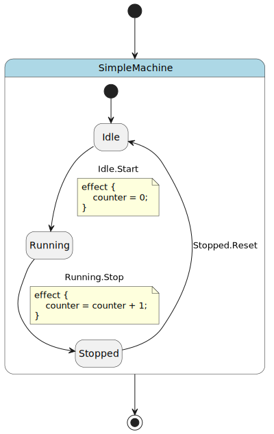
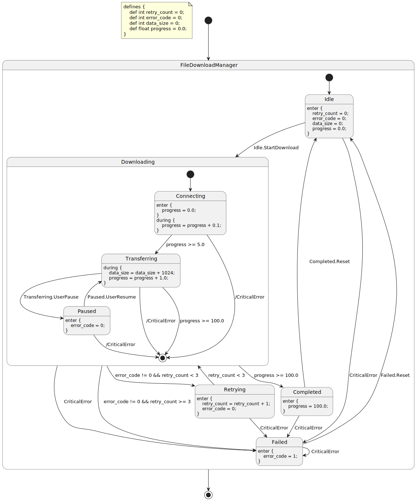

PyFCSTM Command Line Interface Guide
===============================================

pyfcstm is a powerful state machine DSL tool that provides a command-line interface for parsing, visualizing, and generating code from hierarchical finite state machines.

Installation
---------------------------------------

Installation Methods
~~~~~~~~~~~~~~~~~~~~~~~~~~~~~~~~~

**1. pip Installation** (Recommended):

.. code-block:: bash

   pip install pyfcstm

After installation, you can use the ``pyfcstm`` command directly.

**2. Module Execution**:

.. code-block:: bash

   python -m pyfcstm

**3. Pre-compiled Executable**:

Download pre-compiled versions from GitHub Releases:
https://github.com/HansBug/pyfcstm/releases

Verifying Installation
~~~~~~~~~~~~~~~~~~~~~~~~~~~~~~~~~

Check the installed version:

.. literalinclude:: version_check.demo.sh
   :language: bash

Output:

.. literalinclude:: version_check.demo.sh.txt
   :language: text

Getting Help
---------------------

The CLI provides comprehensive help for all commands:

.. literalinclude:: help_example.demo.sh
   :language: bash

This will show:

.. literalinclude:: help_example.demo.sh.txt
   :language: text

Command Reference
-------------------------------------

plantuml Command
~~~~~~~~~~~~~~~~~~~~~~~~~~~~~~

Convert state machine DSL code to PlantUML format for visualization.

**Syntax**:

.. code-block:: bash

   pyfcstm plantuml -i <input_file> [-o <output_file>]

**Parameters**:

- ``-i, --input-code``: Path to input state machine DSL file (required)
- ``-o, --output``: Path to output PlantUML file (optional, outputs to stdout if not specified)

**Example 1: Simple State Machine**

Let's start with a simple state machine:

.. literalinclude:: simple_machine.fcstm
   :language: fcstm
   :caption: simple_machine.fcstm

Generate PlantUML diagram:

.. code-block:: bash

   pyfcstm plantuml -i simple_machine.fcstm -o simple_machine.puml

The generated PlantUML file can be rendered using:

- **Online**: Visit https://www.plantuml.com/plantuml/uml/ and paste the code
- **Local**: Install PlantUML (https://plantuml.com/) and run:

  .. code-block:: bash

     plantuml simple_machine.puml

**Generated State Diagram**:

**Example 2: File Download Manager**

Here's a more complex example with hierarchical states, retry logic, and error handling:

.. literalinclude:: file_download.fcstm
   :language: fcstm
   :caption: file_download.fcstm

This example demonstrates:

- **Hierarchical states**: ``Downloading`` contains nested substates (``Connecting``, ``Transferring``, ``Paused``)
- **Retry logic**: Automatic retry with counter tracking when errors occur
- **Guard conditions**: ``Downloading -> Retrying : if [error_code != 0 && retry_count < 3]`` with complex conditional logic
- **Lifecycle actions**: ``enter`` and ``during`` actions for state initialization and continuous processing
- **Forced transitions**: ``!* -> Failed :: CriticalError`` creates emergency exit paths from all substates
- **Progress tracking**: Variables track download progress, data size, and error states

Generate the diagram:

.. code-block:: bash

   pyfcstm plantuml -i file_download.fcstm -o file_download.puml

**Generated State Diagram**:

**Output to Console**

You can also output PlantUML directly to the console for quick inspection:

.. code-block:: bash

   pyfcstm plantuml -i simple_machine.fcstm

This is useful for:

- Quick verification of DSL syntax
- Piping output to other tools
- Integration with CI/CD pipelines

generate Command
~~~~~~~~~~~~~~~~~~~~~~~~~~~~~~

Generate executable code from state machine DSL using customizable templates.

**Syntax**:

.. code-block:: bash

   pyfcstm generate -i <input_file> -t <template_dir> -o <output_dir> [--clear]

**Parameters**:

- ``-i, --input-code``: Path to input state machine DSL file (required)
- ``-t, --template-dir``: Path to template directory (required)
- ``-o, --output-dir``: Output directory for generated code (required)
- ``--clear``: Clear output directory before generation (optional)

**How It Works**

The ``generate`` command uses a template-based code generation system:

1. **Parse DSL**: Reads and parses the ``.fcstm`` file into an internal model
2. **Load Templates**: Reads Jinja2 templates from the template directory
3. **Render Code**: Processes templates with the state machine model as context
4. **Output Files**: Writes generated code to the output directory

**Template Structure**

A template directory must contain:

- ``config.yaml``: Configuration file defining expression styles, filters, and globals
- ``*.j2``: Jinja2 template files for code generation
- Static files: Copied directly to output (preserve directory structure)

**Example: Generating C Code**

.. code-block:: bash

   # Generate C code from traffic light state machine
   pyfcstm generate -i traffic_light.fcstm -t ./templates/c -o ./output

   # Clear output directory before generating
   pyfcstm generate -i traffic_light.fcstm -t ./templates/c -o ./output --clear

**Example: Generating Python Code**

.. code-block:: bash

   # Generate Python code
   pyfcstm generate -i simple_machine.fcstm -t ./templates/python -o ./output

**Template Context**

Templates have access to the complete state machine model:

- ``model``: Root state machine object
- ``model.variables``: Variable definitions
- ``model.walk_states()``: Iterator over all states
- ``state.name``, ``state.is_leaf_state``, ``state.transitions``
- ``transition.from_state``, ``transition.to_state``, ``transition.guard``

**Expression Rendering**

Use the ``expr_render`` filter to convert DSL expressions to target language syntax:

.. code-block:: jinja

   // C-style expression
   {{ expr | expr_render(style='c') }}

   # Python-style expression
   {{ expr | expr_render(style='python') }}

Common Use Cases
-------------------------------------

Workflow 1: DSL to Diagram
~~~~~~~~~~~~~~~~~~~~~~~~~~~~~~

Visualize your state machine design:

.. code-block:: bash

   # 1. Write your state machine DSL
   vim my_machine.fcstm

   # 2. Generate PlantUML
   pyfcstm plantuml -i my_machine.fcstm -o my_machine.puml

   # 3. Render diagram (online or local)
   plantuml my_machine.puml

Workflow 2: DSL to Code
~~~~~~~~~~~~~~~~~~~~~~~~~~~~~~

Generate executable code for embedded systems:

.. code-block:: bash

   # 1. Design state machine
   vim controller.fcstm

   # 2. Generate C code
   pyfcstm generate -i controller.fcstm -t ./templates/c -o ./src/generated --clear

   # 3. Integrate with your project
   make build

Workflow 3: Validation and Testing
~~~~~~~~~~~~~~~~~~~~~~~~~~~~~~

Validate DSL syntax before committing:

.. code-block:: bash

   # Quick syntax check (generates PlantUML)
   pyfcstm plantuml -i machine.fcstm > /dev/null && echo "Syntax OK"

   # Generate test code
   pyfcstm generate -i machine.fcstm -t ./templates/test -o ./tests/generated

Workflow 4: CI/CD Integration
~~~~~~~~~~~~~~~~~~~~~~~~~~~~~~

Automate code generation in your build pipeline:

.. code-block:: bash

   #!/bin/bash
   # build.sh

   # Validate all DSL files
   for file in src/machines/*.fcstm; do
       echo "Validating $file..."
       pyfcstm plantuml -i "$file" > /dev/null || exit 1
   done

   # Generate code
   pyfcstm generate -i src/machines/main.fcstm -t templates/ -o generated/ --clear

   # Build project
   make all

Best Practices
-------------------------------------

DSL File Organization
~~~~~~~~~~~~~~~~~~~~~~~~~~~~~~

- Use descriptive filenames: ``traffic_light.fcstm``, ``user_auth.fcstm``
- Keep related state machines in a dedicated directory: ``src/machines/``
- Version control your ``.fcstm`` files alongside code

Template Management
~~~~~~~~~~~~~~~~~~~~~~~~~~~~~~

- Maintain separate template directories for each target language
- Use ``config.yaml`` to define language-specific expression styles
- Test templates with sample state machines before production use

Code Generation
~~~~~~~~~~~~~~~~~~~~~~~~~~~~~~

- Always use ``--clear`` flag in automated builds to ensure clean output
- Review generated code before committing (add to ``.gitignore`` if regenerated)
- Document which DSL files generate which output files
