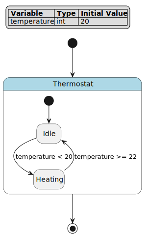

.. _sec-tutorials-dsl:

Write your first FCSTM DSL model
================================

.. contents:: Page map
   :local:
   :depth: 2

What this tutorial covers
-------------------------

This page is the first-success path for the FCSTM DSL. It builds one small
thermostat model, runs it, and shows how to read the first inspect report. It
intentionally stays narrow: once you have the first model working, use the other
DSL pages for breadth.

* :doc:`../../how_to/dsl/index` answers concrete authoring questions with
  recipes, examples, commands, expected diagnostics, and repair steps.
* :doc:`../../reference/dsl/index` is the syntax reference and coverage index.
* :doc:`../../explanations/dsl_semantics/index` explains runtime meaning,
  ownership, combo expansion, forced expansion, and import assembly.
* :doc:`../../reference/diagnostics_codes/index` explains diagnostic codes and
  target-profile warnings.

All commands below are meant to be copied from the repository root.

Step 1: create the smallest shape
---------------------------------

A normal ``.fcstm`` file starts with persistent variables and then exactly one
root ``state``. A practical root is usually composite because it owns child
states and an initial transition.

.. code-block:: fcstm

   def int temperature = 20;

   state Thermostat {
       [*] -> Idle;
       state Idle;
   }

The ``def`` line allocates model state. It is not a block-local variable. The
root state then becomes the ownership tree for child states, events, transitions,
lifecycle actions, and imports.

Step 2: add another leaf and guards
-----------------------------------

A leaf state ends with ``;``. A transition written in ``Thermostat`` can use the
child names owned directly by ``Thermostat``.

.. code-block:: fcstm

   def int temperature = 20;

   state Thermostat {
       [*] -> Idle;
       state Idle;
       state Heating;

       Idle -> Heating : if [temperature < 20];
       Heating -> Idle : if [temperature >= 22];
   }

The guard after ``: if`` is a condition expression. The variable
``temperature`` is a numeric expression; the comparisons turn it into a
condition.

Step 3: add lifecycle actions
-----------------------------

A leaf ``during`` action runs on an ordinary active cycle. An ``enter`` action
runs when the state is entered. This version changes ``temperature`` so both
guards can eventually change truth value.

Patch fragment: replace the two leaf declarations from Step 2 with the two
state blocks below. This snippet is not a complete ``.fcstm`` file by itself;
Step 4 shows the checked complete model.

.. code-block:: fcstm

   state Idle {
       during {
           temperature = temperature - 1;
       }
   }

   state Heating {
       enter {
           temperature = temperature + 1;
       }
       during {
           temperature = temperature + 1;
       }
   }

Operation blocks contain statements such as assignments and ``if`` blocks. A
name assigned inside a block before it is declared as ``def`` is a temporary for
that block only; the how-to page shows this in a complete example.

Step 4: inspect the complete file
---------------------------------

The complete tutorial model is checked in as ``first_thermostat.fcstm``:

.. literalinclude:: first_thermostat.fcstm
   :language: fcstm
   :caption: ``docs/source/tutorials/dsl/first_thermostat.fcstm``

The diagram gives the same model shape visually:

   ``Thermostat`` is the authored root composite state. ``Idle`` and
   ``Heating`` are authored leaf states, and the guarded edges come directly
   from ``Idle -> Heating`` and ``Heating -> Idle`` in the DSL. The initial
   edge ``[*] -> Idle`` selects the first active leaf. This first diagram has
   no generated states, which makes it a useful baseline before you study
   combo or forced expansion.

Inspect it from the repository root:

.. code-block:: bash

   pyfcstm inspect -i docs/source/tutorials/dsl/first_thermostat.fcstm --format human --color never

Expected short output:

.. code-block:: text

   [OK] FCSTM Inspect Report: docs/source/tutorials/dsl/first_thermostat.fcstm

   Summary
     status: ok
     root: Thermostat
     states: 3 total / 2 leaf
     transitions: 3
     variables: 1
     diagnostics: 0 errors / 0 warnings / 0 infos

   No diagnostics.

If this command reports errors, fix those before trying simulation or code
generation. Warnings and infos are still worth reading because they usually say
which target profile, transition, variable, or source span needs attention.

Step 5: run two cycles
----------------------

Run a short batch simulation:

.. code-block:: bash

   pyfcstm simulate -i docs/source/tutorials/dsl/first_thermostat.fcstm --no-color -e "cycle; cycle; current"

The important lines are:

.. code-block:: text

   Cycle: 1
   Current State: Thermostat.Idle
   Variables:
     temperature = 19

   Cycle: 2
   Current State: Thermostat.Heating
   Variables:
     temperature = 21

The first cycle enters ``Idle`` and runs its ``during`` action. On the second
cycle the ``Idle -> Heating`` guard is true, so the transition fires and
``Heating.enter`` runs.

Step 6: repair one deliberate syntax error
------------------------------------------

Inspect is also the fastest way to repair a small DSL mistake. Ordinary event
syntax and ordinary guard syntax are separate transition forms, so this
intentionally bad fixture fails:

.. literalinclude:: event_guard_mixed_invalid.fcstm.txt
   :language: fcstm
   :caption: Intentional parser error; expected excerpt: ``Unexpected token 'if'``.

Run it as a normal input file:

.. code-block:: bash

   pyfcstm inspect -i docs/source/tutorials/dsl/event_guard_mixed_invalid.fcstm.txt --format human --color never

The useful excerpt is:

.. code-block:: text

   Syntax error at line 7, column 17, near 'if': Unexpected token 'if'

Repair it by using combo syntax when both an event term and a guard term are
part of the same trigger:

.. code-block:: fcstm

   A -> B :: Go + [ready > 0];

That is the minimal loop to practice on every future model change: run
``pyfcstm inspect``, read the code and source span, then repair the DSL form
that the diagnostic points to.

Step 7: learn the next DSL feature deliberately
-----------------------------------------------

Do not jump from this tutorial straight into a giant model. Add one DSL feature
at a time and verify the inspect output after each change.

.. list-table:: Next steps
   :header-rows: 1
   :widths: 24 38 38

   * - Goal
     - Start with
     - Why
   * - Add source-local, parent, or root events
     - :ref:`dsl-event-scopes-task`
     - Event scope changes who owns and reuses the event name.
   * - Add effects, temporaries, and ``if`` blocks
     - :ref:`dsl-guards-effects-task`
     - Effects mutate variables at transition time, not while guards are being tested.
   * - Use the full expression language
     - :ref:`dsl-expression-safety-task`
     - Numeric expressions, condition expressions, and ternary forms have different legal contexts.
   * - Reuse lifecycle behavior
     - :ref:`dsl-lifecycle-task`
     - ``abstract`` and ``ref`` are the bridge from DSL structure to generated runtime hooks.
   * - Model multi-term triggers
     - :ref:`dsl-combo-transition-task`
     - Combo transitions expand into pseudo relay states while preserving authored semantics.
   * - Apply one declaration to many sources
     - :ref:`dsl-forced-transition-task`
     - Forced transitions are expansion shorthand and intentionally have no effect block.
   * - Split a model across files
     - :ref:`dsl-import-task`
     - Imports assemble state-machine modules and rewrite variables/events according to mappings.
   * - Repair diagnostics
     - :ref:`dsl-diagnostics-task`
     - Inspect diagnostics include code, severity, source span, refs, and suggested fixes.
