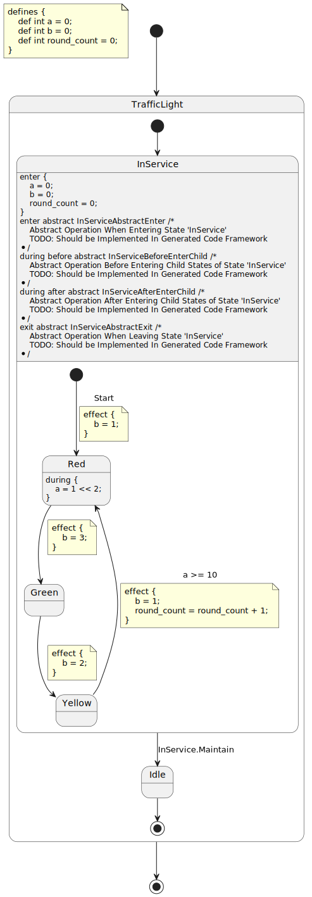

PyFCSTM DSL Syntax Tutorial
========================================

Overview
----------------------------------------------------

The PyFCSTM Domain Specific Language (DSL) provides a comprehensive syntax for defining hierarchical finite state machines with expressions, conditions, and lifecycle actions. This tutorial covers all language constructs, semantic rules, and best practices for writing correct DSL programs.

Language Structure
----------------------------------------------------

Program Organization
~~~~~~~~~~~~~~~~~~~~~~~~~~~~~~~~~~~~~~~~~~~~~~~~

A complete DSL program consists of optional variable definitions followed by a single root state definition:

.. code-block::

   program ::= def_assignment* state_definition EOF

The top-level structure ensures every state machine has exactly one root state that may contain nested substates and transitions.

Variable Definitions
----------------------------------------------------

Syntax
~~~~~~~~~~~~~~~~~~~~~~~~~~~~~~~~~~~~~~~~~~~~~~~~

Variable definitions declare typed variables with initial values using the ``def`` keyword:

.. code-block::

   def_assignment ::= 'def' ('int'|'float') ID '=' init_expression ';'

Correct Usage
~~~~~~~~~~~~~~~~~~~~~~~~~~~~~~~~~~~~~~~~~~~~~~~~

**Integer Variables:**

- ``def int counter = 0;``
- ``def int max_attempts = 5;``
- ``def int flags = 0xFF;``

**Float Variables:**

- ``def float temperature = 25.5;``
- ``def float pi_value = pi;``
- ``def float ratio = 3.14 * 2;``

Semantic Rules
~~~~~~~~~~~~~~~~~~~~~~~~~~~~~~~~~~~~~~~~~~~~~~~~

Variable definitions must follow these semantic constraints:

1. **Unique Names**: Each variable name must be unique within the program scope
2. **Type Consistency**: Initial expressions must evaluate to values compatible with the declared type
3. **Expression Validity**: Initial expressions can only reference mathematical constants and literals

Common Errors
~~~~~~~~~~~~~~~~~~~~~~~~~~~~~~~~~~~~~~~~~~~~~~~~

**Incorrect Usage:**

- Duplicate definitions: ``def int x = 1; def float x = 2.0;`` (semantic error)
- Undefined references: ``def int y = unknown_var;`` (semantic error)
- Type mismatches: Variables must use appropriate types for their intended values

State Definitions
----------------------------------------------------

Syntax Types
~~~~~~~~~~~~~~~~~~~~~~~~~~~~~~~~~~~~~~~~~~~~~~~~

The DSL supports two types of state definitions:

.. code-block::

   state_definition ::= leafStateDefinition | compositeStateDefinition
   leafStateDefinition ::= 'state' ID ';'
   compositeStateDefinition ::= 'state' ID '{' state_inner_statement* '}'

Leaf States
~~~~~~~~~~~~~~~~~~~~~~~~~~~~~~~~~~~~~~~~~~~~~~~~

Leaf states represent terminal states with no internal structure:

**Correct Usage:**

- ``state Idle;``
- ``state Running;``
- ``state Error;``

Leaf states are the simplest form and typically represent final operational states.

Composite States
~~~~~~~~~~~~~~~~~~~~~~~~~~~~~~~~~~~~~~~~~~~~~~~~

Composite states contain nested substates, transitions, and lifecycle actions:

**Correct Usage:**

.. code-block::

   state Machine {
       state Off;
       state On {
           state Slow;
           state Fast;
       }

       [*] -> Off;
       Off -> On: if [power_switch == 1];
       On -> Off: if [power_switch == 0];
   }

Semantic Rules
~~~~~~~~~~~~~~~~~~~~~~~~~~~~~~~~~~~~~~~~~~~~~~~~

State definitions must adhere to these semantic constraints:

1. **Unique Names**: State names must be unique within their containing scope
2. **Entry Transitions**: Composite states must have at least one entry transition (``[*] -> state``)
3. **State References**: All transition targets must reference existing states
4. **Hierarchical Consistency**: Nested states follow proper parent-child relationships

Common Errors
~~~~~~~~~~~~~~~~~~~~~~~~~~~~~~~~~~~~~~~~~~~~~~~~

**Incorrect Usage:**

- Missing entry transitions in composite states (semantic error)
- Duplicate state names within the same scope (semantic error)
- Self-referential state hierarchies (structural error)

Transition Definitions
----------------------------------------------------

Transition Types
~~~~~~~~~~~~~~~~~~~~~~~~~~~~~~~~~~~~~~~~~~~~~~~~

The DSL supports three types of transitions with distinct syntax patterns:

.. code-block::

   transition_definition ::= entryTransitionDefinition | normalTransitionDefinition | exitTransitionDefinition

Entry Transitions
~~~~~~~~~~~~~~~~~~~~~~~~~~~~~~~~~~~~~~~~~~~~~~~~

Entry transitions define the initial state when entering a composite state:

**Syntax:** ``[*] -> target_state [: chain_id|:: event_name] [if [condition]] [effect { operations }] ';'``

**Correct Usage:**

- ``[*] -> Idle;``
- ``[*] -> Running: startup_event;``
- ``[*] -> Active: if [initialized == 0x1];``
- ``[*] -> Ready effect { counter = 0; }``

Normal Transitions
~~~~~~~~~~~~~~~~~~~~~~~~~~~~~~~~~~~~~~~~~~~~~~~~

Normal transitions connect two named states:

**Syntax:** ``from_state -> to_state [: chain_id|:: event_name] [if [condition]] [effect { operations }] ';'``

**Correct Usage:**

- ``Idle -> Running;``
- ``Slow -> Fast : speed_up;``
- ``Slow -> Fast :: speed_up;`` (this is different from the above one, will explain it later)
- ``Active -> Inactive: if [timeout > 100];``
- ``Processing -> Complete effect { result = output; }``

Exit Transitions
~~~~~~~~~~~~~~~~~~~~~~~~~~~~~~~~~~~~~~~~~~~~~~~~

Exit transitions define how to leave a composite state:

**Syntax:** ``from_state -> [*] [: chain_id|:: event_name] [if [condition]] [effect { operations }] ';'``

**Correct Usage:**

- ``Error -> [*];``
- ``Complete -> [*]: finish_event;``
- ``Running -> [*]: if [shutdown_requested];``
- ``Active -> [*] effect { cleanup_flag = 0x1; }``

Chain Identifiers
~~~~~~~~~~~~~~~~~~~~~~~~~~~~~~~~~~~~~~~~~~~~~~~~

Chain identifiers provide hierarchical event naming using dot notation:

**Correct Usage:**

- ``State1 -> State2: event_name;``
- ``Parent -> Child: parent.child.event;``
- ``Active -> Idle: system.shutdown.requested;``

It's worth noting that when using:

.. code-block::

   state Root {
       [*] -> A;
       A -> B : E;
       B -> C : E;
   }

This means that the events triggering both ``A -> B`` and ``B -> C`` transitions will be the same event, specifically the event E under the Root namespace, i.e., ``Root.E``. If you wish to distinguish between these two events, meaning you don't want to trigger two different transitions based on the same event, you should write:

.. code-block::

   state Root {
       [*] -> A;
       A -> B : A.E;
       B -> C : B.E;
   }

In this case, the two events are using ``Root.A.E`` and ``Root.B.E`` respectively, achieving the distinction.

Additionally, to simplify this expression, we provide an extra syntactic sugar:

.. code-block::

   state Root {
       [*] -> A;
       A -> B :: E;
       B -> C :: E;
   }

When using the ``::`` symbol, it means using the event under the namespace of the source state, so this syntax sugar expression is completely equivalent to the method above. Specifically, for ``[*] -> A``, using the ``::`` symbol is equivalent to using ``:``.

Semantic Rules
~~~~~~~~~~~~~~~~~~~~~~~~~~~~~~~~~~~~~~~~~~~~~~~~

Transitions must satisfy these semantic constraints:

1. **State Existence**: Both source and target states must exist in the current scope
2. **Variable Validity**: All variables in conditions and effects must be declared
3. **Expression Types**: Guard conditions must evaluate to boolean values
4. **Entry Requirements**: Composite states require at least one entry transition

Common Errors
~~~~~~~~~~~~~~~~~~~~~~~~~~~~~~~~~~~~~~~~~~~~~~~~

**Incorrect Usage:**

- References to undefined states (semantic error)
- Missing entry transitions for composite states (semantic error)
- Invalid variable references in conditions or effects (semantic error)
- Malformed chain identifiers with invalid dot notation (syntax error)

Expression System
----------------------------------------------------

Expression Hierarchy
~~~~~~~~~~~~~~~~~~~~~~~~~~~~~~~~~~~~~~~~~~~~~~~~

The DSL supports comprehensive expression types for mathematical and logical operations:

.. code-block::

   init_expression ::= conditional_expression
   num_expression ::= conditional_expression
   cond_expression ::= conditional_expression

Literal Values
~~~~~~~~~~~~~~~~~~~~~~~~~~~~~~~~~~~~~~~~~~~~~~~~

**Integer Literals:**

- Decimal: ``42``, ``0``, ``123``
- Hexadecimal: ``0xFF``, ``0x2A``, ``0x100``

**Float Literals:**

- Standard: ``3.14``, ``2.5``, ``0.1``
- Scientific: ``1e6``, ``2.5e-3``, ``1E10``
- Mathematical constants: ``pi``, ``E``, ``tau``

**Boolean Literals:**

- True values: ``true``, ``True``, ``TRUE``
- False values: ``false``, ``False``, ``FALSE``

Operators
~~~~~~~~~~~~~~~~~~~~~~~~~~~~~~~~~~~~~~~~~~~~~~~~

**Arithmetic Operators (by precedence):**

1. Parentheses: ``()``
2. Unary: ``+``, ``-``
3. Power: ``**``
4. Multiplication/Division: ``*``, ``/``, ``%``
5. Addition/Subtraction: ``+``, ``-``

**Comparison Operators:**

- Relational: ``<``, ``>``, ``<=``, ``>=``
- Equality: ``==``, ``!=``

**Logical Operators:**

- Unary: ``!``, ``not``
- Binary: ``&&``, ``||``, ``and``, ``or``

**Bitwise Operators:**

- Bitwise: ``&``, ``|``, ``^``
- Shift: ``<<``, ``>>``

Mathematical Functions
~~~~~~~~~~~~~~~~~~~~~~~~~~~~~~~~~~~~~~~~~~~~~~~~

The DSL provides extensive mathematical function support:

**Trigonometric Functions:**

- Basic: ``sin(x)``, ``cos(x)``, ``tan(x)``
- Inverse: ``asin(x)``, ``acos(x)``, ``atan(x)``
- Hyperbolic: ``sinh(x)``, ``cosh(x)``, ``tanh(x)``

**Exponential and Logarithmic:**

- ``exp(x)``, ``log(x)``, ``log10(x)``, ``log2(x)``

**Other Mathematical Functions:**

- ``sqrt(x)``, ``abs(x)``, ``ceil(x)``, ``floor(x)``, ``round(x)``

Conditional Expressions
~~~~~~~~~~~~~~~~~~~~~~~~~~~~~~~~~~~~~~~~~~~~~~~~

Conditional expressions use ternary operator syntax:

**Syntax:** ``(condition) ? true_value : false_value``

**Correct Usage:**

- ``(x > 0) ? 1 : -1``
- ``(temperature > 25.0) ? "hot" : "cold"``
- ``(count == 0) ? initial_value : current_value``

It is worth noting that you must use a ``()`` outside the condition explicitly. This is quite different from common coding languages.

Semantic Rules
~~~~~~~~~~~~~~~~~~~~~~~~~~~~~~~~~~~~~~~~~~~~~~~~

Expressions must follow these semantic constraints:

1. **Variable Declarations**: All referenced variables must be declared
2. **Type Consistency**: Operations must be performed on compatible types
3. **Function Arguments**: Mathematical functions require appropriate argument types
4. **Boolean Context**: Conditional guards must evaluate to boolean values

Common Errors
~~~~~~~~~~~~~~~~~~~~~~~~~~~~~~~~~~~~~~~~~~~~~~~~

**Incorrect Usage:**

- Undefined variable references (semantic error)
- Type mismatches in operations (semantic error)
- Invalid function arguments (semantic error)
- Malformed conditional expressions (syntax error)

Lifecycle Actions
----------------------------------------------------

Action Types
~~~~~~~~~~~~~~~~~~~~~~~~~~~~~~~~~~~~~~~~~~~~~~~~

States support three lifecycle phases with corresponding action definitions:

.. code-block::

   enter_definition ::= enterOperations | enterAbstractFunc
   during_definition ::= duringOperations | duringAbstractFunc
   exit_definition ::= exitOperations | exitAbstractFunc

Enter Actions
~~~~~~~~~~~~~~~~~~~~~~~~~~~~~~~~~~~~~~~~~~~~~~~~

Enter actions execute when a state is entered:

**Concrete Operations:**

.. code-block::

   enter {
       counter = 0;
       status_flag = 0x1;
   }

**Abstract Functions:**

.. code-block::

   enter abstract initialize_system;
   enter abstract setup_resources /*
       Initialize system resources
   */

It is worth noting that the ``/* xxx */`` part of the abstract enter function is a part of the enter declaration, and it can be reflected in the code generation stage.

During Actions
~~~~~~~~~~~~~~~~~~~~~~~~~~~~~~~~~~~~~~~~~~~~~~~~

During actions execute while a state is active, with optional aspects for composite states:

**Before Aspect (Composite States Only):**

.. code-block::

   during before {
       update_counters = update_counters + 1;
   }

**After Aspect (Composite States Only):**

.. code-block::

   during after {
       cleanup_temporary = 0x1;
   }

**Regular During Actions (Leaf State Only):**

.. code-block::

   during {
       heartbeat_counter = heartbeat_counter + 1;
   }

**Abstract During Actions:**

.. code-block::

   during abstract abstract_during;
   during abstract abstract_during_with_comment /*
       This is the comment
   */

It is worth noting that the ``/* xxx */`` part of the abstract during function is a part of the during declaration, and it can be reflected in the code generation stage.

Exit Actions
~~~~~~~~~~~~~~~~~~~~~~~~~~~~~~~~~~~~~~~~~~~~~~~~

Exit actions execute when leaving a state:

**Concrete Operations:**

.. code-block::

   exit {
       save_state = current_value;
       cleanup_flag = 0x1;
   }

**Abstract Functions:**

.. code-block::

   exit abstract cleanup_resources;
   exit abstract finalize_operations /*
       Clean up before exit
   */

It is worth noting that the ``/* xxx */`` part of the abstract exit function is a part of the exit declaration, and it can be reflected in the code generation stage.

Semantic Rules
~~~~~~~~~~~~~~~~~~~~~~~~~~~~~~~~~~~~~~~~~~~~~~~~

Lifecycle actions must adhere to these constraints:

1. **Variable Validity**: All referenced variables must be declared
2. **Aspect Restrictions**: ``before`` and ``after`` aspects only apply to composite states
3. **Assignment Targets**: Only declared variables can be assigned values
4. **Expression Types**: Assignment expressions must be type-compatible

Common Errors
~~~~~~~~~~~~~~~~~~~~~~~~~~~~~~~~~~~~~~~~~~~~~~~~

**Incorrect Usage:**

- Undefined variable assignments (semantic error)
- Invalid aspect usage on leaf states (semantic error)
- Type mismatches in assignments (semantic error)
- Malformed abstract function declarations (syntax error)

**PlantUML Diagram Placeholder: Lifecycle Action Flow**

Operational Statements
----------------------------------------------------

Assignment Types
~~~~~~~~~~~~~~~~~~~~~~~~~~~~~~~~~~~~~~~~~~~~~~~~

The DSL supports different assignment contexts with distinct operators:

**Operation Assignment:**

- Syntax: ``variable = expression;``
- Usage: Standard assignment in effect blocks and lifecycle actions

Correct Usage
~~~~~~~~~~~~~~~~~~~~~~~~~~~~~~~~~~~~~~~~~~~~~~~~

**In Effect Blocks:**

.. code-block::

   State1 -> State2 effect {
       counter = counter + 1;
       status = 1;
       result = sin(angle) * radius;
   }

**In Lifecycle Actions:**

.. code-block::

   enter {
       initialization_flag = 0x1;
       start_time = current_time;
   }

Semantic Rules
~~~~~~~~~~~~~~~~~~~~~~~~~~~~~~~~~~~~~~~~~~~~~~~~

Operational statements must satisfy:

1. **Variable Existence**: Target variables must be declared
2. **Expression Validity**: Right-hand expressions must be well-formed
3. **Type Compatibility**: Assignments must respect variable types
4. **Scope Validity**: Variables must be accessible in the current context

Common Errors
~~~~~~~~~~~~~~~~~~~~~~~~~~~~~~~~~~~~~~~~~~~~~~~~

**Incorrect Usage:**

- Assignment to undeclared variables (semantic error)
- Type mismatches in assignments (semantic error)
- Invalid expression syntax on right-hand side (syntax error)

Comments and Documentation
----------------------------------------------------

Comment Styles
~~~~~~~~~~~~~~~~~~~~~~~~~~~~~~~~~~~~~~~~~~~~~~~~

The DSL supports multiple comment formats for documentation:

**Line Comments:**

- C++ style: ``// This is a comment``
- Python style: ``# This is also a comment``

Documentation Best Practices
~~~~~~~~~~~~~~~~~~~~~~~~~~~~~~~~~~~~~~~~~~~~~~~~

Comments should be used to:

- Explain complex state machine logic
- Document variable purposes and constraints
- Clarify transition conditions and effects
- Provide context for abstract function implementations

Semantic Validation Rules
----------------------------------------------------

Comprehensive Validation
~~~~~~~~~~~~~~~~~~~~~~~~~~~~~~~~~~~~~~~~~~~~~~~~

The DSL parser performs extensive semantic validation during the parsing process:

**Variable Validation:**

1. Unique variable names across the program
2. All referenced variables must be declared
3. Type consistency in assignments and expressions

**State Validation:**

1. Unique state names within each scope
2. Valid state references in all transitions
3. Required entry transitions for composite states

**Expression Validation:**

1. Well-formed mathematical and logical expressions
2. Valid function calls with appropriate arguments
3. Proper operator precedence and associativity

**Structural Validation:**

1. Proper nesting of composite states
2. Valid lifecycle action placement
3. Correct transition connectivity

Error Handling
~~~~~~~~~~~~~~~~~~~~~~~~~~~~~~~~~~~~~~~~~~~~~~~~

The parser provides detailed error messages for common mistakes:

**Syntax Errors:**

- Malformed expressions and statements
- Missing punctuation and keywords
- Invalid token sequences

**Semantic Errors:**

- Undefined variable or state references
- Type mismatches in operations
- Structural inconsistencies

**PlantUML Diagram Placeholder: Validation Process Flow**

Advanced Patterns and Best Practices
----------------------------------------------------

Hierarchical State Organization
~~~~~~~~~~~~~~~~~~~~~~~~~~~~~~~~~~~~~~~~~~~~~~~~

Organize complex state machines using hierarchical decomposition:

.. code-block::

   state SystemController {
       state PowerManagement {
           state LowPower;
           state NormalPower;
           state HighPower;
       }

       state OperationalMode {
           state Idle;
           state Processing {
               state DataInput;
               state Computation;
               state OutputGeneration;
           }
       }
   }

Event-Driven Transitions
~~~~~~~~~~~~~~~~~~~~~~~~~~~~~~~~~~~~~~~~~~~~~~~~

Use chain identifiers to create clear event hierarchies:

.. code-block::

   ProcessingState -> IdleState: user.input.complete;
   IdleState -> ProcessingState: system.timer.expired;
   ErrorState -> RecoveryState: error.recovery.initiated;

Conditional Logic Patterns
~~~~~~~~~~~~~~~~~~~~~~~~~~~~~~~~~~~~~~~~~~~~~~~~

Implement complex decision logic using conditional expressions:

.. code-block::

   Active -> Standby: if [(battery_level < 20) && (charging_state == 0x0)];
   Normal -> Emergency: if [temperature > critical_temp || pressure > max_pressure];

Resource Management
~~~~~~~~~~~~~~~~~~~~~~~~~~~~~~~~~~~~~~~~~~~~~~~~

Use lifecycle actions for proper resource management:

.. code-block::

   state ResourceManager {
       enter {
           resource_count = 0;
           allocation_flag = 0x1;
       }

       during {
           heartbeat_counter = heartbeat_counter + 1;
       }

       exit {
           cleanup_flag = 0x1;
           resource_count = 0;
       }
   }

Integration with Code Generation
----------------------------------------------------

AST Export Interface
~~~~~~~~~~~~~~~~~~~~~~~~~~~~~~~~~~~~~~~~~~~~~~~~

All DSL constructs implement the AST export interface for code generation:

The parsed DSL programs can be converted back to AST nodes for code generation and analysis purposes. This enables round-trip conversion and integration with various target platforms.

PlantUML Export
~~~~~~~~~~~~~~~~~~~~~~~~~~~~~~~~~~~~~~~~~~~~~~~~

State machines can be exported to PlantUML format for visualization:

The PlantUML export provides graphical representation of state machine structure, transitions, and relationships, facilitating documentation and design review processes.

Here is a full example of FCSTM model DSL code

.. literalinclude:: example.fcstm
    :language: python
    :linenos:

It can be exported to PlantUML code, and get visualized as the following

Notes
----------------------------------------------------

This tutorial provides comprehensive coverage of the PyFCSTM DSL syntax based on the ANTLR grammar definition, AST node types, semantic validation rules, and extensive test cases. The language supports hierarchical state machines with rich expression capabilities, lifecycle management, and comprehensive validation to ensure correct state machine definitions.

For implementation details, refer to the grammar definition, parsing pipeline, and model system documentation. The test suite provides additional examples and validation patterns for complex use cases.

