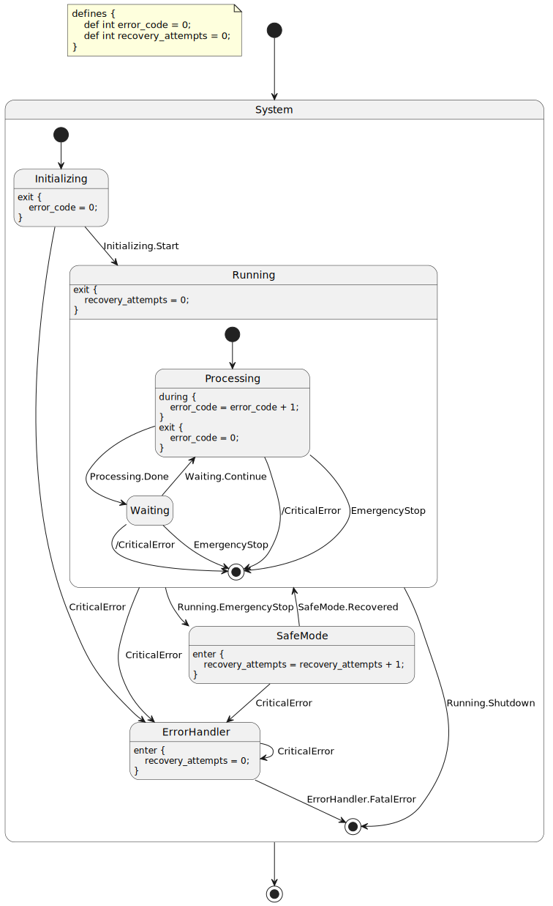
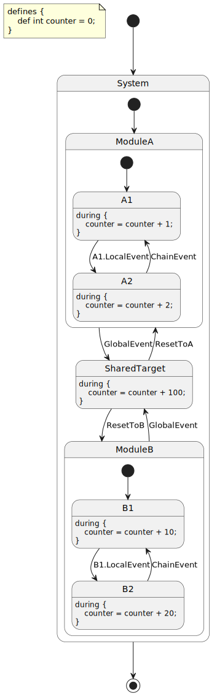
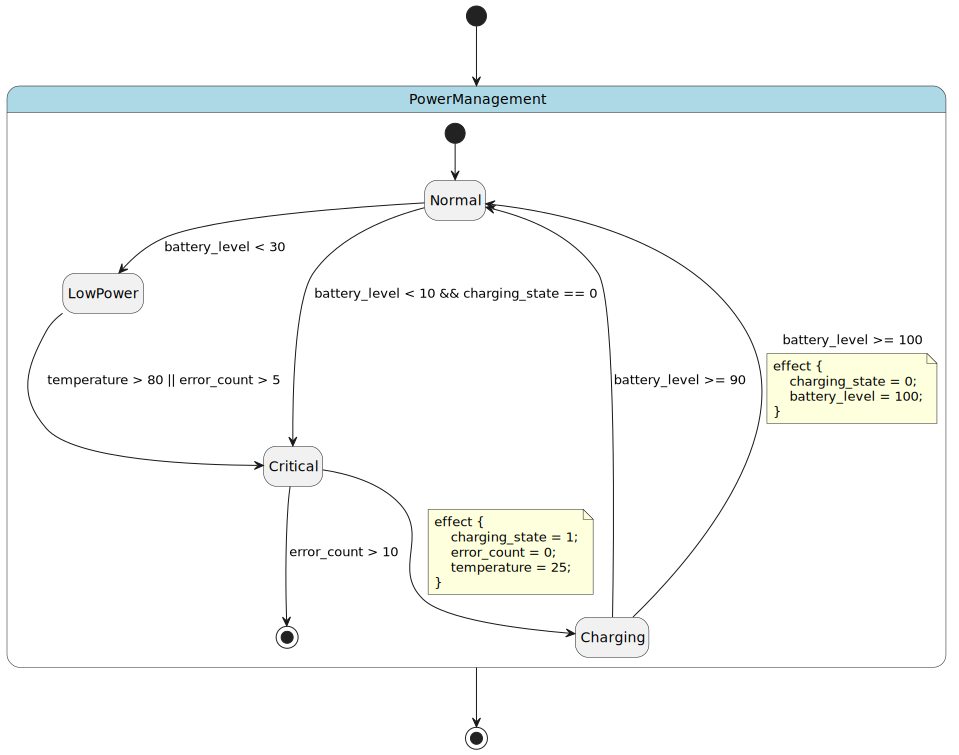
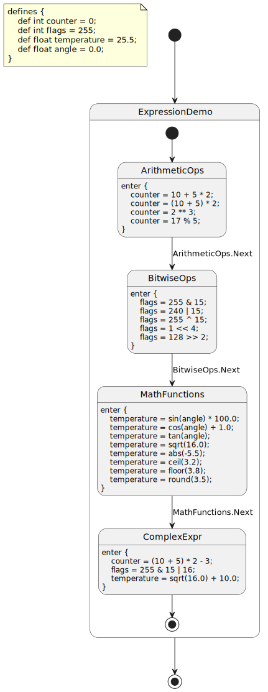
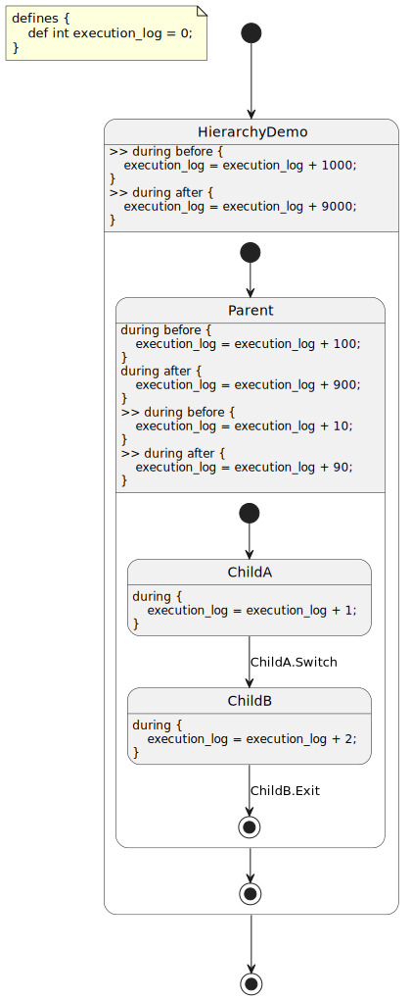
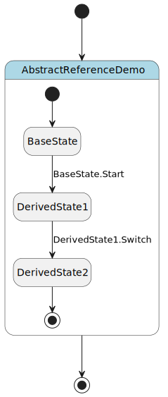
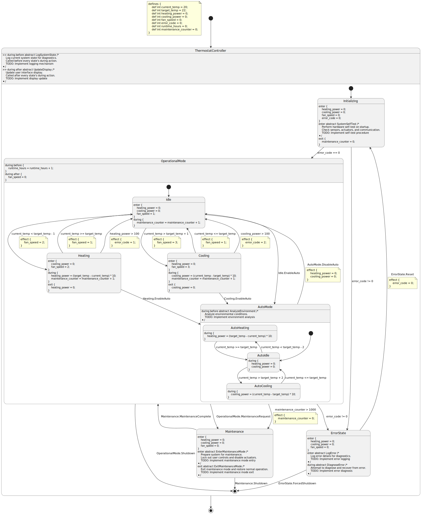
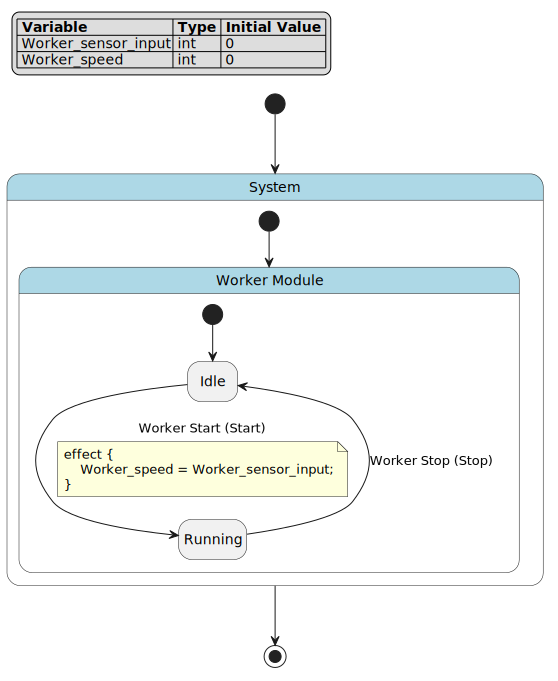
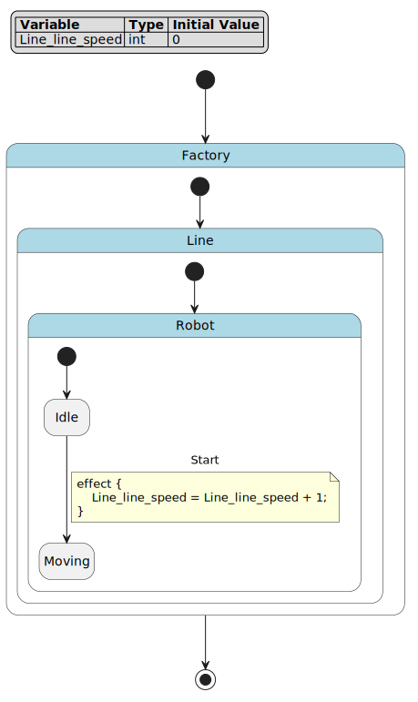

PyFCSTM DSL 语法教程
========================================

.. contents:: 目录
   :local:
   :depth: 3

概述
----------------------------------------------------

PyFCSTM 领域特定语言（DSL）提供了一套全面的语法，用于定义具有表达式、条件和生命周期动作的层次化有限状态机（Harel 状态图）。本教程涵盖所有语言构造、语义规则、执行模型以及编写正确高效 DSL 程序的最佳实践。

您将学到什么
~~~~~~~~~~~~~~~~~~~~~~~~~~~~~~~~~~~~~~~~~~~~~~~~

- 完整的 DSL 语法和文法规则
- 层次化状态机如何执行
- 事件作用域和命名空间解析
- 表达式系统和运算符
- 生命周期动作和面向切面编程
- 实际示例和设计模式

语言结构
----------------------------------------------------

程序组织
~~~~~~~~~~~~~~~~~~~~~~~~~~~~~~~~~~~~~~~~~~~~~~~~

一个完整的 DSL 程序由可选的变量定义和单个根状态定义组成：

.. code-block:: fcstm

   program ::= def_assignment* state_definition EOF

顶层结构确保每个状态机恰好有一个根状态，该根状态可以包含嵌套的子状态和转换。

.. note::
   解析器分多个阶段处理您的 DSL 文件：

   1. **词法分析**：将输入标记化为关键字、标识符、运算符和字面量
   2. **语法分析**：按照文法规则构建抽象语法树（AST）
   3. **语义验证**：验证变量引用、状态名称和类型一致性
   4. **模型构建**：将 AST 转换为可执行的状态机模型

变量定义
----------------------------------------------------

语法
~~~~~~~~~~~~~~~~~~~~~~~~~~~~~~~~~~~~~~~~~~~~~~~~

变量定义使用 ``def`` 关键字声明带有初始值的类型化变量：

.. code-block:: fcstm

   def_assignment ::= 'def' ('int'|'float') ID '=' init_expression ';'

.. important::
   变量对整个状态机是全局的，可以从任何状态、转换或表达式中访问。DSL 支持两种基本类型：

   - **int**：32 位有符号整数，支持十进制（``42``）、十六进制（``0xFF``）和二进制（``0b1010``）字面量
   - **float**：双精度浮点数，支持标准表示法（``3.14``）和科学计数法（``1e-6``）

   所有变量必须在声明时初始化。初始表达式可以包括：

   - 字面量值（``0``、``3.14``、``0xFF``）
   - 数学常量（``pi``、``E``、``tau``）
   - 算术表达式（``3.14 * 2``、``10 + 5``）
   - 数学函数（``sin(0)``、``sqrt(16)``）

正确用法
~~~~~~~~~~~~~~~~~~~~~~~~~~~~~~~~~~~~~~~~~~~~~~~~

**整数变量：**

.. code-block:: fcstm

   def int counter = 0;              // 简单初始化
   def int max_attempts = 5;         // 常量值
   def int flags = 0xFF;             // 十六进制字面量
   def int mask = 0b11110000;        // 二进制字面量
   def int computed = 10 * 5 + 3;    // 表达式初始化

**浮点变量：**

.. code-block:: fcstm

   def float temperature = 25.5;     // 十进制表示法
   def float pi_value = pi;          // 数学常量
   def float ratio = 3.14 * 2;       // 表达式初始化
   def float scientific = 1.5e-3;    // 科学计数法
   def float computed = sqrt(16.0);  // 函数调用

**带注释的示例：**

.. code-block:: fcstm

   // 系统状态变量
   def int system_state = 0;         // 0=初始化, 1=运行中, 2=错误
   def int error_count = 0;          // 跟踪错误发生次数

   // 传感器读数
   def float temperature = 20.0;     // 当前温度（摄氏度）
   def float target_temp = 22.0;     // 目标温度

   // 控制输出
   def int heating_power = 0;        // 加热功率（0-100%）
   def int fan_speed = 0;            // 风扇速度（0-3）

   // 系统状态的位标志
   def int status_flags = 0x00;      // 位 0：加热，位 1：冷却
                                     // 位 2：风扇，位 3：错误

语义规则
~~~~~~~~~~~~~~~~~~~~~~~~~~~~~~~~~~~~~~~~~~~~~~~~

变量定义必须遵循以下语义约束：

1. **唯一名称**：每个变量名在程序作用域内必须唯一
2. **类型一致性**：初始表达式必须求值为与声明类型兼容的值
3. **表达式有效性**：初始表达式只能引用数学常量和字面量（不能引用其他变量）
4. **声明顺序**：变量必须在根状态定义之前声明

.. tip::
   **为什么有这些规则？**

   - **唯一名称**：防止整个状态机中变量引用的歧义
   - **类型一致性**：确保类型安全并防止生成代码中的运行时错误
   - **表达式有效性**：简化初始化并确保确定性的启动状态
   - **声明顺序**：保持数据定义和行为定义之间的清晰分离

常见错误
~~~~~~~~~~~~~~~~~~~~~~~~~~~~~~~~~~~~~~~~~~~~~~~~

**错误用法：**

.. code-block:: fcstm

   // 错误：重复的变量名
   def int x = 1;
   def float x = 2.0;  // 语义错误：'x' 已定义

   // 错误：初始化中的未定义引用
   def int y = unknown_var;  // 语义错误：'unknown_var' 未定义

   // 错误：引用另一个变量
   def int a = 10;
   def int b = a;  // 语义错误：初始化中不能引用变量

**正确的替代方案：**

.. code-block:: fcstm

   // 使用唯一名称
   def int x_int = 1;
   def float x_float = 2.0;

   // 使用字面量或常量初始化
   def int y = 0;

   // 在状态动作中赋值变量
   def int a = 10;
   def int b = 0;

   state Init {
       enter {
           b = a;  // 在生命周期动作中赋值
       }
   }

状态定义
----------------------------------------------------

.. note::
   有限状态机（FSM）是一种计算模型，在任何给定时间只能处于一个状态。机器响应事件在状态之间转换，在这些转换期间执行动作。层次化状态机（Harel 状态图）通过允许状态包含嵌套的子状态来扩展这一概念，实现模块化和可扩展的设计。

语法类型
~~~~~~~~~~~~~~~~~~~~~~~~~~~~~~~~~~~~~~~~~~~~~~~~

DSL 支持两种基本类型的状态定义：

.. code-block:: fcstm

   state_definition ::= leafStateDefinition | compositeStateDefinition
   leafStateDefinition ::= ['pseudo'] 'state' ID [named STRING] ';'
   compositeStateDefinition ::= ['pseudo'] 'state' ID [named STRING] '{' state_inner_statement* '}'

.. tip::
   **关键区别：**

   - **叶状态**：没有内部结构的终端状态；表示原子操作模式
   - **复合状态**：包含嵌套子状态的容器状态；表示层次化分解

叶状态
~~~~~~~~~~~~~~~~~~~~~~~~~~~~~~~~~~~~~~~~~~~~~~~~

叶状态表示没有内部结构的终端状态。它们是状态机的基本构建块。

**正确用法：**

.. code-block:: fcstm

   state Idle;                      // 简单叶状态
   state Running;                   // 另一个叶状态
   state Error;                     // 错误状态

   // 带显示名称的叶状态
   state Running named "系统运行中";

   // 伪叶状态（跳过祖先切面动作）
   pseudo state SpecialState;

.. tip::
   **何时使用叶状态：**

   - 表示原子操作模式（空闲、运行、错误）
   - 层次化分解中的最终状态
   - 具有简单、不可分解行为的状态

**带注释的示例：**

.. code-block:: fcstm

   state TrafficLight {
       // 表示灯光颜色的叶状态
       state Red;      // 停止信号
       state Yellow;   // 警告信号
       state Green;    // 通行信号

       [*] -> Red;
       Red -> Green :: TimerExpired;
       Green -> Yellow :: TimerExpired;
       Yellow -> Red :: TimerExpired;
   }

复合状态
~~~~~~~~~~~~~~~~~~~~~~~~~~~~~~~~~~~~~~~~~~~~~~~~

复合状态包含嵌套的子状态、转换和生命周期动作。它们实现复杂行为的层次化分解。

**正确用法：**

.. code-block:: fcstm

   state Machine {
       // 嵌套子状态
       state Off;
       state On {
           state Slow;
           state Fast;

           [*] -> Slow;
           Slow -> Fast :: SpeedUp;
           Fast -> Slow :: SlowDown;
       }

       // 顶层状态之间的转换
       [*] -> Off;
       Off -> On : if [power_switch == 1];
       On -> Off : if [power_switch == 0];
   }

.. important::
   当复合状态处于活动状态时，其子状态中恰好有一个也处于活动状态。这创建了一个层次化的执行上下文：

   1. **进入**：进入复合状态时，入口转换（``[*] -> ChildState``）决定哪个子状态变为活动状态
   2. **期间**：活动时，复合状态的 ``during before/after`` 动作围绕子状态的动作执行
   3. **退出**：离开复合状态时，活动的子状态首先退出，然后复合状态退出

**带注释的示例：**

.. code-block:: fcstm

   state PowerManagement {
       // 复合状态生命周期动作
       enter {
           // 从外部进入 PowerManagement 时执行
           power_level = 0;
       }

       during before {
           // 从外部进入子状态时执行
           // 在子状态之间转换时不执行
           monitor_counter = monitor_counter + 1;
       }

       during after {
           // 从子状态退出到外部时执行
           // 在子状态之间转换时不执行
           cleanup_flag = 1;
       }

       exit {
           // 离开 PowerManagement 到外部时执行
           power_level = 0;
       }

       // 子状态
       state LowPower {
           during {
               power_level = 10;
           }
       }

       state NormalPower {
           during {
               power_level = 50;
           }
       }

       state HighPower {
           during {
               power_level = 100;
           }
       }

       [*] -> LowPower;
       LowPower -> NormalPower :: Increase;
       NormalPower -> HighPower :: Increase;
       HighPower -> NormalPower :: Decrease;
       NormalPower -> LowPower :: Decrease;
   }

伪状态
~~~~~~~~~~~~~~~~~~~~~~~~~~~~~~~~~~~~~~~~~~~~~~~~

伪状态是跳过祖先切面动作的特殊状态（叶状态或复合状态）。它们对于实现需要绕过横切关注点的特殊行为很有用。

**语法：**

.. code-block:: fcstm

   pseudo state StateName;
   pseudo state StateName { ... }

.. note::
   普通状态执行父状态中定义的祖先切面动作（``>> during before/after``）。伪状态跳过这些切面动作，提供了一种选择退出横切行为的方法。

**对比示例：**

.. literalinclude:: pseudo_state_demo.fcstm
    :language: fcstm
    :linenos:

**执行对比：**

当 ``RegularState`` 处于活动状态时：

1. 根 ``>> during before`` 执行（``aspect_counter += 1``）
2. ``RegularState.during`` 执行（``aspect_counter += 10``）
3. 根 ``>> during after`` 执行（``aspect_counter += 100``）
4. **每个周期的总增量**：111

当 ``SpecialState``\ （伪状态）处于活动状态时：

1. 根 ``>> during before`` **跳过**
2. ``SpecialState.during`` 执行（``aspect_counter += 10``）
3. 根 ``>> during after`` **跳过**
4. **每个周期的总增量**：10

.. tip::
   **何时使用伪状态：**

   - 实现绕过正常监控的异常处理器
   - 创建用于测试或调试的特殊状态
   - 通过跳过开销来优化性能关键状态

命名状态
~~~~~~~~~~~~~~~~~~~~~~~~~~~~~~~~~~~~~~~~~~~~~~~~

状态可以有显示名称用于文档和可视化目的：

.. code-block:: fcstm

   state Running named "系统运行中";
   state Error named "错误状态 - 需要手动重置";
   state Init named "初始化阶段";

显示名称用于 PlantUML 图表和生成的文档，而状态 ID 用于代码生成。

语义规则
~~~~~~~~~~~~~~~~~~~~~~~~~~~~~~~~~~~~~~~~~~~~~~~~

状态定义必须遵守以下语义约束：

1. **唯一名称**：状态名称在其包含作用域内必须唯一（但可以在不同作用域中重用）
2. **入口转换**：复合状态必须至少有一个入口转换（``[*] -> state``）
3. **状态引用**：所有转换目标必须引用当前作用域中的现有状态
4. **层次一致性**：嵌套状态遵循正确的父子关系
5. **切面限制**：``during before/after``\ （不带 ``>>``）仅适用于复合状态

.. tip::
   **为什么有这些规则？**

   - **唯一名称**：防止转换目标和事件作用域的歧义
   - **入口转换**：确保进入复合状态时的确定性行为
   - **状态引用**：防止悬空转换并确保连通性
   - **层次一致性**：维护正确的状态机结构
   - **切面限制**：强制叶状态与复合状态的正确生命周期语义

常见错误
~~~~~~~~~~~~~~~~~~~~~~~~~~~~~~~~~~~~~~~~~~~~~~~~

**错误用法：**

.. code-block:: fcstm

   // 错误：缺少入口转换
   state Container {
       state A;
       state B;
       A -> B :: Event;  // 没有 [*] -> A 或 [*] -> B
   }

   // 错误：同一作用域中的重复状态名
   state Root {
       state Child;
       state Child;  // 语义错误：重复名称
   }

   // 错误：无效的转换目标
   state Root {
       state A;
       [*] -> A;
       A -> B :: Event;  // 语义错误：B 不存在
   }

   // 错误：叶状态上的 during before/after
   state LeafState {
       during before {  // 语义错误：叶状态不能有切面
           x = 1;
       }
   }

**正确的替代方案：**

.. code-block:: fcstm

   // 提供入口转换
   state Container {
       state A;
       state B;
       [*] -> A;  // 需要入口转换
       A -> B :: Event;
   }

   // 使用唯一名称
   state Root {
       state ChildA;
       state ChildB;
   }

   // 定义所有引用的状态
   state Root {
       state A;
       state B;
       [*] -> A;
       A -> B :: Event;
   }

   // 对叶状态使用普通 during
   state LeafState {
       during {  // 正确：没有切面关键字
           x = 1;
       }
   }

转换定义
----------------------------------------------------

.. note::
   转换定义状态机如何响应事件或条件从一个状态移动到另一个状态。每个转换可以有：

   - **源状态**：转换起源的状态
   - **目标状态**：转换指向的状态
   - **事件**：激活转换的可选触发器
   - **守卫条件**：转换触发必须为真的可选布尔表达式
   - **效果**：转换期间执行的可选动作

转换类型
~~~~~~~~~~~~~~~~~~~~~~~~~~~~~~~~~~~~~~~~~~~~~~~~

DSL 支持三种具有不同语法模式的转换类型：

.. code-block:: fcstm

   transition_definition ::= entryTransitionDefinition | normalTransitionDefinition | exitTransitionDefinition

入口转换
~~~~~~~~~~~~~~~~~~~~~~~~~~~~~~~~~~~~~~~~~~~~~~~~

入口转换定义进入复合状态时的初始状态。它们使用伪状态 ``[*]`` 作为源。

**语法：** ``[*] -> target_state [: chain_id|:: event_name] [if [condition]] [effect { operations }] ';'``

**正确用法：**

.. code-block:: fcstm

   [*] -> Idle;                                    // 简单入口
   [*] -> Running : startup_event;                 // 带链事件的入口
   [*] -> Running :: startup_event;                // 带本地事件的入口
   [*] -> Active : if [initialized == 0x1];        // 带守卫条件的入口
   [*] -> Ready effect { counter = 0; };           // 带效果的入口
   [*] -> Running : if [mode == 1] effect {        // 带守卫和效果的入口
       counter = 0;
       status = 1;
   };

.. note::
   当从外部进入复合状态时，入口转换决定哪个子状态变为活动状态。守卫条件（如果存在）会被评估，如果为真，效果（如果存在）会在进入目标状态之前执行。

普通转换
~~~~~~~~~~~~~~~~~~~~~~~~~~~~~~~~~~~~~~~~~~~~~~~~

普通转换连接同一作用域内的两个命名状态。

**语法：** ``from_state -> to_state [: chain_id|:: event_name] [if [condition]] [effect { operations }] ';'``

**正确用法：**

.. code-block:: fcstm

   Idle -> Running;                                // 简单转换
   Slow -> Fast : speed_up;                        // 带链事件的转换
   Slow -> Fast :: speed_up;                       // 带本地事件的转换
   Active -> Inactive : if [timeout > 100];        // 带守卫条件的转换
   Processing -> Complete effect {                 // 带效果的转换
       result = output;
       status = 1;
   };
   Running -> Idle : if [stop_requested] effect {  // 守卫和效果
       cleanup_flag = 1;
   };

.. note::
   普通转换在源状态的"during"阶段进行评估。当事件被触发（如果指定）且守卫条件为真（如果指定）时，转换触发：

   1. 源状态的退出动作执行
   2. 转换效果执行（如果存在）
   3. 目标状态的进入动作执行

退出转换
~~~~~~~~~~~~~~~~~~~~~~~~~~~~~~~~~~~~~~~~~~~~~~~~

退出转换定义如何离开复合状态到其父状态。它们使用伪状态 ``[*]`` 作为目标。

**语法：** ``from_state -> [*] [: chain_id|:: event_name] [if [condition]] [effect { operations }] ';'``

**正确用法：**

.. code-block:: fcstm

   Error -> [*];                                   // 简单退出
   Complete -> [*] : finish_event;                 // 带事件的退出
   Running -> [*] : if [shutdown_requested];       // 带守卫条件的退出
   Active -> [*] effect {                          // 带效果的退出
       cleanup_flag = 0x1;
   };
   Processing -> [*] : if [done] effect {          // 守卫和效果
       result = final_value;
   };

.. note::
   退出转换允许子状态发出完成信号并将控制权返回给父状态。然后父状态可以转换到另一个状态或自己退出。

强制转换
~~~~~~~~~~~~~~~~~~~~~~~~~~~~~~~~~~~~~~~~~~~~~~~~

强制转换是一种\ **语法糖**\ ，自动扩展为多个普通转换。它们对于定义从多个状态到共同目标的转换非常有用，无需重复代码，特别适用于错误处理或紧急情况。

**语法：**

.. code-block:: fcstm

   // 从特定状态的强制转换
   ! from_state -> to_state [: chain_id|:: event_name] [if [condition]] ';'

   // 从特定状态的强制退出
   ! from_state -> [*] [: chain_id|:: event_name] [if [condition]] ';'

   // 从所有子状态的强制转换（通配符）
   ! * -> to_state [: chain_id|:: event_name] [if [condition]] ';'

   // 从所有子状态的强制退出
   ! * -> [*] [: chain_id|:: event_name] [if [condition]] ';'

.. important::
   强制转换是一种\ **语法糖**\ ，在模型构建期间扩展。当你编写：

   .. code-block:: fcstm

      state Parent {
          ! * -> ErrorHandler :: CriticalError;

          state Child1;
          state Child2;
      }

   解析器自动从\ **所有子状态**\ 生成普通转换：

   .. code-block:: fcstm

      // 扩展的转换（自动生成）：
      Child1 -> ErrorHandler : CriticalError;
      Child2 -> ErrorHandler : CriticalError;

   **重要**：这些是\ **普通转换** - 它们像任何其他转换一样执行退出动作。

**关键特性：**

1. **语法糖**：在模型构建期间扩展为多个普通转换
2. **通配符扩展**：``! *`` 从当前作用域中的所有子状态生成转换
3. **层次传播**：强制转换递归传播到嵌套的子状态
4. **共享事件对象**：所有扩展的转换共享\ **相同的事件对象**
5. **无效果块**：强制转换不能有效果块（语法限制）
6. **正常执行**：退出动作正常执行 - 强制转换只是常规转换

.. tip::
   **何时使用强制转换：**

   - **避免重复代码**：定义一个转换而不是许多相同的转换
   - **错误处理**：从任何状态转换到错误处理器
   - **紧急关闭**：从所有状态转换到关闭状态
   - **超时处理**：跨多个状态统一处理超时

.. code-block:: fcstm

   state System {
       // 从任何状态强制转换到错误处理器
       ! * -> ErrorHandler :: CriticalError;

       // 从特定状态强制转换
       ! Running -> SafeMode :: EmergencyStop;

       // 从任何状态强制退出
       ! * -> [*] :: FatalError;

       // 带守卫条件
       ! * -> ErrorHandler : if [error_code > 100];

       state Running {
           exit {
               // 此退出动作在转换时会执行
               cleanup_flag = 1;
           }
       }

       state ErrorHandler;
   }

**何时使用强制转换：**

- **避免重复代码**：定义一个转换而不是许多相同的转换
- **错误处理**：从任何状态转换到错误处理器
- **紧急关闭**：从所有状态转换到关闭状态
- **超时处理**：跨多个状态统一处理超时

**完整示例：**

.. literalinclude:: forced_transitions.fcstm
    :language: fcstm
    :linenos:

**可视化：**

**扩展行为：**

当在 ``System`` 中定义 ``! * -> ErrorHandler :: CriticalError`` 时，它扩展为：

.. code-block:: fcstm

   // 从直接子状态
   Running -> ErrorHandler :: CriticalError;
   Idle -> ErrorHandler :: CriticalError;
   SafeMode -> ErrorHandler :: CriticalError;
   ErrorHandler -> ErrorHandler :: CriticalError;

   // 传播到嵌套子状态（Running.Processing、Running.Waiting）
   // 在 Running 状态内部生成：
   Processing -> [*] : /CriticalError;  // 退出到父状态，然后父状态转换
   Waiting -> [*] : /CriticalError;

**事件共享：**

单个强制转换定义扩展的所有转换共享\ **相同的事件对象**\ 。这意味着：

.. code-block:: fcstm

   state System {
       ! * -> ErrorHandler :: CriticalError;

       state A;
       state B;
       state C;
   }

   // 所有这些转换使用相同的事件对象：
   // A -> ErrorHandler :: CriticalError
   // B -> ErrorHandler :: CriticalError
   // C -> ErrorHandler :: CriticalError
   // 当你触发 CriticalError 时，所有匹配的转换都可以触发

.. warning::
   1. **普通转换**：扩展的转换是普通转换 - 退出动作会执行
   2. **事件共享**：所有扩展的转换共享相同的事件对象
   3. **无效果块**：强制转换不能有效果块（使用目标状态的进入动作）
   4. **作用域限制**：``! *`` 应用于直接子状态，但递归传播
   5. **事件作用域**：事件作用域规则（``:`` vs ``::``）正常应用

**常见错误：**

.. code-block:: fcstm

   // 错误：强制转换不能有效果块
   ! * -> ErrorHandler :: Error effect {  // 语法错误
       error_code = 1;
   };

   // 错误：强制转换必须引用现有状态
   ! * -> NonExistentState :: Error;  // 语义错误

**正确的替代方案：**

.. code-block:: fcstm

   // 在目标状态的进入动作中初始化
   state ErrorHandler {
       enter {
           error_code = 1;  // 在目标状态中初始化
       }
   }

   ! * -> ErrorHandler :: Error;  // 正确：无效果块

事件定义
----------------------------------------------------

事件是触发状态转换的核心机制。在有限状态机中，状态转换通常由外部事件驱动——例如用户输入、传感器信号、定时器到期或系统消息。事件为状态机提供了响应外部刺激的能力，使其能够根据当前状态和接收到的事件做出相应的行为变化。

在 PyFCSTM DSL 中，事件可以通过两种方式定义：

1. **隐式定义**：在转换中直接引用事件名称，事件会自动创建
2. **显式定义**：使用 ``event`` 关键字预先声明事件，并可选地提供显示名称

显式事件定义
~~~~~~~~~~~~~~~~~~~~~~~~~~~~~~~~~~~~~~~~~~~~~~~~

事件可以在状态作用域内使用 ``event`` 关键字显式定义：

**语法：**

.. code-block:: fcstm

   event_definition ::= 'event' ID ('named' STRING)? ';'

**示例：**

.. code-block:: fcstm

   event StartEvent;                              // 简单事件定义
   event ErrorOccurred named "错误发生";           // 带显示名称的事件
   event UserInput named "接收到用户输入";         // 带描述性名称的事件

**显式事件定义的目的：**

显式事件定义有几个重要用途：

1. **文档化**：显式声明状态作用域内使用的事件，提高代码清晰度和可维护性
2. **可视化**：``named`` 属性为 PlantUML 图表和文档生成提供人类可读的显示名称
3. **一致性**：与带有 ``named`` 的状态定义类似，事件定义支持可视化和文档工具

.. important::
   **与转换事件的关系：**

   显式事件定义和转换事件是\ **同一个事件系统**\ 的一部分。当您显式定义一个事件时，它可以在同一作用域内的转换中被引用。这些事件是统一的——在运行时，"显式定义的事件"和"转换事件"之间没有区别。

**完整示例：**

.. code-block:: fcstm

   state System {
       // 带显示名称的显式事件定义
       event Start named "系统启动";
       event Stop named "系统停止";
       event Pause named "系统暂停";
       event Resume named "系统恢复";

       state Idle;
       state Running;
       state Paused;

       [*] -> Idle;
       Idle -> Running : Start;      // 引用显式定义的 Start 事件
       Running -> Idle : Stop;       // 引用显式定义的 Stop 事件
       Running -> Paused : Pause;    // 引用显式定义的 Pause 事件
       Paused -> Running : Resume;   // 引用显式定义的 Resume 事件
   }

.. note::
   **关键要点：**

   - 显式事件定义是\ **可选的**\ ——事件可以在转换中使用而无需显式定义
   - ``named`` 属性是主要优势，为可视化（PlantUML、状态图）提供显示名称
   - 显式定义的事件遵循与转换事件相同的作用域规则（参见下面的事件作用域部分）
   - 显式定义提高了代码可读性、自文档化能力以及与可视化工具的集成
   - ``named`` 属性的工作方式与状态的 ``named`` 属性完全相同——它提供人类可读的标签

事件作用域
~~~~~~~~~~~~~~~~~~~~~~~~~~~~~~~~~~~~~~~~~~~~~~~~

在层次化状态机中，事件需要命名空间以避免命名冲突。

.. important::
   考虑这个场景：

   .. code-block:: fcstm

      state Root {
          state A;
          state B;
          state C;

          [*] -> A;
          A -> B : Event;  // 哪个 Event？
          B -> C : Event;  // 相同的 Event 还是不同的？
      }

   两个转换应该使用相同的事件还是不同的事件？DSL 提供\ **三种作用域机制**\ 来处理这个问题。

作用域机制
~~~~~~~~~~~~~~~~~~~~~~~~~~~~~~~~~~~~~~~~~~~~~~~~

DSL 支持三种指定事件作用域的方式：

1. **本地事件**\ （``::``）：作用域限定于源状态的命名空间
2. **链事件**\ （``:``）：作用域限定于父状态的命名空间
3. **绝对事件**\ （``/``）：作用域限定于根状态的命名空间

所有三种机制都等价于使用绝对路径，只是起始点不同。

本地事件（``::`` 运算符）
^^^^^^^^^^^^^^^^^^^^^^^^^^^^^^^^^^^^^^^^^^^^^^^^

本地事件使用 ``::`` 运算符，作用域限定于\ **源状态的命名空间**\ 。

**语法：** ``StateA -> StateB :: EventName;``

.. note::
   事件在源状态的命名空间中创建。每个源状态获得自己的事件。

**示例：**

.. code-block:: fcstm

   state Root {
       state A;
       state B;

       [*] -> A;
       A -> B :: E;     // 创建事件：Root.A.E
       B -> A :: E;     // 创建事件：Root.B.E（与上面不同）
   }

**等价的绝对路径：**

.. code-block:: fcstm

   // A -> B :: E  等价于：
   A -> B : /A.E

   // B -> A :: E  等价于：
   B -> A : /B.E

.. tip::
   **何时使用：**

   - 每个转换需要自己的唯一事件
   - 避免类似转换之间的命名冲突
   - 不应共享的状态特定事件

链事件（``:`` 运算符）
^^^^^^^^^^^^^^^^^^^^^^^^^^^^^^^^^^^^^^^^^^^^^^^^

链事件使用 ``:`` 运算符，作用域限定于\ **父状态的命名空间**\ 。

**语法：** ``StateA -> StateB : EventName;``

.. note::
   事件在父状态的命名空间中创建。同一作用域中的多个转换可以共享事件。

**示例：**

.. code-block:: fcstm

   state Root {
       state A;
       state B;
       state C;

       [*] -> A;
       A -> B : E;      // 创建事件：Root.E
       B -> C : E;      // 使用相同的事件：Root.E
   }

**等价的绝对路径：**

.. code-block:: fcstm

   // A -> B : E  等价于：
   A -> B : /E

   // B -> C : E  等价于：
   B -> C : /E

.. tip::
   **何时使用：**

   - 多个转换应响应相同的事件
   - 协调兄弟状态之间的转换
   - 作用域内的共享事件

绝对事件（``/`` 前缀）
^^^^^^^^^^^^^^^^^^^^^^^^^^^^^^^^^^^^^^^^^^^^^^^^

绝对事件使用 ``/`` 前缀，作用域限定于\ **根状态的命名空间**\ 。

**语法：** ``StateA -> StateB : /EventName;`` 或 ``StateA -> StateB : /Path.To.EventName;``

.. note::
   事件路径从根状态解析，允许对事件位置进行显式控制。

**示例：**

.. code-block:: fcstm

   state Root {
       state ModuleA {
           state A1;
           state A2;

           [*] -> A1;
           A1 -> A2 : /GlobalEvent;  // 使用 Root.GlobalEvent
       }

       state ModuleB {
           state B1;
           state B2;

           [*] -> B1;
           B1 -> B2 : /GlobalEvent;  // 使用相同的 Root.GlobalEvent
       }

       [*] -> ModuleA;
   }

**等价的绝对路径：**

.. code-block:: fcstm

   // 已经是绝对路径 - 不需要转换
   A1 -> A2 : /GlobalEvent  // Root.GlobalEvent
   B1 -> B2 : /GlobalEvent  // Root.GlobalEvent（相同的事件）

.. tip::
   **何时使用：**

   - 跨模块通信
   - 应该从任何地方访问的全局事件
   - 对事件位置的显式控制
   - 避免深度嵌套状态中的歧义

完整对比示例
^^^^^^^^^^^^^^^^^^^^^^^^^^^^^^^^^^^^^^^^^^^^^^^^

这是一个演示所有三种作用域机制的综合示例：

.. literalinclude:: event_scoping_complete.fcstm
    :language: fcstm
    :linenos:

**可视化：**

**事件解析表：**

.. list-table::
   :header-rows: 1
   :widths: 40 30 30

   * - 转换语法
     - 事件作用域
     - 绝对路径等价
   * - ``A1 -> A2 :: LocalEvent``
     - 源状态（A1）
     - ``A1 -> A2 : /ModuleA.A1.LocalEvent``
   * - ``A2 -> A1 : ChainEvent``
     - 父状态（ModuleA）
     - ``A2 -> A1 : /ModuleA.ChainEvent``
   * - ``ModuleA -> Target : /GlobalEvent``
     - 根状态（System）
     - 已经是绝对路径：``/GlobalEvent``
   * - ``B1 -> B2 :: LocalEvent``
     - 源状态（B1）
     - ``B1 -> B2 : /ModuleB.B1.LocalEvent``
   * - ``B2 -> B1 : ChainEvent``
     - 父状态（ModuleB）
     - ``B2 -> B1 : /ModuleB.ChainEvent``
   * - ``ModuleB -> Target : /GlobalEvent``
     - 根状态（System）
     - 已经是绝对路径：``/GlobalEvent``

**关键观察：**

1. **本地事件**\ （``::``）：每个源状态获得自己的事件
   - ``ModuleA.A1.LocalEvent`` ≠ ``ModuleB.B1.LocalEvent``

2. **链事件**\ （``:``）：每个父作用域获得自己的事件
   - ``ModuleA.ChainEvent`` ≠ ``ModuleB.ChainEvent``

3. **绝对事件**\ （``/``）：所有转换共享相同的事件
   - ``ModuleA -> Target : /GlobalEvent`` = ``ModuleB -> Target : /GlobalEvent``

.. seealso::
   您还可以使用点表示法与绝对路径来引用特定状态中的事件：

   .. code-block:: fcstm

      state Root {
          state A {
              state A1;
              state A2;

              [*] -> A1;
          }

          state B {
              state B1;
              state B2;

              [*] -> B1;
              // 引用 A 命名空间中的事件
              B1 -> B2 : /A.SpecificEvent;  // 使用 Root.A.SpecificEvent
          }

          [*] -> A;
      }

   这允许对层次结构中的事件位置进行细粒度控制。

守卫条件和效果
----------------------------------------------------

守卫条件
~~~~~~~~~~~~~~~~~~~~~~~~~~~~~~~~~~~~~~~~~~~~~~~~

守卫条件是控制转换是否可以触发的布尔表达式。它们在 ``if`` 关键字后用方括号括起来。

**语法：** ``StateA -> StateB : if [condition];``

**支持的运算符：**

- **比较**：``<``、``>``、``<=``、``>=``、``==``、``!=``
- **逻辑**：``&&``、``||``、``!``、``and``、``or``、``not``
- **位运算**：``&``、``|``、``^``
- **算术**：``+``、``-``、``*``、``/``、``%``、``**``

**示例：**

.. code-block:: fcstm

   // 简单比较
   Idle -> Active : if [counter >= 10];

   // 逻辑 AND
   Normal -> Critical : if [battery_level < 10 && charging_state == 0];

   // 逻辑 OR
   LowPower -> Critical : if [temperature > 80 || error_count > 5];

   // 位运算
   Charging -> Normal : if [(battery_level >= 90) && (charging_state & 0x01)];

   // 复杂表达式
   StateA -> StateB : if [(temp > 25.0) && (flags & 0xFF) == 0x01];

转换效果
~~~~~~~~~~~~~~~~~~~~~~~~~~~~~~~~~~~~~~~~~~~~~~~~

转换效果是在转换期间执行的操作块，在源状态退出之后但在目标状态进入之前执行。

**语法：** ``StateA -> StateB effect { operations };``

**示例：**

.. code-block:: fcstm

   // 简单效果
   Idle -> Running effect {
       counter = 0;
   };

   // 多个操作
   Critical -> Charging effect {
       charging_state = 1;
       error_count = 0;
       temperature = 25;
   };

   // 复杂表达式
   Processing -> Complete effect {
       result = sin(angle) * radius;
       flags = flags | 0x01;
       counter = counter + 1;
   };

操作块与临时变量
~~~~~~~~~~~~~~~~~~~~~~~~~~~~~~~~~~~~~~~~~~~~~~~~

所有具体操作块共享同一套执行语义：

- 转换效果（``effect { ... }``）
- 进入动作（``enter { ... }``）
- 期间动作（``during { ... }``）
- 退出动作（``exit { ... }``）

在单个操作块中，你可以给一个此前未声明的名字赋值，从而创建一个
**临时变量**。这个临时变量只对同一个块中后续的语句可见。

.. code-block:: fcstm

   state Example {
       during {
           x = x + 1;     // 全局变量更新
           tmp = x + y;   // tmp 是临时变量
           y = tmp / 2;   // 合法：tmp 已在本块前面赋值
       }
   }

临时变量有三个关键规则：

1. 它只能在当前块中、且在**首次赋值之后**被使用
2. 当前块执行结束后，它会被丢弃
3. 它不会进入状态机的全局持久变量集合

因此下面这种写法是合法的：

.. code-block:: fcstm

   effect {
       z = a + b;
       result = z * 2;
   }

但下面这种写法仍然非法：

.. code-block:: fcstm

   effect {
       result = z * 2;  // 错误：z 在本块中尚未赋值
       z = a + b;
   }

操作块中的 if block
~~~~~~~~~~~~~~~~~~~~~~~~~~~~~~~~~~~~~~~~~~~~~~~~

具体操作块同样支持结构化控制流：

- ``if [condition] { ... }``
- ``else if [condition] { ... }``
- ``else { ... }``

这里的条件语法与转换守卫使用的是同一套布尔条件语法。

.. code-block:: fcstm

   during {
       tmp = target - measured;
       if [tmp > 0] {
           drive = tmp * 10;
       } else {
           drive = 0;
       }
       output = drive;
   }

branch 作用域在原有临时变量规则之外，还要额外注意一条边界：

1. 在 ``if`` 之前就已经引入的临时变量，在每个 branch 中都可见
2. 某个 branch 内新引入的临时变量，只对该 branch 中后续语句可见
3. branch 内新引入的临时变量不会在 ``if`` 结束后继续可见，即使多个
   branch 都给同一个名字赋值也一样

因此下面这种写法是合法的：

.. code-block:: fcstm

   effect {
       tmp = x + 1;
       if [x > 0] {
           tmp = tmp + 10;
       }
       y = tmp;
   }

但下面这种写法仍然非法：

.. code-block:: fcstm

   effect {
       if [x > 0] {
           tmp = x + 1;
       } else {
           tmp = x + 2;
       }
       y = tmp;  // 错误：tmp 只在 branch 内引入
   }

.. important::
   临时变量只是局部计算的便利语法，不是隐藏的机器状态。如果某个名字
   已经通过 ``def`` 全局声明，那么对它赋值仍然会更新全局变量；只有
   之前未声明过的名字才会被视为临时变量。

.. tip::
   **设计思想**

   全局变量应该表示在当前动作或转换之外仍然有意义的持久状态。临时变量
   则适合承载一次性中间计算结果，避免重复写同一段公式，也避免为了局部
   推导而把没有长期意义的“过程变量”塞进整个状态机的全局状态里。

实用示例：供暖控制器
~~~~~~~~~~~~~~~~~~~~~~~~~~~~~~~~~~~~~~~~~~~~~~~~

这个特性在控制逻辑里尤其有用，因为控制算法经常需要几个只在本次计算中
有意义的中间量。

例如，一个房间供暖控制器需要根据当前温差计算加热功率，但中间控制项每个
周期都会重新计算，并不适合作为持久状态存储。

.. code-block:: fcstm

   def float target_temp = 22.0;
   def float measured_temp = 19.5;
   def float heating_power = 0.0;

   state HeatingControl {
       during {
           error = target_temp - measured_temp;                  // 临时变量
           proportional_power = abs(error) * 15.0;              // 临时变量
           heating_power = (error > 0.0) ? proportional_power : 0.0;
       }
   }

在这个例子里：

- ``error`` 让控制意图更直观
- ``proportional_power`` 避免重复书写计算公式
- 只有 ``heating_power`` 才是需要保留的持久状态

这样既保留了表达清晰度，又不会把纯粹的局部数学步骤错误地提升为全局变量。

组合守卫和效果
~~~~~~~~~~~~~~~~~~~~~~~~~~~~~~~~~~~~~~~~~~~~~~~~

转换可以同时具有守卫条件和效果：

.. code-block:: fcstm

   // 守卫和效果
   Charging -> Normal : if [battery_level >= 100] effect {
       charging_state = 0;
       battery_level = 100;
   };

   // 复杂守卫和效果
   Running -> Idle : if [(timeout > 100) && (error_count == 0)] effect {
       cleanup_flag = 1;
       status = 0;
   };

完整示例
~~~~~~~~~~~~~~~~~~~~~~~~~~~~~~~~~~~~~~~~~~~~~~~~

这是一个演示守卫和效果的综合示例：

.. literalinclude:: guards_and_effects.fcstm
    :language: fcstm
    :linenos:

**可视化：**

语义规则
~~~~~~~~~~~~~~~~~~~~~~~~~~~~~~~~~~~~~~~~~~~~~~~~

转换必须满足以下语义约束：

1. **状态存在性**：源状态和目标状态都必须存在于当前作用域中
2. **变量有效性**：守卫中的变量必须是全局已声明变量；操作块中的变量必须是全局已声明变量，或是在同一个块中更早赋值过的临时变量
3. **表达式类型**：守卫条件必须求值为布尔值
4. **入口要求**：复合状态需要至少一个入口转换
5. **效果作用域**：效果块和生命周期动作块可以创建临时变量，但块结束后只有已声明的全局变量会保留下来

**为什么有这些规则？**

- **状态存在性**：防止悬空转换
- **变量有效性**：确保每一次引用在使用当下都是可解析的
- **表达式类型**：在守卫评估中保持类型安全
- **入口要求**：确保复合状态进入的确定性
- **效果作用域**：在允许局部中间计算的同时，保持持久状态显式且清晰

常见错误
~~~~~~~~~~~~~~~~~~~~~~~~~~~~~~~~~~~~~~~~~~~~~~~~

**错误用法：**

.. code-block:: fcstm

   // 错误：引用未定义的状态
   StateA -> UndefinedState :: Event;  // 语义错误

   // 错误：缺少入口转换
   state Container {
       state A;
       state B;
       A -> B :: Event;  // 没有 [*] -> A 或 [*] -> B
   }

   // 错误：守卫中的无效变量
   StateA -> StateB : if [undefined_var > 10];  // 语义错误

   // 错误：非布尔守卫
   StateA -> StateB : if [counter + 10];  // 语义错误：不是布尔值

   // 错误：无效的赋值目标
   StateA -> StateB effect {
       undefined_var = 10;  // 语义错误
   };

**正确的替代方案：**

.. code-block:: fcstm

   // 定义所有状态
   state Root {
       state StateA;
       state StateB;
       [*] -> StateA;
       StateA -> StateB :: Event;
   }

   // 提供入口转换
   state Container {
       state A;
       state B;
       [*] -> A;  // 必需
       A -> B :: Event;
   }

   // 使用已声明的变量
   def int counter = 0;
   state Root {
       state StateA;
       state StateB;
       [*] -> StateA;
       StateA -> StateB : if [counter > 10];  // 有效
   }

   // 使用布尔表达式
   StateA -> StateB : if [counter > 10];  // 有效：比较返回布尔值

   // 赋值给已声明的变量
   def int result = 0;
   state Root {
       state StateA;
       state StateB;
       [*] -> StateA;
       StateA -> StateB effect {
           result = 10;  // 有效
       };
   }

表达式系统
----------------------------------------------------

**表达式如何工作：**

DSL 提供了一个全面的表达式系统，用于数学计算、逻辑操作和条件逻辑。表达式可以出现在：

- 变量初始化（``def int x = expression;``）
- 守卫条件（``if [expression]``）
- 转换效果（``variable = expression;``）
- 生命周期动作（``variable = expression;``）

表达式层次结构
~~~~~~~~~~~~~~~~~~~~~~~~~~~~~~~~~~~~~~~~~~~~~~~~

DSL 支持用于数学和逻辑操作的全面表达式类型：

.. code-block:: fcstm

   init_expression ::= conditional_expression
   num_expression ::= conditional_expression
   cond_expression ::= conditional_expression
   conditional_expression ::= logical_or_expression ['?' expression ':' expression]
   logical_or_expression ::= logical_and_expression [('||' | 'or') logical_and_expression]*
   logical_and_expression ::= bitwise_or_expression [('&&' | 'and') bitwise_or_expression]*
   bitwise_or_expression ::= bitwise_xor_expression ['|' bitwise_xor_expression]*
   bitwise_xor_expression ::= bitwise_and_expression ['^' bitwise_and_expression]*
   bitwise_and_expression ::= equality_expression ['&' equality_expression]*
   equality_expression ::= relational_expression [('==' | '!=') relational_expression]*
   relational_expression ::= shift_expression [('<' | '>' | '<=' | '>=') shift_expression]*
   shift_expression ::= additive_expression [('<<' | '>>') additive_expression]*
   additive_expression ::= multiplicative_expression [('+' | '-') multiplicative_expression]*
   multiplicative_expression ::= power_expression [('*' | '/' | '%') power_expression]*
   power_expression ::= unary_expression ['**' unary_expression]*
   unary_expression ::= ['+' | '-' | '!' | 'not'] primary_expression
   primary_expression ::= literal | variable | function_call | '(' expression ')'

字面量值
~~~~~~~~~~~~~~~~~~~~~~~~~~~~~~~~~~~~~~~~~~~~~~~~

**整数字面量：**

.. code-block:: fcstm

   def int decimal = 42;           // 十进制表示法
   def int hex = 0xFF;             // 十六进制（0x 前缀）
   def int binary = 0b11110000;    // 二进制（0b 前缀）
   def int octal = 0o755;          // 八进制（0o 前缀）

**浮点字面量：**

.. code-block:: fcstm

   def float standard = 3.14;      // 标准表示法
   def float scientific = 1.5e-3;  // 科学计数法（0.0015）
   def float large = 1E10;         // 大数（10000000000）
   def float pi_const = pi;        // 数学常量
   def float e_const = E;          // 欧拉数
   def float tau_const = tau;      // Tau（2*pi）

**布尔字面量：**

.. code-block:: fcstm

   // 真值（不区分大小写）
   true, True, TRUE

   // False 值（不区分大小写）
   false, False, FALSE

运算符
~~~~~~~~~~~~~~~~~~~~~~~~~~~~~~~~~~~~~~~~~~~~~~~~

**算术运算符（按优先级，从高到低）：**

1. **括号**：``()`` - 分组
2. **一元**：``+``、``-`` - 正、负
3. **幂**：``**`` - 幂运算
4. **乘法**：``*``、``/``、``%`` - 乘、除、取模
5. **加法**：``+``、``-`` - 加、减

**比较运算符：**

- **关系**：``<``、``>``、``<=``、``>=``
- **相等**：``==``、``!=``

**逻辑运算符：**

- **一元**：``!``、``not`` - 逻辑非
- **二元**：``&&``、``and`` - 逻辑与
- **二元**：``||``、``or`` - 逻辑或

**位运算符：**

- **位与**：``&``
- **位或**：``|``
- **位异或**：``^``
- **左移**：``<<``
- **右移**：``>>``

**运算符优先级示例：**

.. code-block:: fcstm

   // 不使用括号（遵循优先级）
   result = 2 + 3 * 4;              // 结果：14（乘法优先）
   result = 2 ** 3 + 1;             // 结果：9（幂运算优先）
   result = 10 / 2 + 3;             // 结果：8（除法优先）

   // 使用括号（覆盖优先级）
   result = (2 + 3) * 4;            // 结果：20
   result = 2 ** (3 + 1);           // 结果：16
   result = 10 / (2 + 3);           // 结果：2

算术与逻辑表达式分离
~~~~~~~~~~~~~~~~~~~~~~~~~~~~~~~~~~~~~~~~~~~~~~~~

.. danger::
   fcstm DSL 严格区分算术表达式（``num_expression``）和逻辑/布尔表达式（``cond_expression``）。与常见的高级语言不同，您\ **不能**\ 自由混合算术和逻辑操作。

   **关键规则：**

   1. **赋值需要算术表达式** - 您不能直接赋值布尔结果
   2. **守卫条件需要布尔表达式** - 您不能使用算术值作为条件
   3. **比较运算符桥接两者** - 它们接受算术操作数并产生布尔结果

**常见错误：**

.. code-block:: fcstm

   // 错误：不能将布尔表达式赋值给变量
   result = (x > 10);               // 语法错误：布尔值在算术上下文中
   result = (flag1 && flag2);       // 语法错误：赋值中的逻辑操作

   // 错误：不能使用算术表达式作为条件
   StateA -> StateB : if [counter]; // 语法错误：布尔上下文中的算术
   StateA -> StateB : if [x + 5];   // 语法错误：布尔上下文中的算术

**正确用法：**

.. code-block:: fcstm

   // 使用三元运算符将布尔值转换为算术值
   result = (x > 10) ? 1 : 0;       // 有效：三元返回算术值
   result = (flag1 && flag2) ? 1 : 0;  // 有效：将布尔值转换为 int

   // 在守卫条件中使用比较运算符
   StateA -> StateB : if [counter > 0];    // 有效：比较返回布尔值
   StateA -> StateB : if [x + 5 > 10];     // 有效：比较中的算术

   // 位运算在算术上下文中工作
   result = flags & 0x01;           // 有效：位运算返回算术值
   StateA -> StateB : if [(flags & 0x01) != 0];  // 有效：比较位运算结果

.. tip::
   **为什么这很重要：**

   这种分离确保了类型安全并防止了模糊的表达式。在像 C 这样的语言中，``if (x + 5)`` 是有效的（非零为真），但在 fcstm DSL 中您必须明确：``if [x + 5 > 0]``。这使状态机逻辑更清晰并防止细微的错误。

数学函数
~~~~~~~~~~~~~~~~~~~~~~~~~~~~~~~~~~~~~~~~~~~~~~~~

DSL 提供了广泛的数学函数支持：

**三角函数：**

.. code-block:: fcstm

   // 基本三角函数
   result = sin(angle);             // 正弦
   result = cos(angle);             // 余弦
   result = tan(angle);             // 正切

   // 反三角函数
   result = asin(value);            // 反正弦
   result = acos(value);            // 反余弦
   result = atan(value);            // 反正切

   // 双曲函数
   result = sinh(value);            // 双曲正弦
   result = cosh(value);            // 双曲余弦
   result = tanh(value);            // 双曲正切

**指数和对数：**

.. code-block:: fcstm

   result = exp(x);                 // e^x
   result = log(x);                 // 自然对数（以 e 为底）
   result = log10(x);               // 以 10 为底的对数
   result = log2(x);                // 以 2 为底的对数

**其他数学函数：**

.. code-block:: fcstm

   result = sqrt(x);                // 平方根
   result = abs(x);                 // 绝对值
   result = ceil(x);                // 向上取整
   result = floor(x);               // 向下取整
   result = round(x);               // 四舍五入到最接近的整数

条件表达式
~~~~~~~~~~~~~~~~~~~~~~~~~~~~~~~~~~~~~~~~~~~~~~~~

条件表达式使用三元运算符语法进行内联条件逻辑。

**语法：** ``(condition) ? true_value : false_value``

.. important::
   条件必须用括号括起来。

**示例：**

.. code-block:: fcstm

   // 简单条件
   result = (x > 0) ? 1 : -1;

   // 使用变量
   status = (temperature > 25.0) ? 1 : 0;

   // 嵌套条件
   level = (temp > 30) ? 3 : ((temp > 20) ? 2 : 1);

   // 使用复杂条件
   value = (counter >= 10 && flags & 0x01) ? 100 : 0;

   // 分支中使用表达式
   result = (mode == 1) ? (base * 2) : (base / 2);

**常见错误：**

.. warning::
   .. code-block:: fcstm

      // 错误：条件周围缺少括号
      result = x > 0 ? 1 : -1;  // 语法错误

      // 正确：需要括号
      result = (x > 0) ? 1 : -1;

完整表达式示例
~~~~~~~~~~~~~~~~~~~~~~~~~~~~~~~~~~~~~~~~~~~~~~~~

这是一个演示所有表达式功能的综合示例：

.. literalinclude:: expression_demo.fcstm
    :language: fcstm
    :linenos:

**可视化：**

语义规则
~~~~~~~~~~~~~~~~~~~~~~~~~~~~~~~~~~~~~~~~~~~~~~~~

表达式必须遵循以下语义约束：

1. **变量声明**：所有引用的变量都必须已声明
2. **类型一致性**：操作必须在兼容的类型上执行
3. **函数参数**：数学函数需要适当的参数类型
4. **布尔上下文**：条件守卫必须求值为布尔值
5. **运算符兼容性**：运算符必须与兼容的操作数类型一起使用

**为什么有这些规则？**

- **变量声明**：防止未定义行为
- **类型一致性**：确保生成代码中的类型安全
- **函数参数**：防止数学操作中的运行时错误
- **布尔上下文**：在控制流中保持语义正确性
- **运算符兼容性**：确保有意义的操作

常见错误
~~~~~~~~~~~~~~~~~~~~~~~~~~~~~~~~~~~~~~~~~~~~~~~~

**错误用法：**

.. code-block:: fcstm

   // 错误：未定义的变量引用
   result = unknown_var + 10;  // 语义错误

   // 错误：类型不匹配（混合不兼容的类型）
   // 注意：DSL 是动态类型的，但某些操作可能会失败

   // 错误：无效的函数参数
   result = sqrt(-1);  // 可能导致运行时错误

   // 错误：格式错误的条件（缺少括号）
   result = x > 0 ? 1 : -1;  // 语法错误

**正确替代方案：**

.. code-block:: fcstm

   // 声明所有变量
   def int result = 0;
   def int known_var = 10;

   state Example {
       enter {
           result = known_var + 10;  // 有效
       }
   }

   // 使用适当的函数参数
   def float value = 16.0;
   state Example {
       enter {
           result = sqrt(value);  // 有效：正参数
       }
   }

   // 在条件中使用括号
   result = (x > 0) ? 1 : -1;  // 有效

生命周期动作
----------------------------------------------------

.. note::
   **生命周期动作如何工作：**

   生命周期动作定义在状态生命周期的特定点执行的行为：

   - **Enter 动作**：进入状态时执行一次
   - **During 动作**：状态活动时重复执行
   - **Exit 动作**：离开状态时执行一次

   对于复合状态，生命周期动作可以具有\ **切面**\ （``before``/``after``），用于控制相对于子状态的执行顺序。

   具体的生命周期动作块与转换效果块使用同一套操作语义，包括支持在
   单个 ``enter``/``during``/``exit`` 块内通过赋值引入块级临时变量。

动作类型
~~~~~~~~~~~~~~~~~~~~~~~~~~~~~~~~~~~~~~~~~~~~~~~~

状态支持三个生命周期阶段及相应的动作定义：

.. code-block:: fcstm

   enter_definition ::= enterOperations | enterAbstractFunc | enterRefFunc
   during_definition ::= duringOperations | duringAbstractFunc
   exit_definition ::= exitOperations | exitAbstractFunc | exitRefFunc

   enterOperations ::= 'enter' [ID] '{' operation* '}'
   enterAbstractFunc ::= 'enter' 'abstract' ID [MULTILINE_COMMENT]
   enterRefFunc ::= 'enter' [ID] 'ref' chain_id

   duringOperations ::= 'during' ['before'|'after'] [ID] '{' operation* '}'
   duringAbstractFunc ::= 'during' ['before'|'after'] 'abstract' ID [MULTILINE_COMMENT]

   exitOperations ::= 'exit' [ID] '{' operation* '}'
   exitAbstractFunc ::= 'exit' 'abstract' ID [MULTILINE_COMMENT]
   exitRefFunc ::= 'exit' [ID] 'ref' chain_id

Enter 动作
~~~~~~~~~~~~~~~~~~~~~~~~~~~~~~~~~~~~~~~~~~~~~~~~

Enter 动作在从外部进入状态时执行。

**具体操作：**

.. code-block:: fcstm

   state Active {
       // 简单的 enter 动作
       enter {
           counter = 0;
           status_flag = 0x1;
       }

       // 命名的 enter 动作（用于引用）
       enter InitializeSystem {
           counter = 0;
           flags = 0xFF;
           temperature = 25.0;
       }
   }

**抽象函数：**

抽象 enter 动作声明必须在生成的代码中实现的函数：

.. code-block:: fcstm

   state Active {
       // 简单的抽象 enter
       enter abstract initialize_system;

       // 带文档的抽象 enter
       enter abstract setup_resources /*
           初始化系统资源和外设。
           此函数必须分配内存、打开文件
           并配置硬件接口。
           TODO：在生成的代码框架中实现
       */
   }

**引用动作：**

引用动作重用其他状态的 enter 动作：

.. code-block:: fcstm

   state BaseState {
       enter CommonInit {
           counter = 0;
           flags = 0xFF;
       }
   }

   state DerivedState {
       // 重用 BaseState 的 enter 动作
       enter ref BaseState.CommonInit;

       // 也可以引用全局动作
       enter ref /GlobalInit;
   }

.. important::
   ``ref`` 的本质是\ **动作复用机制**\ ，不是状态引用，也不是事件引用。
   它会解析到某个状态作用域下已经命名的生命周期动作。目标可以是具名的
   ``enter``、``during``、``exit`` 或 ``>> during`` 动作，也可以是抽象动作。
   相对路径从当前状态路径开始解析，带 ``/`` 的路径则从根状态开始解析。

.. tip::
   当多个状态需要共享同一套生命周期行为，并且你希望把动作体或抽象钩子集中在一处维护时，
   建议使用 ``ref``。跨状态复用时更推荐使用绝对路径，以减少歧义。若你需要表达的是“这里声明一个
   由生成代码实现的契约”，而不是“复用已有动作”，则应使用 ``abstract``。

During 动作
~~~~~~~~~~~~~~~~~~~~~~~~~~~~~~~~~~~~~~~~~~~~~~~~

During 动作在状态活动时执行。叶状态和复合状态的行为不同。

**叶状态 During 动作：**

叶状态使用不带切面关键字的普通 ``during``：

.. code-block:: fcstm

   state Running {
       // 在 Running 活动时每个周期执行
       during {
           heartbeat_counter = heartbeat_counter + 1;
           temperature = temperature + 0.1;
       }
   }

**复合状态 During 动作：**

复合状态必须使用 ``before`` 或 ``after`` 切面：

.. code-block:: fcstm

   state Parent {
       // 从外部进入子状态时执行
       // 在子状态之间转换时不执行
       during before {
           monitor_counter = monitor_counter + 1;
       }

       // 从子状态退出到外部时执行
       // 在子状态之间转换时不执行
       during after {
           cleanup_flag = 1;
       }

       state Child1;
       state Child2;

       [*] -> Child1;
       Child1 -> Child2 :: Switch;  // during before/after 不触发
       Child2 -> [*];
   }

**抽象 During 动作：**

.. code-block:: fcstm

   state Processing {
       // 叶状态抽象 during
       during abstract process_data;

       // 带文档
       during abstract process_data /*
           处理传入的数据包。
           TODO：实现数据处理逻辑
       */
   }

   state Container {
       // 带切面的复合状态抽象 during
       during before abstract pre_process /*
           子状态执行前的预处理。
           TODO：实现预处理逻辑
       */

       during after abstract post_process;

       state Child;
       [*] -> Child;
   }

Exit 动作
~~~~~~~~~~~~~~~~~~~~~~~~~~~~~~~~~~~~~~~~~~~~~~~~

Exit 动作在离开状态到外部时执行。

**具体操作：**

.. code-block:: fcstm

   state Active {
       exit {
           save_state = current_value;
           cleanup_flag = 0x1;
           status = 0;
       }

       // 命名的 exit 动作
       exit CleanupResources {
           flags = 0x00;
           counter = 0;
       }
   }

**抽象函数：**

.. code-block:: fcstm

   state Active {
       exit abstract cleanup_resources;

       exit abstract finalize_operations /*
           退出前清理资源。
           释放内存、关闭文件并关闭硬件。
           TODO：在生成的代码框架中实现
       */
   }

**引用动作：**

.. code-block:: fcstm

   state BaseState {
       exit CommonCleanup {
           cleanup_flag = 1;
           counter = 0;
       }
   }

   state DerivedState {
       exit ref BaseState.CommonCleanup;
   }

切面动作
~~~~~~~~~~~~~~~~~~~~~~~~~~~~~~~~~~~~~~~~~~~~~~~~

切面动作使用 ``>>`` 前缀应用于\ **所有后代叶状态**\ 。

**语法：**

.. code-block:: fcstm

   state Root {
       // 在每个后代叶状态的 during 动作之前执行
       >> during before {
           global_counter = global_counter + 1;
       }

       // 在每个后代叶状态的 during 动作之后执行
       >> during after {
           global_counter = global_counter + 100;
       }

       state Child {
           state GrandChild {
               during {
                   local_counter = local_counter + 10;
               }
           }

           [*] -> GrandChild;
       }

       [*] -> Child;
   }

**GrandChild 的执行顺序：**

1. ``Root >> during before``\ （``global_counter += 1``）
2. ``GrandChild.during``\ （``local_counter += 10``）
3. ``Root >> during after``\ （``global_counter += 100``）

层次化执行顺序
~~~~~~~~~~~~~~~~~~~~~~~~~~~~~~~~~~~~~~~~~~~~~~~~

理解层次化状态机中的执行顺序至关重要。这是一个完整的示例：

.. literalinclude:: hierarchy_execution.fcstm
    :language: fcstm
    :linenos:

**可视化：**

.. important::
   **执行场景：**

   **场景 1：初始进入**\ （``HierarchyDemo -> Parent -> ChildA``）

   1. ``HierarchyDemo.enter``\ （如果定义）
   2. ``Parent.enter``\ （如果定义）
   3. ``Parent.during before`` 执行（``execution_log += 100``）
   4. ``ChildA.enter``\ （如果定义）

   **场景 2：During 阶段**\ （当 ``ChildA`` 活动时，每个周期）

   1. ``HierarchyDemo >> during before``\ （``execution_log += 1000``）
   2. ``Parent >> during before``\ （``execution_log += 10``）
   3. ``ChildA.during``\ （``execution_log += 1``）
   4. ``Parent >> during after``\ （``execution_log += 90``）
   5. ``HierarchyDemo >> during after``\ （``execution_log += 9000``）

   **每个周期总计**：10101

   **场景 3：子状态之间的转换**\ （``ChildA -> ChildB :: Switch``）

   1. ``ChildA.exit``\ （如果定义）
   2. 转换效果（如果有）
   3. ``ChildB.enter``\ （如果定义）

   **关键**：``Parent.during before/after``\ **不**\ 执行！

   **场景 4：从复合状态退出**\ （``ChildB -> [*] :: Exit``）

   1. ``ChildB.exit``\ （如果定义）
   2. ``Parent.during after`` 执行（``execution_log += 900``）
   3. ``Parent.exit``\ （如果定义）
   4. ``HierarchyDemo.exit``\ （如果定义）

**生命周期流程图：**

.. list-table::
   :widths: 55 45
   :align: center

   * - .. figure:: composite_state_lifecycle.puml.svg
          :width: 100%
          :align: center
          :alt: Lifecycle of Composite States

     - .. figure:: leaf_state_lifecycle.puml.svg
          :width: 100%
          :align: center
          :alt: Lifecycle of Leaf States

抽象和引用动作示例
~~~~~~~~~~~~~~~~~~~~~~~~~~~~~~~~~~~~~~~~~~~~~~~~

这是一个演示抽象函数和动作引用的完整示例：

.. literalinclude:: abstract_reference_demo.fcstm
    :language: fcstm
    :linenos:

**可视化：**

语义规则
~~~~~~~~~~~~~~~~~~~~~~~~~~~~~~~~~~~~~~~~~~~~~~~~

生命周期动作必须遵守以下约束：

1. **变量有效性**：所有引用的变量都必须已声明
2. **切面限制**：``before`` 和 ``after`` 切面仅适用于复合状态
3. **赋值目标**：只能为已声明的变量赋值
4. **表达式类型**：赋值表达式必须类型兼容
5. **引用有效性**：引用的动作必须存在于指定的状态中

.. tip::
   **为什么有这些规则？**

   - **变量有效性**：防止未定义行为
   - **切面限制**：强制执行正确的生命周期语义
   - **赋值目标**：确保所有赋值都有效
   - **表达式类型**：保持类型安全
   - **引用有效性**：防止悬空引用

常见错误
~~~~~~~~~~~~~~~~~~~~~~~~~~~~~~~~~~~~~~~~~~~~~~~~

.. warning::
   **错误用法：**

   .. code-block:: fcstm

      // 错误：动作中的未定义变量
      state Example {
          enter {
              undefined_var = 10;  // 语义错误
          }
      }

      // 错误：叶状态上的切面
      state LeafState {
          during before {  // 语义错误：叶状态不能有切面
              x = 1;
          }
      }

      // 错误：复合状态上的普通 during
      state CompositeState {
          state Child;
          [*] -> Child;

          during {  // 语义错误：复合状态需要 before/after
              x = 1;
          }
      }

      // 错误：无效引用
      state Example {
          enter ref NonExistentState.Action;  // 语义错误
      }

**正确替代方案：**

.. code-block:: fcstm

   // 声明所有变量
   def int result = 0;

   state Example {
       enter {
           result = 10;  // 有效
       }
   }

   // 对叶状态使用普通 during
   state LeafState {
       during {  // 正确
           result = 1;
       }
   }

   // 对复合状态使用切面
   state CompositeState {
       state Child;
       [*] -> Child;

       during before {  // 正确
           result = 1;
       }
   }

   // 引用现有动作
   state BaseState {
       enter CommonInit {
           result = 0;
       }
   }

   state DerivedState {
       enter ref BaseState.CommonInit;  // 有效
   }

实际示例：智能恒温器
----------------------------------------------------

为了在实际环境中演示所有 DSL 功能，这是一个全面的智能恒温器控制器实现：

.. literalinclude:: thermostat_example.fcstm
    :language: fcstm
    :linenos:

**可视化：**

.. tip::
   **演示的关键设计模式：**

   1. **层次化分解**：``OperationalMode`` 包含多个子模式（Idle、Heating、Cooling、AutoMode）
   2. **面向切面编程**：全局 ``>> during before/after`` 用于日志记录和显示更新
   3. **比例控制**：根据温度差计算加热/冷却功率
   4. **自动模式切换**：``AutoMode`` 智能地在加热、冷却和空闲之间切换
   5. **错误处理**：在异常条件下转换到 ``ErrorState``
   6. **维护调度**：1000 个周期后自动转换到维护
   7. **抽象函数**：硬件特定操作声明为抽象，用于平台实现

**执行流程示例：**

从 ``Initializing`` 开始：

1. 系统执行自检（抽象函数）
2. 如果 ``error_code == 0``，转换到 ``OperationalMode.Idle``
3. ``OperationalMode.during before`` 执行（递增 ``runtime_hours``）
4. 在 ``Idle`` 中：
   - 全局 ``>> during before`` 记录系统状态
   - ``Idle.during`` 递增 ``maintenance_counter``
   - 全局 ``>> during after`` 更新显示
5. 如果 ``current_temp < target_temp - 1``，转换到 ``Heating``
6. 在 ``Heating`` 中：
   - ``Heating.during`` 计算比例加热功率
   - 如果 ``current_temp >= target_temp``，转换回 ``Idle``
7. 1000 个周期后，转换到 ``Maintenance``

注释样式
~~~~~~~~~~~~~~~~~~~~~~~~~~~~~~~~~~~~~~~~~~~~~~~~

DSL 支持多种注释格式用于文档：

**行注释：**

.. code-block:: fcstm

   // C++ 风格的行注释
   # Python 风格的行注释

   def int counter = 0;  // 内联注释
   def int flags = 0xFF; # 另一个内联注释

**块注释：**

.. code-block:: fcstm

   /*
    * 多行块注释
    * 用于详细文档
    */

**抽象函数文档：**

.. code-block:: fcstm

   enter abstract InitializeHardware /*
       初始化硬件外设和传感器。

       此函数必须：
       1. 配置 GPIO 引脚
       2. 初始化 SPI/I2C 接口
       3. 校准传感器
       4. 验证硬件连接

       返回：成功时返回 0，失败时返回错误代码
       TODO：在生成的代码框架中实现
   */

文档最佳实践
~~~~~~~~~~~~~~~~~~~~~~~~~~~~~~~~~~~~~~~~~~~~~~~~

**变量文档：**

.. code-block:: fcstm

   // 系统状态变量
   def int system_state = 0;         // 0=初始化，1=运行，2=错误
   def int error_count = 0;          // 启动以来的错误数

   // 传感器读数（SI 单位）
   def float temperature = 20.0;     // 温度（摄氏度）
   def float pressure = 101.325;     // 压力（kPa）

   // 控制输出（0-100 范围）
   def int heating_power = 0;        // 加热功率百分比
   def int cooling_power = 0;        // 冷却功率百分比

**状态文档：**

.. code-block:: fcstm

   state System {
       // 初始化阶段 - 启动时运行一次
       state Initializing {
           enter {
               // 将所有系统变量重置为安全默认值
               error_count = 0;
               system_state = 0;
           }
       }

       // 正常操作 - 主系统循环
       state Running {
           // 活动处理状态
           state Active {
               during {
                   // 为看门狗递增心跳计数器
                   heartbeat = heartbeat + 1;
               }
           }

           // 空闲状态 - 低功耗模式
           state Idle;

           [*] -> Active;
       }

       [*] -> Initializing;
       Initializing -> Running : if [error_count == 0];
   }

**转换文档：**

.. code-block:: fcstm

   // 当电池电量低且没有关键任务活动时
   // 转换到低功耗模式
   Normal -> LowPower : if [
       (battery_level < 30) &&
       (charging_state == 0) &&
       (critical_task_active == 0)
   ] effect {
       // 降低系统时钟频率
       clock_divider = 8;
       // 禁用非必要外设
       peripheral_enable = 0x01;
   };

语义验证规则
----------------------------------------------------

全面验证
~~~~~~~~~~~~~~~~~~~~~~~~~~~~~~~~~~~~~~~~~~~~~~~~

DSL 解析器在解析过程中执行广泛的语义验证：

**变量验证：**

1. 程序中的变量名称唯一
2. 所有引用的变量都必须已声明
3. 赋值和表达式中的类型一致性
4. 有效的初始化表达式

**状态验证：**

1. 每个作用域内的状态名称唯一
2. 所有转换中的有效状态引用
3. 复合状态需要入口转换
4. 正确的层次化嵌套

**表达式验证：**

1. 格式良好的数学和逻辑表达式
2. 带有适当参数的有效函数调用
3. 正确的运算符优先级和结合性
4. 操作中的类型兼容性

**结构验证：**

1. 复合状态的正确嵌套
2. 有效的生命周期动作放置
3. 正确的转换连接性
4. 切面动作限制

错误处理
~~~~~~~~~~~~~~~~~~~~~~~~~~~~~~~~~~~~~~~~~~~~~~~~

解析器为常见错误提供详细的错误消息：

**语法错误：**

- 格式错误的表达式和语句
- 缺少标点符号和关键字
- 无效的标记序列
- 不正确的运算符使用

**语义错误：**

- 未定义的变量或状态引用
- 操作中的类型不匹配
- 结构不一致
- 无效的生命周期动作放置

**错误消息示例：**

.. code-block:: fcstm

   Error: Undefined variable 'unknown_var' at line 15
   Error: Duplicate state name 'Active' in scope 'System' at line 23
   Error: Missing entry transition for composite state 'Container' at line 45
   Error: Invalid aspect 'before' on leaf state 'Running' at line 67

Import 装配
----------------------------------------------------

概述
~~~~~~~~~~~~~~~~~~~~~~~~~~~~~~~~~~~~~~~~~~~~~~~~

import 支持让 FCSTM 工程从单文件扩展成多文件装配结构。它的设计保持克制：

- import 是编译期装配，不是运行时模块系统
- 每个 import 只导入一个 root state
- 每个 import 都必须显式写出 ``as Alias``
- 变量默认隔离，只有 ``def`` mapping 才共享
- 事件默认实例隔离，只有 ``event`` mapping 才会重写模块绝对事件

最小 import
~~~~~~~~~~~~~~~~~~~~~~~~~~~~~~~~~~~~~~~~~~~~~~~~

被导入模块：

.. literalinclude:: import_worker.fcstm
   :language: fcstm
   :caption: import_worker.fcstm

宿主状态机：

.. literalinclude:: import_host_basic.fcstm
   :language: fcstm
   :caption: import_host_basic.fcstm

这里的行为是：

- 宿主 root state ``System`` 仍然是最终模型的根
- 被导入 root state 会以 alias ``Worker`` 挂到宿主下
- ``[*] -> Worker;`` 让导入子树成为宿主的初始子状态

最终装配后的模型图：

.. important::
   alias 是必需的。import 故意保持模块边界显式存在，这样装配后的状态
   路径才可预测。

在 import 上使用 ``named``
~~~~~~~~~~~~~~~~~~~~~~~~~~~~~~~~~~~~~~~~~~~~~~~~

可以覆盖导入 root state 的显示名称，而不改变它的语义路径：

.. code-block:: fcstm

   state System {
       import "./import_worker.fcstm" as Worker named "Left Worker";
       [*] -> Worker;
   }

这里的 ``named`` 只影响展示文本，不改变用于路径解析的 alias。

使用 ``def`` 做变量映射
~~~~~~~~~~~~~~~~~~~~~~~~~~~~~~~~~~~~~~~~~~~~~~~~

导入变量不会自动与宿主变量合流。只有显式写出 ``def`` mapping 时，宿主
变量才会接收导入模块的值：

.. literalinclude:: import_host_mapped.fcstm
   :language: fcstm
   :caption: import_host_mapped.fcstm

这个例子展示了：

- 通配映射：``def sensor_* -> left_$1;``
- 精确映射：``def speed -> plant_speed;``
- 变量共享必须显式声明，而不是隐式按名字合流

使用 ``event`` 做事件映射
~~~~~~~~~~~~~~~~~~~~~~~~~~~~~~~~~~~~~~~~~~~~~~~~

事件映射比变量映射更严格。左侧必须是模块绝对事件路径：

* ``event /Start -> Start named "Shared Start";``
* ``event /Stop -> Stop named "Shared Stop";``

需要记住的规则：

- 左侧只能是导入模块的绝对事件，例如 ``/Start``
- 宿主侧目标既可以是相对路径，也可以是绝对路径
- 如果 mapping 上带 ``named``，则会覆盖最终宿主事件显示名

通过 ``main.fcstm`` 组织目录入口
~~~~~~~~~~~~~~~~~~~~~~~~~~~~~~~~~~~~~~~~~~~~~~~~

当导入子系统变得不再适合只放在一个文件里时，可以围绕 ``main.fcstm`` 组织
一个约定好的入口文件。

宿主文件：

.. literalinclude:: import_host_directory.fcstm
   :language: fcstm
   :caption: import_host_directory.fcstm

子系统入口：

.. literalinclude:: import_line/main.fcstm
   :language: fcstm
   :caption: import_line/main.fcstm

子系统内部的嵌套导入文件：

.. literalinclude:: import_line/subsystems/robot.fcstm
   :language: fcstm
   :caption: import_line/subsystems/robot.fcstm

在当前语法下，宿主需要显式导入入口文件：

.. code-block:: fcstm

   import "./import_line/main.fcstm" as Line;

这样宿主侧契约保持稳定，而子系统内部仍然可以继续拆分。

入口文件装配后的最终模型图：

常见错误
~~~~~~~~~~~~~~~~~~~~~~~~~~~~~~~~~~~~~~~~~~~~~~~~

最常见的 import 错误包括：

- 忘记写 ``as Alias``，误以为系统会自动推导 alias
- 误以为 ``named`` 会改变语义状态路径或事件路径
- 误以为未映射的导入变量会自动与宿主变量合流
- 在事件映射左侧使用非绝对事件路径
- 忘记把宿主 import 指向子系统入口文件，例如 ``./import_line/main.fcstm``

公开入口保持不变
~~~~~~~~~~~~~~~~~~~~~~~~~~~~~~~~~~~~~~~~~~~~~~~~

import 功能是接入到现有公开入口中的。文件组织正确后，命令形态并不会变化：

.. code-block:: bash

   pyfcstm plantuml -i import_host_mapped.fcstm -o import_host_mapped.puml
   pyfcstm generate -i import_host_directory.fcstm -t ./templates/python -o ./out
   pyfcstm simulate -i import_host_directory.fcstm

这就是 import 功能的目标：工程结构更丰富，但对外命令形态不变。

总结
----------------------------------------------------

本教程涵盖了完整的 PyFCSTM DSL 语法，包括：

- **变量定义**：带有初始化表达式的类型化变量
- **状态定义**：叶状态、复合状态、伪状态和命名状态
- **转换**：带有守卫和效果的入口、普通、退出和强制转换
- **强制转换**：扩展为多个共享事件的普通转换的语法糖
- **事件作用域**：三种机制 - 本地事件（``::``）、链事件（``:``）和绝对事件（``/``）
- **事件命名空间**：理解事件如何在层次化状态机中解析
- **表达式**：全面的运算符支持和数学函数
- **生命周期动作**：带有面向切面编程的 enter、during 和 exit 动作
- **层次化执行**：复合状态和叶状态中嵌套状态的执行顺序
- **抽象函数**：声明平台特定的实现
- **引用动作**：跨状态重用动作
- **Import 装配**：通过 alias、变量映射和事件映射完成多文件组合
- **注释**：用于文档的行注释和块注释

.. important::
   **关键概念：**

   - **层次化状态机**：状态可以包含嵌套的子状态，实现模块化设计
   - **面向切面编程**：``>> during before/after`` 动作应用于所有后代叶状态
   - **复合状态生命周期**：``during before/after`` 仅在进入/退出时执行，在子状态之间转换时不执行
   - **事件命名空间**：三种作用域机制（``::`` 用于本地，``:`` 用于链，``/`` 用于绝对）
   - **事件解析**：所有事件作用域机制都等同于具有不同起点的绝对路径
   - **Import 边界**：通过 alias 和 mapping 规则保持多文件装配语义显式可控
   - **语义验证**：全面的验证确保正确的状态机定义

.. seealso::
   **其他资源：**

   - 文法定义：``pyfcstm/dsl/grammar/Grammar.g4``
   - 解析器实现：``pyfcstm/dsl/parse.py``
   - 模型系统：``pyfcstm/model/model.py``
   - 测试套件：``test/testfile/sample_codes/``

   有关实现细节，请参阅文法定义、解析管道和模型系统文档。测试套件为复杂用例提供了额外的示例和验证模式。
