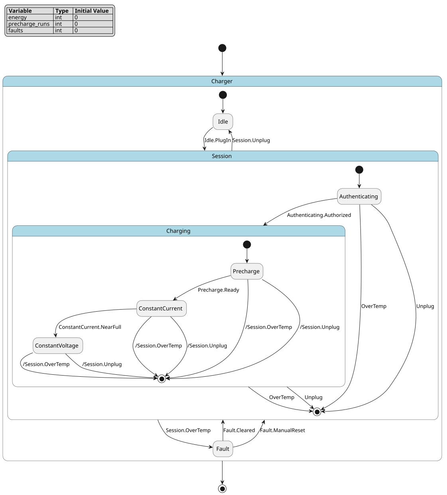

Resume an Interrupted Session with History
==========================================

This tutorial adds history to one existing model. You should already be able
to read an FCSTM model (:doc:`../dsl/index`) and run a batch simulation
(:doc:`../simulation/index`). You will see why a fault recovery that enters a
composite state normally starts over, add history so that the recovery
continues where the interruption happened, and check the result with the
simulator, inspect and a Python hot start.

The model is a DC charger. A charging session authenticates the driver, then
charges in three phases: ``Precharge``, ``ConstantCurrent`` and
``ConstantVoltage``. Every precharge repeats an insulation test, so the model
counts precharges in ``precharge_runs``. An over-temperature fault can
interrupt any phase of the session.

Words used on this page:

* the **owner** is the composite state that remembers where it was left, here
  ``Session``;
* the **record** is what the owner remembers: the leaf state that was active
  when the owner was left;
* **deep history**, written ``[H*]``, restores the recorded leaf itself;
* **shallow history**, written ``[H]``, restores only the owner's direct child
  on the way to that leaf, and that child then runs its own initial
  transition;
* the **default target** is where history goes while the owner has no record.

1. Start from a model that forgets
----------------------------------

The first version recovers from a fault with ordinary transitions:

.. literalinclude:: charger_restart.fcstm
   :language: fcstm
   :caption: ``charger_restart.fcstm``; expected diagnostics: three ``W_UNREFERENCED_VAR`` warnings for the counters.

   ``Session`` holds ``Authenticating`` and the three charging phases. The
   ``OverTemp`` and ``Unplug`` arrows from every phase are the expansion of the
   two forced transitions. ``Cleared`` and ``ManualReset`` both point at the
   ``Session`` box, which means an ordinary entry.

``!Session -> Fault :: OverTemp;`` is a forced transition: it leaves
``Session`` from every phase (see :ref:`dsl-forced-transition-task`). Run a
session into ``ConstantVoltage``, overheat it and let the fault clear:

.. literalinclude:: charger_restart.demo.sh
   :language: bash
   :caption: ``charger_restart.demo.sh``

Output, generated from the script:

.. literalinclude:: charger_restart.demo.sh.txt
   :language: text

The second report shows the problem. An ordinary entry runs ``Session``'s
initial transition, so the charger is back in ``Authenticating``. The driver
must authenticate again, and the next ``Authorized`` runs ``Precharge`` and its
insulation test a second time. ``ManualReset`` behaves the same way in this
model. ``energy`` and ``faults`` keep their values, because leaving and
entering states never resets variables.

2. Declare history inside the owner
-----------------------------------

The composite state that should remember declares its history next to its
ordinary initial transition:

.. code-block:: fcstm

   state Session {
       // ... child states as before ...
       [*] -> Authenticating;
       [H] -> Authenticating;   // shallow history
       [H*] -> Authenticating;  // deep history
       Authenticating -> Charging :: Authorized;
   }

The right-hand side is the default target, used only while ``Session`` has no
record yet; step 7 reaches that case after a power loss. A shallow default must
be a direct child of the owner. A deep default may be any descendant path
written relative to the owner, such as ``Charging.Precharge``.

A declaration alone changes no behavior. Ordinary entries such as
``Idle -> Session :: PlugIn`` still run ``[*] -> Authenticating``.

3. Enter the owner through its history
--------------------------------------

A transition uses history by naming the owner plus a marker as its target. The
transition sits in the owner's parent scope, here ``Charger``, exactly where
the ordinary recovery transitions were:

.. code-block:: fcstm

   Fault -> Session.[H*] :: Cleared;     // resume the exact phase
   Fault -> Session.[H] :: ManualReset;  // resume Charging, then precharge again

The complete model differs from ``charger_restart.fcstm`` only in the header
comment and the highlighted lines:

.. literalinclude:: charger.fcstm
   :language: fcstm
   :emphasize-lines: 28,29,38,39
   :caption: ``charger.fcstm``; expected diagnostics: the same three ``W_UNREFERENCED_VAR`` warnings.

4. Run the same session again
-----------------------------

The script below runs the same session as step 1, interrupts it in
``ConstantVoltage`` and recovers once through each kind of history:

.. literalinclude:: charger_resume.demo.sh
   :language: bash
   :caption: ``charger_resume.demo.sh``

Output, generated from the script:

.. literalinclude:: charger_resume.demo.sh.txt
   :language: text

**Deep history** resumes ``Charging.ConstantVoltage``. The restore skips the
initial transitions on its path, both ``[*] -> Authenticating`` in ``Session``
and ``[*] -> Precharge`` in ``Charging``, so ``precharge_runs`` stays 1.
``energy`` grows from 7 to 9 because the restored leaf runs its ``during`` in
the cycle that enters it, as every entered leaf does.

**Shallow history** remembers only the direct child of ``Session`` that leads
to the recorded leaf, which is ``Charging``. ``Charging`` is entered and runs
its own initial transition, so the charger is in ``Precharge`` and
``precharge_runs`` becomes 2. The operator's reset repeats the insulation test
but skips authentication.

The two ``__hist_*`` variables appear because the simulator runs the model
after model conversion has turned history into ordinary variables and
transitions. Step 8 shows that form; for now, read them as the storage behind
the record.

5. Watch when the record changes
--------------------------------

This Python loop prints the record after every cycle.
:meth:`~pyfcstm.model.model.StateMachine.history_record` decodes the record
into a leaf path relative to ``Session``. The record describes the last exit
only while ``Session`` is inactive, so the script prints ``(Session active)``
otherwise.

.. literalinclude:: charger_record.demo.py
   :language: python
   :caption: ``charger_record.demo.py``

Output, generated from the script:

.. literalinclude:: charger_record.demo.py.txt
   :language: text

Read the table from top to bottom:

* Rows 5 and 7: leaving ``Session`` through ``OverTemp`` records the active
  leaf, ``Charging.ConstantVoltage``.
* Rows 6 and 8: both recoveries read the same record. They differ only in how
  deep they restore, so only row 8 increments ``precharge``.
* Row 10: ``Unplug`` also leaves ``Session``, so it records
  ``Charging.ConstantCurrent``. Every exit from the owner updates the record,
  not only faults.
* Row 11: ``PlugIn`` is an ordinary entry. The new session starts in
  ``Authenticating`` although a record exists; only ``Session.[H]`` and
  ``Session.[H*]`` targets read the record.
* The ``precharge`` and ``energy`` columns never jump back. History restores
  states, not variable values.

6. Check the model and repair one mistake
-----------------------------------------

Inspect judges the model as you wrote it, before conversion. The script below
inspects ``charger.fcstm``, then a copy without the ``[H*]`` declaration:

.. literalinclude:: charger_check.demo.sh
   :language: bash
   :caption: ``charger_check.demo.sh``

Output, generated from the script:

.. literalinclude:: charger_check.demo.sh.txt
   :language: text

The first report has the same three warnings as ``charger_restart.fcstm``, so
history added no finding. It lists the three variables you declared and no
``__hist_*`` variable.

The second report is the mistake to recognize. ``Session.[H*]`` asks for deep
history, but ``Session`` no longer declares it, so inspect reports
``E_HISTORY_TARGET_UNDECLARED`` at the transition and exits with status 1.
``pyfcstm simulate``, ``pyfcstm generate`` and ``pyfcstm bmc`` refuse the same
model, because history is never provided implicitly. Repair it in one of two
ways:

* put ``[H*] -> Authenticating;`` back into ``Session`` when the recovery
  should resume the exact phase;
* write ``Fault -> Session :: Cleared;`` when the recovery should start over.

7. Persist the record across a power loss
-----------------------------------------

A charger that loses power while in ``Fault`` must restore the session record
when it restarts. A hot start supplies every variable, including the
``__hist_*`` ones, so the controller has to store the record somewhere. Store
the source-level record, not the numbers: the numbers are state ids that change
when the model is edited.
:meth:`~pyfcstm.model.model.StateMachine.history_variables` turns a saved
record back into the lowered variables.

.. literalinclude:: charger_hot_start.demo.py
   :language: python
   :caption: ``charger_hot_start.demo.py``

Output, generated from the script:

.. literalinclude:: charger_hot_start.demo.py.txt
   :language: text

With the saved record, ``Cleared`` resumes ``ConstantCurrent`` after the
restart, exactly as it would have without the power loss, and does not repeat
the precharge. Without a record, the deep history uses its default target and
the session starts in ``Authenticating``.

8. Optional: look at what model conversion produced
---------------------------------------------------

The simulator, the generated code and BMC never see ``[H]`` or ``[H*]``. Model
conversion rewrites them into ordinary FCSTM before any of them runs. Printing
the converted model shows that rewritten form:

.. literalinclude:: charger_lowered.demo.py
   :language: python
   :caption: ``charger_lowered.demo.py``

Output, generated from the script:

.. literalinclude:: charger_lowered.demo.py.txt
   :language: fcstm

Use the output to check what the earlier steps observed:

* Two new ``int`` variables follow your own: ``__hist_Session`` holds the
  record and ``__hist_goto`` holds the restore in progress, which is 0
  whenever the machine is stable.
* Every leaf below ``Session`` has an ``exit`` action that writes its id into
  ``__hist_Session``: 4 for ``Authenticating``, 6 to 8 for the three charging
  phases. That is how row 5 of step 5 recorded ``Charging.ConstantVoltage``,
  id 8, and why the record changes on every exit from the owner.
* ``Fault -> Session.[H*] :: Cleared`` became an ordinary entry whose effect
  sets ``__hist_goto`` to the record, or to 4, the id of the default target
  ``Authenticating``, when no record exists.
* ``Fault -> Session.[H] :: ManualReset`` maps a record inside ``Charging``
  (ids 6 to 8) to 5, the id of ``Charging`` itself.
* The initial transitions of ``Session`` and ``Charging`` are guarded by
  ``__hist_goto``. 0 selects the ordinary initial child, other values route
  the entry towards the restore target, and the transition that reaches the
  target resets ``__hist_goto`` to 0. A restore heading for 5 ends at
  ``[*] -> Precharge`` in ``Charging``, which is why the shallow restore
  repeats the precharge.

``pyfcstm plantuml -i charger.fcstm`` draws this same converted model.

Where to go next
----------------

This tutorial covered one owner, entered from its parent through both kinds of
history. Leave it when your question changes:

.. list-table::
   :header-rows: 1
   :widths: 40 60

   * - Question
     - Page
   * - How do I add history to my own model, and what do the common errors mean?
     - :ref:`dsl-history-task`, a task recipe with a troubleshooting table.
   * - Which forms are legal? History can also be entered from an initial
       transition, a forced transition or an external self transition.
     - :ref:`dsl-history-reference`, with every form, diagnostic and lowered
       name.
   * - Why is the record not cleared when the owner ends, and what happens
       when a restore is blocked by a false guard?
     - :ref:`dsl-history-semantics`. A blocked restore rejects the whole
       transition instead of falling back to an ordinary entry.
   * - How do BMC queries treat the ``__hist_*`` variables?
     - :doc:`/reference/bmc_query/index`, the ``havoc`` row.
