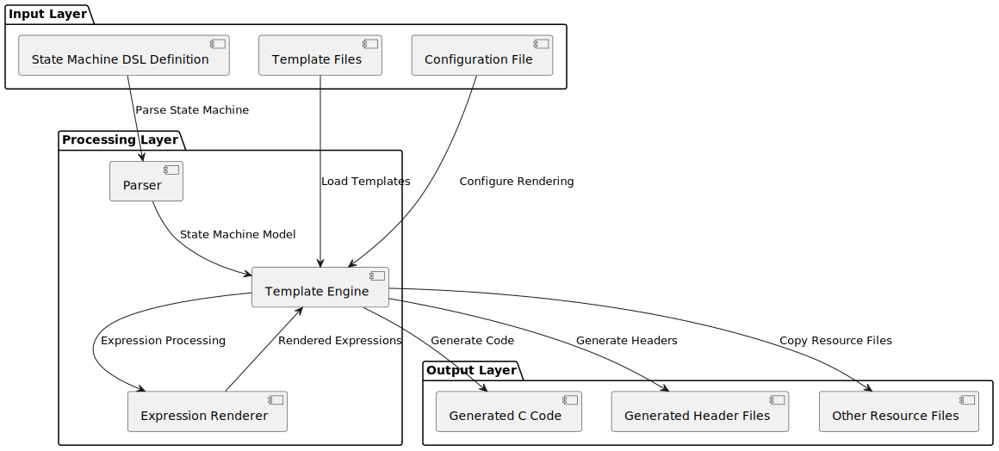
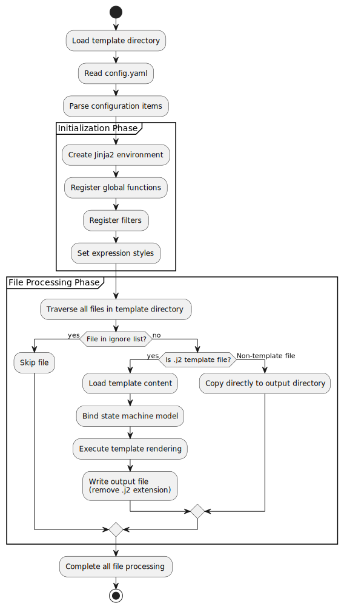
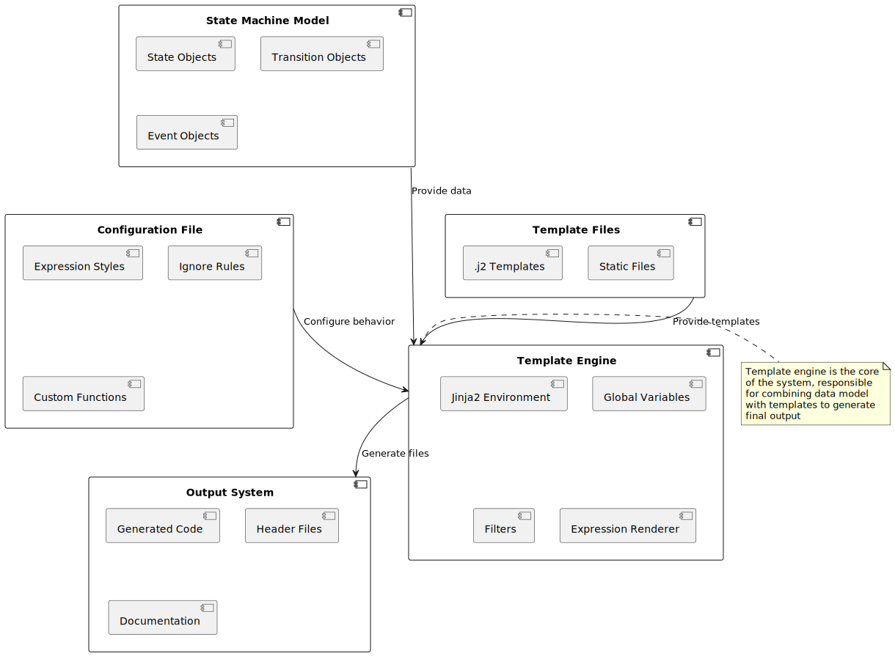
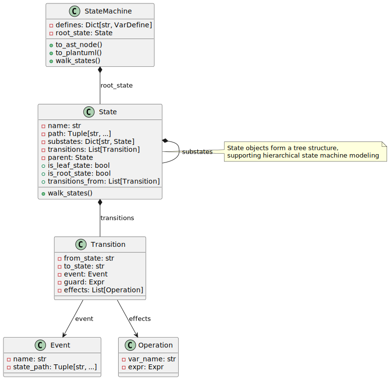

State Machine Code Generator Template Tutorial
============================================================

Introduction
---------------------------------------

What is a State Machine Code Generator?
^^^^^^^^^^^^^^^^^^^^^^^^^^^^^^^^^^^^^^^^^^^^^^^^^^^^^^^^^^^^^^^^^^^

A state machine code generator is a template-based automation tool that automatically generates target code (such as C code) based on state machine definitions (typically using a Domain Specific Language - DSL). By separating the state machine's logical structure from code templates, it achieves decoupling of logic and implementation, improving code maintainability and reusability.

**Core Principle**: Separate the abstract description of the state machine (states, transitions, events, etc.) from the concrete code implementation. The state machine model serves as data, templates serve as blueprints for code, and the rendering engine combines both to generate the final code.

Why Use a Template System?
^^^^^^^^^^^^^^^^^^^^^^^^^^^^^^^^^^^^^^^^^^^^^^^^^^^^^^^^^^^^^^^^^^^

- **Consistency**: Ensures generated code follows uniform coding standards
- **Maintainability**: Modifying templates affects all generated code
- **Flexibility**: Supports multiple output formats and programming languages
- **Automation**: Reduces errors from manual repetitive coding

System Architecture Overview
^^^^^^^^^^^^^^^^^^^^^^^^^^^^^^^^^^^^^^^^^^^^^^^^^^^^^^^^^^^^^^^^^^^

The following diagram illustrates the complete architecture of the state machine code generation system, showing how different components interact to transform DSL definitions into executable code:

This architecture demonstrates the clear separation between input processing, template rendering, and output generation, providing a modular and extensible foundation for code generation.

Template System Architecture Details
--------------------------------------------------------

Template Directory Structure Principle
^^^^^^^^^^^^^^^^^^^^^^^^^^^^^^^^^^^^^^^^^^^^^^^^^^^^^^^^^^^^^^^^^^^

The template directory follows a flexible "convention over configuration" principle that balances structure with flexibility:

.. code-block:: text

   template_directory/
   ├── config.yaml          # Required: System configuration file
   ├── *.j2                 # Optional: Jinja2 template files
   ├── *.c                  # Optional: Direct copy C files
   ├── *.h                  # Optional: Direct copy header files
   └── subdir/              # Optional: Subdirectories (structure preserved)
       ├── *.j2
       └── *.c

**Working Principle Analysis**:

- ``config.yaml`` is the system's "brain", defining rendering rules and behavior
- ``.j2`` files are "smart templates" that dynamically generate content based on the state machine model
- Other files are "static resources" copied directly to target locations
- Directory structure is completely preserved in output, ensuring project structure consistency

This structure allows for both dynamic template processing and static resource management within the same framework.

Detailed Rendering Flow Analysis
^^^^^^^^^^^^^^^^^^^^^^^^^^^^^^^^^^^^^^^^^^^^^^^^^^^^^^^^^^^^^^^^^^^

The rendering process follows a systematic workflow that ensures consistent and reliable code generation:

This flowchart details the step-by-step process from template loading to final output generation, highlighting the key decision points and processing stages.

Core Component Interaction
^^^^^^^^^^^^^^^^^^^^^^^^^^^^^^^^^^^^^^^^^^^^^^^^^^^^^^^^^^^^^^^^^^^

Understanding how the core components interact is crucial for extending or customizing the system:

This diagram shows the relationships between major system components and how data flows between them during the rendering process.

Configuration File Deep Analysis
--------------------------------------------------------

Expression Styles (expr_styles) Principle
^^^^^^^^^^^^^^^^^^^^^^^^^^^^^^^^^^^^^^^^^^^^^^^^^^^^^^^^^^^^^^^^^^^

The expression style system provides a powerful mechanism for customizing how expressions are rendered across different programming languages:

.. code-block:: yaml

   expr_styles:
     default:                    # Base style
       base_lang: c             # Inherit C language base templates
       Name: LX_Vars.{{ node.name }}  # Override variable name rendering rules

     python_style:              # Custom style
       base_lang: python        # Inherit Python base templates
       BinaryOp(&&): '{{ node.expr1 | expr_render }} and {{ node.expr2 | expr_render }}'

**Inheritance Mechanism Principle**:

- Each style inherits from a base language style
- Can override rendering rules for specific node types
- Supports operator-level fine-grained control

This inheritance system allows for creating specialized rendering styles while maintaining consistency across similar language families.

Global Variable System
^^^^^^^^^^^^^^^^^^^^^^^^^^^^^^^^^^^^^^^^^^^^^^^^^^^^^^^^^^^^^^^^^^^

Global variables provide a way to define reusable values and functions that are accessible throughout all templates:

.. code-block:: yaml

   globals:
     # Method 1: Direct value
     global_prefix: 'FSM_'

     # Method 2: Template function
     get_state_name_safe:
       type: template
       params: ['state']
       template: '{{ state.path | join("_") }}'

     # Method 3: Import external function
     math_sqrt:
       type: import
       from: math.sqrt

     # Method 4: Fixed value
     version:
       type: value
       value: '1.0.0'

**Lifecycle**: Global variables are created when Jinja2 environment initializes and remain unchanged throughout the rendering process.

The four definition methods provide flexibility for different use cases, from simple constants to complex template functions.

Filter System Principle
^^^^^^^^^^^^^^^^^^^^^^^^^^^^^^^^^^^^^^^^^^^^^^^^^^^^^^^^^^^^^^^^^^^

Filters transform data within templates and are essential for data formatting and manipulation:

.. code-block:: jinja

   {# Using filters #}
   {{ state | get_state_name_safe }}
   {{ expression | expr_render(style='c') }}

**Implementation Mechanism**:

- Filters receive the left-side value as the first parameter
- Can accept additional parameters
- Return processed value for continued use in templates

Filters enable clean separation of data transformation logic from presentation logic in templates.

Ignore Rules System
^^^^^^^^^^^^^^^^^^^^^^^^^^^^^^^^^^^^^^^^^^^^^^^^^^^^^^^^^^^^^^^^^^^

The ignore system prevents unnecessary files from being processed or copied to the output directory:

.. code-block:: yaml

   ignores:
     - '.git'           # Ignore .git directory
     - '*.tmp'          # Ignore all .tmp files
     - 'build/'         # Ignore build directory
     - '**/test_*'      # Ignore all test_ prefixed files

**Matching Principle**: Uses pathspec library to implement the same pattern matching algorithm as git.

This system ensures that version control files, temporary files, and other non-essential files don't clutter the generated output.

Template Syntax Deep Analysis
--------------------------------------------------------

Variable Output Mechanism
^^^^^^^^^^^^^^^^^^^^^^^^^^^^^^^^^^^^^^^^^^^^^^^^^^^^^^^^^^^^^^^^^^^

Variable output is the fundamental building block of template rendering:

.. code-block:: jinja

   {# Basic variable output #}
   {{ variable }}

   {# Object attribute access #}
   {{ state.name }}
   {{ state.parent.name }}

   {# Dictionary key access #}
   {{ dict['key'] }}
   {{ dict.key }}      {# Equivalent syntax #}

   {# Method calls #}
   {{ obj.method() }}

**Rendering Principle**: Jinja2 automatically resolves variable paths during rendering, accessing object attributes according to Python's attribute lookup rules.

These syntax patterns provide flexible access to the state machine model's data structure.

Control Structure Details
^^^^^^^^^^^^^^^^^^^^^^^^^^^^^^^^^^^^^^^^^^^^^^^^^^^^^^^^^^^^^^^^^^^

Conditional Statements
~~~~~~~~~~~~~~~~~~~~~~~~~~~~~~~~~~~~~~~~~~~~~~~~~~~~~~~~~~~~~~~~~~

Conditional statements enable dynamic content generation based on the state machine's structure:

.. code-block:: jinja

   {# Basic conditions #}
   
     // Leaf state processing
   
     // Root state processing
   
     // Normal state processing
   

   {# Complex conditions #}
   
     // State with transitions
   

   {# Test functions #}
   
     {{ variable }}
   

These conditional patterns allow templates to adapt their output based on the specific characteristics of each state.

Loop Iteration
~~~~~~~~~~~~~~~~~~~~~~~~~~~~~~~~~~~~~~~~~~~~~~~~~~~~~~~~~~~~~~~~~~

Loop constructs enable processing collections of states, transitions, and other model elements:

.. code-block:: jinja

   {# Basic loop #}
   
     // Process {{ state.name }}
   

   {# Loop with index #}
   
     // Transition {{ loop.index }}: {{ transition.from_state }} -> {{ transition.to_state }}
     ...
     ...
   

   {# Loop control #}
   
     
     {{ item }}
   

The loop variable provides access to iteration metadata, enabling sophisticated loop control and formatting.

Template Inheritance and Inclusion
^^^^^^^^^^^^^^^^^^^^^^^^^^^^^^^^^^^^^^^^^^^^^^^^^^^^^^^^^^^^^^^^^^^

Macro Definitions (Functional Templates)
~~~~~~~~~~~~~~~~~~~~~~~~~~~~~~~~~~~~~~~~~~~~~~~~~~~~~~~~~~~~~~~~~~

Macros provide reusable template components that can be parameterized:

.. code-block:: jinja

   {# Define macro #}
   
   state {{ state.name }} {
       
       {{ render_state(substate) }}
       
   }
   

   {# Use macro #}
   {{ render_state(model.root_state) }}

This recursive macro demonstrates how complex rendering logic can be encapsulated and reused.

File Inclusion
~~~~~~~~~~~~~~~~~~~~~~~~~~~~~~~~~~~~~~~~~~~~~~~~~~~~~~~~~~~~~~~~~~

File inclusion enables modular template design and code reuse:

.. code-block:: jinja

   {# Include other template files #}
   

   {# Dynamic inclusion #}
   

Inclusion mechanisms support both static and dynamic template composition patterns.

State Machine Model Objects Detailed
--------------------------------------------------------

Object Relationship Model
^^^^^^^^^^^^^^^^^^^^^^^^^^^^^^^^^^^^^^^^^^^^^^^^^^^^^^^^^^^^^^^^^^^

The state machine model follows a hierarchical object structure that mirrors the state machine's logical organization:

This class diagram illustrates the key objects and their relationships within the state machine model.

State Object Detailed API
^^^^^^^^^^^^^^^^^^^^^^^^^^^^^^^^^^^^^^^^^^^^^^^^^^^^^^^^^^^^^^^^^^^

Attribute Access
~~~~~~~~~~~~~~~~~~~~~~~~~~~~~~~~~~~~~~~~~~~~~~~~~~~~~~~~~~~~~~~~~~

State objects provide comprehensive attribute access for template rendering:

.. code-block:: jinja

   {# Basic information #}
   {{ state.name }}              {# State name #}
   {{ state.path }}              {# Complete path #}
   {{ state.path|join('.') }}    {# Dot-separated path #}

   {# Type checking #}
   {{ state.is_leaf_state }}     {# Is leaf state #}
   {{ state.is_root_state }}     {# Is root state #}
   {{ state.parent.name }}       {# Parent state name #}

These attributes provide access to both the state's identity and its position within the state hierarchy.

Collection Access Methods
~~~~~~~~~~~~~~~~~~~~~~~~~~~~~~~~~~~~~~~~~~~~~~~~~~~~~~~~~~~~~~~~~~

Collection methods enable iteration over state relationships and components:

.. code-block:: jinja

   {# Traverse substates #}
   
     // Substate: {{ name }}
   

   {# Get transitions #}
   
     {{ transition.from_state }} -> {{ transition.to_state }}
   

   {# Get outgoing transitions #}
   
     // Transitions from this state
   

   {# Get incoming transitions #}
   
     // Transitions to this state
   

These collection access patterns support both internal and external state relationships.

Action Query Methods
~~~~~~~~~~~~~~~~~~~~~~~~~~~~~~~~~~~~~~~~~~~~~~~~~~~~~~~~~~~~~~~~~~

Action queries provide access to state lifecycle behaviors and transitions:

.. code-block:: jinja

   {# Entry actions #}
   
     // Entry action {{ id }}: {{ enter.name }}
   

   {# During actions (with filtering) #}
   
     // Pre-during actions
   

   {# Exit actions #}
   
     // Exit action {{ id }}
   

The filtering capabilities allow templates to target specific types of actions based on their characteristics.

Transition Object Detailed API
^^^^^^^^^^^^^^^^^^^^^^^^^^^^^^^^^^^^^^^^^^^^^^^^^^^^^^^^^^^^^^^^^^^

Transition objects encapsulate the logic for moving between states:

.. code-block:: jinja

   
     {# Transition basic information #}
     From: {{ transition.from_state }}
     To: {{ transition.to_state }}

     {# Trigger conditions #}
     
       Event: {{ transition.event.name }}
       Event Path: {{ transition.event.path|join('.') }}
     

     {# Guard conditions #}
     
       Condition: {{ transition.guard.to_ast_node() }}
     

     {# Effect operations #}
     
       Operation: {{ operation.var_name }} = {{ operation.expr.to_ast_node() }}
     
   

This comprehensive API supports rendering both simple and complex transition logic.

Expression Rendering System
-----------------------------------------------------------------

Expression Type Support
^^^^^^^^^^^^^^^^^^^^^^^^^^^^^^^^^^^^^^^^^^^^^^^^^^^^^^^^^^^^^^^^^^^

The expression rendering system supports a wide range of expression types commonly found in state machine definitions:

.. code-block:: jinja

   {# Literals #}
   {{ 42 | expr_render }}           {# Integer #}
   {{ 3.14 | expr_render }}         {# Float #}
   {{ true | expr_render }}         {# Boolean #}

   {# Variable references #}
   {{ variable_name | expr_render }}

   {# Operators #}
   {{ (a + b * 2) | expr_render }}
   {{ (x > 0 && y < 10) | expr_render }}

   {# Function calls #}
   {{ func_name(arg1, arg2) | expr_render }}

   {# Conditional expressions #}
   {{ (condition ? value1 : value2) | expr_render }}

This comprehensive expression support enables accurate rendering of complex state machine logic.

Multi-language Style Support
^^^^^^^^^^^^^^^^^^^^^^^^^^^^^^^^^^^^^^^^^^^^^^^^^^^^^^^^^^^^^^^^^^^

C Language Style
~~~~~~~~~~~~~~~~~~~~~~~~~~~~~~~~~~~~~~~~~~~~~~~~~~~~~~~~~~~~~~~~~~

The C language style adapts expressions to C syntax and conventions:

.. code-block:: jinja

   {{ expression | expr_render(style='c') }}

**Characteristics**:

- Uses C language operators and syntax
- Boolean values converted to 1/0
- Power operations converted to pow() function calls

This style ensures generated C code follows language-specific conventions and limitations.

Python Style
~~~~~~~~~~~~~~~~~~~~~~~~~~~~~~~~~~~~~~~~~~~~~~~~~~~~~~~~~~~~~~~~~~

The Python style renders expressions using Python syntax and idioms:

.. code-block:: jinja

   {{ expression | expr_render(style='python') }}

**Characteristics**:

- Uses Python operators (and, or, not)
- Function calls use math module
- Supports Python ternary expression syntax

This style is particularly useful for generating Python code or for debugging purposes.

DSL Style
~~~~~~~~~~~~~~~~~~~~~~~~~~~~~~~~~~~~~~~~~~~~~~~~~~~~~~~~~~~~~~~~~~

The DSL style preserves the original domain-specific language syntax:

.. code-block:: jinja

   {{ expression | expr_render(style='dsl') }}

**Characteristics**:
- Maintains original DSL syntax
- Used for debugging and documentation generation

This style is valuable for verifying that expressions are correctly parsed from the original DSL.

Custom Expression Rendering
^^^^^^^^^^^^^^^^^^^^^^^^^^^^^^^^^^^^^^^^^^^^^^^^^^^^^^^^^^^^^^^^^^^

Custom expression rendering enables adaptation to specialized requirements or domain-specific conventions:

.. code-block:: yaml

   expr_styles:
     my_style:
       base_lang: c
       BinaryOp(&&): '{{ node.expr1 | expr_render }} AND {{ node.expr2 | expr_render }}'
       UFunc(sqrt): 'SQRT({{ node.expr | expr_render }})'
       Name: 'vars.{{ node.name }}'

This customization capability allows the system to adapt to various coding standards and platform requirements.

Practical Examples: Complete Template Analysis
-----------------------------------------------------------------

State Variable Declaration Template
^^^^^^^^^^^^^^^^^^^^^^^^^^^^^^^^^^^^^^^^^^^^^^^^^^^^^^^^^^^^^^^^^^^

This template demonstrates how state variables are declared in the generated code:

.. code-block:: jinja

   
   {# Generate variable declaration for each state #}
   CST_FSM_Para_Base {{ state | get_state_id }};  // {{ state | get_state_name }}
   

**Generated Result Example**:

.. code-block:: c

   CST_FSM_Para_Base FSM_Root_L1;  // Root
   CST_FSM_Para_Base FSM_Root_SubState1_L2;  // Root.SubState1
   CST_FSM_Para_Base FSM_Root_SubState2_L2;  // Root.SubState2

This pattern ensures each state has a corresponding variable with a unique, meaningful identifier.

State Entry Function Template
^^^^^^^^^^^^^^^^^^^^^^^^^^^^^^^^^^^^^^^^^^^^^^^^^^^^^^^^^^^^^^^^^^^

Entry functions handle state initialization and setup logic:

.. code-block:: jinja

   
   void {{ state | get_state_entry_hook_name }}(XXX_FSM_PARAS_DECLARE)
   {
       // Entry Processes Current State {{ state | get_state_name }}
       
       {{ get_enter_fn_name(state, enter, id) }}(pPara_io, XXX_FSM_PARAS);
       
   }
   

**Generation Logic Analysis**:

1. Traverse all states
2. Generate entry hook function for each state
3. Call all entry actions of that state within the function
4. Use naming conventions to ensure unique function names

This approach ensures consistent entry behavior across all states while maintaining clear separation of concerns.

Transition Processing Template
^^^^^^^^^^^^^^^^^^^^^^^^^^^^^^^^^^^^^^^^^^^^^^^^^^^^^^^^^^^^^^^^^^^

Transition processing handles the logic for moving between states based on events and conditions:

.. code-block:: jinja

   
   INT32S {{ get_state_event_hook_name(state, id) }}(XXX_FSM_PARAS_DECLARE)
   {
       
       if ({{ get_event_trigger_fn_name(state, transition.event) }}(pPara_io, XXX_FSM_PARAS) == BTRUE)
       {
           return {{ get_exit_to_x(state, transition) }};
       }
       return EVENT_NOT_TRIGGERED;
       
       if ({{ transition.guard.to_ast_node() | expr_render }})
       {
           return {{ get_exit_to_x(state, transition) }};
       }
       return EVENT_NOT_TRIGGERED;
       
       return {{ get_exit_to_x(state, transition) }};
       
   }
   

**Condition Processing Logic**:

- With event: Check event trigger condition
- With guard: Evaluate guard expression
- Unconditional: Execute transition directly

This pattern handles the full range of transition types, from simple unconditional transitions to complex conditional ones.

Advanced Techniques and Best Practices
-----------------------------------------------------------------

Template Debugging Techniques
^^^^^^^^^^^^^^^^^^^^^^^^^^^^^^^^^^^^^^^^^^^^^^^^^^^^^^^^^^^^^^^^^^^

Output Debug Information
~~~~~~~~~~~~~~~~~~~~~~~~~~~~~~~~~~~~~~~~~~~~~~~~~~~~~~~~~~~~~~~~~~

Debug output helps identify issues during template development and troubleshooting:

.. code-block:: jinja

   {# Debug output #}
   // DEBUG: State = {{ state.name }}
   // DEBUG: Path = {{ state.path }}
   // DEBUG: Is Leaf = {{ state.is_leaf_state }}

   {# Conditional debugging #}
   
   // Debug Information: {{ state | tojson }}
   

These techniques provide visibility into template execution and data state during development.

Using Temporary Comments
~~~~~~~~~~~~~~~~~~~~~~~~~~~~~~~~~~~~~~~~~~~~~~~~~~~~~~~~~~~~~~~~~~

Temporary comments enable controlled testing and incremental development:

.. code-block:: jinja

   {# Temporarily disable code blocks #}
   
       
           // This code won't execute temporarily
       
   

This approach is particularly useful for isolating issues or testing alternative implementations.

Performance Optimization
^^^^^^^^^^^^^^^^^^^^^^^^^^^^^^^^^^^^^^^^^^^^^^^^^^^^^^^^^^^^^^^^^^^

Avoid Repeated Calculations
~~~~~~~~~~~~~~~~~~~~~~~~~~~~~~~~~~~~~~~~~~~~~~~~~~~~~~~~~~~~~~~~~~

Optimizing calculation patterns can significantly improve template rendering performance:

.. code-block:: jinja

   {# Poor: Calculate every loop iteration #}
   
       ...
   

   {# Recommended: Pre-calculate #}
   
   
       ...
   

This optimization reduces redundant computations, especially important for complex state machines.

Use Caching
~~~~~~~~~~~~~~~~~~~~~~~~~~~~~~~~~~~~~~~~~~~~~~~~~~~~~~~~~~~~~~~~~~

Caching expensive operations improves performance for complex template logic:

.. code-block:: jinja

   {# Cache complex calculations in variables #}
   
   
       // Use cached result
   

Caching is particularly beneficial for recursive operations or complex data transformations.

Template Maintenance
^^^^^^^^^^^^^^^^^^^^^^^^^^^^^^^^^^^^^^^^^^^^^^^^^^^^^^^^^^^^^^^^^^^

Modular Design
~~~~~~~~~~~~~~~~~~~~~~~~~~~~~~~~~~~~~~~~~~~~~~~~~~~~~~~~~~~~~~~~~~

Modular design promotes reuse and maintainability across template code:

.. code-block:: jinja

   {# macro_library.j2 #}
   
       // Transition rendering logic
   

   
       // State rendering logic
   

This approach encapsulates common patterns and reduces code duplication.

Configuration File Organization
~~~~~~~~~~~~~~~~~~~~~~~~~~~~~~~~~~~~~~~~~~~~~~~~~~~~~~~~~~~~~~~~~~

Well-organized configuration improves maintainability and discoverability:

.. code-block:: yaml

   # Group configuration by functionality
   globals:
     naming:
       global_prefix: 'FSM_'
       state_prefix: 'State_'

     rendering:
       default_style: 'c'
       indent_size: 4

   filters:
     naming:
       get_state_id: ...
       get_state_name: ...

     rendering:
       expr_render: ...

Functional grouping makes it easier to locate and modify related configuration items.

Common Issues and Solutions
-----------------------------------------------------------------

Template Syntax Errors
^^^^^^^^^^^^^^^^^^^^^^^^^^^^^^^^^^^^^^^^^^^^^^^^^^^^^^^^^^^^^^^^^^^

Proper syntax is essential for successful template rendering:

**Problem**: ``TemplateSyntaxError: unexpected '%'``

**Cause**: Jinja2 tags not properly closed or nested incorrectly

**Solution**:

.. code-block:: jinja

   {# Error example #}
   
       {{ variable }
   

   {# Correct example #}
   
       {{ variable }}
   

Careful attention to tag matching and nesting prevents these common syntax issues.

Undefined Variable Errors
^^^^^^^^^^^^^^^^^^^^^^^^^^^^^^^^^^^^^^^^^^^^^^^^^^^^^^^^^^^^^^^^^^^

Safe variable access patterns prevent runtime errors:

**Problem**: ``UndefinedError: 'variable' is undefined``

**Solution**:

.. code-block:: jinja

   {# Safe access #}
   
       {{ variable }}
   
       // Use default value
       {{ default_value }}
   

Defensive programming practices ensure templates handle missing data gracefully.

Performance Issues
^^^^^^^^^^^^^^^^^^^^^^^^^^^^^^^^^^^^^^^^^^^^^^^^^^^^^^^^^^^^^^^^^^^

Optimization strategies address rendering performance concerns:

**Problem**: Template rendering too slow

**Solution**:

- Reduce complex calculations in templates
- Use cache variables for repeatedly used results
- Optimize state machine model, avoid deep nesting

Performance optimization focuses on reducing computational complexity and redundant operations.

Custom Functions Not Working
^^^^^^^^^^^^^^^^^^^^^^^^^^^^^^^^^^^^^^^^^^^^^^^^^^^^^^^^^^^^^^^^^^^

Proper configuration ensures custom functions work as expected:

**Problem**: Custom global functions or filters not taking effect

**Solution**:

1. Check if config.yaml syntax is correct
2. Verify function parameters match
3. Confirm functions are defined in correct scope

Systematic troubleshooting addresses the most common configuration issues.

Extension Development Guide
-----------------------------------------------------------------

Adding New Expression Styles
^^^^^^^^^^^^^^^^^^^^^^^^^^^^^^^^^^^^^^^^^^^^^^^^^^^^^^^^^^^^^^^^^^^

Creating custom expression styles enables language-specific adaptations:

1. Define new style in configuration file:

.. code-block:: yaml

   expr_styles:
     my_custom_style:
       base_lang: c
       BinaryOp(&&): '{{ node.expr1 | expr_render }} ANDALSO {{ node.expr2 | expr_render }}'

2. Use in templates:

.. code-block:: jinja

   {{ expression | expr_render(style='my_custom_style') }}

This extension mechanism supports adaptation to specialized requirements or new programming languages.

Creating Custom Filters
^^^^^^^^^^^^^^^^^^^^^^^^^^^^^^^^^^^^^^^^^^^^^^^^^^^^^^^^^^^^^^^^^^^

Custom filters extend template transformation capabilities:

1. Define in configuration file:

.. code-block:: yaml

   filters:
     my_custom_filter:
       type: template
       params: ['value', 'prefix']
       template: '{{ prefix }}_{{ value | upper }}'

2. Use in templates:

.. code-block:: jinja

   {{ state.name | my_custom_filter('PREFIX') }}

Filters provide reusable data transformation logic that can be applied throughout templates.

Integrating External Tools
^^^^^^^^^^^^^^^^^^^^^^^^^^^^^^^^^^^^^^^^^^^^^^^^^^^^^^^^^^^^^^^^^^^

External integration extends system capabilities with existing libraries and tools:

.. code-block:: yaml

   globals:
     datetime_now:
       type: import
       from: datetime.datetime.now
     json_dumps:
       type: import
       from: json.dumps

This integration approach leverages the rich Python ecosystem within template rendering.

Summary
-----------------------------------------------------------------

Through this tutorial, you should have gained a deep understanding of all aspects of the state machine code generator template system:

1. **Architecture Principles**: Understand the three-layer architecture of data-template-rendering
2. **Configuration System**: Master configuration methods for expression styles, global variables, and filters
3. **Template Syntax**: Proficiently use various Jinja2 control structures and expressions
4. **State Machine Model**: Understand usage of core objects like states, transitions, events
5. **Practical Techniques**: Learn methods for debugging, optimizing, and maintaining templates

The main advantages of this system are:

- **Separation of Concerns**: State machine logic separated from code implementation
- **High Configurability**: Supports multiple output styles and coding standards
- **Easy Extensibility**: Can easily add new templates and rendering rules
- **Consistency Guarantee**: Automatically ensures generated code complies with standards

Start creating your own templates and enjoy the efficiency improvements from automated code generation!
