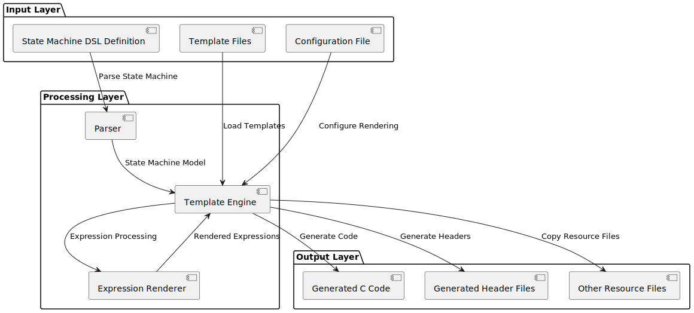

State Machine Code Generator Template Tutorial
============================================================

Introduction
---------------------------------------

What is a State Machine Code Generator?
^^^^^^^^^^^^^^^^^^^^^^^^^^^^^^^^^^^^^^^^^^^^^^^^^^^^^^^^^^^^^^^^^^^

A state machine code generator is a template-based automation tool that automatically generates target code (such as C code) based on state machine definitions (typically using a Domain Specific Language - DSL). By separating the state machine's logical structure from code templates, it achieves decoupling of logic and implementation, improving code maintainability and reusability.

**Core Principle**: Separate the abstract description of the state machine (states, transitions, events, etc.) from the concrete code implementation. The state machine model serves as data, templates serve as blueprints for code, and the rendering engine combines both to generate the final code.

Why Use a Template System?
^^^^^^^^^^^^^^^^^^^^^^^^^^^^^^^^^^^^^^^^^^^^^^^^^^^^^^^^^^^^^^^^^^^

- **Consistency**: Ensures generated code follows uniform coding standards
- **Maintainability**: Modifying templates affects all generated code
- **Flexibility**: Supports multiple output formats and programming languages
- **Automation**: Reduces errors from manual repetitive coding

System Architecture Overview
^^^^^^^^^^^^^^^^^^^^^^^^^^^^^^^^^^^^^^^^^^^^^^^^^^^^^^^^^^^^^^^^^^^

Template System Architecture Details
--------------------------------------------------------

Template Directory Structure Principle
^^^^^^^^^^^^^^^^^^^^^^^^^^^^^^^^^^^^^^^^^^^^^^^^^^^^^^^^^^^^^^^^^^^

The template directory follows a flexible "convention over configuration" principle:

.. code-block:: text

   template_directory/
   ├── config.yaml          # Required: System configuration file
   ├── *.j2                 # Optional: Jinja2 template files
   ├── *.c                  # Optional: Direct copy C files
   ├── *.h                  # Optional: Direct copy header files
   └── subdir/              # Optional: Subdirectories (structure preserved)
       ├── *.j2
       └── *.c

**Working Principle Analysis**:

- ``config.yaml`` is the system's "brain", defining rendering rules and behavior
- ``.j2`` files are "smart templates" that dynamically generate content based on the state machine model
- Other files are "static resources" copied directly to target locations
- Directory structure is completely preserved in output, ensuring project structure consistency

Detailed Rendering Flow Analysis
^^^^^^^^^^^^^^^^^^^^^^^^^^^^^^^^^^^^^^^^^^^^^^^^^^^^^^^^^^^^^^^^^^^

Core Component Interaction
^^^^^^^^^^^^^^^^^^^^^^^^^^^^^^^^^^^^^^^^^^^^^^^^^^^^^^^^^^^^^^^^^^^

.. figure:: core_component.puml.svg
   :width: 100%
   :align: center
   :alt: Core Component Interation

Configuration File Deep Analysis
--------------------------------------------------------

Expression Styles (expr_styles) Principle
^^^^^^^^^^^^^^^^^^^^^^^^^^^^^^^^^^^^^^^^^^^^^^^^^^^^^^^^^^^^^^^^^^^

The expression style system is a multi-layer template inheritance system:

.. code-block:: yaml

   expr_styles:
     default:                    # Base style
       base_lang: c             # Inherit C language base templates
       Name: LX_Vars.{{ node.name }}  # Override variable name rendering rules

     python_style:              # Custom style
       base_lang: python        # Inherit Python base templates
       BinaryOp(&&): '{{ node.expr1 | expr_render }} and {{ node.expr2 | expr_render }}'

**Inheritance Mechanism Principle**:

- Each style inherits from a base language style
- Can override rendering rules for specific node types
- Supports operator-level fine-grained control

Global Variable System
^^^^^^^^^^^^^^^^^^^^^^^^^^^^^^^^^^^^^^^^^^^^^^^^^^^^^^^^^^^^^^^^^^^

Global variables are available everywhere in templates, supporting three definition methods:

.. code-block:: yaml

   globals:
     # Method 1: Direct value
     global_prefix: 'FSM_'

     # Method 2: Template function
     get_state_name_safe:
       type: template
       params: ['state']
       template: '{{ state.path | join("_") }}'

     # Method 3: Import external function
     math_sqrt:
       type: import
       from: math.sqrt

     # Method 4: Fixed value
     version:
       type: value
       value: '1.0.0'

**Lifecycle**: Global variables are created when Jinja2 environment initializes and remain unchanged throughout the rendering process.

Filter System Principle
^^^^^^^^^^^^^^^^^^^^^^^^^^^^^^^^^^^^^^^^^^^^^^^^^^^^^^^^^^^^^^^^^^^

Filters are essentially functions that can be called in templates using the pipe symbol ``|``:

.. code-block:: jinja

   {# Using filters #}
   {{ state | get_state_name_safe }}
   {{ expression | expr_render(style='c') }}

**Implementation Mechanism**:

- Filters receive the left-side value as the first parameter
- Can accept additional parameters
- Return processed value for continued use in templates

Ignore Rules System
^^^^^^^^^^^^^^^^^^^^^^^^^^^^^^^^^^^^^^^^^^^^^^^^^^^^^^^^^^^^^^^^^^^

Ignore rules use gitignore pattern matching:

.. code-block:: yaml

   ignores:
     - '.git'           # Ignore .git directory
     - '*.tmp'          # Ignore all .tmp files
     - 'build/'         # Ignore build directory
     - '**/test_*'      # Ignore all test_ prefixed files

**Matching Principle**: Uses pathspec library to implement the same pattern matching algorithm as git.

Template Syntax Deep Analysis
--------------------------------------------------------

Variable Output Mechanism
^^^^^^^^^^^^^^^^^^^^^^^^^^^^^^^^^^^^^^^^^^^^^^^^^^^^^^^^^^^^^^^^^^^

.. code-block:: jinja

   {# Basic variable output #}
   {{ variable }}

   {# Object attribute access #}
   {{ state.name }}
   {{ state.parent.name }}

   {# Dictionary key access #}
   {{ dict['key'] }}
   {{ dict.key }}      {# Equivalent syntax #}

   {# Method calls #}
   {{ obj.method() }}

**Rendering Principle**: Jinja2 automatically resolves variable paths during rendering, accessing object attributes according to Python's attribute lookup rules.

Control Structure Details
^^^^^^^^^^^^^^^^^^^^^^^^^^^^^^^^^^^^^^^^^^^^^^^^^^^^^^^^^^^^^^^^^^^

Conditional Statements
~~~~~~~~~~~~~~~~~~~~~~~~~~~~~~~~~~~~~~~~~~~~~~~~~~~~~~~~~~~~~~~~~~

.. code-block:: jinja

   {# Basic conditions #}
   
     // Leaf state processing
   
     // Root state processing
   
     // Normal state processing
   

   {# Complex conditions #}
   
     // State with transitions
   

   {# Test functions #}
   
     {{ variable }}
   

Loop Iteration
~~~~~~~~~~~~~~~~~~~~~~~~~~~~~~~~~~~~~~~~~~~~~~~~~~~~~~~~~~~~~~~~~~

.. code-block:: jinja

   {# Basic loop #}
   
     // Process {{ state.name }}
   

   {# Loop with index #}
   
     // Transition {{ loop.index }}: {{ transition.from_state }} -> {{ transition.to_state }}
     ...
     ...
   

   {# Loop control #}
   
     
     {{ item }}
   

Template Inheritance and Inclusion
^^^^^^^^^^^^^^^^^^^^^^^^^^^^^^^^^^^^^^^^^^^^^^^^^^^^^^^^^^^^^^^^^^^

Macro Definitions (Functional Templates)
~~~~~~~~~~~~~~~~~~~~~~~~~~~~~~~~~~~~~~~~~~~~~~~~~~~~~~~~~~~~~~~~~~

.. code-block:: jinja

   {# Define macro #}
   
   state {{ state.name }} {
       
       {{ render_state(substate) }}
       
   }
   

   {# Use macro #}
   {{ render_state(model.root_state) }}

File Inclusion
~~~~~~~~~~~~~~~~~~~~~~~~~~~~~~~~~~~~~~~~~~~~~~~~~~~~~~~~~~~~~~~~~~

.. code-block:: jinja

   {# Include other template files #}
   

   {# Dynamic inclusion #}
   

State Machine Model Objects Detailed
--------------------------------------------------------

Object Relationship Model
^^^^^^^^^^^^^^^^^^^^^^^^^^^^^^^^^^^^^^^^^^^^^^^^^^^^^^^^^^^^^^^^^^^

State Object Detailed API
^^^^^^^^^^^^^^^^^^^^^^^^^^^^^^^^^^^^^^^^^^^^^^^^^^^^^^^^^^^^^^^^^^^

Attribute Access
~~~~~~~~~~~~~~~~~~~~~~~~~~~~~~~~~~~~~~~~~~~~~~~~~~~~~~~~~~~~~~~~~~

.. code-block:: jinja

   {# Basic information #}
   {{ state.name }}              {# State name #}
   {{ state.path }}              {# Complete path #}
   {{ state.path|join('.') }}    {# Dot-separated path #}

   {# Type checking #}
   {{ state.is_leaf_state }}     {# Is leaf state #}
   {{ state.is_root_state }}     {# Is root state #}
   {{ state.parent.name }}       {# Parent state name #}

Collection Access Methods
~~~~~~~~~~~~~~~~~~~~~~~~~~~~~~~~~~~~~~~~~~~~~~~~~~~~~~~~~~~~~~~~~~

.. code-block:: jinja

   {# Traverse substates #}
   
     // Substate: {{ name }}
   

   {# Get transitions #}
   
     {{ transition.from_state }} -> {{ transition.to_state }}
   

   {# Get outgoing transitions #}
   
     // Transitions from this state
   

   {# Get incoming transitions #}
   
     // Transitions to this state
   

Action Query Methods
~~~~~~~~~~~~~~~~~~~~~~~~~~~~~~~~~~~~~~~~~~~~~~~~~~~~~~~~~~~~~~~~~~

.. code-block:: jinja

   {# Entry actions #}
   
     // Entry action {{ id }}: {{ enter.name }}
   

   {# During actions (with filtering) #}
   
     // Pre-during actions
   

   {# Exit actions #}
   
     // Exit action {{ id }}
   

Transition Object Detailed API
^^^^^^^^^^^^^^^^^^^^^^^^^^^^^^^^^^^^^^^^^^^^^^^^^^^^^^^^^^^^^^^^^^^

.. code-block:: jinja

   
     {# Transition basic information #}
     From: {{ transition.from_state }}
     To: {{ transition.to_state }}

     {# Trigger conditions #}
     
       Event: {{ transition.event.name }}
       Event Path: {{ transition.event.path|join('.') }}
     

     {# Guard conditions #}
     
       Condition: {{ transition.guard.to_ast_node() }}
     

     {# Effect operations #}
     
       Operation: {{ operation.var_name }} = {{ operation.expr.to_ast_node() }}
     
   

Expression Rendering System
-----------------------------------------------------------------

Expression Type Support
^^^^^^^^^^^^^^^^^^^^^^^^^^^^^^^^^^^^^^^^^^^^^^^^^^^^^^^^^^^^^^^^^^^

The system supports multiple expression types:

.. code-block:: jinja

   {# Literals #}
   {{ 42 | expr_render }}           {# Integer #}
   {{ 3.14 | expr_render }}         {# Float #}
   {{ true | expr_render }}         {# Boolean #}

   {# Variable references #}
   {{ variable_name | expr_render }}

   {# Operators #}
   {{ (a + b * 2) | expr_render }}
   {{ (x > 0 && y < 10) | expr_render }}

   {# Function calls #}
   {{ func_name(arg1, arg2) | expr_render }}

   {# Conditional expressions #}
   {{ (condition ? value1 : value2) | expr_render }}

Multi-language Style Support
^^^^^^^^^^^^^^^^^^^^^^^^^^^^^^^^^^^^^^^^^^^^^^^^^^^^^^^^^^^^^^^^^^^

C Language Style
~~~~~~~~~~~~~~~~~~~~~~~~~~~~~~~~~~~~~~~~~~~~~~~~~~~~~~~~~~~~~~~~~~

.. code-block:: jinja

   {{ expression | expr_render(style='c') }}

**Characteristics**:

- Uses C language operators and syntax
- Boolean values converted to 1/0
- Power operations converted to pow() function calls

Python Style
~~~~~~~~~~~~~~~~~~~~~~~~~~~~~~~~~~~~~~~~~~~~~~~~~~~~~~~~~~~~~~~~~~

.. code-block:: jinja

   {{ expression | expr_render(style='python') }}

**Characteristics**:

- Uses Python operators (and, or, not)
- Function calls use math module
- Supports Python ternary expression syntax

DSL Style
~~~~~~~~~~~~~~~~~~~~~~~~~~~~~~~~~~~~~~~~~~~~~~~~~~~~~~~~~~~~~~~~~~

.. code-block:: jinja

   {{ expression | expr_render(style='dsl') }}

**Characteristics**:
- Maintains original DSL syntax
- Used for debugging and documentation generation

Custom Expression Rendering
^^^^^^^^^^^^^^^^^^^^^^^^^^^^^^^^^^^^^^^^^^^^^^^^^^^^^^^^^^^^^^^^^^^

Add custom rendering rules in configuration file:

.. code-block:: yaml

   expr_styles:
     my_style:
       base_lang: c
       BinaryOp(&&): '{{ node.expr1 | expr_render }} AND {{ node.expr2 | expr_render }}'
       UFunc(sqrt): 'SQRT({{ node.expr | expr_render }})'
       Name: 'vars.{{ node.name }}'

Practical Examples: Complete Template Analysis
-----------------------------------------------------------------

State Variable Declaration Template
^^^^^^^^^^^^^^^^^^^^^^^^^^^^^^^^^^^^^^^^^^^^^^^^^^^^^^^^^^^^^^^^^^^

.. code-block:: jinja

   
   {# Generate variable declaration for each state #}
   CST_FSM_Para_Base {{ state | get_state_id }};  // {{ state | get_state_name }}
   

**Generated Result Example**:

.. code-block:: c

   CST_FSM_Para_Base FSM_Root_L1;  // Root
   CST_FSM_Para_Base FSM_Root_SubState1_L2;  // Root.SubState1
   CST_FSM_Para_Base FSM_Root_SubState2_L2;  // Root.SubState2

State Entry Function Template
^^^^^^^^^^^^^^^^^^^^^^^^^^^^^^^^^^^^^^^^^^^^^^^^^^^^^^^^^^^^^^^^^^^

.. code-block:: jinja

   
   void {{ state | get_state_entry_hook_name }}(XXX_FSM_PARAS_DECLARE)
   {
       // Entry Processes Current State {{ state | get_state_name }}
       
       {{ get_enter_fn_name(state, enter, id) }}(pPara_io, XXX_FSM_PARAS);
       
   }
   

**Generation Logic Analysis**:

1. Traverse all states
2. Generate entry hook function for each state
3. Call all entry actions of that state within the function
4. Use naming conventions to ensure unique function names

Transition Processing Template
^^^^^^^^^^^^^^^^^^^^^^^^^^^^^^^^^^^^^^^^^^^^^^^^^^^^^^^^^^^^^^^^^^^

.. code-block:: jinja

   
   INT32S {{ get_state_event_hook_name(state, id) }}(XXX_FSM_PARAS_DECLARE)
   {
       
       if ({{ get_event_trigger_fn_name(state, transition.event) }}(pPara_io, XXX_FSM_PARAS) == BTRUE)
       {
           return {{ get_exit_to_x(state, transition) }};
       }
       return EVENT_NOT_TRIGGERED;
       
       if ({{ transition.guard.to_ast_node() | expr_render }})
       {
           return {{ get_exit_to_x(state, transition) }};
       }
       return EVENT_NOT_TRIGGERED;
       
       return {{ get_exit_to_x(state, transition) }};
       
   }
   

**Condition Processing Logic**:

- With event: Check event trigger condition
- With guard: Evaluate guard expression
- Unconditional: Execute transition directly

Advanced Techniques and Best Practices
-----------------------------------------------------------------

Template Debugging Techniques
^^^^^^^^^^^^^^^^^^^^^^^^^^^^^^^^^^^^^^^^^^^^^^^^^^^^^^^^^^^^^^^^^^^

Output Debug Information
~~~~~~~~~~~~~~~~~~~~~~~~~~~~~~~~~~~~~~~~~~~~~~~~~~~~~~~~~~~~~~~~~~

.. code-block:: jinja

   {# Debug output #}
   // DEBUG: State = {{ state.name }}
   // DEBUG: Path = {{ state.path }}
   // DEBUG: Is Leaf = {{ state.is_leaf_state }}

   {# Conditional debugging #}
   
   // Debug Information: {{ state | tojson }}
   

Using Temporary Comments
~~~~~~~~~~~~~~~~~~~~~~~~~~~~~~~~~~~~~~~~~~~~~~~~~~~~~~~~~~~~~~~~~~

.. code-block:: jinja

   {# Temporarily disable code blocks #}
   
       
           // This code won't execute temporarily
       
   

Performance Optimization
^^^^^^^^^^^^^^^^^^^^^^^^^^^^^^^^^^^^^^^^^^^^^^^^^^^^^^^^^^^^^^^^^^^

Avoid Repeated Calculations
~~~~~~~~~~~~~~~~~~~~~~~~~~~~~~~~~~~~~~~~~~~~~~~~~~~~~~~~~~~~~~~~~~

.. code-block:: jinja

   {# Poor: Calculate every loop iteration #}
   
       ...
   

   {# Recommended: Pre-calculate #}
   
   
       ...
   

Use Caching
~~~~~~~~~~~~~~~~~~~~~~~~~~~~~~~~~~~~~~~~~~~~~~~~~~~~~~~~~~~~~~~~~~

.. code-block:: jinja

   {# Cache complex calculations in variables #}
   
   
       // Use cached result
   

Template Maintenance
^^^^^^^^^^^^^^^^^^^^^^^^^^^^^^^^^^^^^^^^^^^^^^^^^^^^^^^^^^^^^^^^^^^

Modular Design
~~~~~~~~~~~~~~~~~~~~~~~~~~~~~~~~~~~~~~~~~~~~~~~~~~~~~~~~~~~~~~~~~~

.. code-block:: jinja

   {# macro_library.j2 #}
   
       // Transition rendering logic
   

   
       // State rendering logic
   

Configuration File Organization
~~~~~~~~~~~~~~~~~~~~~~~~~~~~~~~~~~~~~~~~~~~~~~~~~~~~~~~~~~~~~~~~~~

.. code-block:: yaml

   # Group configuration by functionality
   globals:
     naming:
       global_prefix: 'FSM_'
       state_prefix: 'State_'

     rendering:
       default_style: 'c'
       indent_size: 4

   filters:
     naming:
       get_state_id: ...
       get_state_name: ...

     rendering:
       expr_render: ...

Common Issues and Solutions
-----------------------------------------------------------------

Template Syntax Errors
^^^^^^^^^^^^^^^^^^^^^^^^^^^^^^^^^^^^^^^^^^^^^^^^^^^^^^^^^^^^^^^^^^^

**Problem**: ``TemplateSyntaxError: unexpected '%'``

**Cause**: Jinja2 tags not properly closed or nested incorrectly

**Solution**:

.. code-block:: jinja

   {# Error example #}
   
       {{ variable }
   

   {# Correct example #}
   
       {{ variable }}
   

Undefined Variable Errors
^^^^^^^^^^^^^^^^^^^^^^^^^^^^^^^^^^^^^^^^^^^^^^^^^^^^^^^^^^^^^^^^^^^

**Problem**: ``UndefinedError: 'variable' is undefined``

**Solution**:

.. code-block:: jinja

   {# Safe access #}
   
       {{ variable }}
   
       // Use default value
       {{ default_value }}
   

Performance Issues
^^^^^^^^^^^^^^^^^^^^^^^^^^^^^^^^^^^^^^^^^^^^^^^^^^^^^^^^^^^^^^^^^^^

**Problem**: Template rendering too slow

**Solution**:

- Reduce complex calculations in templates
- Use cache variables for repeatedly used results
- Optimize state machine model, avoid deep nesting

Custom Functions Not Working
^^^^^^^^^^^^^^^^^^^^^^^^^^^^^^^^^^^^^^^^^^^^^^^^^^^^^^^^^^^^^^^^^^^

**Problem**: Custom global functions or filters not taking effect

**Solution**:

1. Check if config.yaml syntax is correct
2. Verify function parameters match
3. Confirm functions are defined in correct scope

Extension Development Guide
-----------------------------------------------------------------

Adding New Expression Styles
^^^^^^^^^^^^^^^^^^^^^^^^^^^^^^^^^^^^^^^^^^^^^^^^^^^^^^^^^^^^^^^^^^^

1. Define new style in configuration file:

.. code-block:: yaml

   expr_styles:
     my_custom_style:
       base_lang: c
       BinaryOp(&&): '{{ node.expr1 | expr_render }} ANDALSO {{ node.expr2 | expr_render }}'

2. Use in templates:

.. code-block:: jinja

   {{ expression | expr_render(style='my_custom_style') }}

Creating Custom Filters
^^^^^^^^^^^^^^^^^^^^^^^^^^^^^^^^^^^^^^^^^^^^^^^^^^^^^^^^^^^^^^^^^^^

1. Define in configuration file:

.. code-block:: yaml

   filters:
     my_custom_filter:
       type: template
       params: ['value', 'prefix']
       template: '{{ prefix }}_{{ value | upper }}'

2. Use in templates:

.. code-block:: jinja

   {{ state.name | my_custom_filter('PREFIX') }}

Integrating External Tools
^^^^^^^^^^^^^^^^^^^^^^^^^^^^^^^^^^^^^^^^^^^^^^^^^^^^^^^^^^^^^^^^^^^

Can integrate external Python functions through import type:

.. code-block:: yaml

   globals:
     datetime_now:
       type: import
       from: datetime.datetime.now
     json_dumps:
       type: import
       from: json.dumps

Summary
-----------------------------------------------------------------

Through this tutorial, you should have gained a deep understanding of all aspects of the state machine code generator template system:

1. **Architecture Principles**: Understand the three-layer architecture of data-template-rendering
2. **Configuration System**: Master configuration methods for expression styles, global variables, and filters
3. **Template Syntax**: Proficiently use various Jinja2 control structures and expressions
4. **State Machine Model**: Understand usage of core objects like states, transitions, events
5. **Practical Techniques**: Learn methods for debugging, optimizing, and maintaining templates

The main advantages of this system are:

- **Separation of Concerns**: State machine logic separated from code implementation
- **High Configurability**: Supports multiple output styles and coding standards
- **Easy Extensibility**: Can easily add new templates and rendering rules
- **Consistency Guarantee**: Automatically ensures generated code complies with standards

Start creating your own templates and enjoy the efficiency improvements from automated code generation!