FCSTM Simulation Guide
===============================================

This guide introduces how to simulate FCSTM state machines in Python. The simulation runtime provides an interactive execution environment for testing, prototyping, and understanding state machine behavior before code generation.

Core Concepts
---------------------------------------

Before diving into usage, understand these key concepts:

**State Types**

- **Leaf State**: A state with no children (can execute ``during`` actions)
- **Composite State**: A state containing child states (requires initial transitions)
- **Pseudo State**: A special leaf state that skips ancestor aspect actions
- **Stoppable State**: A leaf state (non-pseudo) where a cycle can end

**Lifecycle Actions**

- **enter**: Executed when entering a state
- **during**: Executed while remaining in a state (each cycle)
- **exit**: Executed when leaving a state

**Aspect Actions**

- **>> during before/after**: Cross-cutting actions that apply to all descendant leaf states
- Pseudo states skip ancestor aspect actions

**Composite State Actions**

- **during before**  (without ``>>``): Executed when entering composite state from parent (``[*] -> Child``)
- **during after**  (without ``>>``): Executed when exiting composite state to parent (``Child -> [*]``)
- **NOT executed**  during child-to-child transitions (``Child1 -> Child2``)

Python Usage
---------------------------------------

Creating and Running Simulations
~~~~~~~~~~~~~~~~~~~~~~~~~~~~~~~~~

The basic workflow:

1. Parse DSL code into an AST
2. Convert AST to a state machine model
3. Create a ``SimulationRuntime`` instance
4. Execute cycles with ``runtime.cycle()``

.. literalinclude:: basic_usage.demo.py
   :language: python
   :caption: Basic simulation example

Output:

.. literalinclude:: basic_usage.demo.py.txt
   :language: text

**Key APIs**:

- ``runtime.cycle()``: Execute one complete cycle
- ``runtime.current_state``: Get current state object (use ``.path`` for tuple or ``'.'.join(.path)`` for string)
- ``runtime.vars``: Access/modify variables as a dictionary
- ``runtime.is_terminated``: Check if state machine has terminated

Triggering Events
~~~~~~~~~~~~~~~~~~~~~~~~~~~~~~~~~

Pass event names to ``cycle()`` to trigger transitions:

.. literalinclude:: event_triggering.demo.py
   :language: python
   :caption: Event triggering

Output:

.. literalinclude:: event_triggering.demo.py.txt
   :language: text

**Event Scoping**:

- ``::`` creates local events (scoped to source state)
- ``:`` creates chain events (scoped to parent state)
- ``/`` creates absolute events (scoped to root state)

Hot Start from Specific State
~~~~~~~~~~~~~~~~~~~~~~~~~~~~~~~~~

Use the ``initial_state`` and ``initial_vars`` parameters to start execution from an arbitrary state without executing enter actions:

.. code-block:: python

   # Hot start from Active state with custom variable values
   runtime = SimulationRuntime(
       sm,
       initial_state="System.Active",
       initial_vars={"counter": 100, "flag": 1}
   )

   # First cycle starts from Active state (no enter actions executed)
   runtime.cycle()
   print(f"State: {'.'.join(runtime.current_state.path)}")
   print(f"Counter: {runtime.vars['counter']}")  # 110 (100 + 10)

**Key Points**:

- ``initial_state`` accepts string path (``"System.Active"``), tuple path (``('System', 'Active')``), or State object
- ``initial_vars`` must provide **all** variables (partial override not supported)
- Enter actions are skipped for all states in the path
- During actions execute normally starting from the first cycle
- For composite states, the runtime automatically performs initial transitions to find a stoppable leaf state

Implementing Abstract Handlers
~~~~~~~~~~~~~~~~~~~~~~~~~~~~~~~~~

Use the ``@abstract_handler`` decorator to implement custom logic:

.. literalinclude:: abstract_handlers.demo.py
   :language: python
   :caption: Abstract action handlers

Output:

.. literalinclude:: abstract_handlers.demo.py.txt
   :language: text

**Handler Context API**:

.. code-block:: python

   @abstract_handler('System.Active.Monitor')
   def handle_monitor(self, ctx):
       # Get current state path
       state_path = ctx.get_full_state_path()

       # Access/modify variables
       counter = ctx.get_var('counter')
       ctx.set_var('counter', counter + 1)

       # Get state object
       state = ctx.get_state()

       # Access runtime
       runtime = ctx.get_runtime()

CLI Usage
---------------------------------------

The ``pyfcstm simulate`` command provides an interactive REPL for testing state machines without writing Python code.

Starting the Simulator
~~~~~~~~~~~~~~~~~~~~~~~~~~~~~~~~~

Launch the simulator with a DSL file:

.. code-block:: bash

   pyfcstm simulate -i example.fcstm

This starts an interactive session with command history, auto-completion, and syntax highlighting.

Available Commands
~~~~~~~~~~~~~~~~~~~~~~~~~~~~~~~~~

.. list-table::
   :header-rows: 1
   :widths: 30 70

   * - Command
     - Description
   * - ``cycle [count] [events...]``
     - Execute one or more cycles with optional events. Examples: ``cycle``, ``cycle 5``, ``cycle 3 Start Stop``
   * - ``init <state_path> [var=value...]``
     - Hot start from specific state with variable values. Examples: ``init System.Active counter=10``, ``init Root.Heating temp=52``
   * - ``current``
     - Show current state and all variables
   * - ``events``
     - List available events in current state
   * - ``history [n|all]``
     - Show execution history (default: 10 recent entries). Use ``all`` to show complete history
   * - ``setting [key] [value]``
     - View or change settings. Without arguments, shows all settings
   * - ``export <filename>``
     - Export history to file. Supported formats: CSV, JSON, YAML, JSONL (auto-detected from extension)
   * - ``help``
     - Show help message with command list
   * - ``quit`` / ``exit``
     - Exit the simulator

**Variable Value Formats for init command**:

- Decimal integers: ``counter=10``
- Hexadecimal: ``flags=0xFF`` (255)
- Binary: ``mask=0b1010`` (10)
- Floating point: ``temp=25.5``
- Scientific notation: ``value=1.5e2`` (150.0)

Interactive Features
~~~~~~~~~~~~~~~~~~~~~~~~~~~~~~~~~

- **Tab completion**: Press Tab to complete commands, events, and settings
- **History search**: Press Ctrl+R to search command history
- **Auto-suggestions**: Previous commands appear as gray suggestions
- **Color output**: Syntax highlighting for states, variables, and events

Example Session
~~~~~~~~~~~~~~~~~~~~~~~~~~~~~~~~~

.. code-block:: text

   $ pyfcstm simulate -i example.fcstm

   ╔══════════════════════════════════════════════════════════╗
   ║  State Machine Interactive Simulator                     ║
   ╟──────────────────────────────────────────────────────────╢
   ║  Type 'help' to see available commands                   ║
   ╚══════════════════════════════════════════════════════════╝

   simulate> current
   Cycle: 0
   Current State: System.Idle
   Variables:
     counter = 0
     temperature = 25.0

   simulate> events
   Available Events:
     • Start (System.Events.Start)
     • Reset (System.Events.Reset)

   simulate> cycle Start
   Cycle: 1
   Current State: System.Running.Active
   Variables:
     counter = 1
     temperature = 25.1

   simulate> cycle 5
    Cycle     State      counter  temperature
   --------------------------------------------
      2    Root.Active     2         25.2
      3    Root.Active     3         25.3
      4    Root.Active     4         25.4
      5    Root.Active     5         25.5
      6    Root.Active     6         25.6

   simulate> history 3
    Cycle     State      counter  temperature
   --------------------------------------------
      4    Root.Active     4         25.4
      5    Root.Active     5         25.5
      6    Root.Active     6         25.6

   simulate> export history.csv
   Exported 6 history entries to history.csv

   simulate> quit
   Goodbye!

Batch Mode
~~~~~~~~~~~~~~~~~~~~~~~~~~~~~~~~~

Execute commands non-interactively using the ``-e`` flag:

.. code-block:: bash

   pyfcstm simulate -i example.fcstm -e "current; cycle Start; current; events"

Output:

.. code-block:: text

   ────────────────────────────────────────────────────────────
   >>> current
   ────────────────────────────────────────────────────────────
   Current State: System.Idle
   Variables:
     counter = 0
     temperature = 25.0

   ────────────────────────────────────────────────────────────
   >>> cycle Start
   ────────────────────────────────────────────────────────────
   Current State: System.Running.Active
   Variables:
     counter = 1
     temperature = 25.1

   ────────────────────────────────────────────────────────────
   >>> events
   ────────────────────────────────────────────────────────────
   Available Events:
     • Stop (System.Events.Stop)
     • Pause (System.Events.Pause)

Batch mode is useful for automated testing, CI/CD pipelines, and scripting.

Configuration Settings
~~~~~~~~~~~~~~~~~~~~~~~~~~~~~~~~~

.. list-table::
   :header-rows: 1
   :widths: 25 20 55

   * - Setting
     - Default
     - Description
   * - ``table_max_rows``
     - 20
     - Maximum rows displayed in tables
   * - ``history_size``
     - 100
     - Maximum history entries to keep
   * - ``color``
     - on
     - Enable/disable color output (on/off)
   * - ``log_level``
     - info
     - Logging verbosity (debug/info/warning/error/off)

Example:

.. code-block:: text

   simulate> setting
   Current Settings:
     table_max_rows = 20
     history_size = 100
     color = on
     log_level = info

   simulate> setting log_level debug
   Setting 'log_level' set to: debug

Export Formats
~~~~~~~~~~~~~~~~~~~~~~~~~~~~~~~~~

.. list-table::
   :header-rows: 1
   :widths: 20 80

   * - Format
     - Description
   * - CSV
     - Semicolon-separated values with headers (``cycle;state;var1;var2;...``)
   * - JSON
     - JSON array with objects containing ``cycle``, ``state``, and ``vars``
   * - YAML
     - YAML array with the same structure as JSON
   * - JSONL
     - JSON Lines format (one JSON object per line)

Example:

.. code-block:: bash

   simulate> export history.csv
   Exported 6 history entries to history.csv

Command Line Options
~~~~~~~~~~~~~~~~~~~~~~~~~~~~~~~~~

.. list-table::
   :header-rows: 1
   :widths: 35 65

   * - Option
     - Description
   * - ``-i, --input-code <file>``
     - State machine DSL file path (required)
   * - ``-e, --execute <commands>``
     - Execute batch commands (semicolon-separated) and exit
   * - ``--no-color``
     - Disable color output

Execution Semantics
---------------------------------------

Understanding how state machines execute is crucial for building correct behavior. This section provides detailed examples with step-by-step execution traces.

Cycle Execution
~~~~~~~~~~~~~~~~~~~~~~~~~~~~~~~~~

A **cycle**  executes until reaching a stable boundary:

- Follows transition chains until reaching a stoppable state (leaf state, non-pseudo)
- Executes the ``during`` action at the final stoppable state
- May execute multiple transitions in one cycle (e.g., through pseudo states)
- If no transition fires, executes the current state's ``during`` action

Example 1: Basic Transition
~~~~~~~~~~~~~~~~~~~~~~~~~~~~~~~~~

.. literalinclude:: example1_basic.full.fcstm
   :language: fcstm
   :caption: Basic state transition

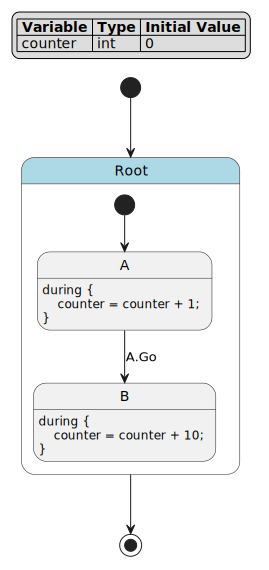

   State machine diagram

**Execution Summary**:

.. list-table::
   :header-rows: 1
   :widths: 8 20 20 12 40

   * - Cycle
     - Event
     - State
     - counter
     - Reason
   * - 0
     - *(none)*
     - *(initial)*
     - 0
     - Initial variable values
   * - 1
     - *(none)*
     - Root.A
     - 1
     - Initial transition ``[*] -> A``, then execute ``A.during`` (counter + 1)
   * - 2
     - *(none)*
     - Root.A
     - 2
     - No event, stay in A, execute ``A.during`` (counter + 1)
   * - 3
     - ``Go``
     - Root.B
     - 12
     - Event ``Go`` triggers ``A -> B``, then execute ``B.during`` (counter + 10)

**Detailed Execution Trace**:

**Cycle 1**  (initialization):

- Initial state: ``counter = 0``
- Execute initial transition ``[*] -> A``
- Execute ``A.enter`` (none defined)
- Reach stoppable state ``A``
- Execute ``A.during``: ``counter = 0 + 1 = 1``
- **Result**: ``state = Root.A``, ``counter = 1``

**Cycle 2**  (no event):

- Current state: ``Root.A``, ``counter = 1``
- Check transitions: ``A -> B :: Go`` (requires event, not triggered)
- No transition fires
- Execute ``A.during``: ``counter = 1 + 1 = 2``
- **Result**: ``state = Root.A``, ``counter = 2``

**Cycle 3**  (with event ``Go``):

- Current state: ``Root.A``, ``counter = 2``
- Check transitions: ``A -> B :: Go`` (event matches!)
- Execute ``A.exit`` (none defined)
- Execute transition (no effect)
- Execute ``B.enter`` (none defined)
- Reach stoppable state ``B``
- Execute ``B.during``: ``counter = 2 + 10 = 12``
- **Result**: ``state = Root.B``, ``counter = 12``

Example 2: Composite State with Initial Transition
~~~~~~~~~~~~~~~~~~~~~~~~~~~~~~~~~

.. literalinclude:: example2_composite.full.fcstm
   :language: fcstm
   :caption: Composite state with nested states

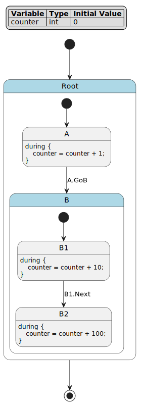

   Composite state diagram

**Execution Summary**:

.. list-table::
   :header-rows: 1
   :widths: 8 20 22 12 38

   * - Cycle
     - Event
     - State
     - counter
     - Reason
   * - 0
     - *(none)*
     - *(initial)*
     - 0
     - Initial variable values
   * - 1
     - *(none)*
     - Root.A
     - 1
     - Initial transition ``[*] -> A``, execute ``A.during`` (counter + 1)
   * - 2
     - ``GoB``
     - Root.B.B1
     - 11
     - Event ``GoB`` triggers ``A -> B``, follow ``[*] -> B1``, execute ``B1.during`` (counter + 10)
   * - 3
     - ``Next``
     - Root.B.B2
     - 111
     - Event ``Next`` triggers ``B1 -> B2``, execute ``B2.during`` (counter + 100)

**Detailed Execution Trace**:

**Cycle 1**  (initialization):

- Initial state: ``counter = 0``
- Execute ``[*] -> A``
- Reach stoppable state ``A``
- Execute ``A.during``: ``counter = 0 + 1 = 1``
- **Result**: ``state = Root.A``, ``counter = 1``

**Cycle 2**  (with event ``GoB``):

- Current state: ``Root.A``, ``counter = 1``
- Check transitions: ``A -> B :: GoB`` (event matches!)
- Execute ``A.exit`` (none defined)
- Execute ``B.enter`` (none defined)
- **B is composite state**  - must follow initial transition
- Execute ``[*] -> B1`` (inside B)
- Execute ``B1.enter`` (none defined)
- Reach stoppable state ``B1``
- Execute ``B1.during``: ``counter = 1 + 10 = 11``
- **Result**: ``state = Root.B.B1``, ``counter = 11``

**Key Point**: When transitioning to a composite state, the cycle continues by following initial transitions until reaching a stoppable state.

**Cycle 3**  (with event ``Next``):

- Current state: ``Root.B.B1``, ``counter = 11``
- Check transitions: ``B1 -> B2 :: Next`` (event matches!)
- Execute ``B1.exit`` (none defined)
- Execute ``B2.enter`` (none defined)
- Reach stoppable state ``B2``
- Execute ``B2.during``: ``counter = 11 + 100 = 111``
- **Result**: ``state = Root.B.B2``, ``counter = 111``

Example 3: Aspect Actions
~~~~~~~~~~~~~~~~~~~~~~~~~~~~~~~~~

.. literalinclude:: example3_aspect.full.fcstm
   :language: fcstm
   :caption: Aspect actions with execution order

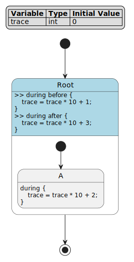

   Aspect actions diagram

**Execution Summary**:

.. list-table::
   :header-rows: 1
   :widths: 8 20 20 12 40

   * - Cycle
     - Event
     - State
     - trace
     - Reason
   * - 0
     - *(none)*
     - *(initial)*
     - 0
     - Initial variable values
   * - 1
     - *(none)*
     - Root.A
     - 123
     - Initial transition ``[*] -> A``, execute: before (×10+1=1) → during (×10+2=12) → after (×10+3=123)
   * - 2
     - *(none)*
     - Root.A
     - 123123
     - No event, execute: before (×10+1=1231) → during (×10+2=12312) → after (×10+3=123123)

**Detailed Execution Trace**:

**Cycle 1**  (initialization):

- Initial state: ``trace = 0``
- Execute ``[*] -> A``
- Reach stoppable state ``A``
- Execute during phase:
  1. ``Root >> during before``: ``trace = 0 * 10 + 1 = 1``
  2. ``A.during``: ``trace = 1 * 10 + 2 = 12``
  3. ``Root >> during after``: ``trace = 12 * 10 + 3 = 123``
- **Result**: ``state = Root.A``, ``trace = 123``

**Cycle 2**  (no event):

- Current state: ``Root.A``, ``trace = 123``
- No transition fires
- Execute during phase:
  1. ``Root >> during before``: ``trace = 123 * 10 + 1 = 1231``
  2. ``A.during``: ``trace = 1231 * 10 + 2 = 12312``
  3. ``Root >> during after``: ``trace = 12312 * 10 + 3 = 123123``
- **Result**: ``state = Root.A``, ``trace = 123123``

**Key Point**: Aspect actions (``>> during before/after``) execute in hierarchical order around the leaf state's ``during`` action, creating a sandwich pattern: before → during → after.

Example 4: Pseudo State (Skipping Aspect Actions)
~~~~~~~~~~~~~~~~~~~~~~~~~~~~~~~~~

.. literalinclude:: example4_pseudo.full.fcstm
   :language: fcstm
   :caption: Pseudo state skips aspect actions

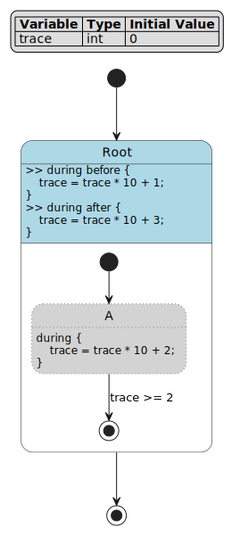

   Pseudo state diagram

**Execution Summary**:

.. list-table::
   :header-rows: 1
   :widths: 8 20 22 12 38

   * - Cycle
     - Event
     - State
     - trace
     - Reason
   * - 0
     - *(none)*
     - *(initial)*
     - 0
     - Initial variable values
   * - 1
     - *(none)*
     - *(terminated)*
     - 2
     - Initial transition ``[*] -> A``, pseudo state skips aspect actions, execute ``A.during`` (×10+2=2), guard satisfied, transition to ``[*]``

**Detailed Execution Trace**:

**Cycle 1**  (initialization and termination):

- Initial state: ``trace = 0``
- Execute ``[*] -> A``
- Reach stoppable state ``A`` (pseudo state)
- **Pseudo state skips aspect actions!**
- Execute during phase:
  - ``Root >> during before`` **SKIPPED**
  - ``A.during``: ``trace = 0 * 10 + 2 = 2``
  - ``Root >> during after`` **SKIPPED**
- Check transitions: ``A -> [*] : if [trace >= 2]`` (guard satisfied!)
- Execute ``A.exit`` (none defined)
- Transition to final state
- **Result**: ``state = terminated``, ``trace = 2``

**Key Point**: Pseudo states skip all ancestor aspect actions, executing only their own ``during`` action. This is useful for intermediate states that shouldn't trigger cross-cutting concerns.

Example 5: Multi-Level Composite State
~~~~~~~~~~~~~~~~~~~~~~~~~~~~~~~~~

.. literalinclude:: example5_multilevel.full.fcstm
   :language: fcstm
   :caption: Multi-level nested composite states

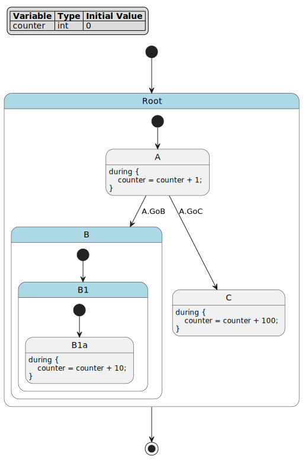

   Multi-level composite state diagram

**Execution Summary (Scenario 1: A → B)**:

.. list-table::
   :header-rows: 1
   :widths: 8 20 25 12 35

   * - Cycle
     - Event
     - State
     - counter
     - Reason
   * - 0
     - *(none)*
     - *(initial)*
     - 0
     - Initial variable values
   * - 1
     - *(none)*
     - Root.A
     - 1
     - Initial transition ``[*] -> A``, execute ``A.during`` (counter + 1)
   * - 2
     - ``GoB``
     - Root.B.B1.B1a
     - 11
     - Event ``GoB`` triggers ``A -> B``, follow ``[*] -> B1`` then ``[*] -> B1a``, execute ``B1a.during`` (counter + 10)

**Execution Summary (Scenario 2: A → C)**:

.. list-table::
   :header-rows: 1
   :widths: 8 20 25 12 35

   * - Cycle
     - Event
     - State
     - counter
     - Reason
   * - 0
     - *(none)*
     - *(initial)*
     - 0
     - Initial variable values
   * - 1
     - *(none)*
     - Root.A
     - 1
     - Initial transition ``[*] -> A``, execute ``A.during`` (counter + 1)
   * - 2
     - ``GoC``
     - Root.C
     - 101
     - Event ``GoC`` triggers ``A -> C``, execute ``C.during`` (counter + 100)

**Detailed Execution Trace**:

**Cycle 1**  (initialization):

- Initial state: ``counter = 0``
- Execute ``[*] -> A``
- Reach stoppable state ``A``
- Execute ``A.during``: ``counter = 0 + 1 = 1``
- **Result**: ``state = Root.A``, ``counter = 1``

**Cycle 2**  (with event ``GoB``):

- Current state: ``Root.A``, ``counter = 1``
- Check transitions: ``A -> B :: GoB`` (event matches!)
- Execute ``A.exit`` (none defined)
- Execute ``B.enter`` (none defined)
- **B is composite**  - follow ``[*] -> B1``
- Execute ``B1.enter`` (none defined)
- **B1 is also composite**  - follow ``[*] -> B1a``
- Execute ``B1a.enter`` (none defined)
- Reach stoppable state ``B1a``
- Execute ``B1a.during``: ``counter = 1 + 10 = 11``
- **Result**: ``state = Root.B.B1.B1a``, ``counter = 11``

**Key Point**: A single cycle can traverse multiple levels of composite states by following initial transition chains until reaching a stoppable leaf state.

**Cycle 3**  (with event ``GoC`` from initial state):

- Starting fresh: ``counter = 0``
- Execute ``[*] -> A``
- Execute ``A.during``: ``counter = 1``
- Next cycle with event ``GoC``:

- Check transitions: ``A -> C :: GoC`` (event matches!)
- Execute ``A.exit`` (none defined)
- Execute ``C.enter`` (none defined)
- Reach stoppable state ``C``
- Execute ``C.during``: ``counter = 1 + 100 = 101``
- **Result**: ``state = Root.C``, ``counter = 101``

Hierarchical Execution Order
~~~~~~~~~~~~~~~~~~~~~~~~~~~~~~~~~

Understanding execution order in nested states is crucial:

.. literalinclude:: hierarchy_execution.demo.py
   :language: python
   :caption: Hierarchical execution

Output:

.. literalinclude:: hierarchy_execution.demo.py.txt
   :language: text

**Complete Execution Order**:

**Entry Phase**  (from parent):

1. ``State.enter``
2. ``State.during before`` (if entering via ``[*] -> Child``)
3. ``Child.enter``

**During Phase**  (each cycle at leaf state):

1. Ancestor ``>> during before`` actions (root to leaf)
2. Leaf state ``during`` action
3. Ancestor ``>> during after`` actions (leaf to root)

**Exit Phase**  (to parent):

1. ``Child.exit``
2. ``State.during after`` (if exiting via ``Child -> [*]``)
3. ``State.exit``

**Child-to-Child Transition**:

1. ``Child1.exit``
2. (Transition effect)
3. ``Child2.enter``
4. NO ``during before/after`` execution

**Key Points**:

- Aspect actions (``>> during before/after``) execute during the ``during`` phase for all descendant leaf states
- Composite state actions (``during before/after`` without ``>>``) only execute during entry/exit transitions, NOT during the ``during`` phase
- Pseudo states skip ancestor aspect actions

Example 6: Transition Priority
~~~~~~~~~~~~~~~~~~~~~~~~~~~~~~~~~

When multiple transitions from the same state have satisfied guards, the first transition in definition order is selected:

.. literalinclude:: example6_transition_priority.full.fcstm
   :language: fcstm
   :caption: Transition priority demonstration

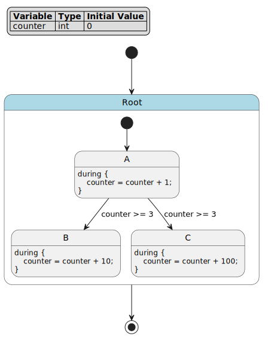

   Transition priority diagram

**Execution Summary**:

.. list-table::
   :header-rows: 1
   :widths: 8 20 20 12 40

   * - Cycle
     - Event
     - State
     - counter
     - Reason
   * - 0
     - *(none)*
     - *(initial)*
     - 0
     - Initial variable values
   * - 1
     - *(none)*
     - Root.A
     - 1
     - Initial transition ``[*] -> A``, execute ``A.during`` (counter + 1)
   * - 2
     - *(none)*
     - Root.A
     - 2
     - No guard satisfied (counter < 3), execute ``A.during`` (counter + 1)
   * - 3
     - *(none)*
     - Root.A
     - 3
     - No guard satisfied (counter < 3), execute ``A.during`` (counter + 1)
   * - 4
     - *(none)*
     - Root.B
     - 13
     - Both guards satisfied (counter >= 3), but ``A -> B`` is defined first and takes priority, execute ``B.during`` (counter + 10)

**Detailed Execution Trace**:

**Cycle 1-3**  (accumulating counter):

- Initial state: ``counter = 0``
- Execute ``[*] -> A``
- Reach stoppable state ``A``
- Execute ``A.during``: ``counter = 0 + 1 = 1``
- Cycles 2-3 continue incrementing: ``counter = 2``, then ``counter = 3``

**Cycle 4**  (transition priority):

- Current state: ``Root.A``, ``counter = 3``
- Check transitions in definition order:
  1. ``A -> B : if [counter >= 3]`` (guard satisfied!)
  2. ``A -> C : if [counter >= 3]`` (guard also satisfied, but not checked)
- Execute ``A.exit`` (none defined)
- Execute ``B.enter`` (none defined)
- Reach stoppable state ``B``
- Execute ``B.during``: ``counter = 3 + 10 = 13``
- **Result**: ``state = Root.B``, ``counter = 13``

**Key Point**: Transitions are evaluated in definition order. The first transition with a satisfied guard is selected, even if multiple guards are satisfied.

Example 7: Self-Transition
~~~~~~~~~~~~~~~~~~~~~~~~~~~~~~~~~

Self-transitions execute exit and enter actions, providing a way to reset state-specific initialization:

.. literalinclude:: example7_self_transition.full.fcstm
   :language: fcstm
   :caption: Self-transition with lifecycle actions

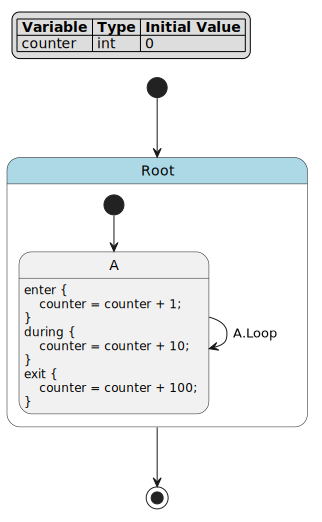

   Self-transition diagram

**Execution Summary**:

.. list-table::
   :header-rows: 1
   :widths: 8 20 20 12 40

   * - Cycle
     - Event
     - State
     - counter
     - Reason
   * - 0
     - *(none)*
     - *(initial)*
     - 0
     - Initial variable values
   * - 1
     - *(none)*
     - Root.A
     - 11
     - Initial transition ``[*] -> A``, execute ``A.enter`` (+1), then ``A.during`` (+10)
   * - 2
     - *(none)*
     - Root.A
     - 21
     - No event, stay in A, execute ``A.during`` (+10)
   * - 3
     - *(none)*
     - Root.A
     - 31
     - No event, stay in A, execute ``A.during`` (+10)
   * - 4
     - ``Loop``
     - Root.A
     - 142
     - Event ``Loop`` triggers ``A -> A``, execute ``A.exit`` (+100), ``A.enter`` (+1), ``A.during`` (+10)

**Detailed Execution Trace**:

**Cycle 1**  (initialization):

- Initial state: ``counter = 0``
- Execute ``[*] -> A``
- Execute ``A.enter``: ``counter = 0 + 1 = 1``
- Reach stoppable state ``A``
- Execute ``A.during``: ``counter = 1 + 10 = 11``
- **Result**: ``state = Root.A``, ``counter = 11``

**Cycle 2-3**  (staying in state without transition):

- Current state: ``Root.A``, ``counter = 11``
- No event provided, no transition fires
- Stay in state ``A``
- Execute ``A.during``: ``counter = 11 + 10 = 21``
- **Result**: ``state = Root.A``, ``counter = 21``
- Cycle 3: Same process, ``counter = 21 + 10 = 31``

**Cycle 4**  (self-transition with event ``Loop``):

- Current state: ``Root.A``, ``counter = 31``
- Check transitions: ``A -> A :: Loop`` (event matches!)
- Execute ``A.exit``: ``counter = 31 + 100 = 131``
- Execute transition (no effect)
- Execute ``A.enter``: ``counter = 131 + 1 = 132``
- Reach stoppable state ``A`` (same state)
- Execute ``A.during``: ``counter = 132 + 10 = 142``
- **Result**: ``state = Root.A``, ``counter = 142``

**Key Point**: Self-transitions (``A -> A``) execute the full exit-enter sequence, allowing state reinitialization. This is different from staying in the state without a transition:

- **Staying in state**  (cycles 2-3): Only ``during`` action executes (+10 each cycle)
- **Self-transition**  (cycle 4): Full sequence executes: ``exit`` (+100) → ``enter`` (+1) → ``during`` (+10)

Example 8: Guard Conditions with Effects
~~~~~~~~~~~~~~~~~~~~~~~~~~~~~~~~~

Guards and effects work together to enable complex conditional transitions with state modifications:

.. literalinclude:: example8_guard_effect.full.fcstm
   :language: fcstm
   :caption: Guard conditions with transition effects

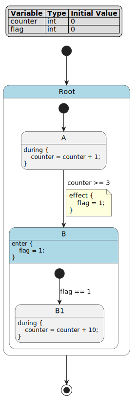

   Guard and effect diagram

**Execution Summary**:

.. list-table::
   :header-rows: 1
   :widths: 8 20 25 12 12 31

   * - Cycle
     - Event
     - State
     - counter
     - flag
     - Reason
   * - 0
     - *(none)*
     - *(initial)*
     - 0
     - 0
     - Initial variable values
   * - 1
     - *(none)*
     - Root.A
     - 1
     - 0
     - Initial transition ``[*] -> A``, execute ``A.during`` (counter + 1)
   * - 2
     - *(none)*
     - Root.A
     - 2
     - 0
     - Guard not satisfied (counter < 3), execute ``A.during`` (counter + 1)
   * - 3
     - *(none)*
     - Root.A
     - 3
     - 0
     - Guard not satisfied (counter < 3), execute ``A.during`` (counter + 1)
   * - 4
     - *(none)*
     - Root.B.B1
     - 13
     - 1
     - Guard satisfied (counter >= 3), effect sets flag=1, ``B.enter`` validates ``B1`` is reachable, execute ``B1.during`` (counter + 10)

**Detailed Execution Trace**:

**Cycle 1-3**  (accumulating counter):

- Initial state: ``counter = 0``, ``flag = 0``
- Execute ``[*] -> A``
- Reach stoppable state ``A``
- Execute ``A.during``: ``counter = 0 + 1 = 1``
- Cycles 2-3 continue: ``counter = 2``, then ``counter = 3``

**Cycle 4**  (guard satisfied, effect executed):

- Current state: ``Root.A``, ``counter = 3``, ``flag = 0``
- Check transitions: ``A -> B : if [counter >= 3]`` (guard satisfied!)
- Execute ``A.exit`` (none defined)
- Execute transition effect: ``flag = 1``
- Execute ``B.enter``: ``flag = 1`` (enter action sets flag)
- **B is composite**  - follow ``[*] -> B1 : if [flag == 1]`` (guard satisfied!)
- Execute ``B1.enter`` (none defined)
- Reach stoppable state ``B1``
- Execute ``B1.during``: ``counter = 3 + 10 = 13``
- **Result**: ``state = Root.B.B1``, ``counter = 13``, ``flag = 1``

**Key Point**: Transition effects execute after exit actions but before enter actions. The effect can modify variables that are checked by guards in subsequent initial transitions, enabling complex multi-stage validation.

DFS Validation Mechanism
~~~~~~~~~~~~~~~~~~~~~~~~~~~~~~~~~

When transitioning to a non-stoppable state (composite or pseudo), the runtime performs a depth-first search (DFS) to validate that a stoppable state can be reached. This prevents the state machine from entering invalid states.

**Validation Rules**:

1. **Composite States**: Must have at least one initial transition that leads to a stoppable state
2. **Pseudo States**: Must have an outgoing transition that leads to a stoppable state
3. **Event Requirements**: All required events must be available in the current cycle
4. **Guard Conditions**: All guards along the path must be satisfied
5. **Transition Order**: Transitions are evaluated in definition order (DFS, not BFS)

**Validation Process**:

1. Create a snapshot of current variables
2. Simulate the transition chain using DFS:
   - Execute enter actions (modifying snapshot)
   - Check guards (using snapshot)
   - Follow initial transitions recursively
3. If a stoppable state is reached: validation succeeds, execute the real transition
4. If no stoppable state is reachable: validation fails, stay in current state

Example 9: Pseudo State Chain Validation
~~~~~~~~~~~~~~~~~~~~~~~~~~~~~~~~~

Pseudo states require validation to ensure they lead to stoppable states:

.. literalinclude:: example9_pseudo_chain.full.fcstm
   :language: fcstm
   :caption: Pseudo state chain requiring validation

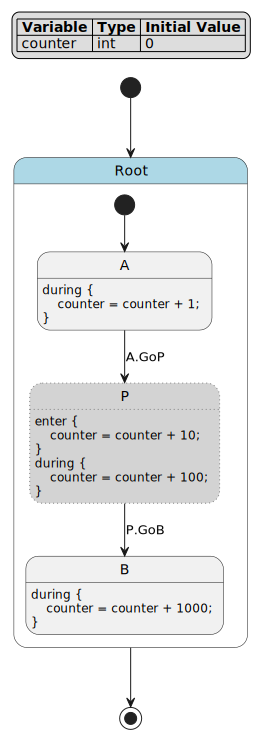

   Pseudo state chain diagram

**Execution Summary**:

.. list-table::
   :header-rows: 1
   :widths: 8 25 20 12 35

   * - Cycle
     - Event
     - State
     - counter
     - Reason
   * - 0
     - *(none)*
     - *(initial)*
     - 0
     - Initial variable values
   * - 1
     - *(none)*
     - Root.A
     - 1
     - Initial transition ``[*] -> A``, execute ``A.during`` (counter + 1)
   * - 2
     - ``GoP``
     - Root.A
     - 2
     - Event ``GoP`` triggers ``A -> P``, but P is pseudo (non-stoppable), validation fails (no ``GoB`` event), stay in A, execute ``A.during`` (counter + 1)
   * - 3
     - ``GoP``, ``GoB``
     - Root.B
     - 1112
     - Both events provided, validation succeeds: ``A -> P`` (+10, +100) ``-> B``, execute ``B.during`` (+1000)

**Detailed Execution Trace**:

**Cycle 1**  (initialization):

- Initial state: ``counter = 0``
- Execute ``[*] -> A``
- Reach stoppable state ``A``
- Execute ``A.during``: ``counter = 0 + 1 = 1``
- **Result**: ``state = Root.A``, ``counter = 1``

**Cycle 2**  (validation failure - missing event):

- Current state: ``Root.A``, ``counter = 1``
- Check transitions: ``A -> P :: GoP`` (event matches!)
- **Validation phase**  (using snapshot):
  - Target ``P`` is pseudo state (non-stoppable)
  - Simulate: execute ``P.enter``: ``counter_snapshot = 1 + 10 = 11``
  - Check ``P``'s transitions: ``P -> B :: GoB`` (requires ``GoB`` event)
  - Event ``GoB`` NOT available in current cycle
  - **Validation fails**: cannot reach stoppable state
- Transition rejected, stay in ``A``
- Execute ``A.during``: ``counter = 1 + 1 = 2``
- **Result**: ``state = Root.A``, ``counter = 2``

**Cycle 3**  (validation success - all events provided):

- Current state: ``Root.A``, ``counter = 2``
- Check transitions: ``A -> P :: GoP`` (event matches!)
- **Validation phase**  (using snapshot):
  - Target ``P`` is pseudo state (non-stoppable)
  - Simulate: execute ``P.enter``: ``counter_snapshot = 2 + 10 = 12``
  - Check ``P``'s transitions: ``P -> B :: GoB`` (requires ``GoB`` event)
  - Event ``GoB`` IS available in current cycle
  - Simulate: execute ``B.enter`` (none defined)
  - Target ``B`` is stoppable state
  - **Validation succeeds**: can reach stoppable state ``B``
- **Real execution**:
  - Execute ``A.exit`` (none defined)
  - Execute ``P.enter``: ``counter = 2 + 10 = 12``
  - Reach pseudo state ``P`` (non-stoppable, continue immediately)
  - Execute ``P.during``: ``counter = 12 + 100 = 112``
  - Execute ``P.exit`` (none defined)
  - Execute ``B.enter`` (none defined)
  - Reach stoppable state ``B``
  - Execute ``B.during``: ``counter = 112 + 1000 = 1112``
- **Result**: ``state = Root.B``, ``counter = 1112``

**Key Point**: Pseudo states are non-stoppable and require validation. The validation uses DFS to check if the transition chain can reach a stoppable state with the available events. Pseudo states execute their ``during`` action during the real transition, but this happens in the same cycle as reaching the final stoppable state.

Example 10: Validation Failure - Unreachable Stoppable
~~~~~~~~~~~~~~~~~~~~~~~~~~~~~~~~~

When a composite state's initial transitions cannot reach a stoppable state, the transition is rejected:

.. literalinclude:: example10_validation_failure.full.fcstm
   :language: fcstm
   :caption: Validation failure due to unreachable stoppable state

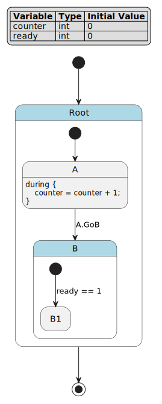

   Validation failure diagram

**Execution Summary**:

.. list-table::
   :header-rows: 1
   :widths: 8 20 20 12 12 28

   * - Cycle
     - Event
     - State
     - counter
     - ready
     - Reason
   * - 0
     - *(none)*
     - *(initial)*
     - 0
     - 0
     - Initial variable values
   * - 1
     - *(none)*
     - Root.A
     - 1
     - 0
     - Initial transition ``[*] -> A``, execute ``A.during`` (counter + 1)
   * - 2
     - ``GoB``
     - Root.A
     - 2
     - 0
     - Event ``GoB`` triggers ``A -> B``, but validation fails (``B`` has no valid initial transition to reach stoppable), stay in A, execute ``A.during`` (counter + 1)

**Detailed Execution Trace**:

**Cycle 1**  (initialization):

- Initial state: ``counter = 0``, ``ready = 0``
- Execute ``[*] -> A``
- Reach stoppable state ``A``
- Execute ``A.during``: ``counter = 0 + 1 = 1``
- **Result**: ``state = Root.A``, ``counter = 1``, ``ready = 0``

**Cycle 2**  (validation failure - guard not satisfied):

- Current state: ``Root.A``, ``counter = 1``, ``ready = 0``
- Check transitions: ``A -> B :: GoB`` (event matches!)
- **Validation phase**  (using snapshot):
  - Target ``B`` is composite state (non-stoppable)
  - Simulate: execute ``B.enter`` (none defined)
  - Check ``B``'s initial transitions: ``[*] -> B1 : if [ready == 1]``
  - Guard check: ``ready == 1`` (current value: ``ready = 0``)
  - **Guard NOT satisfied**
  - No other initial transitions available
  - **Validation fails**: cannot reach stoppable state
- Transition rejected, stay in ``A``
- Execute ``A.during``: ``counter = 1 + 1 = 2``
- **Result**: ``state = Root.A``, ``counter = 2``, ``ready = 0``

**Key Point**: Composite states must have at least one initial transition that can reach a stoppable state. The validation checks all guards and event requirements along the path. If no valid path exists, the transition is rejected and the state machine remains in the current state.

Hot Start Feature
---------------------------------------

The hot start feature allows starting execution from an arbitrary state without executing enter actions. This section explains the mechanism, implementation details, and practical use cases.

Mechanism and Implementation
~~~~~~~~~~~~~~~~~~~~~~~~~~~~~~~~~

**What is Hot Start?**

Hot start constructs the execution stack directly to a target state, bypassing all enter actions. This simulates having already entered and stabilized at that state. The runtime behaves as if it had executed a complete initialization sequence, but without actually running the enter action code.

**Stack Construction Rules**:

When hot starting to a target state, the runtime builds a frame stack from root to target:

1. **Leaf States** (target): Use ``'active'`` mode
   - First cycle executes the during chain (including aspect actions)
   - Behaves like a normal stoppable state

2. **Composite States** (target): Use ``'init_wait'`` mode
   - First cycle triggers DFS to find initial transition
   - Automatically navigates to a stoppable leaf state
   - If no valid initial transition exists, validation fails

3. **Ancestor States** (path to target): Use ``'active'`` mode
   - Represent that child states are running
   - Aspect actions (``>> during before/after``) execute normally

**Variable Override**:

- ``initial_vars`` must provide **all** variables (no partial override)
- Variables are set before stack construction
- Type checking enforced (int vs float)

**Lifecycle Action Behavior**:

- **Enter actions**: Skipped for all states in the path
- **During actions**: Execute normally starting from first cycle
- **Aspect actions**: Execute normally (``>> during before/after``)
- **Exit actions**: Execute normally when leaving states

Use Case Examples
~~~~~~~~~~~~~~~~~~~~~~~~~~~~~~~~~

**Example 1: Debugging Specific States**

Jump directly to a problematic state to test behavior without full initialization:

.. code-block:: python

   # Debug error handling without triggering the error
   runtime = SimulationRuntime(
       sm,
       initial_state="System.ErrorHandler",
       initial_vars={"error_code": 42, "retry_count": 3}
   )

   # Test error recovery logic directly
   runtime.cycle()
   print(f"Error code: {runtime.vars['error_code']}")
   print(f"Retry count: {runtime.vars['retry_count']}")

**Example 2: State Recovery and Checkpointing**

Save and restore execution state for testing or recovery:

.. code-block:: python

   # Save current state
   checkpoint = {
       'state': runtime.current_state.path,
       'vars': runtime.vars.copy()
   }

   # Later: restore from checkpoint
   runtime = SimulationRuntime(
       sm,
       initial_state=checkpoint['state'],
       initial_vars=checkpoint['vars']
   )

   # Continue execution from saved point
   runtime.cycle()

**Example 3: Testing State-Specific Logic**

Test specific state behavior without dependencies on previous states:

.. code-block:: python

   # Test water heater heating logic at specific temperature
   runtime = SimulationRuntime(
       sm,
       initial_state="WaterHeater.Heating",
       initial_vars={"water_temp": 52, "draw_count": 0}
   )

   # Verify heating behavior over multiple cycles
   for i in range(5):
       runtime.cycle()
       temp = runtime.vars['water_temp']
       print(f"Cycle {i+1}: Temperature = {temp}°C")

       # Verify temperature increases by 4 per cycle
       assert temp == 52 + (i+1) * 4

**Example 4: Testing Composite State Initial Transitions**

Hot start from a composite state to verify initial transition logic:

.. code-block:: python

   # Hot start from composite state
   runtime = SimulationRuntime(
       sm,
       initial_state="System.SubSystem",
       initial_vars={"ready": 1, "counter": 0}
   )

   # First cycle triggers initial transition
   runtime.cycle()

   # Verify reached correct leaf state
   assert runtime.current_state.path == ('System', 'SubSystem', 'Ready')

**Example 5: CLI Hot Start for Interactive Testing**

Use the ``init`` command in CLI for quick testing:

.. code-block:: bash

   $ pyfcstm simulate -i water_heater.fcstm

   # Hot start to Heating state with low temperature
   > init WaterHeater.Heating water_temp=52 draw_count=0
   Initialized from state: WaterHeater.Heating
   Current state: WaterHeater.Heating
   Variables: water_temp=52, draw_count=0

   # Execute cycles to test heating
   > cycle 3
    Cycle     State                water_temp  draw_count
   --------------------------------------------------------
      1    WaterHeater.Heating        56           0
      2    WaterHeater.Heating        60           0
      3    WaterHeater.Standby        59           0

   # Temperature reached 60, transitioned to Standby

**Important Considerations**:

- Hot start is for testing and debugging, not production execution
- Enter actions may contain critical initialization logic - verify behavior
- For composite states, ensure valid initial transitions exist
- The ``init`` CLI command creates a new runtime (history is cleared)
- All variables must be provided (no partial override)

Real-World Business Examples
---------------------------------------

The following examples demonstrate practical applications of FCSTM state machines in real-world control systems. Each example includes multiple execution scenarios showing different business conditions and their detailed execution traces.

Example 11: Elevator Door Control
~~~~~~~~~~~~~~~~~~~~~~~~~~~~~~~~~

This example simulates common elevator car door control logic: doors open when a hall call is received, remain open for a hold period, then automatically close. If the infrared beam detects an obstruction during closing, the doors immediately reopen and restart the hold timer.

.. literalinclude:: example11_elevator_door.full.fcstm
   :language: fcstm
   :caption: Elevator door control system

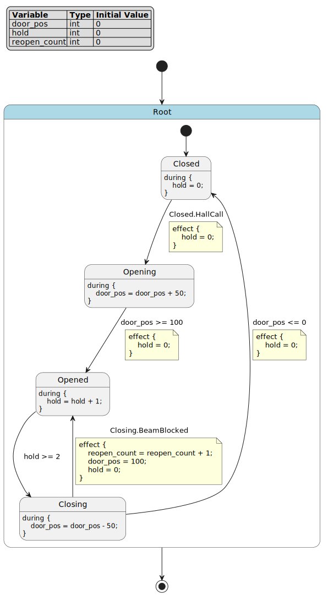

   Elevator door control diagram

**Business Context**:

This state machine models a typical elevator safety system where:

- ``door_pos`` represents door position (0=fully closed, 50=half-open, 100=fully open)
- ``hold`` counts cycles the door remains fully open
- ``reopen_count`` tracks how many times the door reopened due to obstructions

**Scenario A: Normal Operation**  (open → hold → close)

.. list-table::
   :header-rows: 1
   :widths: 8 20 12 12 12 36

   * - Cycle
     - Event
     - State
     - door_pos
     - hold
     - Business Meaning
   * - 1
     - *(none)*
     - Closed
     - 0
     - 0
     - Elevator idle, doors closed
   * - 2
     - ``HallCall``
     - Opening
     - 50
     - 0
     - Passenger calls elevator, doors begin opening
   * - 3
     - *(none)*
     - Opening
     - 100
     - 0
     - Doors continue opening to full position
   * - 4
     - *(none)*
     - Opened
     - 100
     - 1
     - Doors fully open, hold timer starts
   * - 5
     - *(none)*
     - Opened
     - 100
     - 2
     - Hold timer continues (waiting for passengers)
   * - 6
     - *(none)*
     - Closing
     - 50
     - 2
     - Hold time expired, doors begin closing
   * - 7
     - *(none)*
     - Closing
     - 0
     - 2
     - Doors continue closing to fully closed
   * - 8
     - *(none)*
     - Closed
     - 0
     - 0
     - Doors fully closed, ready for next call

**Detailed Execution Trace A**:

**Cycle 1**  (initial state):

- Initial: ``door_pos = 0``, ``hold = 0``, ``reopen_count = 0``
- Execute ``[*] -> Closed``
- Execute ``Closed.during``: ``hold = 0``
- **Result**: Elevator idle with doors closed

**Cycle 2**  (hall call received):

- Event ``HallCall`` triggers ``Closed -> Opening``
- Execute ``Closed.exit`` (none defined)
- Execute transition effect: ``hold = 0``
- Execute ``Opening.enter`` (none defined)
- Execute ``Opening.during``: ``door_pos = 0 + 50 = 50``
- **Result**: Doors begin opening, halfway open

**Cycle 3**  (doors continue opening):

- Check ``Opening -> Opened``: ``door_pos >= 100`` not satisfied (current: 50)
- Execute ``Opening.during``: ``door_pos = 50 + 50 = 100``
- **Result**: Doors reach fully open position

**Cycle 4**  (transition to opened state):

- Check ``Opening -> Opened``: ``door_pos >= 100`` satisfied
- Execute ``Opening.exit`` (none defined)
- Execute transition effect: ``hold = 0``
- Execute ``Opened.enter`` (none defined)
- Execute ``Opened.during``: ``hold = 0 + 1 = 1``
- **Result**: Doors fully open, hold timer starts

**Cycle 5**  (hold timer continues):

- Check ``Opened -> Closing``: ``hold >= 2`` not satisfied (current: 1)
- Execute ``Opened.during``: ``hold = 1 + 1 = 2``
- **Result**: Hold timer reaches threshold

**Cycle 6**  (begin closing):

- Check ``Opened -> Closing``: ``hold >= 2`` satisfied
- Execute ``Opened.exit`` (none defined)
- Execute ``Closing.enter`` (none defined)
- Execute ``Closing.during``: ``door_pos = 100 - 50 = 50``
- **Result**: Doors begin closing

**Cycle 7**  (continue closing):

- Check ``Closing -> Closed``: ``door_pos <= 0`` not satisfied (current: 50)
- Execute ``Closing.during``: ``door_pos = 50 - 50 = 0``
- **Result**: Doors reach fully closed position

**Cycle 8**  (transition to closed):

- Check ``Closing -> Closed``: ``door_pos <= 0`` satisfied
- Execute ``Closing.exit`` (none defined)
- Execute transition effect: ``hold = 0``
- Execute ``Closed.enter`` (none defined)
- Execute ``Closed.during``: ``hold = 0``
- **Result**: Doors fully closed, system ready

**Scenario B: Safety Reopening**  (obstruction detected during closing)

.. list-table::
   :header-rows: 1
   :widths: 8 25 12 12 12 31

   * - Cycle
     - Event
     - State
     - door_pos
     - reopen_count
     - Business Meaning
   * - 1-5
     - *(same as A)*
     - *(same as A)*
     - *(same)*
     - 0
     - Normal opening and hold sequence
   * - 6
     - *(none)*
     - Closing
     - 50
     - 0
     - Doors begin closing automatically
   * - 7
     - ``BeamBlocked``
     - Opened
     - 100
     - 1
     - Obstruction detected! Doors immediately reopen for safety

**Detailed Execution Trace B**:

**Cycles 1-6**: Same as Scenario A (doors open, hold, begin closing)
- After cycle 6: ``state = Closing``, ``door_pos = 50``, ``hold = 2``, ``reopen_count = 0``

**Cycle 7**  (obstruction detected):

- Event ``BeamBlocked`` triggers ``Closing -> Opened``
- Execute ``Closing.exit`` (none defined)
- Execute transition effect:
  - ``reopen_count = 0 + 1 = 1`` (track safety reopening)
  - ``door_pos = 100`` (immediately set to fully open)
  - ``hold = 0`` (restart hold timer)
- Execute ``Opened.enter`` (none defined)
- Execute ``Opened.during``: ``hold = 0 + 1 = 1``
- **Result**: Doors immediately reopen for safety, hold timer restarts

**Key Points**:

- ``door_pos`` is abstracted to three positions (0, 50, 100) representing closed, half, and fully open
- ``BeamBlocked`` event only has meaning in ``Closing`` state, matching real elevator safety logic
- Reopening transitions directly to ``Opened`` (not ``Opening``), immediately providing clearance
- ``reopen_count`` tracks safety events for maintenance monitoring

Example 12: Water Heater Temperature Control
~~~~~~~~~~~~~~~~~~~~~~~~~~~~~~~~~

This example simulates a common residential storage water heater: water temperature gradually decreases during standby, heating activates when temperature drops below the lower threshold, and deactivates when reaching the upper threshold. Heavy water usage causes rapid temperature drop, triggering earlier heating.

.. literalinclude:: example12_water_heater.full.fcstm
   :language: fcstm
   :caption: Water heater temperature control system

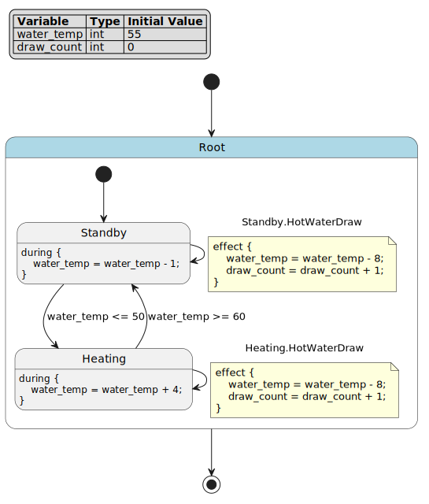

   Water heater temperature control diagram

**Business Context**:

This state machine models a typical hysteresis temperature control system where:

- ``water_temp`` represents water temperature in degrees
- ``draw_count`` tracks number of hot water usage events
- Temperature naturally decreases by 1°/cycle in standby
- Heating increases temperature by 4°/cycle
- Hot water draw causes immediate 8° temperature drop

**Scenario A: Natural Heat Loss and Recovery**  (no water usage)

.. list-table::
   :header-rows: 1
   :widths: 8 20 15 12 43

   * - Cycle
     - Event
     - State
     - water_temp
     - Business Meaning
   * - 1
     - *(none)*
     - Standby
     - 54
     - Normal standby, gradual heat loss
   * - 2
     - *(none)*
     - Standby
     - 53
     - Continued heat loss through insulation
   * - 3
     - *(none)*
     - Standby
     - 52
     - Temperature approaching lower threshold
   * - 4
     - *(none)*
     - Standby
     - 51
     - Temperature nearing heating activation point
   * - 5
     - *(none)*
     - Standby
     - 50
     - Temperature at lower threshold
   * - 6
     - *(none)*
     - Heating
     - 54
     - Heating activated, temperature begins rising
   * - 7
     - *(none)*
     - Heating
     - 58
     - Heating continues toward upper threshold

**Detailed Execution Trace A**:

**Cycle 1**  (initial standby):

- Initial: ``water_temp = 55``, ``draw_count = 0``
- Execute ``[*] -> Standby``
- Execute ``Standby.during``: ``water_temp = 55 - 1 = 54``
- **Result**: Normal heat loss through tank insulation

**Cycles 2-5**  (gradual temperature decrease):

- Each cycle: Check ``Standby -> Heating``: ``water_temp <= 50`` not satisfied
- Execute ``Standby.during``: ``water_temp`` decreases by 1
- Cycle 2: ``54 - 1 = 53``
- Cycle 3: ``53 - 1 = 52``
- Cycle 4: ``52 - 1 = 51``
- Cycle 5: ``51 - 1 = 50``
- **Result**: Temperature gradually drops to lower threshold

**Cycle 6**  (heating activation):

- Check ``Standby -> Heating``: ``water_temp <= 50`` satisfied
- Execute ``Standby.exit`` (none defined)
- Execute ``Heating.enter`` (none defined)
- Execute ``Heating.during``: ``water_temp = 50 + 4 = 54``
- **Result**: Heating element activates, temperature begins rising

**Cycle 7**  (continued heating):

- Check ``Heating -> Standby``: ``water_temp >= 60`` not satisfied (current: 54)
- Execute ``Heating.during``: ``water_temp = 54 + 4 = 58``
- **Result**: Heating continues toward upper threshold

**Scenario B: Heavy Water Usage**  (morning shower triggers early heating)

.. list-table::
   :header-rows: 1
   :widths: 8 25 15 12 12 28

   * - Cycle
     - Event
     - State
     - water_temp
     - draw_count
     - Business Meaning
   * - 1
     - *(none)*
     - Standby
     - 54
     - 0
     - Normal standby state
   * - 2
     - ``HotWaterDraw``
     - Standby
     - 45
     - 1
     - Heavy water usage (shower), rapid temperature drop
   * - 3
     - *(none)*
     - Heating
     - 49
     - 1
     - Temperature below threshold, heating activates
   * - 4
     - *(none)*
     - Heating
     - 53
     - 1
     - Heating continues
   * - 5
     - *(none)*
     - Heating
     - 57
     - 1
     - Approaching upper threshold
   * - 6
     - *(none)*
     - Heating
     - 61
     - 1
     - Temperature exceeds upper threshold
   * - 7
     - *(none)*
     - Standby
     - 60
     - 1
     - Heating deactivates, return to standby

**Detailed Execution Trace B**:

**Cycle 1**  (initial standby):

- Same as Scenario A: ``water_temp = 54``, ``draw_count = 0``

**Cycle 2**  (heavy water usage):

- Event ``HotWaterDraw`` triggers ``Standby -> Standby`` (self-transition)
- Execute ``Standby.exit`` (none defined)
- Execute transition effect:
  - ``water_temp = 54 - 8 = 46`` (cold water influx)
  - ``draw_count = 0 + 1 = 1`` (track usage event)
- Execute ``Standby.enter`` (none defined)
- Execute ``Standby.during``: ``water_temp = 46 - 1 = 45``
- **Result**: Significant temperature drop from water usage

**Cycle 3**  (heating activation):

- Check ``Standby -> Heating``: ``water_temp <= 50`` satisfied (current: 45)
- Execute ``Standby.exit`` (none defined)
- Execute ``Heating.enter`` (none defined)
- Execute ``Heating.during``: ``water_temp = 45 + 4 = 49``
- **Result**: Low temperature triggers immediate heating

**Cycles 4-6**  (heating to upper threshold):

- Each cycle: Check ``Heating -> Standby``: ``water_temp >= 60`` not satisfied
- Execute ``Heating.during``: ``water_temp`` increases by 4
- Cycle 4: ``49 + 4 = 53``
- Cycle 5: ``53 + 4 = 57``
- Cycle 6: ``57 + 4 = 61``
- **Result**: Temperature rises above upper threshold

**Cycle 7**  (heating deactivation):

- Check ``Heating -> Standby``: ``water_temp >= 60`` satisfied
- Execute ``Heating.exit`` (none defined)
- Execute ``Standby.enter`` (none defined)
- Execute ``Standby.during``: ``water_temp = 61 - 1 = 60``
- **Result**: Heating deactivates, system returns to standby

**Key Points**:

- ``HotWaterDraw`` models significant temperature drop from water usage
- ``Standby -> Heating`` and ``Heating -> Standby`` form classic hysteresis control (50°-60° deadband)
- Self-transition ``Standby -> Standby`` allows water draw during standby
- Self-transition ``Heating -> Heating`` models "heating while drawing" scenario
- ``draw_count`` enables usage pattern analysis for energy management

Example 13: Traffic Light with Pedestrian Crossing
~~~~~~~~~~~~~~~~~~~~~~~~~~~~~~~~~

This example simulates a common urban intersection signal controller: the main road maintains green light by default; when a pedestrian button is pressed, the request is latched; only after the minimum green time is satisfied does the controller enter yellow light and pedestrian crossing phases, then returns to main road green.

.. literalinclude:: example13_traffic_light.full.fcstm
   :language: fcstm
   :caption: Traffic light with pedestrian crossing control

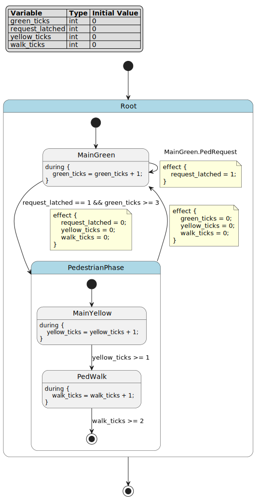

   Traffic light control diagram

**Business Context**:

This state machine models a traffic-responsive signal system where:

- ``green_ticks`` counts cycles the main road has been green
- ``request_latched`` stores pedestrian button press (latched, not momentary)
- ``yellow_ticks`` counts yellow light duration
- ``walk_ticks`` counts pedestrian crossing time
- ``PedestrianPhase`` is a composite state containing yellow and walk sub-phases

**Scenario A: No Pedestrian Request**  (main road priority maintained)

.. list-table::
   :header-rows: 1
   :widths: 8 20 15 15 50

   * - Cycle
     - Event
     - State
     - green_ticks
     - Business Meaning
   * - 1
     - *(none)*
     - MainGreen
     - 1
     - Main road green light active, no pedestrian request
   * - 2
     - *(none)*
     - MainGreen
     - 2
     - Continued main road priority
   * - 3
     - *(none)*
     - MainGreen
     - 3
     - Minimum green time satisfied, but no pedestrian waiting
   * - 4
     - *(none)*
     - MainGreen
     - 4
     - Main road continues with green (efficient traffic flow)

**Detailed Execution Trace A**:

**Cycle 1**  (initial state):

- Initial: ``green_ticks = 0``, ``request_latched = 0``, ``yellow_ticks = 0``, ``walk_ticks = 0``
- Execute ``[*] -> MainGreen``
- Execute ``MainGreen.during``: ``green_ticks = 0 + 1 = 1``
- **Result**: Main road green light active

**Cycles 2-4**  (continued main road priority):

- Each cycle: Check ``MainGreen -> PedestrianPhase``: ``request_latched == 1 && green_ticks >= 3`` not satisfied
- Execute ``MainGreen.during``: ``green_ticks`` increments
- Cycle 2: ``green_ticks = 2``
- Cycle 3: ``green_ticks = 3`` (minimum green satisfied, but no request)
- Cycle 4: ``green_ticks = 4``
- **Result**: Main road maintains priority without pedestrian demand

**Scenario B: Pedestrian Request with Latching**  (button pressed early, served after minimum green)

.. list-table::
   :header-rows: 1
   :widths: 8 25 20 15 12 20

   * - Cycle
     - Event
     - State
     - green_ticks
     - request_latched
     - Business Meaning
   * - 1
     - *(none)*
     - MainGreen
     - 1
     - 0
     - Main road green active
   * - 2
     - ``PedRequest``
     - MainGreen
     - 2
     - 1
     - Pedestrian presses button, request latched
   * - 3
     - *(none)*
     - MainGreen
     - 3
     - 1
     - Minimum green not yet satisfied, main road continues
   * - 4
     - *(none)*
     - MainYellow
     - 3
     - 0
     - Minimum green satisfied, enter pedestrian phase (yellow first)
   * - 5
     - *(none)*
     - PedWalk
     - 3
     - 0
     - Yellow complete, pedestrian crossing begins
   * - 6
     - *(none)*
     - PedWalk
     - 3
     - 0
     - Pedestrian crossing continues
   * - 7
     - *(none)*
     - MainGreen
     - 1
     - 0
     - Pedestrian phase complete, return to main road green

**Detailed Execution Trace B**:

**Cycle 1**  (initial state):

- Same as Scenario A: ``green_ticks = 1``, ``request_latched = 0``

**Cycle 2**  (pedestrian button pressed):

- Event ``PedRequest`` triggers ``MainGreen -> MainGreen`` (self-transition)
- Check ``MainGreen -> PedestrianPhase``: ``request_latched == 1 && green_ticks >= 3`` not satisfied
- Execute ``MainGreen.exit`` (none defined)
- Execute transition effect: ``request_latched = 1`` (latch the request)
- Execute ``MainGreen.enter`` (none defined)
- Execute ``MainGreen.during``: ``green_ticks = 1 + 1 = 2``
- **Result**: Request latched, but minimum green not yet satisfied

**Cycle 3**  (waiting for minimum green):

- Check ``MainGreen -> PedestrianPhase``: ``request_latched == 1 && green_ticks >= 3`` not satisfied (current: 2)
- Execute ``MainGreen.during``: ``green_ticks = 2 + 1 = 3``
- **Result**: Minimum green time now satisfied

**Cycle 4**  (enter pedestrian phase - yellow light):

- Check ``MainGreen -> PedestrianPhase``: ``request_latched == 1 && green_ticks >= 3`` satisfied
- Execute ``MainGreen.exit`` (none defined)
- Execute transition effect:
  - ``request_latched = 0`` (clear the latch)
  - ``yellow_ticks = 0`` (reset yellow timer)
  - ``walk_ticks = 0`` (reset walk timer)
- Execute ``PedestrianPhase.enter`` (none defined)
- **PedestrianPhase is composite**  - follow ``[*] -> MainYellow``
- Execute ``MainYellow.enter`` (none defined)
- Execute ``MainYellow.during``: ``yellow_ticks = 0 + 1 = 1``
- **Result**: Yellow light clears vehicle traffic

**Cycle 5**  (transition to pedestrian walk):

- Check ``MainYellow -> PedWalk``: ``yellow_ticks >= 1`` satisfied
- Execute ``MainYellow.exit`` (none defined)
- Execute ``PedWalk.enter`` (none defined)
- Execute ``PedWalk.during``: ``walk_ticks = 0 + 1 = 1``
- **Result**: Pedestrian crossing signal activates

**Cycle 6**  (pedestrian crossing continues):

- Check ``PedWalk -> [*]``: ``walk_ticks >= 2`` not satisfied (current: 1)
- Execute ``PedWalk.during``: ``walk_ticks = 1 + 1 = 2``
- **Result**: Pedestrian crossing time satisfied

**Cycle 7**  (return to main road green):

- Check ``PedWalk -> [*]``: ``walk_ticks >= 2`` satisfied
- Execute ``PedWalk.exit`` (none defined)
- Exit to ``PedestrianPhase``
- Check ``PedestrianPhase -> MainGreen``: unconditional transition
- Execute ``PedestrianPhase.exit`` (none defined)
- Execute transition effect:
  - ``green_ticks = 0`` (reset main green timer)
  - ``yellow_ticks = 0`` (reset yellow timer)
  - ``walk_ticks = 0`` (reset walk timer)
- Execute ``MainGreen.enter`` (none defined)
- Execute ``MainGreen.during``: ``green_ticks = 0 + 1 = 1``
- **Result**: Main road green restored, system ready for next cycle

**Key Points**:

- ``request_latched`` implements button request memory (not requiring continuous press)
- ``PedestrianPhase`` composite state models real-world sequence: yellow → pedestrian walk → return
- Minimum green time (``green_ticks >= 3``) prevents excessive main road interruption
- ``PedWalk -> [*]`` exits to parent, then ``PedestrianPhase -> MainGreen`` completes the cycle
- All timers reset on phase transitions, ensuring clean state for next cycle
- Self-transition ``MainGreen -> MainGreen`` allows request latching without changing state

Best Practices
---------------------------------------

State Machine Design
~~~~~~~~~~~~~~~~~~~~~~~~~~~~~~~~~

- Keep states focused with clear, single responsibilities
- Use hierarchical states to group related states
- Minimize aspect actions - use sparingly for cross-cutting concerns
- Document abstract actions with comments

Testing and Debugging
~~~~~~~~~~~~~~~~~~~~~~~~~~~~~~~~~

- Test initialization, all transitions, guards, effects, and termination
- Print state and variables after each cycle for debugging
- Use abstract handlers to trace execution
- Inspect state objects with ``runtime.get_current_state_object()``

Handler Implementation
~~~~~~~~~~~~~~~~~~~~~~~~~~~~~~~~~

- Keep handlers simple and focused
- Avoid side effects - minimize external state modifications
- Use the context API to access runtime state
- Add logging for debugging complex interactions

Performance
~~~~~~~~~~~~~~~~~~~~~~~~~~~~~~~~~

- Limit cycle count to avoid infinite loops
- Keep guard expressions simple for faster evaluation
- Minimize aspect actions (they execute every cycle)
- Use pseudo states to skip aspect actions when not needed

Common Pitfalls
---------------------------------------

**Aspect Action Confusion**

Problem: Expecting ``during before/after`` (without ``>>``) to execute during the ``during`` phase.

Solution: Remember that composite state ``during before/after`` only execute during entry/exit transitions (``[*] -> Child`` or ``Child -> [*]``), NOT during the ``during`` phase.

**Event Scoping Issues**

Problem: Events not triggering due to incorrect scoping.

Solution: Understand event scoping - ``::`` creates state-specific events, ``:`` creates parent-scoped events, ``/`` creates root-scoped events.

**Variable Initialization**

Problem: Variables not initialized before use.

Solution: Always define variables at the top of the DSL with initial values:

.. code-block:: fcstm

   def int counter = 0;
   def float temperature = 25.0;

**Missing Abstract Handlers**

Problem: Abstract actions declared but not implemented, causing runtime errors.

Solution: Implement all abstract handlers before running the simulation and register them with ``runtime.register_handlers_from_object(handlers)``.

Summary
---------------------------------------

The simulation runtime provides a powerful environment for testing and understanding FCSTM state machines:

- **Core concepts**: State types, lifecycle actions, aspect actions, execution semantics
- **Python usage**: Creating runtimes, executing cycles, triggering events, implementing handlers
- **Execution semantics**: Cycle execution, hierarchical execution order
- **Best practices**: Design, testing, debugging, performance optimization

For more information, explore:

- :doc:`../visualization/index` - Visualize state machines
- :doc:`../dsl/index` - Advanced DSL features
- :doc:`../render/index` - Code generation from state machines
