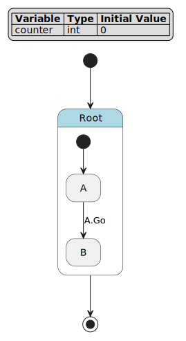
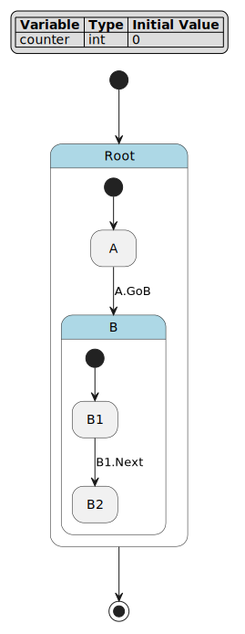
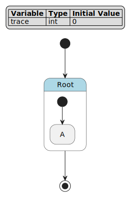
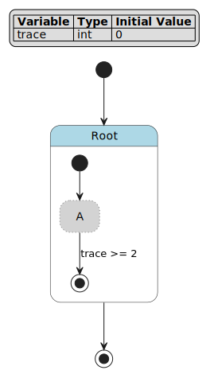
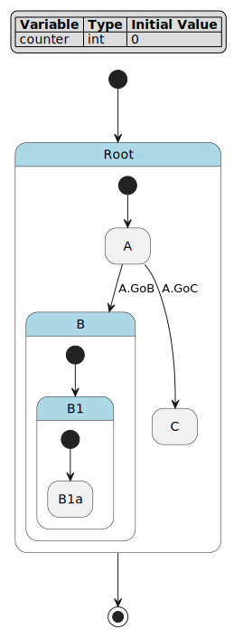

FCSTM Simulation Guide
===============================================

This guide introduces how to simulate FCSTM state machines in Python. The simulation runtime provides an interactive execution environment for testing, prototyping, and understanding state machine behavior before code generation.

Core Concepts
---------------------------------------

Before diving into usage, understand these key concepts:

**State Types**

- **Leaf State**: A state with no children (can execute ``during`` actions)
- **Composite State**: A state containing child states (requires initial transitions)
- **Pseudo State**: A special leaf state that skips ancestor aspect actions
- **Stoppable State**: A leaf state (non-pseudo) where a cycle can end

**Lifecycle Actions**

- **enter**: Executed when entering a state
- **during**: Executed while remaining in a state (each cycle)
- **exit**: Executed when leaving a state

**Aspect Actions**

- **>> during before/after**: Cross-cutting actions that apply to all descendant leaf states
- Pseudo states skip ancestor aspect actions

**Composite State Actions**

- **during before** (without ``>>``): Executed when entering composite state from parent (``[*] -> Child``)
- **during after** (without ``>>``): Executed when exiting composite state to parent (``Child -> [*]``)
- **NOT executed** during child-to-child transitions (``Child1 -> Child2``)

Python Usage
---------------------------------------

Creating and Running Simulations
~~~~~~~~~~~~~~~~~~~~~~~~~~~~~~~~~

The basic workflow:

1. Parse DSL code into an AST
2. Convert AST to a state machine model
3. Create a ``SimulationRuntime`` instance
4. Execute cycles with ``runtime.cycle()``

.. literalinclude:: basic_usage.demo.py
   :language: python
   :caption: Basic simulation example

Output:

.. literalinclude:: basic_usage.demo.py.txt
   :language: text

**Key APIs**:

- ``runtime.cycle()``: Execute one complete cycle
- ``runtime.current_state``: Get current state object (use ``.path`` for tuple or ``'.'.join(.path)`` for string)
- ``runtime.vars``: Access/modify variables as a dictionary
- ``runtime.is_terminated``: Check if state machine has terminated

Triggering Events
~~~~~~~~~~~~~~~~~~~~~~~~~~~~~~~~~

Pass event names to ``cycle()`` to trigger transitions:

.. literalinclude:: event_triggering.demo.py
   :language: python
   :caption: Event triggering

Output:

.. literalinclude:: event_triggering.demo.py.txt
   :language: text

**Event Scoping**:

- ``::`` creates local events (scoped to source state)
- ``:`` creates chain events (scoped to parent state)
- ``/`` creates absolute events (scoped to root state)

Implementing Abstract Handlers
~~~~~~~~~~~~~~~~~~~~~~~~~~~~~~~~~

Use the ``@abstract_handler`` decorator to implement custom logic:

.. literalinclude:: abstract_handlers.demo.py
   :language: python
   :caption: Abstract action handlers

Output:

.. literalinclude:: abstract_handlers.demo.py.txt
   :language: text

**Handler Context API**:

.. code-block:: python

   @abstract_handler('System.Active.Monitor')
   def handle_monitor(self, ctx):
       # Get current state path
       state_path = ctx.get_full_state_path()

       # Access/modify variables
       counter = ctx.get_var('counter')
       ctx.set_var('counter', counter + 1)

       # Get state object
       state = ctx.get_state()

       # Access runtime
       runtime = ctx.get_runtime()

Execution Semantics
---------------------------------------

Understanding how state machines execute is crucial for building correct behavior. This section provides detailed examples with step-by-step execution traces.

Cycle Execution
~~~~~~~~~~~~~~~~~~~~~~~~~~~~~~~~~

A **cycle** executes until reaching a stable boundary:

- Follows transition chains until reaching a stoppable state (leaf state, non-pseudo)
- Executes the ``during`` action at the final stoppable state
- May execute multiple transitions in one cycle (e.g., through pseudo states)
- If no transition fires, executes the current state's ``during`` action

Example 1: Basic Transition
~~~~~~~~~~~~~~~~~~~~~~~~~~~~~~~~~

.. literalinclude:: example1_basic.fcstm
   :language: fcstm
   :caption: Basic state transition

   State machine diagram

**Execution Summary**:

.. list-table::
   :header-rows: 1
   :widths: 8 20 20 12 40

   * - Cycle
     - Event
     - State
     - counter
     - Reason
   * - 0
     - *(none)*
     - *(initial)*
     - 0
     - Initial variable values
   * - 1
     - *(none)*
     - Root.A
     - 1
     - Initial transition ``[*] -> A``, then execute ``A.during`` (counter + 1)
   * - 2
     - *(none)*
     - Root.A
     - 2
     - No event, stay in A, execute ``A.during`` (counter + 1)
   * - 3
     - ``Go``
     - Root.B
     - 12
     - Event ``Go`` triggers ``A -> B``, then execute ``B.during`` (counter + 10)

**Detailed Execution Trace**:

**Cycle 1** (initialization):

- Initial state: ``counter = 0``
- Execute initial transition ``[*] -> A``
- Execute ``A.enter`` (none defined)
- Reach stoppable state ``A``
- Execute ``A.during``: ``counter = 0 + 1 = 1``
- **Result**: ``state = Root.A``, ``counter = 1``

**Cycle 2** (no event):

- Current state: ``Root.A``, ``counter = 1``
- Check transitions: ``A -> B :: Go`` (requires event, not triggered)
- No transition fires
- Execute ``A.during``: ``counter = 1 + 1 = 2``
- **Result**: ``state = Root.A``, ``counter = 2``

**Cycle 3** (with event ``Go``):

- Current state: ``Root.A``, ``counter = 2``
- Check transitions: ``A -> B :: Go`` (event matches!)
- Execute ``A.exit`` (none defined)
- Execute transition (no effect)
- Execute ``B.enter`` (none defined)
- Reach stoppable state ``B``
- Execute ``B.during``: ``counter = 2 + 10 = 12``
- **Result**: ``state = Root.B``, ``counter = 12``

Example 2: Composite State with Initial Transition
~~~~~~~~~~~~~~~~~~~~~~~~~~~~~~~~~

.. literalinclude:: example2_composite.fcstm
   :language: fcstm
   :caption: Composite state with nested states

   Composite state diagram

**Execution Summary**:

.. list-table::
   :header-rows: 1
   :widths: 8 20 22 12 38

   * - Cycle
     - Event
     - State
     - counter
     - Reason
   * - 0
     - *(none)*
     - *(initial)*
     - 0
     - Initial variable values
   * - 1
     - *(none)*
     - Root.A
     - 1
     - Initial transition ``[*] -> A``, execute ``A.during`` (counter + 1)
   * - 2
     - ``GoB``
     - Root.B.B1
     - 11
     - Event ``GoB`` triggers ``A -> B``, follow ``[*] -> B1``, execute ``B1.during`` (counter + 10)
   * - 3
     - ``Next``
     - Root.B.B2
     - 111
     - Event ``Next`` triggers ``B1 -> B2``, execute ``B2.during`` (counter + 100)

**Detailed Execution Trace**:

**Cycle 1** (initialization):

- Initial state: ``counter = 0``
- Execute ``[*] -> A``
- Reach stoppable state ``A``
- Execute ``A.during``: ``counter = 0 + 1 = 1``
- **Result**: ``state = Root.A``, ``counter = 1``

**Cycle 2** (with event ``GoB``):

- Current state: ``Root.A``, ``counter = 1``
- Check transitions: ``A -> B :: GoB`` (event matches!)
- Execute ``A.exit`` (none defined)
- Execute ``B.enter`` (none defined)
- **B is composite state** - must follow initial transition
- Execute ``[*] -> B1`` (inside B)
- Execute ``B1.enter`` (none defined)
- Reach stoppable state ``B1``
- Execute ``B1.during``: ``counter = 1 + 10 = 11``
- **Result**: ``state = Root.B.B1``, ``counter = 11``

**Key Point**: When transitioning to a composite state, the cycle continues by following initial transitions until reaching a stoppable state.

**Cycle 3** (with event ``Next``):

- Current state: ``Root.B.B1``, ``counter = 11``
- Check transitions: ``B1 -> B2 :: Next`` (event matches!)
- Execute ``B1.exit`` (none defined)
- Execute ``B2.enter`` (none defined)
- Reach stoppable state ``B2``
- Execute ``B2.during``: ``counter = 11 + 100 = 111``
- **Result**: ``state = Root.B.B2``, ``counter = 111``

Example 3: Aspect Actions
~~~~~~~~~~~~~~~~~~~~~~~~~~~~~~~~~

.. literalinclude:: example3_aspect.fcstm
   :language: fcstm
   :caption: Aspect actions with execution order

   Aspect actions diagram

**Execution Summary**:

.. list-table::
   :header-rows: 1
   :widths: 8 20 20 12 40

   * - Cycle
     - Event
     - State
     - trace
     - Reason
   * - 0
     - *(none)*
     - *(initial)*
     - 0
     - Initial variable values
   * - 1
     - *(none)*
     - Root.A
     - 123
     - Initial transition ``[*] -> A``, execute: before (×10+1=1) → during (×10+2=12) → after (×10+3=123)
   * - 2
     - *(none)*
     - Root.A
     - 123123
     - No event, execute: before (×10+1=1231) → during (×10+2=12312) → after (×10+3=123123)

**Detailed Execution Trace**:

**Cycle 1** (initialization):

- Initial state: ``trace = 0``
- Execute ``[*] -> A``
- Reach stoppable state ``A``
- Execute during phase:
  1. ``Root >> during before``: ``trace = 0 * 10 + 1 = 1``
  2. ``A.during``: ``trace = 1 * 10 + 2 = 12``
  3. ``Root >> during after``: ``trace = 12 * 10 + 3 = 123``
- **Result**: ``state = Root.A``, ``trace = 123``

**Cycle 2** (no event):

- Current state: ``Root.A``, ``trace = 123``
- No transition fires
- Execute during phase:
  1. ``Root >> during before``: ``trace = 123 * 10 + 1 = 1231``
  2. ``A.during``: ``trace = 1231 * 10 + 2 = 12312``
  3. ``Root >> during after``: ``trace = 12312 * 10 + 3 = 123123``
- **Result**: ``state = Root.A``, ``trace = 123123``

**Key Point**: Aspect actions (``>> during before/after``) execute in hierarchical order around the leaf state's ``during`` action, creating a sandwich pattern: before → during → after.

Example 4: Pseudo State (Skipping Aspect Actions)
~~~~~~~~~~~~~~~~~~~~~~~~~~~~~~~~~

.. literalinclude:: example4_pseudo.fcstm
   :language: fcstm
   :caption: Pseudo state skips aspect actions

   Pseudo state diagram

**Execution Summary**:

.. list-table::
   :header-rows: 1
   :widths: 8 20 22 12 38

   * - Cycle
     - Event
     - State
     - trace
     - Reason
   * - 0
     - *(none)*
     - *(initial)*
     - 0
     - Initial variable values
   * - 1
     - *(none)*
     - *(terminated)*
     - 2
     - Initial transition ``[*] -> A``, pseudo state skips aspect actions, execute ``A.during`` (×10+2=2), guard satisfied, transition to ``[*]``

**Detailed Execution Trace**:

**Cycle 1** (initialization and termination):

- Initial state: ``trace = 0``
- Execute ``[*] -> A``
- Reach stoppable state ``A`` (pseudo state)
- **Pseudo state skips aspect actions!**
- Execute during phase:
  - ``Root >> during before`` **SKIPPED**
  - ``A.during``: ``trace = 0 * 10 + 2 = 2``
  - ``Root >> during after`` **SKIPPED**
- Check transitions: ``A -> [*] : if [trace >= 2]`` (guard satisfied!)
- Execute ``A.exit`` (none defined)
- Transition to final state
- **Result**: ``state = terminated``, ``trace = 2``

**Key Point**: Pseudo states skip all ancestor aspect actions, executing only their own ``during`` action. This is useful for intermediate states that shouldn't trigger cross-cutting concerns.

Example 5: Multi-Level Composite State
~~~~~~~~~~~~~~~~~~~~~~~~~~~~~~~~~

.. literalinclude:: example5_multilevel.fcstm
   :language: fcstm
   :caption: Multi-level nested composite states

   Multi-level composite state diagram

**Execution Summary (Scenario 1: A → B)**:

.. list-table::
   :header-rows: 1
   :widths: 8 20 25 12 35

   * - Cycle
     - Event
     - State
     - counter
     - Reason
   * - 0
     - *(none)*
     - *(initial)*
     - 0
     - Initial variable values
   * - 1
     - *(none)*
     - Root.A
     - 1
     - Initial transition ``[*] -> A``, execute ``A.during`` (counter + 1)
   * - 2
     - ``GoB``
     - Root.B.B1.B1a
     - 11
     - Event ``GoB`` triggers ``A -> B``, follow ``[*] -> B1`` then ``[*] -> B1a``, execute ``B1a.during`` (counter + 10)

**Execution Summary (Scenario 2: A → C)**:

.. list-table::
   :header-rows: 1
   :widths: 8 20 25 12 35

   * - Cycle
     - Event
     - State
     - counter
     - Reason
   * - 0
     - *(none)*
     - *(initial)*
     - 0
     - Initial variable values
   * - 1
     - *(none)*
     - Root.A
     - 1
     - Initial transition ``[*] -> A``, execute ``A.during`` (counter + 1)
   * - 2
     - ``GoC``
     - Root.C
     - 101
     - Event ``GoC`` triggers ``A -> C``, execute ``C.during`` (counter + 100)

**Detailed Execution Trace**:

**Cycle 1** (initialization):

- Initial state: ``counter = 0``
- Execute ``[*] -> A``
- Reach stoppable state ``A``
- Execute ``A.during``: ``counter = 0 + 1 = 1``
- **Result**: ``state = Root.A``, ``counter = 1``

**Cycle 2** (with event ``GoB``):

- Current state: ``Root.A``, ``counter = 1``
- Check transitions: ``A -> B :: GoB`` (event matches!)
- Execute ``A.exit`` (none defined)
- Execute ``B.enter`` (none defined)
- **B is composite** - follow ``[*] -> B1``
- Execute ``B1.enter`` (none defined)
- **B1 is also composite** - follow ``[*] -> B1a``
- Execute ``B1a.enter`` (none defined)
- Reach stoppable state ``B1a``
- Execute ``B1a.during``: ``counter = 1 + 10 = 11``
- **Result**: ``state = Root.B.B1.B1a``, ``counter = 11``

**Key Point**: A single cycle can traverse multiple levels of composite states by following initial transition chains until reaching a stoppable leaf state.

**Cycle 3** (with event ``GoC`` from initial state):

- Starting fresh: ``counter = 0``
- Execute ``[*] -> A``
- Execute ``A.during``: ``counter = 1``
- Next cycle with event ``GoC``:
- Check transitions: ``A -> C :: GoC`` (event matches!)
- Execute ``A.exit`` (none defined)
- Execute ``C.enter`` (none defined)
- Reach stoppable state ``C``
- Execute ``C.during``: ``counter = 1 + 100 = 101``
- **Result**: ``state = Root.C``, ``counter = 101``

Hierarchical Execution Order
~~~~~~~~~~~~~~~~~~~~~~~~~~~~~~~~~

Understanding execution order in nested states is crucial:

.. literalinclude:: hierarchy_execution.demo.py
   :language: python
   :caption: Hierarchical execution

Output:

.. literalinclude:: hierarchy_execution.demo.py.txt
   :language: text

**Complete Execution Order**:

**Entry Phase** (from parent):

1. ``State.enter``
2. ``State.during before`` (if entering via ``[*] -> Child``)
3. ``Child.enter``

**During Phase** (each cycle at leaf state):

1. Ancestor ``>> during before`` actions (root to leaf)
2. Leaf state ``during`` action
3. Ancestor ``>> during after`` actions (leaf to root)

**Exit Phase** (to parent):

1. ``Child.exit``
2. ``State.during after`` (if exiting via ``Child -> [*]``)
3. ``State.exit``

**Child-to-Child Transition**:

1. ``Child1.exit``
2. (Transition effect)
3. ``Child2.enter``
4. NO ``during before/after`` execution

**Key Points**:

- Aspect actions (``>> during before/after``) execute during the ``during`` phase for all descendant leaf states
- Composite state actions (``during before/after`` without ``>>``) only execute during entry/exit transitions, NOT during the ``during`` phase
- Pseudo states skip ancestor aspect actions

Best Practices
---------------------------------------

State Machine Design
~~~~~~~~~~~~~~~~~~~~~~~~~~~~~~~~~

- Keep states focused with clear, single responsibilities
- Use hierarchical states to group related states
- Minimize aspect actions - use sparingly for cross-cutting concerns
- Document abstract actions with comments

Testing and Debugging
~~~~~~~~~~~~~~~~~~~~~~~~~~~~~~~~~

- Test initialization, all transitions, guards, effects, and termination
- Print state and variables after each cycle for debugging
- Use abstract handlers to trace execution
- Inspect state objects with ``runtime.get_current_state_object()``

Handler Implementation
~~~~~~~~~~~~~~~~~~~~~~~~~~~~~~~~~

- Keep handlers simple and focused
- Avoid side effects - minimize external state modifications
- Use the context API to access runtime state
- Add logging for debugging complex interactions

Performance
~~~~~~~~~~~~~~~~~~~~~~~~~~~~~~~~~

- Limit cycle count to avoid infinite loops
- Keep guard expressions simple for faster evaluation
- Minimize aspect actions (they execute every cycle)
- Use pseudo states to skip aspect actions when not needed

Common Pitfalls
---------------------------------------

**Aspect Action Confusion**

Problem: Expecting ``during before/after`` (without ``>>``) to execute during the ``during`` phase.

Solution: Remember that composite state ``during before/after`` only execute during entry/exit transitions (``[*] -> Child`` or ``Child -> [*]``), NOT during the ``during`` phase.

**Event Scoping Issues**

Problem: Events not triggering due to incorrect scoping.

Solution: Understand event scoping - ``::`` creates state-specific events, ``:`` creates parent-scoped events, ``/`` creates root-scoped events.

**Variable Initialization**

Problem: Variables not initialized before use.

Solution: Always define variables at the top of the DSL with initial values:

.. code-block:: fcstm

   def int counter = 0;
   def float temperature = 25.0;

**Missing Abstract Handlers**

Problem: Abstract actions declared but not implemented, causing runtime errors.

Solution: Implement all abstract handlers before running the simulation and register them with ``runtime.register_handlers_from_object(handlers)``.

Summary
---------------------------------------

The simulation runtime provides a powerful environment for testing and understanding FCSTM state machines:

- **Core concepts**: State types, lifecycle actions, aspect actions, execution semantics
- **Python usage**: Creating runtimes, executing cycles, triggering events, implementing handlers
- **Execution semantics**: Cycle execution, hierarchical execution order
- **Best practices**: Design, testing, debugging, performance optimization

For more information, explore:

- :doc:`../visualization/index` - Visualize state machines
- :doc:`../dsl/index` - Advanced DSL features
- :doc:`../render/index` - Code generation from state machines
