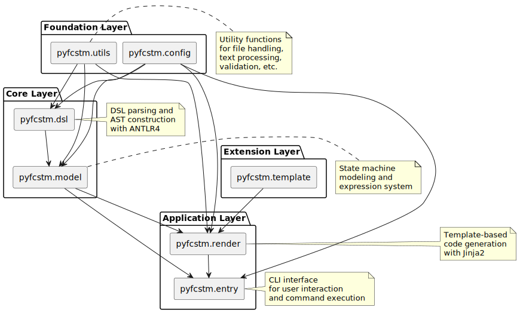

Project Structure Guide
====================================================================================================

Project Overview
----------------------------------------------------------------------------------------------------

PyFCSTM is a Python framework for parsing finite state machine domain-specific language (DSL) and generating executable code in multiple target languages. The project adopts a modular design and provides comprehensive parsing, modeling, and code generation capabilities.

Core Module Structure
----------------------------------------------------------------------------------------------------

Model Layer (pyfcstm.model)
~~~~~~~~~~~~~~~~~~~~~~~~~~~~~~~~~~~~~~~~~~~~~~~~~~~~~~~~~~~~~~~~~~~~~~~~~~~~~~~~~~~~~~~~~~~~~~~~~~~~

Core components for state machine modeling and expression processing:

- **model.py** - State machine model definitions
  - Core classes: states, transitions, events, operations
  - Hierarchical state machine support
  - DSL node to state machine object parsing
  - PlantUML export functionality

- **expr.py** - Expression processing system
  - Mathematical expressions and operator support
  - Variable references and function calls
  - Expression evaluation and AST conversion
  - Comprehensive operator precedence handling

- **base.py** - Export interface definitions
  - AST and PlantUML export capabilities
  - Extensible interface design
  - Abstract base classes for exportable objects

DSL Parsing Layer (pyfcstm.dsl)
~~~~~~~~~~~~~~~~~~~~~~~~~~~~~~~~~~~~~~~~~~~~~~~~~~~~~~~~~~~~~~~~~~~~~~~~~~~~~~~~~~~~~~~~~~~~~~~~~~~~

State machine DSL syntax parsing and abstract syntax tree construction:

- **parse.py** - Syntax parsing entry points
  - ANTLR4 parser encapsulation
  - Condition, preamble, operation syntax element parsing
  - Grammar entry point management

- **node.py** - AST node definitions
  - Complete abstract syntax tree node types
  - State definitions, transitions, expressions nodes
  - Special state markers (INIT_STATE, EXIT_STATE, ALL)

- **grammar/** - Grammar rule definitions
  - Grammar.g4 - ANTLR grammar file
  - Auto-generated lexer and parser (GrammarLexer, GrammarParser)
  - Grammar listener implementation

- **error.py** - Error handling
  - Syntax error collection and reporting
  - Custom error types (GrammarParseError, SyntaxFailError, etc.)
  - Comprehensive error listener implementation

- **listener.py** - Parse listener
  - AST construction logic
  - Parse tree to model node conversion
  - GrammarParseListener implementation

Utility Layer (pyfcstm.utils)
~~~~~~~~~~~~~~~~~~~~~~~~~~~~~~~~~~~~~~~~~~~~~~~~~~~~~~~~~~~~~~~~~~~~~~~~~~~~~~~~~~~~~~~~~~~~~~~~~~~~

General utilities and helper functions:

- **binary.py** - Binary file detection using text character analysis
- **doc.py** - Multiline comment formatting and cleanup
- **validate.py** - Validation framework with error aggregation
- **text.py** - String normalization and identifier generation
- **json.py** - JSON serialization interface with YAML support
- **jinja2.py** - Template environment enhancement with Python built-ins
- **decode.py** - Automatic text decoding with Chinese encoding support
- **safe.py** - Safe sequence identifier generation

Configuration and Meta Information
~~~~~~~~~~~~~~~~~~~~~~~~~~~~~~~~~~~~~~~~~~~~~~~~~~~~~~~~~~~~~~~~~~~~~~~~~~~~~~~~~~~~~~~~~~~~~~~~~~~~

- **pyfcstm.config** - Project configuration
  - meta.py - Project metadata definition (version, author, description)

Template System (pyfcstm.template)
~~~~~~~~~~~~~~~~~~~~~~~~~~~~~~~~~~~~~~~~~~~~~~~~~~~~~~~~~~~~~~~~~~~~~~~~~~~~~~~~~~~~~~~~~~~~~~~~~~~~

Code generation template support (reserved module for future expansion)

Entry Point Layer (pyfcstm.entry)
~~~~~~~~~~~~~~~~~~~~~~~~~~~~~~~~~~~~~~~~~~~~~~~~~~~~~~~~~~~~~~~~~~~~~~~~~~~~~~~~~~~~~~~~~~~~~~~~~~~~

Command-line interface and user interaction:

- **cli.py** - Command-line main entry point and subcommand aggregation
- **dispatch.py** - Command dispatch and version information
- **generate.py** - Code generation command implementation
- **plantuml.py** - PlantUML generation command implementation
- **base.py** - CLI base functionality and exception handling

Rendering Engine (pyfcstm.render)
~~~~~~~~~~~~~~~~~~~~~~~~~~~~~~~~~~~~~~~~~~~~~~~~~~~~~~~~~~~~~~~~~~~~~~~~~~~~~~~~~~~~~~~~~~~~~~~~~~~~

State machine model to code transformation engine:

- **render.py** - Code renderer core
  - Template-driven code generation
  - Multi-language output support
  - Configuration-based template management

- **expr.py** - Expression rendering
  - Multi-language expression format conversion
  - DSL, C, C++, Python style support
  - Template-based expression transformation

- **func.py** - Function processing
  - Dynamic object creation and import
  - Template function registration
  - Configuration-to-object conversion

- **env.py** - Template environment
  - Jinja2 environment configuration
  - Global variables and filter setup
  - Custom template settings

Module Dependency Relationships
----------------------------------------------------------------------------------------------------

The project adopts a layered architecture design:

1. **Foundation Layer**: utils, config - Provides general utilities and configuration
2. **Core Layer**: model, dsl - Defines state machine models and parsing capabilities
3. **Application Layer**: entry, render - Provides user interfaces and code generation
4. **Extension Layer**: template - Supports custom template extensions

Clear dependency relationships between modules ensure upper layers depend on lower layers, guaranteeing code maintainability and testability.

Architecture Diagram
----------------------------------------------------------------------------------------------------

The following PlantUML diagram illustrates the module relationships and data flow:

Data Flow Description:

1. **Input Processing**: DSL code → pyfcstm.dsl (parsing) → pyfcstm.model (model construction)
2. **Model Processing**: State machine model → pyfcstm.render (template rendering) → Generated code
3. **User Interaction**: Commands → pyfcstm.entry (CLI processing) → Appropriate module execution
4. **Utility Support**: All layers utilize pyfcstm.utils for common functionality

This architecture ensures separation of concerns and enables flexible extension for new target languages and template formats.
