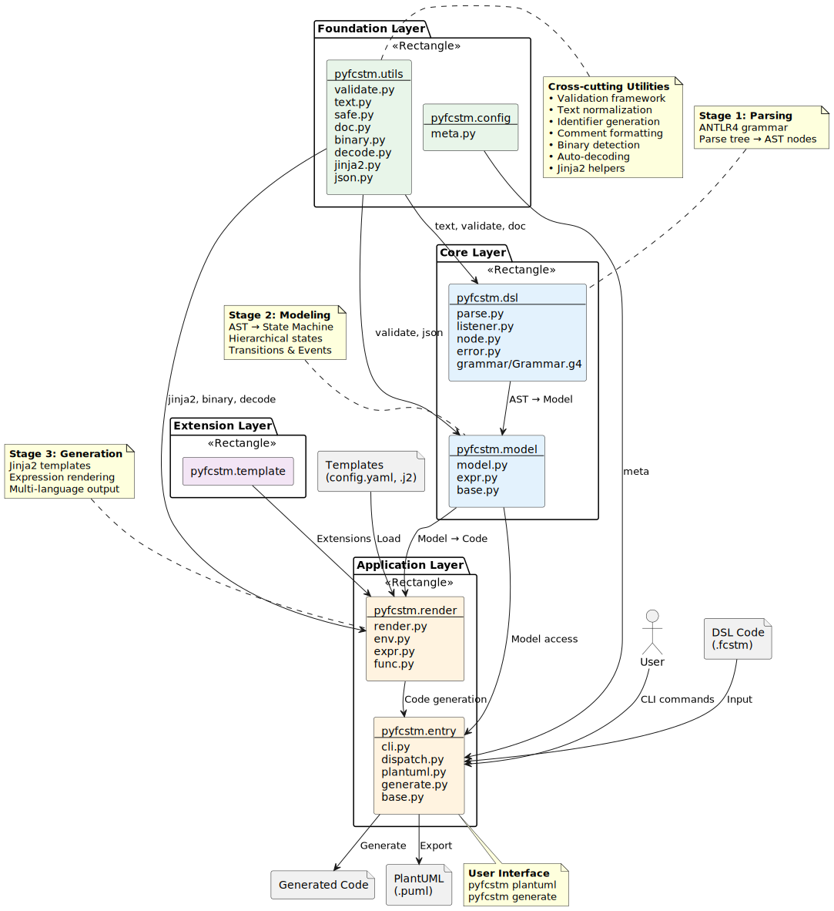

项目结构指南
====================================================================================================

概述
----------------------------------------------------------------------------------------------------

PyFCSTM 是一个用于解析有限状态机（FSM）领域特定语言（DSL）并生成多种目标语言可执行代码的 Python 框架。该框架通过三阶段架构实现了从 DSL 文本到可执行代码的完整流程：**DSL 解析 → 状态机建模 → 代码生成**。

该项目采用分层模块化设计，分离关注点并支持新目标语言和模板格式的扩展。

架构层次
----------------------------------------------------------------------------------------------------

该框架组织为四个不同的架构层：

**基础层** (``pyfcstm.utils``, ``pyfcstm.config``)
    提供所有其他层使用的横切关注点工具和项目元数据。

**核心层** (``pyfcstm.dsl``, ``pyfcstm.model``)
    实现 DSL 解析和状态机建模 - 框架的核心。

**应用层** (``pyfcstm.render``, ``pyfcstm.entry``)
    为最终用户提供代码生成引擎和命令行界面。

**扩展层** (``pyfcstm.template``)
    为自定义模板扩展和未来扩展保留。

模块参考
----------------------------------------------------------------------------------------------------

基础层
~~~~~~~~~~~~~~~~~~~~~~~~~~~~~~~~~~~~~~~~~~~~~~~~~~~~~~~~~~~~~~~~~~~~~~~~~~~~~~~~~~~~~~~~~~~~~~~~~~~~

**pyfcstm.config** - 项目元数据
    - ``meta.py``：包元数据（版本、作者、描述、标题）
    - 提供 ``__VERSION__``、``__TITLE__``、``__AUTHOR__``、``__DESCRIPTION__``
    - 由 ``setup.py`` 用于包分发

**pyfcstm.utils** - 工具函数
    - ``validate.py``：验证框架，包含 ``IValidatable`` 基类和 ``ModelValidationError``
    - ``text.py``：字符串规范化（``normalize()``、``to_identifier()``）用于标识符生成
    - ``safe.py``：安全序列标识符生成（``sequence_safe()``）
    - ``doc.py``：多行注释格式化（``format_multiline_comment()``）
    - ``binary.py``：二进制文件检测工具
    - ``decode.py``：使用 ``auto_decode()`` 自动解码各种编码
    - ``jinja2.py``：Jinja2 环境工具（``add_builtins_to_env()``、``add_settings_for_env()``）
    - ``json.py``：JSON 操作接口，包含用于序列化的 ``IJsonOp``

核心层
~~~~~~~~~~~~~~~~~~~~~~~~~~~~~~~~~~~~~~~~~~~~~~~~~~~~~~~~~~~~~~~~~~~~~~~~~~~~~~~~~~~~~~~~~~~~~~~~~~~~

**pyfcstm.dsl** - DSL 解析流程
    使用 ANTLR4 将 DSL 文本转换为抽象语法树（AST）节点。

    - ``parse.py``：入口点，包含用于解析 DSL 代码字符串的 ``parse_with_grammar_entry()``
    - ``listener.py``：ANTLR 监听器（``GrammarParseListener``），遍历解析树并构造 AST 节点
    - ``node.py``：状态、转换、操作、表达式的 AST 节点定义（数据类）
    - ``error.py``：DSL 解析错误处理（``GrammarParseError``、``SyntaxFailError``）
    - ``grammar/Grammar.g4``：ANTLR4 语法，定义 FSM DSL 语法的词法和解析规则
    - ``grammar/GrammarLexer.py``、``grammar/GrammarParser.py``、``grammar/GrammarListener.py``：自动生成的 ANTLR4 代码

    **关键概念：**
        - 支持带有嵌套复合状态的分层状态定义
        - 表达式语法包括数值运算、位运算、条件运算、函数调用
        - 每个 AST 节点都有导出回 DSL 或 PlantUML 格式的方法

**pyfcstm.model** - 状态机建模
    将 AST 节点转换为结构化、可查询的状态机模型。

    - ``model.py``：核心状态机模型类
        - ``StateMachine``：根容器，包含变量、状态和全局事件
        - ``State``：表示状态，包含父/子关系、生命周期动作（enter/during/exit）、转换
        - ``Transition``：状态转换，包含源、目标、事件、守卫条件、效果
        - ``Event``：命名事件，带有作用域（本地 ``::`` vs 全局 ``:`` 或 ``/``）
        - ``Operation``：在生命周期动作或转换效果期间执行的变量赋值
        - ``VarDefine``：变量定义，包含类型（int/float）和初始值
        - ``OnStage``/``OnAspect``：enter/during/exit 行为的生命周期动作容器
    - ``expr.py``：变量、条件和效果的表达式系统
        - 支持字面量、变量、一元/二元运算符、位运算、函数调用
        - 带有转换守卫的条件表达式
        - 可渲染为不同目标语言的表达式树结构
    - ``base.py``：模型组件的基类 ``AstExportable`` 和 ``PlantUMLExportable``

    **关键方法：**
        - ``walk_states()``：遍历状态层次结构
        - ``find_state()``：按名称查找状态
        - DSL 和 PlantUML 格式的导出功能

应用层
~~~~~~~~~~~~~~~~~~~~~~~~~~~~~~~~~~~~~~~~~~~~~~~~~~~~~~~~~~~~~~~~~~~~~~~~~~~~~~~~~~~~~~~~~~~~~~~~~~~~

**pyfcstm.render** - 代码生成引擎
    使用 Jinja2 模板将状态机模型转换为目标代码。

    - ``render.py``：主 ``StateMachineCodeRenderer`` 类
        - 加载模板目录和 ``config.yaml`` 配置
        - 使用状态机模型作为上下文处理 ``.j2`` Jinja2 模板
        - 直接将静态文件复制到输出目录
        - 通过类似 gitignore 的模式支持文件忽略
    - ``env.py``：Jinja2 环境设置和配置
        - 创建带有自定义全局变量、过滤器、测试的沙盒 Jinja2 环境
        - 配置模板加载器和渲染选项
    - ``expr.py``：不同目标语言的表达式渲染
        - ``create_expr_render_template()``：创建特定语言的表达式渲染器
        - 支持多种表达式样式：``dsl``、``c``、``cpp``、``python``
        - 将 DSL 表达式转换为目标语言语法（例如，Python 的 ``&&`` 转换为 ``and``）
        - 在模板中作为 ``expr_render`` 过滤器可用：``{{ expr | expr_render(style='c') }}``
    - ``func.py``：自定义 Jinja2 过滤器和函数
        - ``process_item_to_object()``：将配置项转换为 Python 对象（导入、模板、值）
        - 支持将外部 Python 函数导入模板上下文

    **模板系统：**
        - 模板目录必须包含定义 ``expr_styles``、``globals``、``filters``、``ignores`` 的 ``config.yaml``
        - ``.j2`` 文件通过 ``model`` 变量访问状态机模型
        - 静态文件直接复制，保留目录结构

**pyfcstm.entry** - 命令行界面
    为 DSL 处理提供面向用户的命令。

    - ``cli.py``：使用 Click 框架的 CLI 实现
        - 主入口点 ``pyfcstmcli()`` 注册为控制台脚本
        - 子命令聚合和参数解析
    - ``dispatch.py``：命令调度逻辑和版本信息
    - ``plantuml.py``：从状态机模型生成 PlantUML 图
        - 将 DSL 转换为 ``.puml`` 格式以进行可视化
    - ``generate.py``：基于模板的代码生成
        - 协调解析 DSL、构建模型和使用模板渲染
    - ``base.py``：CLI 基础功能和异常处理

扩展层
~~~~~~~~~~~~~~~~~~~~~~~~~~~~~~~~~~~~~~~~~~~~~~~~~~~~~~~~~~~~~~~~~~~~~~~~~~~~~~~~~~~~~~~~~~~~~~~~~~~~

**pyfcstm.template** - 模板扩展
    为自定义模板扩展和未来扩展保留的模块。

架构图
----------------------------------------------------------------------------------------------------

下图说明了框架中的模块关系和数据流：

   PyFCSTM 分层架构，显示模块依赖关系和数据流

处理流程
----------------------------------------------------------------------------------------------------

框架通过三阶段流程处理 FSM 定义：

**阶段 1：DSL 解析** (``pyfcstm.dsl``)
    1. 用户提供 DSL 代码作为文本（来自 ``.fcstm`` 文件）
    2. ANTLR4 解析器根据 ``Grammar.g4`` 规则进行标记化和解析
    3. ``GrammarParseListener`` 遍历解析树并构造 AST 节点
    4. 输出：AST 节点树（``node.py`` 数据类）

**阶段 2：模型构建** (``pyfcstm.model``)
    1. AST 节点转换为状态机模型对象
    2. 建立分层状态关系（父/子）
    3. 转换、事件和表达式链接到状态
    4. 模型验证确保结构完整性
    5. 输出：可查询的 ``StateMachine`` 对象，包含 ``State``、``Transition``、``Event`` 实例

**阶段 3：代码生成** (``pyfcstm.render``)
    1. 加载带有 ``config.yaml`` 配置的模板目录
    2. 使用自定义过滤器和表达式渲染器配置 Jinja2 环境
    3. 模板接收 ``model`` 对象作为上下文
    4. 表达式渲染将 DSL 表达式转换为目标语言语法
    5. 输出：目标语言的生成代码文件

用户交互流程
----------------------------------------------------------------------------------------------------

用户通过 CLI 命令（``pyfcstm.entry``）与框架交互：

**PlantUML 生成**::

    pyfcstm plantuml -i input.fcstm -o output.puml

    流程：DSL → 解析器 → 模型 → PlantUML 导出器 → .puml 文件

**代码生成**::

    pyfcstm generate -i input.fcstm -t template_dir/ -o output_dir/

    流程：DSL → 解析器 → 模型 → 模板渲染器 → 生成的代码文件

依赖关系
----------------------------------------------------------------------------------------------------

分层架构强制执行明确的依赖规则：

- **基础层** 不依赖于其他层
- **核心层** 仅依赖于基础层
- **应用层** 依赖于核心层和基础层
- **扩展层** 依赖于应用层、核心层和基础层

这种设计确保：

- **模块化**：每层都有明确定义的职责
- **可测试性**：较低层可以独立测试
- **可扩展性**：可以通过模板添加新的目标语言，而无需修改核心逻辑
- **可维护性**：上层的更改不会影响下层

关键设计模式
----------------------------------------------------------------------------------------------------

**访问者模式** (``pyfcstm.dsl.listener``)
    ANTLR 监听器遍历解析树并构造 AST 节点

**模板方法模式** (``pyfcstm.model.base``)
    基类定义由模型类实现的导出接口

**策略模式** (``pyfcstm.render.expr``)
    不同目标语言的表达式渲染策略

**外观模式** (``pyfcstm.entry``)
    CLI 为复杂的解析和渲染子系统提供简化的接口
