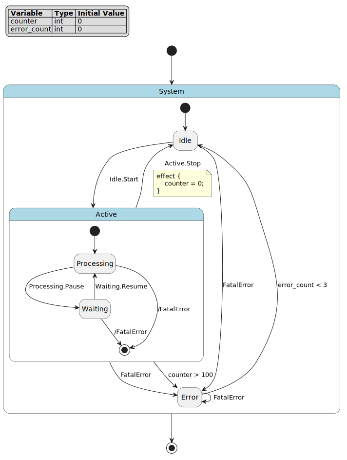
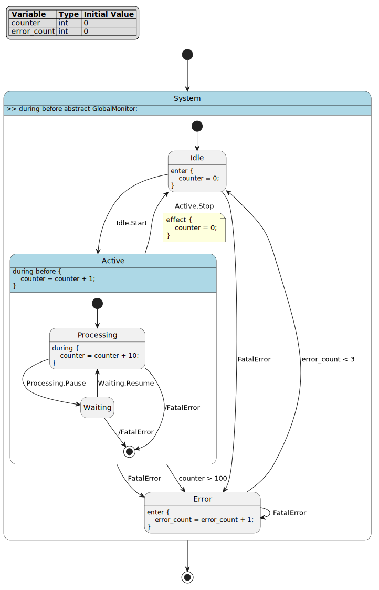
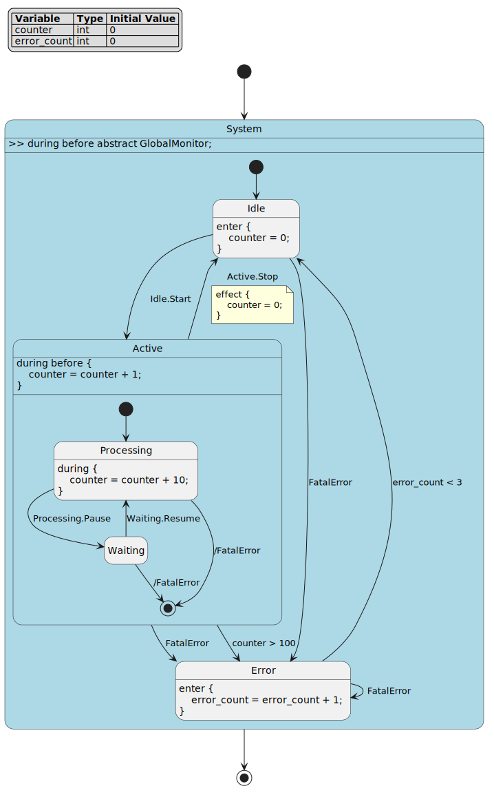
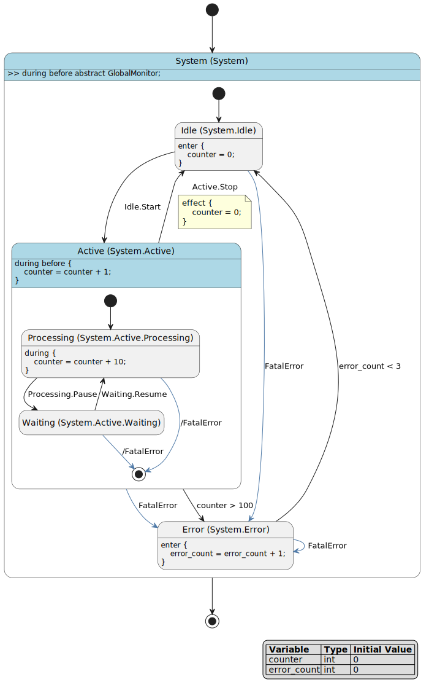

FCSTM 可视化指南
===============================================

本指南全面介绍如何可视化 FCSTM DSL 定义的有限状态机。你将学习如何使用 Python 代码和命令行界面生成 PlantUML 图表，以及如何使用灵活的配置系统自定义可视化输出。

概述
---------------------------------------

pyfcstm 提供两种主要的状态机可视化方法：

1. **Python API**：通过 ``PlantUMLOptions`` 类进行编程控制
2. **命令行界面**：使用灵活的配置选项快速可视化

两种方法都支持相同的综合配置系统，允许你控制生成的 PlantUML 图表的各个方面。

示例状态机
---------------------------------------

在本指南中，我们将使用以下示例状态机来演示所有可视化功能：

.. literalinclude:: example.fcstm
   :language: fcstm
   :caption: example.fcstm

这个状态机演示了 FCSTM 的关键特性：

- **变量**：``counter`` 和 ``error_count`` 用于状态跟踪
- **层次化状态**：``Active`` 包含嵌套的 ``Processing`` 和 ``Waiting`` 状态
- **生命周期动作**：``enter`` 和 ``during`` 动作定义状态行为
- **切面动作**：``>> during before`` 应用于所有后代状态
- **抽象动作**：``GlobalMonitor`` 必须在生成的代码中实现
- **带守卫的转换**：``Active -> Error : if [counter > 100]``
- **带效果的转换**：``Active -> Idle :: Stop effect { counter = 0; }``
- **强制转换**：``!* -> Error :: FatalError`` 从所有状态触发

**可视化效果**

以下是使用默认设置可视化该状态机的效果：

.. figure:: example.fcstm.puml.svg
   :alt: 示例状态机可视化
   :align: center
   :width: 100%

   示例状态机的默认可视化效果

可视化方法
---------------------------------------

Python API 可视化
~~~~~~~~~~~~~~~~~~~~~~~~~~~~~~~~~

Python API 通过 ``PlantUMLOptions`` 类提供对可视化的编程控制。

**基本用法**

.. literalinclude:: python_basic.demo.py
   :language: python
   :caption: 基本 Python 可视化

输出：

.. literalinclude:: python_basic.demo.py.txt
   :language: text

**生成的可视化效果**

   使用默认设置生成的 PlantUML 图表

**使用自定义选项**

.. literalinclude:: python_options.demo.py
   :language: python
   :caption: 使用 PlantUMLOptions 的 Python 可视化

输出：

.. literalinclude:: python_options.demo.py.txt
   :language: text

**生成的可视化效果**

.. figure:: output_custom.puml.svg
   :alt: 使用自定义选项的 Python 可视化
   :align: center
   :width: 80%

   使用自定义 PlantUMLOptions 生成的图表（完整详细级别，启用事件，最大深度 3）

CLI 可视化
~~~~~~~~~~~~~~~~~~~~~~~~~~~~~~~~~

命令行界面提供快速访问可视化功能，配置灵活。

**基本用法**

.. literalinclude:: cli_basic.demo.sh
   :language: bash
   :caption: 基本 CLI 可视化

输出：

.. literalinclude:: cli_basic.demo.sh.txt
   :language: text

**生成的可视化效果**

.. figure:: output_cli_basic.puml.svg
   :alt: CLI 基本可视化输出
   :align: center
   :width: 80%

   使用 CLI 默认设置生成的 PlantUML 图表

配置系统
---------------------------------------

可视化系统通过 ``PlantUMLOptions`` 提供全面的配置。所有选项在 Python API 和 CLI 中都可用。

配置选项参考
~~~~~~~~~~~~~~~~~~~~~~~~~~~~~~~~~

下表提供了所有可用配置选项的完整参考：

.. list-table:: PlantUMLOptions 配置参考
   :widths: 25 15 15 45
   :header-rows: 1

   * - 选项
     - 类型
     - 默认值
     - 描述
   * - **预设级别**
     -
     -
     -
   * - ``detail_level``
     - str
     - ``'normal'``
     - 预设详细级别：``'minimal'``、``'normal'`` 或 ``'full'``
   * - **变量显示**
     -
     -
     -
   * - ``show_variable_definitions``
     - bool
     - ``None``
     - 显示变量定义（如果为 None 则从 detail_level 继承，所有级别默认为 True）
   * - ``variable_display_mode``
     - str
     - ``'legend'``
     - 变量显示方式：``'note'``、``'legend'`` 或 ``'hide'``
   * - ``variable_legend_position``
     - str
     - ``'top left'``
     - 图例位置：``'top left'``、``'top center'``、``'top right'``、``'bottom left'``、``'bottom center'``、``'bottom right'``、``'left'``、``'right'``、``'center'``
   * - **状态格式化**
     -
     -
     -
   * - ``state_name_format``
     - tuple
     - ``('extra_name',)``
     - 状态名称格式：``'name'``、``'extra_name'``、``'path'``
   * - ``show_pseudo_state_style``
     - bool
     - ``None``
     - 对伪状态应用虚线边框样式
   * - ``collapse_empty_states``
     - bool
     - ``False``
     - 隐藏没有生命周期动作的状态的动作文本
   * - **生命周期动作**
     -
     -
     -
   * - ``show_lifecycle_actions``
     - bool
     - ``None``
     - 所有生命周期动作的主开关（enter/during/exit/aspect）
   * - ``show_enter_actions``
     - bool
     - ``None``
     - 显示 enter 动作（从 show_lifecycle_actions 继承）
   * - ``show_during_actions``
     - bool
     - ``None``
     - 显示 during 动作（从 show_lifecycle_actions 继承）
   * - ``show_exit_actions``
     - bool
     - ``None``
     - 显示 exit 动作（从 show_lifecycle_actions 继承）
   * - ``show_aspect_actions``
     - bool
     - ``None``
     - 显示切面动作（``>> during before/after``）
   * - **动作详情**
     -
     -
     -
   * - ``show_abstract_actions``
     - bool
     - ``None``
     - 显示抽象动作（从 show_lifecycle_actions 继承）
   * - ``show_concrete_actions``
     - bool
     - ``None``
     - 显示具体动作（从 show_lifecycle_actions 继承）
   * - ``abstract_action_marker``
     - str
     - ``'text'``
     - 抽象动作标记：``'text'``、``'symbol'`` 或 ``'none'``
   * - ``max_action_lines``
     - int
     - ``None``
     - 每个动作的最大行数（None = 无限制）
   * - **转换**
     -
     -
     -
   * - ``show_transition_guards``
     - bool
     - ``None``
     - 在转换上显示守卫条件
   * - ``show_transition_effects``
     - bool
     - ``None``
     - 显示转换效果
   * - ``transition_effect_mode``
     - str
     - ``'note'``
     - 效果显示模式：``'note'``、``'inline'`` 或 ``'hide'``
   * - **事件**
     -
     -
     -
   * - ``show_events``
     - bool
     - ``None``
     - 在转换上显示事件名称
   * - ``event_name_format``
     - tuple
     - ``('extra_name', 'relpath')``
     - 事件名称格式：``'name'``、``'extra_name'``、``'path'``、``'relpath'``
   * - ``event_visualization_mode``
     - str
     - ``'none'``
     - 事件可视化：``'none'``、``'color'``、``'legend'``、``'both'``
   * - ``event_legend_position``
     - str
     - ``'right'``
     - 事件图例位置：``'top left'``、``'top center'``、``'top right'``、``'bottom left'``、``'bottom center'``、``'bottom right'``、``'left'``、``'right'``、``'center'``
   * - **层次控制**
     -
     -
     -
   * - ``max_depth``
     - int
     - ``None``
     - 可视化的最大嵌套深度（None = 无限制）
   * - ``collapsed_state_marker``
     - str
     - ``'...'``
     - 折叠状态的文本标记
   * - **PlantUML 样式**
     -
     -
     -
   * - ``use_skinparam``
     - bool
     - ``True``
     - 包含 skinparam 样式块
   * - ``use_stereotypes``
     - bool
     - ``True``
     - 添加构造型标记（``<<pseudo>>``、``<<composite>>``）
   * - ``custom_colors``
     - dict
     - ``None``
     - 事件的自定义颜色映射（事件路径 -> 十六进制颜色）

**注意：**

- 默认值为 ``None`` 的选项从 ``detail_level`` 预设或父选项继承
- ``show_lifecycle_actions`` 控制 enter/during/exit/aspect/abstract/concrete 动作的默认值
- 元组选项接受多个格式元素，按显示顺序组合
- CLI 使用 ``-c key=value`` 语法进行配置

详细级别预设
~~~~~~~~~~~~~~~~~~~~~~~~~~~~~~~~~

详细级别预设为常见用例提供快速配置：

- **minimal**：最小细节的基本结构
- **normal**：包含基本信息的平衡视图（默认）
- **full**：包括所有动作和事件的完整细节

**Python API**

.. literalinclude:: python_detail_levels.demo.py
   :language: python
   :caption: Python 中的详细级别

输出：

.. literalinclude:: python_detail_levels.demo.py.txt
   :language: text

**CLI**

.. literalinclude:: cli_level.demo.sh
   :language: bash
   :caption: CLI 中的详细级别

输出：

.. literalinclude:: cli_level.demo.sh.txt
   :language: text

**可视化效果对比**

三种详细级别产生显著不同的可视化输出：

**最小详细级别**

.. figure:: output_minimal.puml.svg
   :alt: 最小详细级别可视化
   :align: center
   :width: 70%

   最小：仅基本状态结构，无动作或详细信息

**普通详细级别**\ （默认）

.. figure:: output_normal.puml.svg
   :alt: 普通详细级别可视化
   :align: center
   :width: 70%

   普通：包含基本生命周期动作和转换信息的平衡视图

**完整详细级别**

   完整：包括所有动作、事件、守卫和效果的完整细节

变量显示选项
~~~~~~~~~~~~~~~~~~~~~~~~~~~~~~~~~

控制状态机变量在图表中的显示方式。

**配置选项**

- ``show_variable_definitions`` (bool)：在顶部显示变量定义（所有详细级别默认为 True）
- ``variable_display_mode`` (str)：显示模式 - ``'note'``、``'legend'`` 或 ``'hide'``（默认：``'legend'``）
- ``variable_legend_position`` (str)：使用 ``'legend'`` 模式时的图例位置（默认：``'top left'``）

  - 可用位置：``'top left'``、``'top center'``、``'top right'``、``'bottom left'``、``'bottom center'``、``'bottom right'``、``'left'``、``'right'``、``'center'``

**示例**

.. code-block:: python

   from pyfcstm.model.plantuml import PlantUMLOptions

   # 将变量显示为左上角的图例（默认）
   options = PlantUMLOptions(
       show_variable_definitions=True,
       variable_display_mode='legend',
       variable_legend_position='top left'
   )

   # 将图例放在右下角
   options = PlantUMLOptions(
       show_variable_definitions=True,
       variable_display_mode='legend',
       variable_legend_position='bottom right'
   )

**CLI 等效命令**

.. code-block:: bash

   # 默认位置（左上角）
   pyfcstm plantuml -i example.fcstm \
     -c show_variable_definitions=true \
     -c variable_display_mode=legend \
     -o output.puml

   # 自定义位置
   pyfcstm plantuml -i example.fcstm \
     -c show_variable_definitions=true \
     -c variable_display_mode=legend \
     -c variable_legend_position="bottom right" \
     -o output.puml

状态名称格式化
~~~~~~~~~~~~~~~~~~~~~~~~~~~~~~~~~

自定义状态名称在图表中的显示方式。

**配置选项**

- ``state_name_format`` (tuple[str, ...])：格式组件 - ``'name'``、``'path'``、``'relpath'``
- ``show_pseudo_state_style`` (bool)：对伪状态应用特殊样式
- ``collapse_empty_states`` (bool)：折叠没有动作或子状态的状态

**示例**

.. code-block:: python

   # 同时显示名称和完整路径
   options = PlantUMLOptions(
       state_name_format=('name', 'path'),
       show_pseudo_state_style=True,
       collapse_empty_states=False
   )

**CLI 等效命令**

.. code-block:: bash

   pyfcstm plantuml -i example.fcstm \
     -c state_name_format=name,path \
     -c show_pseudo_state_style=true \
     -c collapse_empty_states=false \
     -o output.puml

生命周期动作显示
~~~~~~~~~~~~~~~~~~~~~~~~~~~~~~~~~

控制在图表中显示哪些生命周期动作（enter、during、exit）。

**配置选项**

- ``show_lifecycle_actions`` (bool)：所有生命周期动作的主开关
- ``show_enter_actions`` (bool)：显示 enter 动作
- ``show_during_actions`` (bool)：显示 during 动作
- ``show_exit_actions`` (bool)：显示 exit 动作
- ``show_aspect_actions`` (bool)：显示切面动作（``>> during before/after``）
- ``show_abstract_actions`` (bool)：显示抽象动作声明
- ``show_concrete_actions`` (bool)：显示具体动作实现
- ``abstract_action_marker`` (str)：抽象动作的标记（默认：``'«abstract»'``）
- ``max_action_lines`` (int)：每个动作块显示的最大行数

**示例**

.. code-block:: python

   # 仅显示 enter 和 during 动作，隐藏 exit 动作
   options = PlantUMLOptions(
       show_lifecycle_actions=True,
       show_enter_actions=True,
       show_during_actions=True,
       show_exit_actions=False,
       show_abstract_actions=True,
       max_action_lines=10
   )

**CLI 等效命令**

.. literalinclude:: cli_config.demo.sh
   :language: bash
   :caption: 生命周期动作配置

输出：

.. literalinclude:: cli_config.demo.sh.txt
   :language: text

**生成的可视化效果**

生命周期动作配置根据显示的动作产生不同的输出：

   自定义生命周期动作显示（显示 enter 和 during，隐藏 exit）

转换显示选项
~~~~~~~~~~~~~~~~~~~~~~~~~~~~~~~~~

控制转换在图表中的显示方式。

**配置选项**

- ``show_transition_guards`` (bool)：在转换上显示守卫条件
- ``show_transition_effects`` (bool)：在转换上显示效果块
- ``transition_effect_mode`` (str)：如何显示效果 - ``'note'`` 或 ``'inline'``

**示例**

.. code-block:: python

   # 将守卫和效果显示为注释
   options = PlantUMLOptions(
       show_transition_guards=True,
       show_transition_effects=True,
       transition_effect_mode='note'
   )

**CLI 等效命令**

.. code-block:: bash

   pyfcstm plantuml -i example.fcstm \
     -c show_transition_guards=true \
     -c show_transition_effects=true \
     -c transition_effect_mode=note \
     -o output.puml

事件可视化
~~~~~~~~~~~~~~~~~~~~~~~~~~~~~~~~~

控制事件在图表中的显示方式。

**配置选项**

- ``show_events`` (bool)：在转换上显示事件名称
- ``event_name_format`` (tuple[str, ...])：格式组件 - ``'name'``、``'path'``、``'relpath'``
- ``event_visualization_mode`` (str)：可视化模式 - ``'none'``、``'color'``、``'legend'`` 或 ``'both'``
- ``event_legend_position`` (str)：使用 ``'legend'`` 或 ``'both'`` 模式时的事件图例位置（默认：``'right'``）

  - 可用位置：``'top left'``、``'top center'``、``'top right'``、``'bottom left'``、``'bottom center'``、``'bottom right'``、``'left'``、``'right'``、``'center'``

**示例**

.. note::
   **推荐**：使用 ``event_visualization_mode='both'`` 来结合颜色编码的转换和图例。这提供了最佳的可视化效果，通过颜色使事件在视觉上更加清晰，同时提供清晰的参考图例显示事件名称和转换计数。

.. code-block:: python

   # 推荐：同时显示颜色和图例，并自定义位置
   options = PlantUMLOptions(
       event_visualization_mode='both',
       event_legend_position='top right'
   )

   # 仅使用颜色编码显示事件
   options = PlantUMLOptions(
       show_events=True,
       event_name_format=('name', 'relpath'),
       event_visualization_mode='color'
   )

   # 仅在自定义位置显示事件图例
   options = PlantUMLOptions(
       event_visualization_mode='legend',
       event_legend_position='bottom right'
   )

**CLI 等效命令**

.. code-block:: bash

   # 推荐：同时使用颜色和图例
   pyfcstm plantuml -i example.fcstm \
     -c event_visualization_mode=both \
     -c event_legend_position="top right" \
     -o output.puml

   # 仅颜色模式
   pyfcstm plantuml -i example.fcstm \
     -c show_events=true \
     -c event_name_format=name,relpath \
     -c event_visualization_mode=color \
     -o output.puml

   # 仅图例模式，自定义位置
   pyfcstm plantuml -i example.fcstm \
     -c event_visualization_mode=legend \
     -c event_legend_position="bottom right" \
     -o output.puml

深度控制
~~~~~~~~~~~~~~~~~~~~~~~~~~~~~~~~~

控制可视化深入嵌套状态的程度。

**配置选项**

- ``max_depth`` (int)：可视化的最大嵌套深度（0 = 无限制）
- ``collapsed_state_marker`` (str)：折叠状态的标记（默认：``'...'``）

**示例**

.. code-block:: python

   # 限制为 2 层嵌套
   options = PlantUMLOptions(
       max_depth=2,
       collapsed_state_marker='[collapsed]'
   )

**CLI 等效命令**

.. code-block:: bash

   pyfcstm plantuml -i example.fcstm \
     -c max_depth=2 \
     -c collapsed_state_marker=[collapsed] \
     -o output.puml

PlantUML 样式
~~~~~~~~~~~~~~~~~~~~~~~~~~~~~~~~~

控制 PlantUML 特定的样式功能。

**配置选项**

- ``use_skinparam`` (bool)：使用 skinparam 进行样式设置（默认：True）
- ``use_stereotypes`` (bool)：使用构造型进行状态分类（默认：True）

**示例**

.. code-block:: python

   # 禁用 skinparam 和构造型
   options = PlantUMLOptions(
       use_skinparam=False,
       use_stereotypes=False
   )

**CLI 等效命令**

.. code-block:: bash

   pyfcstm plantuml -i example.fcstm \
     -c use_skinparam=false \
     -c use_stereotypes=false \
     -o output.puml

高级配置
---------------------------------------

组合多个选项
~~~~~~~~~~~~~~~~~~~~~~~~~~~~~~~~~

你可以组合多个配置选项来创建高度自定义的可视化。

**Python API**

.. code-block:: python

   from pyfcstm.model.plantuml import PlantUMLOptions

   # 创建综合自定义配置
   options = PlantUMLOptions(
       detail_level='full',
       show_events=True,
       event_visualization_mode='both',
       show_lifecycle_actions=True,
       show_enter_actions=True,
       show_during_actions=True,
       show_exit_actions=True,
       show_abstract_actions=True,
       max_action_lines=10,
       state_name_format=('name', 'path'),
       event_name_format=('name', 'relpath'),
       max_depth=3,
       use_stereotypes=True,
       use_skinparam=True
   )

   plantuml_output = model.to_plantuml(options)

**CLI**

.. literalinclude:: cli_advanced.demo.sh
   :language: bash
   :caption: 高级 CLI 配置

输出：

.. literalinclude:: cli_advanced.demo.sh.txt
   :language: text

**生成的可视化效果**

   综合自定义配置组合多个选项（完整详细级别，同时使用颜色和图例的事件可视化，所有生命周期动作，自定义名称格式，最大深度 3）

配置类型系统
~~~~~~~~~~~~~~~~~~~~~~~~~~~~~~~~~

CLI 配置系统支持自动类型推断和显式类型提示：

**支持的类型**

- ``bool``：``true``/``false``、``yes``/``no``、``1``/``0``
- ``int``：整数值（例如 ``42``、``0xFF``、``0b1010``）
- ``float``：浮点数值（例如 ``3.14``、``2.5``）
- ``str``：字符串值（带引号或不带引号）
- ``tuple[T, ...]``：可变长度元组（例如 ``name,path``）
- ``tuple[T1, T2]``：具有特定类型的固定长度元组

**类型推断**

当没有提供类型提示时，CLI 会自动推断类型：

.. code-block:: bash

   # 推断为 int
   pyfcstm plantuml -i example.fcstm -c max_depth=3

   # 推断为 bool
   pyfcstm plantuml -i example.fcstm -c show_events=true

   # 推断为 tuple[str, ...]
   pyfcstm plantuml -i example.fcstm -c state_name_format=name,path

最佳实践
---------------------------------------

选择详细级别
~~~~~~~~~~~~~~~~~~~~~~~~~~~~~~~~~

- **minimal**：用于高层架构概览或向非技术利益相关者展示
- **normal**：用于一般文档和代码审查
- **full**：用于详细的实现文档或调试

优化图表可读性
~~~~~~~~~~~~~~~~~~~~~~~~~~~~~~~~~

1. **从默认设置开始**：从默认设置开始，根据需要进行调整
2. **使用深度限制**：对于复杂的状态机，使用 ``max_depth`` 专注于特定层级
3. **隐藏不必要的细节**：禁用与你的用例无关的动作或事件
4. **使用事件可视化**：启用 ``event_visualization_mode='color'`` 以更好地跟踪事件
5. **折叠空状态**：启用 ``collapse_empty_states`` 以减少视觉混乱

性能考虑
~~~~~~~~~~~~~~~~~~~~~~~~~~~~~~~~~

- 大型状态机可能生成非常大的 PlantUML 文件
- 使用 ``max_depth`` 限制复杂性以进行初步探索
- 考虑为不同受众生成不同详细级别的多个图表

下一步
---------------------------------------

- 探索 :doc:`../cli/index_zh` 了解更多 CLI 功能
- 学习 :doc:`../dsl/index_zh` 创建你自己的状态机
- 查看 :doc:`../render/index` 了解从状态机生成代码

总结
---------------------------------------

本指南涵盖了：

- 两种可视化方法：Python API 和 CLI
- 使用 ``PlantUMLOptions`` 的综合配置系统
- 详细级别预设（minimal、normal、full）
- 对变量、状态、动作、转换和事件的细粒度控制
- 高级配置技术和最佳实践

灵活的配置系统允许你创建针对特定需求的可视化，从高层概览到详细的实现图表。
