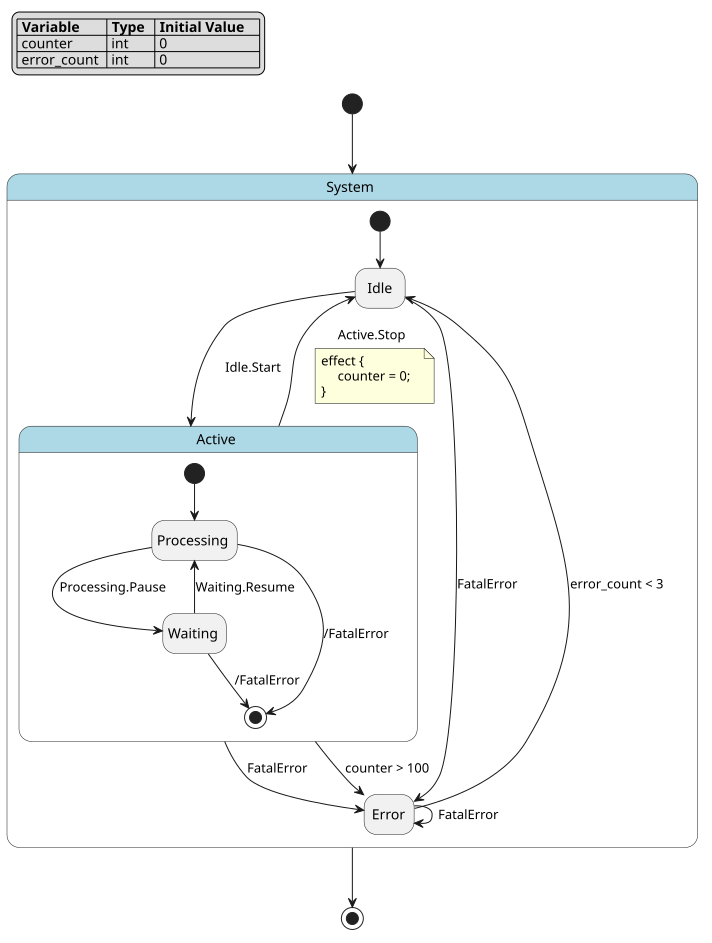

第一张图
========

本教程展示从 FCSTM 模型生成 PlantUML 图源码和渲染示例的最短路径。导出任务配方请见 :doc:`/how_to/visualization/index_zh`；选项事实请见 :doc:`/reference/visualization_options/index_zh`。

术语说明：图源文件（diagram source）、渲染后端（rendering backend）和本地渲染（local rendering）在本页首次交接后，后文只使用中文术语。

示例状态机
----------

.. literalinclude:: example.fcstm
   :language: fcstm
   :caption: example.fcstm

生成 PlantUML 源码
------------------

需要确定性的文本输出时，使用 ``plantuml``：

.. literalinclude:: cli_basic.demo.sh
   :language: bash
   :caption: 基本 CLI 可视化

预期反馈：

.. literalinclude:: cli_basic.demo.sh.txt
   :language: text

渲染示例
--------

文档资源构建会把生成的 PlantUML 源码渲染为 SVG 产物：

   使用 CLI 默认设置生成的 PlantUML 图表。

尝试详细级别预设
----------------

用 ``-l`` 选择内置详细级别预设：

.. code-block:: bash

   pyfcstm plantuml -i example.fcstm -l minimal -o output_minimal.puml
   pyfcstm plantuml -i example.fcstm -l normal -o output_normal.puml
   pyfcstm plantuml -i example.fcstm -l full -o output_full.puml

选项参考会解释每个预设影响哪些事实。

打开离线 Python 查看器
-----------------------

如果需要一个包含源码/图形对比、并能在浏览器中下载 SVG、PNG 和矢量 PDF
的自包含 HTML 文件，可以使用 Python ``Diagram`` 接口。运行时不需要
PlantUML 或 Node。

.. code-block:: python

   from pyfcstm.model import load_state_machine_from_text

   model = load_state_machine_from_text("state Root { state Idle; [*] -> Idle; }")
   diagram = model.diagram(direction="LR", cjk_locale="sc")
   data = diagram.to_dict()
   html = diagram.to_html()
   output = diagram.show(open_window=False)

前三个结果依次是可移植数据、完整 HTML 文本和生成的 ``.html`` 路径。HTML
内嵌查看器、渲染器、WASM 和选定字体，因此不依赖网络。只有在存在
Chromium 系浏览器时才使用默认的 ``open_window=True``：它会像
``matplotlib.pyplot.show`` 那样阻塞到你关闭窗口，随后删除自己写出的临时文件——
想保留请显式传入路径。没有浏览器、或机器上没有显示环境时，``show`` 会抛出
``DiagramUnavailableError``；只想生成文件时使用 ``open_window=False``。

本阶段的同步 ``to_svg()``、``to_png()`` 和 ``to_pdf()`` 只是类型化能力探针，
会抛出 ``DiagramUnavailableError``。生成的 HTML 中的浏览器导出按钮才是
当前可用的三格式导出路径；可选的 Python 无头运行时归后续交付阶段负责。

下一步
------

* :doc:`/how_to/visualization/index_zh` 展示 PlantUML 源码导出和直接渲染文件导出任务。
  该页还包含 Python Diagram 查看器任务。
* :doc:`/reference/visualization_options/index_zh` 列出 ``PlantUMLOptions``、CLI ``-c``
  以及 Python Diagram 选项/取值合同。
* :doc:`/tutorials/quick_start/index_zh` 在最短端到端路径中包含可视化。
